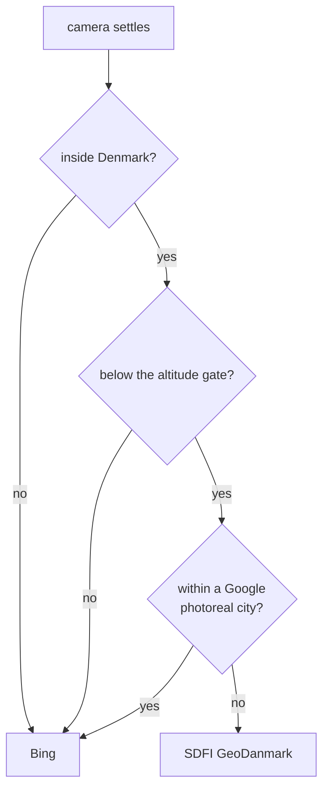

# Which basemap, and where

`src/basemap_rule.js`. **This environment only** (`billund-sovereign`
worktree). The C2 platform never constructs this module and is unchanged.

## The problem it solves

Two basemaps are loaded at once and exactly one is visible.

| | source | covers | strength |
|---|---|---|---|
| Bing | Microsoft | global | the base everywhere, and the ground Google's photoreal 3D mesh sits on |
| SDFI GeoDanmark | Klimadatastyrelsen | Denmark | 10 cm orthophoto, registered to the same coordinates our tracks are drawn at |

Neither wins everywhere. Google's photorealistic 3D tiles cover six
Danish cities, and inside those the mesh is what you look at: Bing's
few-metre offset is hidden under it, and we draw no building mesh of our
own there. Everywhere else is rural infrastructure, which is where Bing
is weakest, where its offset is visible against our own building meshes,
and where the Danish orthophoto is sharp and correctly registered.

## The rule



Cities and radii are in `GOOGLE_PHOTOREAL_CITIES`: København 14 km,
Aarhus 11, Odense 10, Aalborg 10, Esbjerg 9, Vejle 8. Radii are
deliberately generous. Being wrong towards Bing costs imagery sharpness;
being wrong towards SDFI costs the 3D buildings, which is the worse
trade.

The altitude gate has two thresholds, not one: on below 12 km, off above
16 km. A single threshold flickers when the camera drifts across it.

## Why it is a module

Three call sites need the same answer, and while they each decided for
themselves they disagreed:

- `_enterMapMode` forced `sdfi.show = true` and zeroed Bing's alpha. Over
  Copenhagen that overrode the rule in the one place the rule exists to
  protect, and the zeroed alpha left a transparent hole anywhere SDFI was
  then hidden.
- `_exitMapMode` forced `sdfi.show = false`. Leaving map mode over
  Billund dropped to Bing and stayed there until the next camera move.

Both were invisible until you flew somewhere the override was wrong. One
owner, one answer, every call site asks.

## Contract

```js
const rule = createBasemapRule({ Cesium, viewer, sdfiLayer, bingLayer });
```

| member | does |
|---|---|
| `apply(reason)` | evaluate and set. Idempotent, logs only on change |
| `force('sdfi' \| 'bing' \| 'auto')` | pin, or hand control back. A pin survives later `apply()` calls |
| `status()` | what is active and why |
| `cities` | the coverage list |

The factory registers its own `moveEnd` listener and applies once at
construction, so it maintains itself. Camera flights fire `moveEnd` on
arrival, which is what makes picking a site re-evaluate with nobody
calling `apply()`.

Exposed as `window.__isr_basemap`. `sdfiLayer` may be null when no token
is configured; the module is then inert and Bing stays.

## What this does not change

Nothing geospatial. Positions, distances, bearings and sensor coverage
are computed from latitude and longitude, and an imagery layer is a
texture. What it changes is whether the picture agrees with the numbers.
On Bing a track drawn at its true coordinates sits a few metres off the
imagery under it, so anyone judging "how close did it pass" by eye reads
it wrong while the debrief figure was right. On Danish imagery the two
agree.

## What it does not fix

Buildings. The basemap is ground texture; 3D buildings come from three
separate sources, none of which this module touches:

1. Google photorealistic 3D tiles, in the six cities.
2. Our own draped mesh, where the pipeline has been run (Billund).
3. Cesium OSM Buildings, everywhere else: correct footprints and heights,
   blank off-white surfaces, one level of detail, so they do not improve
   as you zoom in.

Where Google's coverage has a hole, source 3 is what you get, and it
looks like white boxes regardless of which basemap is underneath.
