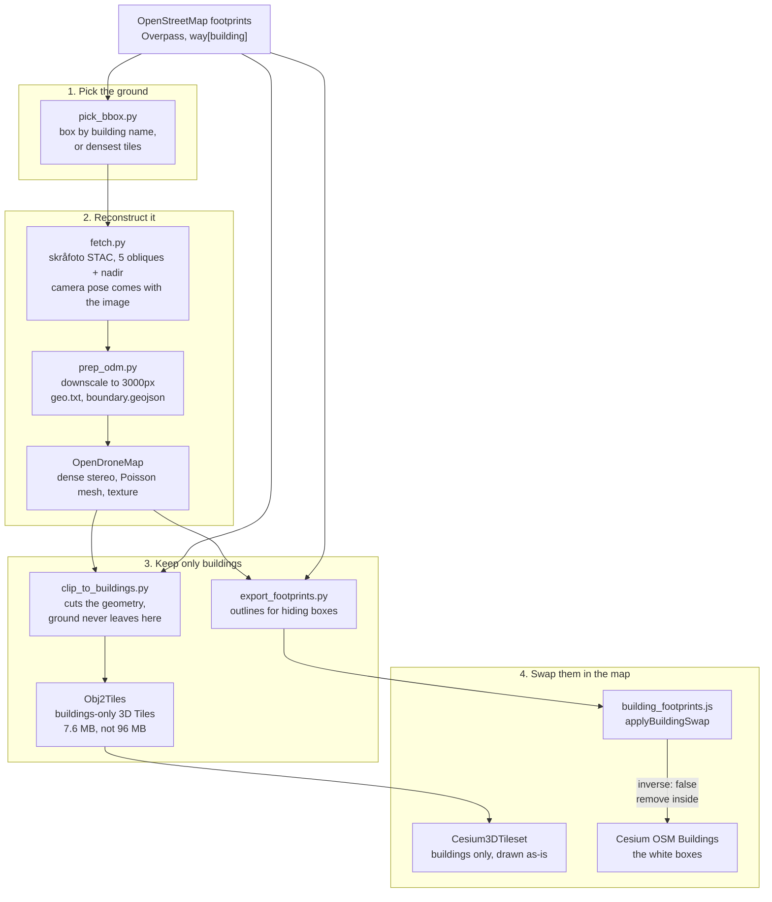

# Building Mesh Architecture

How a white extruded box becomes a photographed building.

Away from the cities Google's photorealistic tiles cover, every
building in the map is a white box from Cesium's OSM Buildings tileset:
the right outline, roughly the right height, nothing else. At Billund,
Esbjerg and every substation, that is what an operator sees.

`city-creation-framework/mesh-pipeline/` builds the replacement from Danish national
oblique photography, and `src/building_footprints.js` puts it in place
of the boxes.

## The chain



## Why the footprints come from OpenStreetMap

The national register is more accurate. OpenStreetMap is used anyway,
because the white boxes **are** OpenStreetMap, drawn from Cesium's OSM
Buildings tileset.

Clipping both layers against the same outline makes them swap exactly.
A more accurate polygon that disagrees with the box is worse, not
better: the disagreement is the thing that shows, as a sliver of white
box beside a real building, or a gap where neither draws.

Correspondence beats accuracy whenever two layers have to line up.

## The box decides everything

Triangle density is the difference between a building and a bump. The
mesh budget spreads over whatever ground gets reconstructed, so the
bounding box is not housekeeping, it is the only thing aiming the
compute at buildings.

Measured on Billund, same imagery, same settings otherwise:

| | No boundary | Boundary, mesh-size 800000 |
| --- | --- | --- |
| Ground covered | 11.4 km2 | 0.67 km2 |
| Triangles on the terminal | 738 | ~50,000 |
| Per building, 654 of them | ~8 | hundreds |

Eight triangles is a box with a photograph on it, which is the thing
being replaced.

**Boxes are derived from footprints, never typed.** `pick_bbox.py`
does it, and `clip_to_buildings.py` refuses a mesh with no building
standing on it. Both exist because a box was once typed from memory,
landed on Billund's runway, and reconstructed half a square kilometre
of tarmac that contained nothing to clip to.

## The mesh is cut in the geometry, not on the screen

`clip_to_buildings.py` keeps triangles whose centroid sits inside a
padded footprint and at least 2 m above local ground, then
`export_footprints.py` exports the outlines and ODM's `Obj2Tiles` turns
the result into 3D Tiles. **What reaches the browser contains buildings
and nothing else.** No runway, no tarmac, no field, no tree.

The height test matters because a footprint alone also captures the
tarmac inside a building outline wherever the roof failed to
reconstruct, which would hoist a patch of ground to roof level.

Padding is a true dilation by distance to the nearest edge, not a grown
bounding box. An OSM footprint is the roof outline seen from above
while a reconstructed wall leans outward from it, so without real
padding the wall triangles are shaved off and roofs float with nothing
under them.

Render-time clipping of the full reconstruction was tried first, using
`ClippingPolygonCollection` with `inverse: true` to keep only what
stood inside a footprint. It was appealing because both layers would be
cut against the same outline and it needed no extra tooling. It was the
wrong call:

- It ships a mesh **full of ground** and relies on a shader to hide it,
  so when the clipping misbehaves the fallback is the worst possible
  output. It did misbehave, and put a lit square of tarmac and car park
  across the map.
- Clipping hides geometry, it does not stop it downloading. 96 MB over
  the wire to display 7.6 MB of buildings.

Cutting the geometry removes that failure mode instead of guarding
against it. A file with no ground in it cannot draw ground.

`SITE_MESHES[site].buildingsOnly` records that a mesh is already cut,
and the loader then skips clipping it.

## Clipping still hides the boxes

The one remaining use of `ClippingPolygonCollection` is the white
boxes, with `inverse: false`, so they are removed exactly where the
reconstruction replaces them.

That direction is safe in a way the other was not: clipping can only
**remove** box geometry, never reveal something that should not be
there. The worst failure is a white box that stays visible, which is
the map as it was.

## Vertical datum

Skråfoto heights are DVR90, orthometric. Cesium wants ellipsoidal.
Over Denmark those differ by roughly 37 m, and the tileset carries no
correction, so an uncorrected mesh loads about 37 m underground.

`DK_GEOID_SEPARATION_M = 36.8` in `main.js` is the default and
`__isr_siteMesh.height(n)` tunes it live, because the published
approximation is a starting point and the right value is whatever puts
the building on the ground. The same number applies to every Danish
site.

## Seams

`registerFootprintAdapter(name, adapter)` follows the same shape as the
track, dispatch and telemetry seams. `source` is declared at
registration, not read from the returned data, for the same reason as
everywhere else: provenance belongs to who is speaking, not to a field
the payload can claim for itself.

Outlines are bundled today because there are a few dozen and they
change when a building is built, not when a drone flies. A site with
live outlines, from the national register or a customer's own facility
model, registers a `live` source and nothing else changes.

## Console

```js
await __isr_siteMesh.load('billund')   // load the reconstruction
await __isr_siteMesh.goto()            // put the camera on it
await __isr_siteMesh.debug()           // position, tiles drawn, clip state
await __isr_siteMesh.height(36.8)      // tune the geoid offset live
await __isr_siteMesh.clip(false)       // white boxes back, to compare
__isr_buildings.hide()                 // white boxes off entirely
```

Every handle awaits a load in flight. They did not, and three commands
pasted together all answered "no mesh loaded" about a mesh that was a
second from existing, which reads exactly like a mesh that failed.

`debug()` reports `metresAboveTerrain` and `tiles.selected`, which
separate the ways this looks identical on screen: the mesh never
rendered, it rendered somewhere else, or it rendered and something cut
it away.

On a `buildingsOnly` mesh, `clip(false)` only brings the white boxes
back. It cannot reveal ground, because there is none in the file.

## Not loaded on startup

A site with no entry in `SITE_MESHES` is untouched, which is what keeps
this away from the eight sites that already look right. Meshes are
served from a separate origin rather than `public/`, because a tileset
is hundreds of megabytes and Vite copies `public/` into every build.
`city-creation-framework/mesh-pipeline/serve_tiles.py` serves them locally with the
CORS headers Cesium needs; production is object storage behind a CDN,
set by `VITE_SITE_MESH_URL`.
