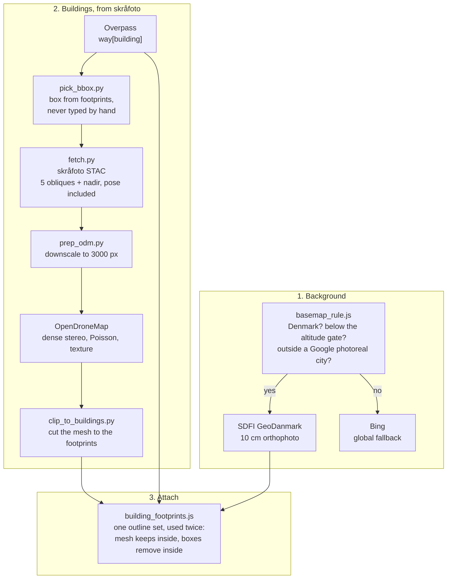

# City Creation Framework

How a new Danish site gets a real basemap and real buildings, instead of a
global orthophoto and white extruded boxes.

Everything here is reusable per city. Nothing in it is Billund-specific except
the worked example, and Billund is the only site it has been run end to end on
twice.

## What the framework is

Two sovereign Danish data sources, and the rule that decides when each one wins.

| | Source | Owner | What it gives |
|---|---|---|---|
| **Background** | SDFI GeoDanmark orthophoto | Klimadatastyrelsen | 10 cm imagery, registered to the same coordinates our tracks are drawn at |
| **Buildings** | Skråfoto oblique photography | SDFI | textured reconstructions with real roofs and real walls |

Both are Danish state data, which is the point: see
[two environments; the sim is the product](../CLAUDE.md). A global basemap is a
few metres off, and that offset is invisible under Google's photoreal mesh and
glaringly visible against our own building meshes out in the country, which is
exactly where the critical infrastructure is.

## The chain

## Read in this order

| | |
|---|---|
| [`01-basemap-rule.md`](01-basemap-rule.md) | which basemap, and where. The altitude gate, the photoreal city radii, and why it is one module with one owner |
| [`02-attach-mesh-to-buildings.md`](02-attach-mesh-to-buildings.md) | how a white box becomes a photographed building. The chain, the vertical datum, the seams |
| [`mesh-pipeline/RECIPE.md`](mesh-pipeline/RECIPE.md) | **the recipe that works.** Verified twice on the Billund terminal. Do not change any of it without saving a copy of the output first |
| [`mesh-pipeline/README.md`](mesh-pipeline/README.md) | what each script does |
| [`mesh-pipeline/STORAGE.md`](mesh-pipeline/STORAGE.md) | what goes in git and what is reproducible |

## Two rules that cost the most time when broken

**Never type a bounding box by hand.** It is step zero of the recipe because
skipping it wasted more time than every settings problem put together.
`pick_bbox.py --check` exits 1 on an empty box, and `clip_to_buildings.py`
refuses one before it spends an hour on it.

**Footprints come from OpenStreetMap, deliberately, even though the national
register is more accurate.** The white boxes ARE OSM, drawn from Cesium's OSM
Buildings tileset, so clipping both against an OSM outline makes them swap
exactly. Correspondence matters more than accuracy here: a more accurate
polygon that disagrees with the box is worse, because the disagreement is what
shows.

## What deliberately does not live here

The two runtime modules stay in `src/`, because `main.js` imports them and the
app has to boot without this folder:

- `src/basemap_rule.js` — the background decision
- `src/building_footprints.js` + `src/data/building_footprints.json` — the attach

This folder is the framework and the recipe. Those two files are the product
implementing it. Keeping them apart is why the pipeline can be moved, renamed
or run from another checkout without touching the platform.

## Status

Run end to end twice, on the Billund Airport terminal only. The south strip
(1,852 buildings) and west strip (714) are committed. No other city has been
tiled yet, and the recipe's frame count and image size are tuned to what worked
there, not proven across sites.
