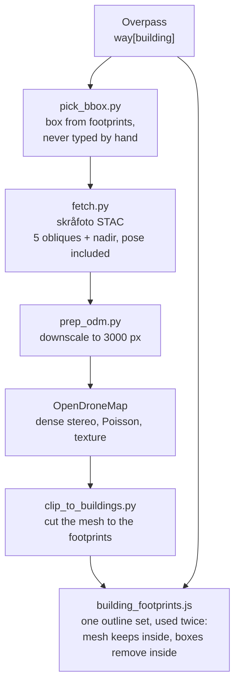

# City Creation Framework

How a new Danish site gets a sovereign basemap, sovereign terrain and real
buildings, instead of US-hosted commercial tiles and white extruded boxes.

Everything here is reusable per city. Nothing is Billund-specific except the
worked example, and Billund is the only site the photographed-building half has
been run end to end on.

## The four layers

A city is not one pipeline. It is four, and each replaces a different
commercial dependency with Danish state data.

| | Layer | Danish source | Replaces | Where it lives |
|---|---|---|---|---|
| 1 | Background imagery | SDFI GeoDanmark, 10 cm orthophoto | Bing | `src/basemap_rule.js` — **`billund-sovereign` branch only** |
| 2 | Terrain | DHM, Danmarks Højdemodel LiDAR | Cesium World Terrain | `scripts/dhm-pipeline/` |
| 3 | City buildings | BBR + DHM | Google Photorealistic 3D Tiles | `scripts/city-tiles-pipeline/` |
| 4 | Site buildings, photographed | Skråfoto obliques | the white OSM boxes | [`mesh-pipeline/`](mesh-pipeline/) |

Layers 2 and 3 cover a city at once and are coarse. Layer 4 is per building and
photoreal: it is what makes an airport terminal look like that terminal. They
are complements, not alternatives.

## Layer 4, the one with the recipe

| | |
|---|---|
| [`mesh-pipeline/RECIPE.md`](mesh-pipeline/RECIPE.md) | **the recipe that works.** Verified twice on the Billund terminal. Do not change any of it without saving a copy of the output first |
| [`mesh-pipeline/PLAYBOOK.md`](mesh-pipeline/PLAYBOOK.md) | running it, and the external dependencies it leans on |
| [`mesh-pipeline/AGENT_RUNBOOK.md`](mesh-pipeline/AGENT_RUNBOOK.md) | for an agent driving the pipeline |
| [`mesh-pipeline/STORAGE.md`](mesh-pipeline/STORAGE.md) | what goes in git and what is reproducible |
| [`attach-mesh-to-buildings.md`](attach-mesh-to-buildings.md) | how a white box becomes a photographed building: the chain, the vertical datum, the seams |

## Two rules that cost the most time when broken

**Never type a bounding box by hand.** It is step zero of the recipe because
skipping it wasted more time than every settings problem put together.
`pick_bbox.py --check` exits 1 on an empty box, and `clip_to_buildings.py`
refuses one before it spends an hour on it.

**Footprints come from OpenStreetMap, deliberately, even though BBR is more
accurate.** The white boxes ARE OSM, drawn from Cesium's OSM Buildings tileset,
so clipping both against an OSM outline makes them swap exactly. Correspondence
matters more than accuracy here: a more accurate polygon that disagrees with the
box is worse, because the disagreement is what shows.

## What deliberately does not live here

**The runtime modules stay in `src/`.** `main.js` imports them and the app has
to boot without this folder:

- `src/building_footprints.js` + `src/data/building_footprints.json` — the attach
- `src/basemap_rule.js` — the background decision, on the sovereign branch only

This folder is the framework and the recipe. Those files are the product
implementing it. Keeping them apart is what lets the pipeline be moved, renamed
or run from another checkout without touching the platform.

**Layers 2 and 3 are still under `scripts/`.** Moving them is a separate
decision, not an oversight:

- `scripts/dhm-pipeline/` is 192 tracked files and 168 MB, because its built
  `.terrain` tiles and input GeoTIFFs are committed. Relocating it is a large,
  noisy rename, and the artifacts arguably should not be in git at all
- `scripts/city-tiles-pipeline/` carries an untracked 23 MB `venv/`. A directory
  move takes it along and breaks it, since a Python venv hardcodes absolute
  paths

Both belong here conceptually. Neither should be dragged across without
deciding what to do about its payload first.

## Status

| Layer | State |
|---|---|
| 1 Background | works, sovereign branch only, not in the platform |
| 2 Terrain | built and serving for the Billund tile set |
| 3 City buildings | pipeline written, deploy script present, not run at city scale |
| 4 Photographed buildings | run end to end twice, Billund terminal only. South strip 1,852 buildings and west strip 714 committed. Frame count and image size are tuned to what worked there, not proven across sites |

No city other than Billund has been tiled.
