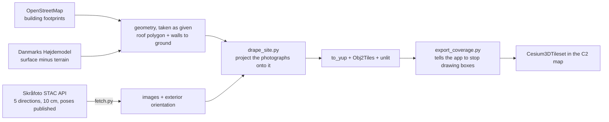

# ISR Systems · Skråfoto Mesh Pipeline

Build photorealistic 3D meshes of Danish sites from national oblique
photography, in-house, with open-source tools and no licence fees.

> **Doing this for a town? Read [PLAYBOOK.md](PLAYBOOK.md).** Ten steps
> from nothing to a working tileset, with the real costs from the five
> Billund builds. This README is background on why the method is what it
> is; the playbook is how to run it. An agent should follow
> [AGENT_RUNBOOK.md](AGENT_RUNBOOK.md) instead, which is the same
> steps with pass/fail gates on every one.

## Why this exists

Google Photorealistic 3D Tiles covers six Danish cities: Aalborg,
Aarhus, Copenhagen, Esbjerg, Odense, Vejle. **Billund is not one of
them, and neither are the substations, the ports, or most of the
infrastructure this platform protects.** Outside those six cities the
map falls back to extruded OSM footprints, which read as white blocks
over an otherwise sharp orthophoto.

There is no product to buy this off the shelf cheaply and no Danish
national mesh to download. Denmark publishes the *raw material* instead,
and Aarhus Kommune built their own city mesh from exactly that.

So do we.

## What makes this tractable

Denmark is the first country in the world to publish nationwide oblique
aerial photography as open data, and critically, it publishes the
**camera orientation with every image**.

That last part is the whole reason this is a weekend project rather than
a research effort. Normal photogrammetry starts with Structure from
Motion: solving where every camera was, from the pictures alone. It is
slow, it is fragile, and it is where amateur attempts fail.

**We can skip it entirely.** Every image arrives with its exterior
orientation already solved by the national mapping agency.

Verified against the live API on 2026-09-30 for the Billund Airport
bounding box:

| | |
| --- | --- |
| Collection | `skraafotos2025`, flown April–May 2025 |
| Images over the airport | **121** |
| By direction | nadir 24, north 24, south 24, east 28, west 21 |
| Ground sample distance | **0.1 m** |
| Exterior orientation | `pers:omega`, `pers:phi`, `pers:kappa`, `pers:perspective_center`, plus a 9-value rotation matrix |
| Coordinate reference | EPSG:25832 (ETRS89 / UTM 32N) |
| Access | Dataforsyningen token, already in `.env.local` as `VITE_SDFI_TOKEN` |

Five viewing directions per location is what makes facades reconstruct
rather than just roofs. It is the same input Aarhus used.

## Pipeline

**The geometry is never reconstructed.** That was the original plan and
it was wrong: five oblique frames per point is not enough to reconstruct
from, and it is plenty to texture with. Footprints and heights already
exist as published open data, so the job is to project the photographs
onto geometry that is already known.

## Tooling, all free

| Stage | Tool | Licence |
| --- | --- | --- |
| Fetch | `fetch.py` in this directory | ours |
| Dense stereo + mesh | **OpenMVS**, or COLMAP with fixed poses | open source |
| Alternative, single-shot | **OpenDroneMap** | open source |
| Mesh to 3D Tiles | `obj2tiles`, or py3dtiles | open source |
| Hosting | `scripts/city-tiles-pipeline/deploy-scaleway.sh` | already written |

**Hardware we already have.** Gowri's dual RTX workstation is exactly
the machine for the dense-stereo stage, which is the only part that
wants a GPU.

## Status, honestly

| Stage | State |
| --- | --- |
| API access and data availability | **Proven.** Token works |
| `fetch.py` | **Works.** 212 GB fetched across five Billund builds |
| Interior orientation | **Resolved. It was never a blocker.** Published on every image, 0.000 px reprojection error on all 63 test frames |
| Dense stereo | **Abandoned, deliberately.** Not enough frames to reconstruct from. Replaced by draping onto published geometry |
| Draped mesh | **Works.** 6,309 buildings over Billund |
| Mesh to 3D Tiles | **Works.** 146 MB, DVR90 handled by a per-site geoid offset of 40.3 m |
| App integration | **Works.** Per-site `SITE_MESHES` entry plus coverage rectangles that clip the OSM boxes away |
| Hosting | **Not done.** The tiles exist on one laptop, served from `serve_tiles.py` on 8778. `VITE_SITE_MESH_URL` is the seam |

Billund has been built and looked at. The one thing nobody should claim
is that this is deployed: until the tiles are in object storage, the
result lives on a single machine.

## The camera model, resolved

Interior orientation was written up here as the one real unknown. It
was not an unknown at all: SDFI publishes it on every image under
`pers:interior_orientation`, alongside the exterior orientation.

Verified against all 68 images of the terminal box:

| | |
| --- | --- |
| Distinct cameras | **6**, not one |
| Nadir | focal **79.6 mm**, sensor 20544 x 14016, principal point centred |
| Oblique forward/backward | focal **123.38 mm**, sensor 14144 x 10560, centred |
| Oblique left/right | focal **123.38 mm**, sensor 10560 x 14144 (portrait), principal point offset **6.68 mm** |
| Pixel pitch | 0.00376 mm |
| Distortion | **none to apply** |

Three things follow, and each one is a way to get this wrong:

**The `100mm` in an image id is a CDN product tier, not a focal length.**
Every image over Billund ends in `_100mm` while the true focal lengths
are 79.6 and 123.38. An earlier version of `fetch.py` parsed that suffix
and was wrong on 100% of images, by -19% on obliques and +26% on nadir.
`fetch.py` now prints a loud note if the tier ever disagrees with the
published focal length, which it always will.

**Bind interior orientation per image, never globally.** Nadir is a
different camera head from the obliques. One shared intrinsic block
would corrupt the nadir images against the oblique ones.

**Apply the principal point offset.** It is 6.68 mm on the left/right
cones, which is 1777 pixels. Zeroing it moves the ground intercept by
roughly 200 m, and it does not fail loudly: it produces a plausible
tilt, so a wrong reconstruction looks superficially fine.

Distortion can be treated as zero. This is a Vexcel UltraCam Osprey
Level 2 product whose residual distortion is specified under 0.002 mm,
which is about 5 cm on the ground, half the 0.1 m GSD. SDFI's own
open-source SAUL library, which their national viewer depends on,
implements plain pinhole collinearity with no distortion terms at all.
That is the sanctioned model, not a shortcut.

## The vertical datum trap

Poses carry `crs: 25832` (ETRS89 / UTM 32N) and `vertical_crs: 5799`,
which is **DVR90**, an orthometric height system.

Cesium works in ellipsoidal height. The geoid separation over Denmark is
roughly 36-40 m. Converting horizontally and forgetting the vertical
puts the finished mesh about 40 metres underground.

This is worth writing down because the failure is late and expensive:
everything up to the final tileset looks correct, and the problem only
appears when the mesh is loaded in the app.

## Order of work

Settled. The method is draping, not reconstruction, and it is written up
step by step in [PLAYBOOK.md](PLAYBOOK.md).

1. ~~Resolve interior orientation~~ **Done.** It is published per image,
   per frame, and projects to 0.000 px error on all 63 test frames.
2. ~~Fetch a small area first~~ **Done.**
3. ~~Dense stereo, as the go/no-go~~ **Abandoned, and that was the
   turning point.** Five oblique frames per point is not enough to
   reconstruct geometry from, and it is plenty to texture with. The
   footprints and heights already exist as published data, so the job
   was never to rebuild the geometry: take it as given and project the
   photographs onto it. See `drape_site.py`.
4. ~~Subtract a local origin~~ **Done.** UTM northings here are around
   6,177,000 and lose precision in single-precision maths; every build
   writes its own `origin.json`.
5. ~~Scale up and convert to 3D Tiles~~ **Done.** Billund is 6,309
   buildings across five builds, DVR90 to ellipsoidal handled by a
   per-site geoid offset of 40.3 m.
6. **Host.** The one thing still open. The tiles exist only on one
   laptop, served from `serve_tiles.py` on port 8778, and the app reads
   `VITE_SITE_MESH_URL`. Put them in object storage and point that at
   it.

## Licence

Danish public geodata is free to use, including commercially, under the
terms Dataforsyningen publishes. **Confirm the attribution string
required for skråfoto before anything built from it is shown to a
customer**, and put it in the map credits. The STAC collection response
returned no `license` field, so this needs reading from Dataforsyningen's
own terms rather than assumed.

## Related

- `scripts/city-tiles-pipeline/` — the earlier CityGML route. Different
  input, same destination. Its `deploy-scaleway.sh` is reusable here.
- `docs/geospatial-integrations.md` — the Danish data source register.
