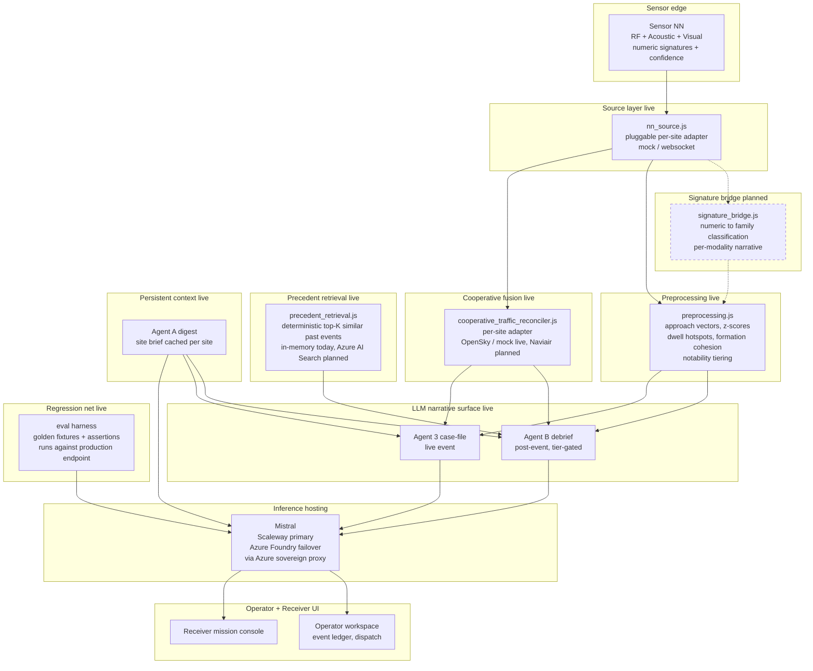

# ISR Systems · Agentic Architecture

Design reference for the multi-agent pipeline that turns neural network
detection outputs into operator-actionable intelligence and back into
coordinated response.

Current version reflects target state. Sections marked `[live]` are
implemented today. Sections marked `[planned]` are next.

**Companion documents:**
- `agentic-preprocessing-architecture.md` `[live]` — the deterministic feature-extraction pipeline (approach vectors, z-scores, formation cohesion) that feeds Agent B a structured signal block instead of raw telemetry.
- `agentic-signature-bridge-architecture.md` `[planned]` — the deterministic layer that translates raw NN numeric signatures (RF spectra, acoustic vectors, visual embeddings) into family-labelled narrative before preprocessing sees anything. Deferred until first real NN plugs in.
- `agentic-cooperative-traffic-fusion-architecture.md` `[live — MVP with OpenSky + mock adapters landed 2026-09-05; Naviair partner adapter deferred]` — pluggable per-site cooperative-aircraft feed that reconciles sensor detections against known cooperative traffic. Classification precision, not visualization.
- `agentic-precedent-retrieval-architecture.md` `[live — MVP in-memory index landed 2026-09-05; Azure AI Search adapter deferred]` — deterministic retrieval of similar past events, injected into Agent B prompt as a PRIOR SIMILAR EVENTS block. Detection-only stance: context for the operator, never basis for the agent to propose actions.
- `agentic-eval-architecture.md` `[live]` — the golden-fixture harness that regression-tests every agent's prompt output. Load-bearing for the Azure sovereign-proxy migration.
- `agentic-dispatch-adapter-architecture.md` `[live — MVP mock adapter landed 2026-09-06; real per-receiver adapters register file-by-file when customer APIs come online]` — pluggable per-receiver-role adapter seam for the 16 branch-scoped stub CTAs (deploy-patrol, brs-standby, issue-notam, etc.). Real customer dispatch APIs plug in without touching CTA code.
- `nn-adapter-explainer.md` `[live]` — the `NnOutputSource` seam between real / mock NN hardware and the platform.
- `interface-design-document.md` IF-9 `[live]` — the partner-facing contract for the Mistral agent surface.

## System overview

Live pieces are solid boxes. Planned pieces are dashed. Everything upstream of the LLM is deterministic — the model never gets raw floats and never decides what data to consume.



**MVP wiring note (2026-09-05):** cooperative-traffic-reconciler (CTR) feeds Agent B and Agent 3 prompts directly today via a pre-formatted block. Long-term end state per `docs/agentic-cooperative-traffic-fusion-architecture.md` moves reconciliation upstream of preprocessing.js so classification collapse to `friendly` can bypass Agent B entirely on matched cooperative tracks. Signal-block path is the MVP; classification-collapse is v2.

Detection-only stance (see `memory/feedback_detection_only_positioning`) applies to every arrow above. The platform observes and narrates. Operators decide and dispatch. No agent in this diagram proposes specific dispatch actions.

---

## 1. Design principles

**Deterministic where lives are on the line, generative where nuance is
what an analyst adds.**

Correlation, threat scoring, and dispatch routing are deterministic.
Failure of these paths must never depend on a language model responding.
Narrative synthesis, dwell interpretation, and outlier explanation are
generative. Failure there degrades to a shorter deterministic summary.

**Every agent has one job.**

Seven small agents beat one large one. Small agents can be swapped,
cached, retried, and reasoned about independently. Each agent has a
defined input contract, output contract, latency budget, and failure
fallback.

**Sensor-side signal processing is not an agent.**

Raw RF, acoustic, visual, and radar processing happens inside the
neural network running on the sensor node. The NN emits fused
detection outputs on a fixed tick (~500 ms per node). The platform's
agent pipeline starts where the NN output stream arrives. Modality
processing, cross-modality fusion, and drone classification are the
NN's job, not a platform agent's job.

**Sovereign by default.**

All model inference runs on EU-hosted infrastructure. Target production
architecture: Azure carries the platform spine (identity via Entra ID,
secrets in Key Vault, event and evidence storage, telemetry, tenant
isolation) and hosts a sovereign proxy service. That proxy forwards
narrative and reasoning calls to Scaleway's Mistral endpoint (EU
sovereign inference). Azure Foundry Mistral is the failover when
Scaleway degrades. NN inference runs on the sensor node itself. Zero
calls to US-hosted models. Full hosting mechanics are specified in
`docs/interface-design-document.md` IF-9.7.

**Known gap (parked 2026-09-06):** the Scaleway→Foundry failover is
NOT implemented in the client today. `src/mistral_client.js` is
single-endpoint. The proper fix belongs server-side at the Azure
sovereign proxy (not in the browser), so this is parked pending
Azure infra provisioning. If the configured endpoint degrades today,
agent narratives stop rendering. Bump priority when Azure is
provisioned or if a customer explicitly requires runtime provider
resilience before then. See IDD IF-9.7.

**Data provenance is a first-class artifact.**

Every derived value carries its lineage: which sensor node produced
the NN detection, which model version generated it, which agent
transformed it, at what timestamp. Not for compliance theater. For the
moment an operator asks "why did the platform say hostile" and gets a
real answer.

**Additive, not replacing.**

Real hardware plugs into the same downstream pipeline mock data uses
today. The boundary between "NN output source" and "platform logic"
is a single adapter interface, not a rewrite.

---

## 2. Platform entry point: the NN output stream

Before agent 1 fires, this happens on the sensor node:

- Raw multi-modality sensor input (RF, acoustic, visual, radar) flows
  into the neural network running locally on the sensor node.
- The NN performs modality-level signal processing, cross-modality
  fusion, and drone classification.
- On a fixed tick (~500 ms per node, configurable per site), the NN
  emits zero or more detection objects.

Each NN detection object carries:

```
{
  sensor_node_id: string
  tick_id: string
  timestamp_utc: ISO8601
  nn_model_version: string
  detections: [
    {
      nn_class: 'quadcopter' | 'fixed-wing' | 'jet' | 'missile' | 'unknown'
      nn_confidence: number 0..1
      lat: number
      lon: number
      alt_m: number
      heading_deg: number
      speed_ms: number
      contributing_modalities: string[]   // ["RF", "Acoustic", "Visual"]
      rf_signature_match: string | null   // "OcuSync 91%" | null
    }
  ]
  node_health: { cpu_pct, battery_pct, gps_lock_sec, inference_latency_ms }
}
```

The agent pipeline consumes this stream. Nothing platform-side re-does
the fusion or classification the NN already did.

---

## 3. Agent inventory

Seven agents. Numbered by their position in the live-detection flow.
Not all fire on every event.

### Event registry (plumbing, not an agent)

Before Agent 1 fires, the event registry handles same-target track
continuity. Each incoming NN detection is checked against active
events for that site: if the tick's target is within 200 m and 8 s of
an existing active event's last known position, the tick attaches to
that event. Otherwise a new event scaffold is created. This is
deterministic plumbing at the ingestion boundary, not an agent.

---

### Agent 1 · Site Context (Agent A) `[live]`

**Role.** Maintains a per-site knowledge base of critical assets,
response asset positions, aircraft of interest, dwell zones,
perimeter geometry, jurisdictional coverage, and operator-declared
temporary state (VIP presence, closed hangars, scheduled maintenance
windows, restricted airspace activations). Frame of reference for
every downstream agent.

**Inputs.**
- Site definition files (static base layer)
- Response asset registries
- ATC / port authority feeds (live where available)
- **Operator briefings from the Site Context Console** (live edits by
  the operator on shift)

**Outputs.** `SiteContext { site_id, critical_areas, high_value_assets,
response_asset_positions, aircraft_of_interest, dwell_zones,
politikreds, tier_1_operators, active_briefings: [{ id, category,
scope, from_utc, to_utc, reason, author, priority }] }`

**Model.** Deterministic. Loaded from `site_context.js` at boot, then
mutated live by operator briefings. Refreshed per site on any change.

**Latency budget.** Zero at runtime for lookups. Briefing writes
propagate to downstream agents within 200 ms.

**Fallback.** Missing site context means the narrative agent falls
back to generic language ("track observed across site sensor
coverage"). Never blocks the pipeline.

**Operator surface: Site Context Console `[planned]`.** A dedicated
UI on each site's Control Panel where the operator on shift can:
- Add or edit critical assets (name, geometry, why it matters)
- Declare time-windowed activations (VIP visit Tuesday 14:00-18:00,
  runway 04L closed for maintenance, drone film permit active over
  Terminal 3)
- Attach reason annotations to any asset or zone (readable inline in
  the narrative agent's briefings)
- See a change log of who briefed what, when, and why
- Push a briefing to a linked sister site (CPH ↔ Amalienborg jointly
  briefed for state visits)

Every operator-side edit immediately updates SiteContext and appears
in Agent 3's next narrative pass. Briefings are versioned and
attached to the event's audit trail so the receiver reading a briefing
sees exactly which operator-declared context was in force at the time
of detection.

**Why this matters.** Site context is not a config file that changes
quarterly. It is a live operational picture that the operator on
shift knows better than any static definition. Giving the operator a
direct channel to Agent 1 turns Site Context from stale reference
data into ground truth.

---

### Agent 2 · Correlation `[live: partial]`

**Role.** Macro correlation. Cross-references the current event
against historical events and concurrent active events across all
sites. Detects repeat signatures, cross-border tracks, and
coordinated multi-site incursions. External to the site, not
internal to the tick.

**Inputs.** Current event (with NN classification and Site Context)
plus the full EVENTS registry across all sites.

**Outputs.** `CorrelationResult { linked_event_ids, similarity_scores,
cross_site_track, pattern_flags }`

**Correlation heuristics.**
- Same RF signature at another site within 4 hours → cross-site track
- Same platform class at same site within 90 days → recurring
  incursion
- More than 3 similar events across the country in 30 days →
  national pattern flag
- Trajectory heading toward a briefed high-value asset (from Agent 1)
  → directional intent flag

**Model.** Deterministic scoring. Signature match plus temporal
proximity plus spatial connectivity plus directional projection
against Site Context.

**Latency budget.** Sub-300 ms per event update.

**Fallback.** Correlation is advisory. Missing cross-site correlation
never blocks escalation, only enriches the narrative.

---

### Agent 3 · Narrative (Agent B) `[live]`

**Role.** Produces a natural-language analyst-grade summary and
recommendation per event. This is what the receiver reads first.

**Inputs.** Event scaffold from Agent 1, `CorrelationResult`,
`SiteContext`, live NN telemetry snapshot, recording samples if
available. Debrief mode also injects the Agent A site digest and
(when the preprocessing pipeline lands) the resolved highlights and
ranked trajectory signals from `docs/agentic-preprocessing-architecture.md`.

**Outputs.** `Narrative { body, recommendation, generated_at,
model_version, confidence, signalHash }`

**Model.** Mistral (family sized per tier — Medium 3.5 for narrative,
Large where reasoning breadth matters). Sovereign EU inference.
Endpoint is OpenAI-compatible, streaming, `Authorization: Bearer <token>`.
Temperature 0.2 for consistency across similar events.

**Hosting state (see IDD IF-9.4 + IF-9.7 for the full spec):**

- **Current (transitional, dev/demo only).** Browser calls
  `api.mistral.ai` directly with `VITE_MISTRAL_API_TOKEN` in the build.
  Token is browser-exposed. Not shippable to production. Flagged in
  `mistral_client.js:18-19`.
- **Target production.** Browser calls an Azure-hosted sovereign proxy
  (Azure Container Apps behind API Management, token in Azure Key
  Vault). The proxy forwards to Scaleway's Mistral endpoint
  (`https://api.scaleway.ai/v1/chat/completions`) for sovereign EU
  inference. Azure carries everything else — identity (Entra ID),
  event/evidence storage (Blob with WORM), correlation index (AI
  Search), tenant isolation. Scaleway is treated as an external
  sovereign inference provider plugged into the Azure spine.
- **Failover.** Azure Foundry Mistral serverless (France Central /
  Sweden Central) as the backup inference endpoint when Scaleway
  degrades. Same IF-9.4 client contract, no browser change.

**Endpoint swap seam.** `getInferenceConfig()` in `mistral_client.js`
reads `VITE_MISTRAL_ENDPOINT`, `VITE_MISTRAL_MODEL`,
`VITE_MISTRAL_API_TOKEN` from env. In production these point at the
Azure proxy, not Mistral or Scaleway directly. Provider migration is
one env-var change.

**Module layout (post-Phase-2 split, 2026-08-30).** The Mistral
integration is split across:
- `src/mistral_client.js` — transport, config, streamCompletion,
  makeDelimitedStreamHandler, WRITING_RULES, OUTPUT_FORMAT,
  siteVersionStamp, sanitizePartnerString.
- `src/agents/agent_a_digest.js` — Agent A site-context digest + cache.
- `src/agents/agent_b_debrief.js` — Agent B debrief narrative + narrativeCache persistence.
- `src/agents/agent_case_file.js` — Agent 3 live-event narrative.
- `src/mistral.js` — re-export barrel so existing importers keep working.

**Prompt structure (live post-Phase-4).**
```
System 1: Analyst role + DEBRIEF_WRITING_RULES (looser: 2000-char body,
          400-char reco, 4 paragraphs max) + delimited output format.
System 2: PERSISTENT SITE INTELLIGENCE BRIEF (Agent A digest, optional).
User:     Event metadata (id, site, duration, outcome, platform count) +
          canonical detection subject digest +
          PARTNER-DECLARED HIGHLIGHTS (JSON, sanitized rationale, treat-as-data prefix) +
          STRUCTURED SIGNAL BLOCK (topOutliers + topTrends JSON from preprocessing) +
          INTERPRETED SIGNAL PROSE (deterministic phrasings) +
          TRAJECTORY ANALYSIS (dwell profile) +
          CLASSIFICATION LOG.
```

**Latency budget.** 3 seconds for stream start, 8 seconds for full
completion. Streams into the UI as it arrives.

**Persistence.** `event.narrativeCache` is written on `onDone` and
mirrored to `localStorage[isr:narrativeCache:${eventId}]` so PDF
export, closed-panel render, and reopen debrief flows survive a page
reload without re-hitting Mistral.

**Fallback.** If Mistral is unreachable or slow, falls back to
`_generateAgentBNarrative` deterministic template in main.js.
Fallback is invisible to the operator except for the model_version
tag. Silent console warning `[mistral debrief] falling back to deterministic: <reason>`.

**Regenerate.** Operator-triggered button in debrief modal invalidates
the site's Agent A digest cache, the persisted narrative cache, and
re-fires the full Agent A → Agent B chain. Guarded against rapid
re-entry by an `event._regenInFlight` promise.

---

### Agent 4 · Recommendation `[live]`

**Role.** Maps NN classification plus threat plus site rules to a
prioritized list of escalation destinations and playbook steps.

**Inputs.** Event with NN classification, `SiteContext`, active
auto-escalation rules.

**Outputs.** `Recommendation { tiers, destinations, playbook_id,
urgency, override_reason }`

**Recommendation logic.**
- Missile + hostile → all tiers, QRA dispatch pre-authorized
- Hostile fixed-wing + inside perimeter → tiers 1-3, Politi cascade
- Unknown NN class + confidence under 0.60 → tier 1 only, analyst
  review flag
- Friendly ID with valid flight plan → tier 1 audit log only

**Model.** Deterministic rules engine. Rules editable via Config UI
(`rules.js`).

**Latency budget.** Sub-50 ms.

**Fallback.** If no rule matches, defaults to tier 1 escalation and
flags the event for rule authoring.

---

### Agent 5 · Escalation Router `[live]`

**Role.** Dispatches escalations to the destination receivers. Handles
dedup, contact method selection, delivery retries.

**Inputs.** `Recommendation` plus operator-selected destinations from
the escalate modal.

**Outputs.** `EscalationRecord[]` written to `event.escalations`. Each
record is a durable dispatch entry with status history.

**Contact method selection.** Reads `destination.contactMethods` and
picks by urgency: `api` for machine receivers, `phone` for critical
human, `encrypted-email` for standard.

**Dedup.** Skips destinations that already have a record on this
event. Prevents auto-rules and manual escalation from duplicating.

**Model.** Deterministic. `escalateEvent()` in `events.js`.

**Latency budget.** Sub-100 ms per destination.

**Fallback.** Delivery failures log a `SendFailure` and retry via
alternate contact method. Marked in the audit trail.

---

### Agent 6 · Response Coordinator `[live: partial]`

**Role.** Tracks receiver acknowledgements, responses, cascades, and
QRA dispatches. Coordinates multi-receiver state so each receiver
sees what the others have done.

**Inputs.** Receiver actions (ack, respond, cascade, QRA dispatch),
current `EscalationRecord[]`.

**Outputs.** Updates to `event.escalations[].statusHistory` and
`event.escalations[].response`. Fires `ResponseReceived` events for
the operator inbox.

**Cross-receiver visibility (Advance C).** When Politi is looking at
event E, they see PET's ack timestamp and Flyvevåbnet's QRA dispatch
status inline. Not just the operator sees it. Every active receiver
sees every other active receiver's state on the same event.

**Model.** Deterministic. Event-sourced. All state changes append to
`statusHistory`.

**Latency budget.** UI reflection under 250 ms via live-telemetry
patcher.

**Fallback.** Optimistic UI. Ack sent → chip appears immediately. If
delivery fails downstream, chip reverts and a toast surfaces.

---

### Agent 7 · Debrief Synthesizer `[live]`

**Role.** Post-event synthesis. Combines trajectory recording, moment
extraction, outlier detection, and asset touch analysis into a
narrative + geospatial callouts.

**Inputs.** Full `EventRecording` (per-drone timeseries),
`SiteContext`, `analysis.touched` assets, `analysis.dwellZones`,
per-drone confidence outliers.

**Outputs.** `DebriefReport { narrative, moments, trajectory_segments,
outlier_flags, asset_touches, exports: {pdf, kml, gpx} }`

**Moment extraction (deterministic today).**
- First sensor contact
- Loiter (top 2 dwell zones over threshold)
- Closest approach (single, under 200 m)
- Level flyby (drone altitude matches asset rooftop height within ±12 m)
- Track lost (last sensor contact)
- Max 10 moments, callouts stagger vertically to avoid overlap

**Outlier detection (deterministic today).** Per-drone mean confidence
compared to pack average. Flags drones running 15+ percentage points
below pack. Planned upgrade in `docs/agentic-preprocessing-architecture.md`
adds ranked outlier + trend signals from the Trajectory Signal Extractor.

**Narrative.** Streamed from Agent 3 (Agent B) via
`streamDebriefNarrative` in `src/agents/agent_b_debrief.js`
(re-exported through `src/mistral.js` for existing importers).
Deterministic skeleton
renders on debrief open, then Mistral tokens replace the body as they
arrive. Model + prompt structure per Agent 3 above. When the
preprocessing pipeline lands, Agent B also receives the resolved
site highlights and ranked trajectory signals as prompt context.

**Latency budget.** Debrief opens instantly with deterministic
skeleton. Mistral narrative streams in over 3-8 seconds.

**Fallback.** Deterministic narrative always renders. Mistral
narrative replaces it when it arrives.

**Persistence + regenerate.** See Agent 3 above.

---

## 4. Flow diagrams

### Live-detection flow

```
  [Real sensor node]                     [Mock NN output source]
        |                                          |
        v                                          v
  Neural network                          Synthetic NN output
  (modality processing,                   generator (same schema)
   fusion, classification)                          |
        |                                          |
        +----- NN output stream (~500 ms tick) ----+
                             |
                             v
                Event registry: same-target attach
                             |
                             v
                    Agent 1 · Site Context
                     (live-briefed by operator
                      via Site Context Console)
                             |
                             v
                    Agent 2 · Correlation
                     (macro: cross-site, historical,
                      pattern flags, directional intent)
                             |
                             v
                    Agent 3 · Narrative (Mistral Large 2, streaming)
                             |
                             v
                    Agent 4 · Recommendation
                             |
                             v
                    Agent 5 · Escalation Router
                             |
                             v
              [Receiver inboxes: PET, Politi, Flyvevåbnet, ...]
                             |
                             v
                    Agent 6 · Response Coordinator
                             |
                             v
                    [Operator ledger: acks, responses, cascades]
```

### Post-event flow

```
  Event closes  ---->  _persistRecording (timeseries frozen)
                                |
                                v
                     Agent 7 · Debrief Synthesizer
                                |
                    +-----------+-----------+
                    |                       |
                    v                       v
        Deterministic layer         Mistral narrative pass
        (moments, outliers,         (analyst paragraph,
         asset touches, exports)    reasoning about the drift)
                    |                       |
                    +-----------+-----------+
                                v
                    [DebriefReport rendered on map + panel]
                                |
                                v
              [Exports: PDF brief, KML flight path, GPX trail]
```

### Feedback loop (receiver → operator)

```
  Receiver clicks CTA
       |
       +---> Acknowledge  ----> Agent 6 updates statusHistory ----> Operator ledger badge
       |
       +---> Respond      ----> Agent 6 attaches response       ----> Operator ↩ chip + inbox
       |
       +---> Cascade      ----> Agent 5 escalateEvent (with     ----> New EscalationRecord[]
       |                        receiver-role provenance)             visible in audit trail
       |
       +---> QRA dispatch ----> triggerQraIntercept              ----> F-35 icon animates on map
```

---

## 5. Model selection matrix

| Layer | Task | Model | Rationale |
|---|---|---|---|
| Sensor node NN | Modality processing, fusion, classification | Neural network on-node | Real-time signal-level work, must live at the sensor |
| Agent 1 Site Context | Knowledge base + live operator briefings | Cached deterministic | Zero-latency lookups, briefing writes propagate in ~200 ms |
| Agent 2 Correlation | Macro cross-event pattern match | Deterministic | Similarity scores are math, not language |
| Agent 3 Narrative | Event summary | **Mistral Large 2** | Natural language quality matters, sovereign requirement |
| Agent 4 Recommendation | Route logic | Deterministic rules | Auditable, editable, no black-box risk on dispatch |
| Agent 5 Escalation Router | Dispatch | Deterministic | Send-reliability critical, no room for hallucination |
| Agent 6 Response Coordinator | State machine | Deterministic | Event-sourced audit trail |
| Agent 7 Debrief Synthesizer | Post-event analysis | Deterministic bones + **Mistral Large 2** narrative | Bones are math, story is language |

**Why not one big model.** A single Mistral Large 2 call replacing
agents 4-6 would be cheaper to build. It would also be a single point
of failure for the dispatch decision, and it would erase the audit
trail that lets an operator answer "why did you route this to PET and
not Rigspolitiet."

---

## 6. Deployment topology

Three tiers.

### Edge (sensor node)
- Sensor hardware (RF, acoustic, visual, radar)
- Neural network inference (modality processing, fusion, drone
  classification)
- Local health telemetry
- Emits NN output stream on ~500 ms tick
- Runs on Radxa Rock 4SE or equivalent sensor compute
- Latency budget: sub-500 ms from raw signal to NN output on the wire

### Client (operator + receiver browsers)
- Renders all UI
- Runs the deterministic agent pipeline (Agents 1, 2, 4, 5, 6)
- Holds recording state, timeseries, event registry
- Talks to sovereign backend for Mistral calls (Agents 3, 7 narrative)
- All heavy lifting today (mock NN output source)

### Sovereign backend (planned)
- Azure-hosted sovereign proxy (Container Apps + Key Vault) forwarding
  narrative/reasoning calls to Scaleway Mistral (sovereign EU inference,
  primary) with Azure Foundry Mistral as failover. See IDD IF-9.7.
- Real sensor mesh ingestion (WebSocket + MQTT), consuming NN output
  streams from field nodes.
- Persistent event storage with signed evidence hashes (Azure Blob with
  WORM immutability).
- Cross-site correlation index (Azure AI Search).
- Multi-tenant deployment per customer (Entra ID + resource-group
  boundaries).

---

## 7. Sensor mesh plug-in adapter `[planned: Advance B]`

The critical architectural decision that keeps the platform ready for
real hardware without a rewrite.

### Adapter contract

Every NN output source implements the same interface, whether it is a
mock generator, a WebSocket stream from real sensor nodes in the
field, or a bridge to a customer's existing detection system.

```
interface NnOutputSource {
  // Called on session boot. Adapter reports its sensor node inventory.
  registerNodes(): SensorNodeDescriptor[]

  // Adapter pushes NN detection batches via callback per tick.
  onDetectionTick(callback: (NnDetectionBatch) => void): void

  // Adapter pushes node health updates via callback.
  onNodeHealthChange(callback: (NodeHealthEvent) => void): void

  // Called when platform needs to unsubscribe.
  disconnect(): void
}
```

### Sensor node descriptor

Every node exposes this data regardless of hardware type.

```
SensorNodeDescriptor {
  id: string
  siteId: string
  lat: number
  lon: number
  alt_m: number
  hardware: string           // "Radxa Rock 4SE + HackRF + microphone array"
  modalities: string[]       // ["RF", "Acoustic", "Visual"] — what NN inputs
  nn_model_version: string   // versioned model artifact hash
  tick_ms: number            // typical output cadence
  coverageRadius_m: number
  status: 'online' | 'degraded' | 'offline'
  metadata: object           // vendor-specific extension
}
```

### Migration path

**Phase 1 (today).** `SITES[siteId].sensors` is static data. A single
`MockNnOutputSource` reads it and emits synthetic NN detection
batches per tick. Zero adapter boundary.

**Phase 2 (Advance B).** Extract a `MockNnOutputSource` implementing
the `NnOutputSource` interface. Zero visible change. Adds one layer
of indirection.

**Phase 3 (real hardware).** New `WebSocketNnOutputSource`
implementation consumes streams from field sensor nodes. Registered
alongside mock in config. Real NN outputs flow through the same
downstream agents.

**Phase 4 (multi-source composition).** Multiple NN output sources
active at once. Real hardware in some sites, mock in others (for
continued demo capability). Sources declare which siteIds they own.

### What this unlocks

- Adding a sensor node to a site is a JSON entry in a config file. No
  code.
- Swapping RF hardware vendors is a new adapter. No downstream code
  changes.
- A customer running their own legacy detection system writes an
  adapter that maps their output to our NN detection schema. Their
  existing infra plugs in.
- Testing new NN model versions is done at the adapter layer with
  recorded NN output batches. No platform code touched.

---

## 8. Data contracts (canonical shapes)

The interfaces every agent commits to. Version-locked once a customer
integration ships.

### NnDetectionBatch (platform entry point)
```
{
  sensor_node_id: string
  tick_id: string
  timestamp_utc: ISO8601
  nn_model_version: string
  detections: [
    {
      nn_class: 'quadcopter' | 'fixed-wing' | 'jet' | 'missile' | 'unknown'
      nn_confidence: number 0..1
      lat, lon, alt_m
      heading_deg, speed_ms
      contributing_modalities: string[]
      rf_signature_match: string | null
    }
  ]
  node_health: { cpu_pct, battery_pct, gps_lock_sec, inference_latency_ms }
}
```

### Event (Agent 1 output, mutated by later agents)
```
{
  event_id: string
  site_id: string
  first_seen_utc, last_seen_utc: ISO8601
  nn_class, threat_level, confidence
  contributing_nodes: string[]
  correlation: CorrelationResult
  narrative: Narrative
  recommendation: Recommendation
  escalations: EscalationRecord[]
  recording: EventRecording (post-close)
}
```

### CorrelationResult
```
{
  linked_event_ids: string[]
  similarity_scores: { [event_id]: number }
  cross_site_track: bool
  pattern_flags: string[]  // ['recurring', 'national_pattern', ...]
}
```

### Narrative
```
{
  body: string           // Max 400 chars
  recommendation: string // Max 200 chars, single sentence
  generated_at: ISO8601
  model_version: string  // "mistral-large-2411" | "mock-v1"
  streaming: bool
  confidence: 'HIGH' | 'MEDIUM' | 'LOW'
}
```

---

## 9. Latency + reliability targets

| Stage | p50 | p99 | Availability target |
|---|---|---|---|
| Raw signal → NN output on the wire (on sensor node) | 400 ms | 800 ms | 99.9% |
| NN output → Site Context lookup (Agent 1) | 20 ms | 80 ms | 99.9% |
| Site Context → Correlation (Agent 2) | 80 ms | 300 ms | 99.9% |
| Correlation → Recommendation (Agent 4) | 40 ms | 150 ms | 99.9% |
| Operator briefing write → downstream propagation | 100 ms | 200 ms | 99.9% |
| Recommendation → Dispatch (Agent 5) | 80 ms | 400 ms | 99.5% |
| Total live path (raw signal → receiver inbox) | **700 ms** | **1.8 s** | 99.5% |
| Narrative first token (Agent 3) | 2.5 s | 8 s | 99% |
| Narrative full completion (Agent 3) | 6 s | 15 s | 99% |
| Debrief render, deterministic bones (Agent 7) | instant | 200 ms | 99.9% |

Narrative failure never blocks dispatch. Deterministic path holds the
99.5% availability floor.

---

## 10. Failure modes + fallbacks

| Failure | Impact | Fallback |
|---|---|---|
| Mistral endpoint unreachable | No AI narrative | `_mockAiSynthesis` deterministic template |
| Single sensor node NN offline | Reduced coverage for that node's footprint | Other nodes' NN outputs continue, event still forms if any other node sees the target |
| Whole site sensor mesh offline | No local detections | Cross-site correlation still detects if track reaches another site |
| NN output schema mismatch on a tick | That tick dropped | Next tick resumes, `SchemaDrop` logged |
| Correlation index stale | No cross-site linking | Event still processes, no linked event advisory |
| Escalation dispatch fails (agency API down) | Destination not notified | Alternate contact method attempted, `SendFailure` logged |
| Receiver browser disconnects | No ack visibility | Escalation stays `sent`, timeout after 15 min triggers operator alert |
| Backend down | UI stays functional (mock NN source), no real sensor updates | Session survives on local cache, warns operator |

---

## 11. Current state vs target state

### What exists today (Aug 2026)

- Agents 1, 4, 5 fully deterministic and running (Site Context is
  static config today, briefing console not yet built)
- Agent 2 partial (cross-site correlation heuristics wired but not
  exercised at scale, directional intent flag pending)
- Agent 3 mock (`_mockAiSynthesis`)
- Agent 6 partial (single-receiver flows wired, multi-receiver
  coordination pending Advance C)
- Agent 7 deterministic layer complete, narrative is mock
- No sovereign backend, all data client-side
- NN output source is synthetic, driven by
  `sites.js` + `sites_energinet.js` + scenario scripts

### What Advance A delivers (Mistral wiring)

- Agent 3 real Mistral Large 2 streaming
- Agent 7 narrative uses real Mistral
- Fallback to mock preserved
- Model version tag in every generated artifact

### What Advance B delivers (NN output source adapter)

- `NnOutputSource` interface extracted
- `MockNnOutputSource` implementing the interface (zero visible
  change)
- `WebSocketNnOutputSource` skeleton for real hardware
- Config-driven sensor node registration
- Live health stream (node.status flips on heartbeat)

### What Advance C delivers (multi-receiver coordination)

- Agent 6 fully realized
- Cross-receiver visibility on shared events
- Receiver-side timeline showing other receivers' actions
- Coordination indicator on operator ledger

### What Advance D delivers (Site Context Console)

- Operator-facing UI to brief and update Agent 1 live
- CRUD on critical assets with reason annotations
- Time-windowed activations (VIP visits, closed hangars, permits,
  restricted airspace)
- Change log with author, timestamp, reason
- Cross-site briefing propagation (CPH ↔ Amalienborg for state
  visits)
- Every briefing versioned and attached to event audit trail
- Immediate propagation to Agent 3 narrative pass

### Roadmap beyond Advances A + B + C + D

- Sovereign backend deployment (Mistral inference, event storage,
  correlation index)
- Signed evidence links with chain-of-custody hashes
- KML / GPX / PDF exports from Debrief Agent
- Threat library expansion (more scenario templates)
- Real hardware pilot: DTI sensor mesh integration via Advance B
  adapter

---

## 12. Design decisions we have already committed to

**Cesium as the geospatial engine, two render profiles.** CesiumJS
(Apache 2.0, engine-only, not the commercial Ion service) is the
rendering engine. Data providers are pluggable via a single
`render_profile` flag: `photoreal` (default — Cesium Ion + Google
Photorealistic 3D Tiles + Cesium World Terrain, best fidelity for
demos and non-sovereign customers) or `sovereign` (SDFI GeoDanmark
primary imagery + self-hosted BBR/DHM-derived tiles when the
pipeline lands, 100% DK data residency). Flip via `?profile=sovereign`
URL param, `localStorage['isr:render_profile']`, or
`window.__isr_setRenderProfile()`. See section 13 and
[docs/geospatial-integrations.md](geospatial-integrations.md) for the
full DK provider registry, tier plan, and integration procedure.

**IBM Plex Mono for machine-readable text.** Every ID, timestamp,
coordinate, and confidence value uses tabular-nums. Body copy uses
the body font.

**Palantir-esque visual language.** Dark backgrounds, subtle white
borders, accent-color 3px left-stripes for state and grouping, mono
labels with wide letter-spacing. Reads as operations-grade, not
consumer software.

**No em-dashes, no semicolons, no AI filler in any human-facing
text.** Founder writing voice. Applies to narratives generated by
Mistral too (enforced by prompt).

**Æøå everywhere.** Never substitute with `ae`, `oe`, `o`.

**Detection-only positioning.** ISR provides intelligence, government
responds. Never framed as counter-drone, anti-drone, or kinetic.

---

## 13. Geospatial rendering + sovereign profile

The map is where every operator + receiver lives. The rendering data
providers are separated from the entity layer (sensors, sites,
tracks, coverage rings, debrief overlays, replay UI) so a customer
with data-residency constraints gets the same product with different
tiles underneath.

### 13.1 Two profiles, one engine

CesiumJS the engine (Apache 2.0, open-source) is not the same thing
as Cesium Ion the tile-hosting service (commercial, US-cloud). We use
the engine unconditionally. The data-provider selection is what
switches.

**`photoreal` (default).** Cesium Ion + Google Photorealistic 3D
Tiles (asset 2275207, best over CPH/Aarhus/Aalborg/Odense, sparse
elsewhere) + Cesium OSM Buildings fallback (asset 96188) + Cesium
World Terrain. Best fidelity for demos, aviation customers, and any
customer without a data-residency mandate.

**`sovereign`.** SDFI GeoDanmark Ortofoto as primary imagery (100%
DK data residency). Google Photorealistic 3D Tiles skipped
entirely. Terrain and 3D buildings remain on Cesium World Terrain +
OSM Buildings as an interim until the self-hosted DHM
quantized-mesh pipeline and BBR+DHM 3D Tiles pipeline land (see
Tier C in `geospatial-integrations.md`). All additional Danish
vector jurisdictions, weather overlays, and no-fly zones are
default-disabled but available via `window.__isr_layers.enable(id)`.

The flag is picked in this order at boot:

1. `?profile=sovereign|photoreal` URL param
2. `localStorage['isr:render_profile']`
3. Default: `photoreal`

Code: [src/render_profile.js](../src/render_profile.js).

### 13.2 Feature preservation contract

The render profile only swaps what Cesium loads into the imagery,
terrain, and 3D-tiles layers. It never touches:

- Sensor entities and coverage rings
- Site polygons (Billund, CPH, Amager, Energinet substations)
- Drone trajectory lines, colours, animation
- Debrief overlays, replay UI, replay playback
- Event escalation logic, receiver inbox, cross-cued advisories
- Simulator, threat templates
- Day/night imagery mode logic (which is a separate concern from
  render profile — day/night controls sun lighting + tile alpha
  blending, render profile controls which tiles are loaded)
- Cesium globals: `viewer.scene.globe.*`, `postProcessStages`,
  `canvas.style.filter`, clock, atmosphere (see
  `feedback_never_touch_cesium_globals`)

Every entity renders in Cesium's entity layer, above whatever
imagery/vector this system loads. Zero regression risk to any
feature when the profile flips.

### 13.3 Sovereign layer registry

Every Danish geospatial data source is a plain-object entry in
`SOVEREIGN_LAYERS` in [src/sovereign_layers.js](../src/sovereign_layers.js).
Adding a new provider is one array entry. No case statements, no
conditionals in `main.js`, no manager code changes.

Three categories: `imagery` (WMTS/WMS raster tiles), `vector`
(WFS/GeoJSON polygons + lines), `overlay` (WMS overlays like weather
radar and no-fly zones).

Three types the manager understands: `wmts`, `wms`, `geojson`. A
fourth stub type `external-viewer` marks providers that need a
companion iframe/panel rather than in-map rendering (e.g. SDFI
Skråfoto oblique).

Every entry declares: `id`, `category`, `provider`, `authority`,
`name`, `description`, `type`, `tokenScope`, `url`, `credit`,
`docsUrl`, `enabledByDefault`, plus optional `_needsVerification`
and `_notes` for URL patterns that follow documented conventions but
haven't been live-tested from our stack (prevents hallucinated URLs
from silently 404-ing at customer sites).

### 13.4 Layer manager

`SovereignLayerManager` in the same module. Six public methods:

- `enable(layerId)` — idempotent, adds the Cesium layer/data source
- `disable(layerId)` — removes it
- `list()` / `status()` — introspection for DevTools + future UI
- `isEnabled(id)` — boolean check

Init is gated on sovereign profile only. On photoreal, the manager
is never constructed, `window.__isr_layers` never appears, and the
entire codepath is a no-op.

Runtime toggle via DevTools:

```js
window.__isr_layers.list()
window.__isr_layers.enable('dagi_kommunegraenser')
window.__isr_layers.disable('dagi_politikredse')
```

### 13.5 Token scopes

Different providers use different tokens/API keys. The manager
receives them at init keyed by scope and substitutes `${TOKEN}` in
URL templates. Current scopes:

- `sdfi` — dataforsyningen.dk (single token for Kortforsyningen +
  Dataforsyningen APIs, includes DAGI and most ortho/topo)
- `dmi` — dmigw.govcloud.dk (weather radar, observations, forecasts)
- `datafordeler` — datafordeler.dk (BBR, DAR, CVR, Ejendom — some
  require signed access agreements per dataset)

### 13.6 Tier roadmap

**Tier A — declarative layers (LANDED 2026-09-01).** 9 layers in the
registry: SDFI ortho spring (live, managed elsewhere), ortho autumn
(stub), topo skærmkort (stub), skråfoto (external-viewer stub), DAGI
kommunegrænser + politikredse + regionsgrænser (all stub), BRS
beredskabsområder (stub), droneluftrum no-fly (stub), DMI radar
(stub). Unverified entries need endpoint QA before customer demo.

**Tier B — REST integrations (SCAFFOLDING LANDED 2026-09-01, tokens
pending).** BBR per-building info, DAR reverse-geocode, DMI weather
stations, CVR company lookup. Not tile providers — click-driven
services. Wired in [src/sovereign_services.js](../src/sovereign_services.js).
Always-available (not profile-gated); gated only by token presence.
Every response wraps its payload in a `{ provider, authority,
retrieved_at, source_url, data }` envelope for provenance.
DevTools access: `window.__isr_services.bbr(lat, lon)` etc.

**Tier C — self-hosted tile pipelines.** DHM raster → quantized-mesh
terrain (`cesium-terrain-builder`); 3D Bygningsmodel CityGML → 3D
Tiles buildings (`py3dtiles` or FME). Both self-hosted on Azure DK
East or Scaleway FR. 1-2 weeks each. Trigger: first sovereign
customer signature.

**Tier D — live feeds.** AIS ship tracking (Søfartsstyrelsen
WebSocket), Naviair eAIP NOTAMs, Vejdirektoratet live traffic.

Full DK provider registry, endpoint documentation, and add-a-layer
procedure: [docs/geospatial-integrations.md](geospatial-integrations.md).

### 13.7 Hosting for the sovereign stack

- **Azure Denmark East (Copenhagen region)** — first-choice for
  self-hosted tile pipelines. Microsoft cloud but data physically in
  DK. Procurement-friendly for enterprise + government.
- **Scaleway FR / OVH FR** — second-choice for customers who
  explicitly refuse US-parented cloud.
- **SecNumCloud (via OVH)** — only if a customer explicitly requires
  it.
- **Never:** Google Cloud, AWS US regions, Cesium Ion, any
  US-parented service that would fail a data-residency audit.

---

## 14. Audit / Feedback log `[live]`

Write-only audit trail of operator decisions on events. Records the **(agent_recommendation, operator_action, event_outcome)** triple every time an operator takes a load-bearing decision. Purpose: post-hoc "did operators agree with agent recommendations" review, regulatory audit ("prove the operator made the call, not the platform"), and eventual outcome-attribution input for the precedent-retrieval index.

**Load-bearing actions logged today** (extendable):
- `counter-dispatch` — operator dispatches a kinetic asset. Snapshot pulled from live Agent 3 case-file cache.
- `confirm-outcome` — operator resolves the dispatch outcome (neutralised / escaped / etc). Retro-fills all earlier entries for this event with the resolved outcome.
- `close-event` — final close. Also retro-fills outcome.

**Schema** (per entry):
```
{
  id, schemaVersion, timestamp, eventId, siteId, actorRole,
  action, actionDetail,
  recommendationSnapshot: { source, body, recommendation, model_version },
  outcome: { status, label, resolvedAt }
}
```

**Storage boundary:** pluggable adapter via `src/feedback_log_store.js` — contract is `hydrate() / append(entry) / appendOutcomeResolution(eventId, {status, label, resolvedAt}) / clear()`. `src/feedback_log.js` is a sync façade over an in-memory cache (mirror of `precedent_index.js`) — writes push to cache sync, then fire-and-forget to the adapter. WORM-safety enforced by the contract: `append` writes ONE entry (never rewrites the container); `appendOutcomeResolution` writes a NEW resolution entry rather than mutating prior entries in place. LocalStorage adapter can still mutate; Azure Blob adapter drops in append-only.
- **Today:** localStorage adapter (`src/adapters/feedback_log_localstorage.js`) self-registers as default. Key `isr:feedback_log:v1`, 5000-entry FIFO cap, quota-exceeded halve+drop fallback.
- **Production:** Azure Blob WORM adapter registers under `'azure-blob-worm'` + calls `setActiveFeedbackStore('azure-blob-worm')` at boot. Nothing in `feedback_log.js` or `main.js` changes.

**Detection-only invariant (LOAD-BEARING).** The log is **write-only from the platform's perspective**. `src/agents/*` and `src/preprocessing.js` do NOT import `feedback_log`. Nothing feeds operator decisions back into agent behavior as "the operator picked Y last time, so recommend Y again". That's decision-collaborator territory, explicitly out of scope per `memory/feedback_detection_only_positioning.md`. The log is for humans and (later) for the precedent-retrieval index — even there, only as outcome-attribution CONTEXT for the operator's next call, never as basis for the agent to propose actions.

**Console:** `window.__isr_feedbackLog(filter)` — `console.table` of entries. `window.__isr_feedbackLogClear()` — wipe.

**When to extend:** any new operator action worth auditing gets a `logOperatorDecision(...)` call in the button-click handler in `main.js`. Wrap in try/catch — the log must be non-blocking on failure.

---

## 15. Open questions

- **Prompt versioning for Mistral.** Do we version prompts per-agent
  in a git-tracked file and stamp `prompt_version` on every generated
  artifact? Recommend yes.
- **Rate limiting for Mistral calls.** At scale, one narrative per
  event across all customers could hit rate limits. Batch strategy?
  Priority queue?
- **Correlation index refresh cadence.** Currently per-request. At
  scale, precomputed and incrementally updated?
- **Multi-tenant boundary.** Each customer sees only their events.
  Cross-customer correlation for national-level pattern detection is
  a future capability that needs an explicit contract.
- **NN output source security.** Real sensor nodes push NN detection
  batches as trusted. Attestation strategy for field hardware?
- **NN model version drift.** Different sensor nodes may run
  different NN model versions. How does the platform reconcile
  cross-version confidence scores?

---

*Last updated 2026-09-01. Living document, updated as Advances land.*
