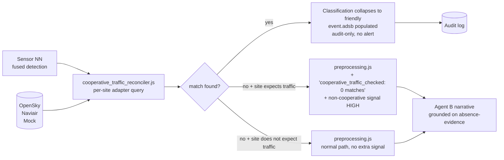

# Cooperative Traffic Fusion Architecture (planning, buildable today)

**Status:** `[planned — MVP buildable without Azure via OpenSky adapter, full version needs Naviair partner feed]` — designed 2026-09-05.

## Purpose

At aviation sites (CPH, Billund), sensors will detect hundreds of aircraft per day. Every commercial airliner, helicopter transit, and inspection drone. Without cooperative-traffic correlation, every one becomes an "unknown" event, alert fatigue kills operator trust, and real hostile drones drown in noise.

Cooperative-traffic fusion is **primarily a classification-precision input, not a visual layer.** When a sensor detection matches a cooperative track (ADS-B / flight-plan feed) in space, time, and class → confidence in the "friendly" classification jumps to near-certainty. When no cooperative track matches at a site that normally has cooperative traffic → positive evidence of NON-cooperation, feeding the hostile hypothesis with something stronger than "unknown, assume the worst."

## Pipeline



## Pluggable per-site adapters

Same seam pattern as `nn_source.js`. Each adapter implements `CooperativeTrafficSource`:

```
src/cooperative_traffic_source.js              # abstract seam
src/adapters/cooperative_opensky.js            # free, EU, dev + demo + first customer
src/adapters/cooperative_naviair.js            # partner-provided, real Danish ATC (planned)
src/adapters/cooperative_mock.js               # sim mode
```

Contract:

```
{
  getActiveTracks(bbox, timeWindow) → Promise<CoopTrack[]>
  subscribe(bbox, callback) → unsubscribe fn
}
CoopTrack = {
  callsign, icao24, lat, lon, alt_m, heading_deg, speed_ms,
  klass: 'fixed_wing_commercial' | 'helicopter_civilian' | 'fixed_wing_military' | ...,
  timestamp,
}
```

## Per-site configuration

Lives alongside existing site context (proposed location: extend `site_context.js` records):

```
cooperative_traffic: {
  expected: true | false,        // does normal ops involve overhead flights?
  source: 'opensky' | 'naviair' | 'none',
  match_radius_m: 800,           // spatial tolerance for correlation
  match_time_window_s: 4,        // temporal tolerance
  bbox_padding_deg: 0.15,        // how wide to poll cooperative feed around site
  poll_interval_s: 15,           // how often to refresh (rate-limit aware)
}
```

Sites that opt in:
- CPH, Billund (heavy commercial aviation)
- Port sites (helicopter O&M overflight)
- Energinet substations near flight corridors (case-by-case)

Sites that opt out (rural, no expected traffic): `expected: false, source: 'none'`. Absence of match tells you nothing at these sites — don't over-weight it.

## Reconciler logic (deterministic)

For every sensor detection at time T, position P, class C:

1. **Query the cooperative-track index** for tracks active within `match_radius_m` of P and within `match_time_window_s` of T.
2. **Score each candidate on three axes:**
   - Spatial: euclidean distance (weight decays past `match_radius_m`)
   - Temporal: |Δt| (weight decays past `match_time_window_s`)
   - Class compatibility: sensor said "fixed-wing" + ADS-B says "commercial airliner" → compatible; sensor said "quadcopter" → incompatible even at zero distance
3. **Best combined score above threshold (0.75) → match.**
   - Collapse classification to `friendly`
   - Populate `event.adsb.icao24 / callsign / flight_plan_match`
   - Bypass Agent B narrative path
   - Log as audit-only
4. **No match:**
   - If site's `cooperative_traffic.expected: true` → add strong signal to preprocessing block (see below)
   - If `expected: false` → proceed unchanged

## The "no match" signal — second-order gold

When a site normally has cooperative traffic AND the feed is live AND we checked N tracks AND zero matched, that's positive evidence of NON-cooperation. Much stronger than "unknown, defaulting to alert."

Fed into Agent B's structured signal block:

```
COOPERATIVE TRAFFIC CROSS-CHECK
─────────────────────────────────
Site expectation: cooperative traffic normally present (CPH ILS 04L approach corridor).
ADS-B feed status: live (12 cooperative tracks in 3 nm bubble at detection time).
Match result: 0 tracks compatible with observed class + trajectory.
Confidence uplift on non-cooperative hypothesis: HIGH.
```

Agent B narrative now grounds on this positive-absence-evidence, not just "unknown → assume hostile → alert everyone."

## Rendering (secondary, useful)

Cooperative tracks render as subtle grey icons with callsigns on the map. Distinct from hostile/unknown events which use the full alert visual language. Operator sees the whole picture, attention goes to the anomalies. Renders live from the same feed the reconciler uses — no separate wiring.

## Deployment topology

Adapter processes run as Scaleway Serverless Containers today (matches AIS proxy + VD-AMQP proxy pattern), Azure Container Apps in production. Cooperative-track index is in-memory (tracks are ephemeral, ~30 min lifetime max). No persistence needed for the tracks themselves — audit log captures match RESULTS, not raw feed history.

## What's buildable today (MVP, ~3-4 days)

1. `src/cooperative_traffic_source.js` — abstract seam.
2. `src/adapters/cooperative_opensky.js` — REST + polling. OpenSky free tier: ~400 req/day anonymous. Per-site bbox polling every 15s is well within limits.
3. `src/adapters/cooperative_mock.js` — for eval + sim.
4. `src/cooperative_traffic_reconciler.js` — spatial + temporal + class matching, scoring, threshold gate.
5. Extension to `site_context.js` — cooperative_traffic block per site.
6. Extension to preprocessing → Agent B prompt — new COOPERATIVE TRAFFIC CROSS-CHECK block.
7. Extension to event classification path — collapse to friendly on match.
8. Optional: ambient cooperative track rendering (Cesium layer).
9. Eval fixtures — one matched track, one unmatched-at-expected-site case.

## What needs partner integration

- Naviair adapter (`cooperative_naviair.js`) — trusted-source upgrade for production, requires the partnership.
- Any commercial ADS-B provider fallback (ADSBHub, FlightAware) if OpenSky rate limits get uncomfortable at scale.

Contract stays identical — swap adapters, everything else unchanged.

## Related

- `docs/agentic-architecture.md` — where this slots in the pipeline (upstream of preprocessing).
- `docs/agentic-preprocessing-architecture.md` — the layer this feeds a new signal block into.
- `docs/agentic-precedent-retrieval-architecture.md` — companion planned layer; better classification here means more useful precedents there.
- `docs/agentic-signature-bridge-architecture.md` — the OTHER classification input; both feed the same downstream logic.
- `docs/nn-adapter-explainer.md` — same architectural pattern (pluggable per-site adapter).
- Memory: `azure-final-destination`, `api-nn-plugin-ready`.
