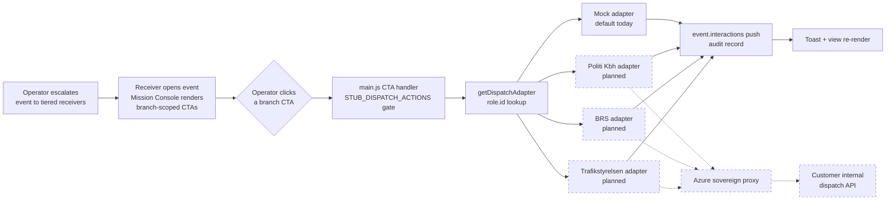

# Dispatch Adapter Architecture

**Status:** `[live — MVP mock adapter landed 2026-09-06; real per-receiver adapters register via `registerDispatchAdapter(roleId, adapter)` when customer APIs come online]`. Zero behavior change from the pre-adapter inline stub — the mock adapter preserves the audit-log push shape byte-for-byte.

## Why this exists

The Mission Console has 16 branch-scoped CTA actions today (deploy-patrol, set-cordon, request-aks, brs-standby, brs-deploy, army-c-uas, army-ground, intel-log, issue-notam, restrict-airspace, issue-maritime-advisory, kom-crisis, kom-shelter, hjv-reinforce, region-ambulance-standby, region-triage-prep). Every one fires a toast + writes an interaction audit record and stops there.

The real work — Politi Kbh's dispatch API, BRS's alerting system, Trafikstyrelsen's NOTAM push, the region's ambulance service, and so on — sits behind each customer's internal firewall. Those integrations land customer-by-customer over Phase 3+.

**This seam prepares the architecture so real customer APIs plug in without touching any CTA rendering code, any handler dispatcher, any receiver-role logic, or any of the 16 action names.** Same pattern as `nn_source.js` and `cooperative_traffic_source.js` — one interface, per-key adapter selection.

## Pipeline



## Contract

Every adapter (mock + future real ones) implements:

```js
{
  name: string,                       // 'mock' | 'politi-kbh-api' | ...
  async dispatch({
    action:       string,             // 'deploy-patrol', 'issue-notam', ...
    event:        object,             // full event, mutable (adapter pushes to event.interactions)
    actorRole:    object,             // getActiveRole() result
    actionDetail: object | undefined, // action-specific extras from the CTA dataset (empty today)
  }) → Promise<{
    status:      'accepted' | 'rejected' | 'error',
    external_id: string | null,       // real API's ticket / dispatch id when live
    timestamp:   ISO,                 // adapter-stamped
    provider:    string,              // 'mock' | 'politi-api' | ...
    notes:       string | null,       // human-readable free text
  }>
}
```

**Implementation contract:** the adapter is responsible for pushing to `event.interactions`. The caller (main.js CTA handler) surfaces the result via toast + re-render, but the audit record shape is owned by the adapter. Real adapters can push a richer payload (e.g. `payload: { action, event_id, external_ticket_id, dispatch_zone, eta_min }`) without touching the CTA handler.

## Registry

```js
import { registerDispatchAdapter, DEFAULT_DISPATCH_ADAPTER_KEY } from './dispatch_source.js';

// Per-receiver-role registration
registerDispatchAdapter('politi-kbh', politiKbhAdapter);
registerDispatchAdapter('brs-beredskab-copenhagen', brsAdapter);

// Fallback for any role without a specific adapter
registerDispatchAdapter(DEFAULT_DISPATCH_ADAPTER_KEY, mockAdapter);   // already done on import
```

## Lookup semantics

`getDispatchAdapter(roleId)` returns:
1. The adapter registered under `roleId` if one exists (customer's real adapter takes precedence).
2. Otherwise, the adapter registered under `DEFAULT_DISPATCH_ADAPTER_KEY` (mock).
3. Otherwise, `null` (never in practice — mock self-registers on import).

## Mock adapter (default today)

`src/adapters/dispatch_mock.js`. Preserves the pre-adapter inline stub push shape byte-for-byte:

```js
event.interactions.push({
  id:            `ACT-${Date.now()}-${Math.floor(Math.random() * 1000)}`,
  timestamp:     new Date().toISOString(),
  flow:          'action-dispatched',   // literal string, not FLOW_TYPES member
  from_role_id:  roleId,
  to_role_id:    'response-pipeline',
  payload:       { action, event_id: event.id },
  ackStatus:     'pending',
  ackedAt:       null,
  ackedBy:       null,
});
```

The `flow: 'action-dispatched'` literal is a schema violation vs IDD IF-6.12 (which expects a `FLOW_TYPES` enum member), but it is what the pre-adapter stub used and Phase 3+ readers may already be coded against it. Not touching without an explicit schema decision.

## Real customer adapter (illustrative — not built)

```js
// src/adapters/dispatch_politi_kbh.js
class PolitiKbhAdapter {
  constructor({ proxyEndpoint }) { this.proxyEndpoint = proxyEndpoint; }
  async dispatch({ action, event, actorRole }) {
    const timestamp = new Date().toISOString();
    try {
      // Call Azure sovereign proxy, which forwards to Politi's internal
      // dispatch API. Same auth pattern as Mistral (see IDD IF-9.7).
      const res = await fetch(`${this.proxyEndpoint}/dispatch/politi/kbh`, {
        method: 'POST',
        headers: { 'Content-Type': 'application/json' },
        body: JSON.stringify({
          action, event_id: event.id, event_class: event.classification,
          threat_level: event.threat, actor_role_id: actorRole?.id,
        }),
      });
      const json = await res.json();
      const externalId = json?.dispatch_ticket_id || null;

      // Adapter pushes to event.interactions itself — richer payload
      // than the mock (external_id, dispatch_zone from API response).
      if (!Array.isArray(event.interactions)) event.interactions = [];
      event.interactions.push({
        id: `ACT-${Date.now()}-${Math.floor(Math.random() * 1000)}`,
        timestamp,
        flow: 'action-dispatched',
        from_role_id: actorRole?.id || 'unknown',
        to_role_id: 'politi-kbh-dispatch',
        payload: { action, event_id: event.id, external_ticket_id: externalId, ...json?.dispatch_meta },
        ackStatus: json?.acked ? 'acked' : 'pending',
        ackedAt: json?.acked ? timestamp : null,
        ackedBy: json?.acked_by || null,
      });

      return {
        status: res.ok ? 'accepted' : 'rejected',
        external_id: externalId,
        timestamp,
        provider: 'politi-kbh-api',
        notes: json?.notes || null,
      };
    } catch (err) {
      return { status: 'error', external_id: null, timestamp, provider: 'politi-kbh-api', notes: err.message };
    }
  }
}

registerDispatchAdapter('politi-kbh', new PolitiKbhAdapter({
  proxyEndpoint: import.meta.env.VITE_AZURE_PROXY_URL,
}));
```

## Detection-only stance

Adapters carry the operator's decision to the right endpoint. They DO NOT make decisions. The operator's click IS the decision. Adapter responses (accepted / rejected / error) are transport telemetry, not agent recommendations. Nothing in this seam feeds back into any agent prompt or reasoning surface.

## Azure fit

Real adapters call the Azure sovereign proxy, never customer APIs directly. Same pattern as Mistral inference in IDD IF-9.7:
- Browser → Azure Container Apps proxy → customer's internal dispatch endpoint
- Proxy holds per-tenant credentials in Key Vault
- No customer API credentials ever land in the browser bundle
- Retry, rate-limit, and audit logging enforced at the proxy tier

## When to build a real adapter

Trigger per customer: their internal dispatch API is documented + accessible + auth model agreed. Then one file per adapter under `src/adapters/dispatch_<customer>.js`, one import in `main.js`, one `registerDispatchAdapter(roleId, instance)` call. Nothing else changes.

## Related

- `docs/agentic-architecture.md` §14 Audit / Feedback Log — the feedback_log module already records the operator-decision triple; dispatch adapter's `external_id` return value flows into that triple's `actionDetail`.
- `docs/interface-design-document.md` IF-6.12 — `event.interactions` schema (the mock's literal `flow` value violates it; open decision).
- `docs/interface-design-document.md` IF-9.7 — Azure sovereign proxy pattern that real adapters route through.
- `docs/cross-agency-flows.md` — end-to-end escalation scenarios that will exercise real adapters when they land.
- Memory: `project_azure_final_destination`, `feedback_operator_receiver_flow`, `feedback_detection_only_positioning`.
