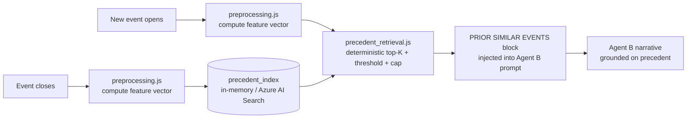

# Precedent Retrieval Architecture

**Status:** `[live — MVP in-memory index landed 2026-09-05; Azure AI Search adapter deferred]`. Built into Agent B post-event debrief flow. Detection-only stance enforced in prompt-block trailing instructions + backed by eval assertion.

## Purpose

Every event today is analyzed fresh. Agent B has never seen an event before. If an operator recognizes "this looks like the Bjæverskov intrusion last month", they say so out loud — the platform doesn't. **Precedent retrieval closes that gap by surfacing similar past events to Agent B as a grounded context block.**

Detection-only stance holds: precedents are context for the operator's decision, not a basis for the agent to propose specific actions. See [feedback_detection_only_positioning](../memory/feedback_detection_only_positioning.md).

## Pipeline



## Event feature vector

Computed on close (for storage) and on open (for query). Deterministic, versioned.

Fields (indicative — full list evolves as coverage grows):

| Field | Source | Purpose |
|---|---|---|
| `site_id` | `event.siteId` | Spatial tier gate |
| `asset_targeted` | `analysis.closestAssetApproach.assetId` | Primary similarity signal |
| `platform_family` | `event.subject.category` + `event.subject.klass` | Class similarity |
| `cardinality` | `event.droneCount` bucketed (1 / 2-3 / 4-6 / 7+) | Formation similarity |
| `dwell_signature` | `analysis.dwellProfile.hotspotIds` sorted + hashed | Behavior similarity |
| `approach_vector_bucket` | Bearing at entry, 8-way compass | Trajectory similarity |
| `notability_tier` | Preprocessing output | Depth of comparison |
| `class_transitions` | `analysis.classChangeLog` bool | Uncertainty signal |
| `outcome` | `event.outcome` | Retrieval filter (only closed events with outcomes) |

Vector is a normalized concatenation of one-hot + numeric features. Cosine similarity between two events = the base similarity score.

## Deterministic cutoff logic

The LLM never decides how many precedents to include. Preprocessing decides. Everything is a constant, versioned in `conf/precedent_retrieval.yaml`.

**Four dimensions applied in order:**

1. **Spatial tier (hard filter):**
   - Tier 1: same site + same asset targeted
   - Tier 2: same site, any asset
   - Tier 3: same operator (customer tenant)
   - Tier 4: cross-tenant same platform family (fallback only when tiers 1-3 yield fewer than 2 results)

2. **Semantic similarity (score):** cosine similarity between feature vectors, computed within the spatial tier.

3. **Temporal decay (weight):**
   - Last 30 days = weight 1.0
   - 30-180 days = weight 0.7
   - 180-365 days = weight 0.4
   - > 12 months = weight 0.15

4. **Include gate:**
   ```
   include event IFF
     spatial_tier ≤ 3
     AND (temporal_weight × cosine_similarity) ≥ 0.72
     AND running_token_budget < 1800
   TOP-5 max
   ```

Configurable per-site. High-traffic sites tighten the similarity floor to avoid retrieving too many marginal events.

## What Agent B actually sees

Injected as a new prompt block, upstream of the existing STRUCTURED SIGNAL BLOCK:

```
PRIOR SIMILAR EVENTS AT THIS SITE
─────────────────────────────────
1. DET-20260814-0417 — 22 days ago — similarity 0.84
   Single Mavic, same approach vector from Øresund side, dwelled 3 min over Terminal 2.
   Classified hostile. Neutralised by police patrol. Wreckage recovered.

2. DET-20260722-0311 — 45 days ago — similarity 0.78
   Autel Evo, same entry corridor, exited without dwell.
   Classified hostile. No dispatch (out of coverage before response arrived).

Use these as contextual reference. Do NOT extrapolate or recommend action
based on prior outcomes. Highlight pattern similarity only if it exists.
```

The last two sentences are load-bearing — they enforce the detection-only stance in the prompt. Agent B surfaces the pattern; operator makes the call.

## Storage

- **Today (pre-Azure):** in-memory `Map<eventId, featureVector>` rebuilt from `EVENTS` array on page load. Fine for demo; capped by memory to a few thousand events.
- **Production (Azure):** Azure AI Search vector index. Same interface, `precedent_retrieval.js` gets a new adapter, agent B unchanged.

## Auditability

Operator can always ask "why did you show me this precedent?" — the answer is a scored table:

```
Retrieved for DET-20260904-0021:
  ID              spatial_tier  similarity  recency_weight  weighted
  DET-20260814..  1             0.87        0.85            0.74  ✓ included
  DET-20260722..  1             0.79        0.75            0.59  ✓ included
  DET-20260514..  2             0.71        0.40            0.28  ✗ below threshold
```

Not a model opinion. A deterministic score.

## What's buildable today (MVP, ~2-3 days)

1. `src/precedent_index.js` — in-memory index, event registration on close, feature vector computation.
2. `src/precedent_retrieval.js` — deterministic query with tier + similarity + recency scoring.
3. Extension to `preprocessing.js` — compute event feature vector, register on close, query on new-event open.
4. Injection into `agent_b_debrief.js` prompt builder as PRIOR SIMILAR EVENTS block.
5. Eval fixture — one event with known-similar precedent, assertion `precedent_grounding` verifies the retrieval fired.

## What needs Azure

- Vector index at scale (Azure AI Search)
- Cross-tenant precedent (behind Entra ID access controls)
- Long-term persistence beyond one browser session

The MVP interface is identical to the production one — swap the storage adapter, everything else unchanged.

## Constraints from detection-only stance

- Precedents are for CONTEXT. Agent B must not say "based on the outcome of DET-20260814-0417, dispatch X units."
- Precedents include outcome for OPERATOR reference, not agent inference.
- If a similar past event had a bad outcome, Agent B surfaces the pattern; the operator decides what to do differently, not the platform.

## Related

- `docs/agentic-architecture.md` — where this slots in the agent pipeline.
- `docs/agentic-preprocessing-architecture.md` — the layer this extends.
- `docs/agentic-eval-architecture.md` — how the retrieval logic gets regression-tested.
- `docs/agentic-cooperative-traffic-fusion-architecture.md` — companion planned layer; precedent retrieval assumes past events are well-classified, which cooperative-traffic fusion enables.
- Memory: `feedback-detection-only-positioning`, `azure-final-destination`.
