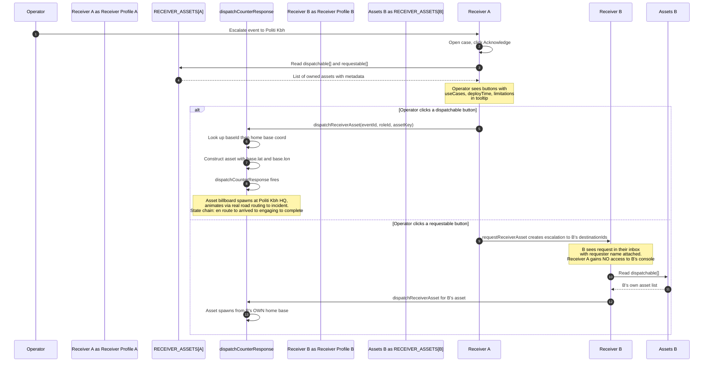

# Receiver Asset Plug-in Architecture

Locked-in design for how a receiver profile (police district, tactical unit, emergency management centre, home guard district, regulatory agency, medical region) declares the physical response assets it owns and how those assets surface in the receiver console for the operator to dispatch.

Last updated 2026-09-07.

## Purpose

Real customers give us their real asset inventory. That data lands in one file with a simple schema and shows up in the app immediately. No code changes, no dispatch engine changes, no risk of breaking existing flows.

## Two systems, cleanly separated

There are two distinct dispatch surfaces in the receiver console. They serve different purposes and are wired to different data sources.

### System 1: Department-owned assets (this document)

Owned by the receiver profile. Spawned from the profile's own home base coordinate. Metadata-rich so the operator understands capability, use cases, deploy time, and limitations before clicking.

Configured in `src/receiver_assets.js` using the schema below.

Surfaces in the case-file "Your Response" section.

### System 2: National asset pool (existing, unchanged)

Distributed across Denmark. Ranked by real distance to the threat. Response bundle selects appropriate kinds per threat class.

Configured in `src/response_assets.js` with `ROLE_DISPATCH_SCOPE_LOOKUP` in `src/main.js` gating which roles can fire which kinds.

Surfaces in the Mission Console right pillar.

Both systems ultimately spawn assets via the same `dispatchCounterResponse` engine but they answer different questions:

- System 1 answers "what does THIS department own"
- System 2 answers "what national assets can respond to THIS threat class"

## The plug-in schema

```javascript
export const RECEIVER_ASSETS = {
  '<role-id>': {
    label: 'Human readable profile name',
    baseId: 'link-to-receiver_bases.js-entry',

    dispatchable: [
      {
        assetKey: 'unique-stable-id',
        kind: 'maps-to-CD_PROFILE-entry-in-main.js',
        name: 'Human readable asset name',
        count: 12,
        icon: 'emoji',
        useCases: [
          'Scenario one this asset addresses',
          'Scenario two',
        ],
        capabilities: {
          coordination: true,
          armed: true,
          kinetic_counter_drone: false,
        },
        deployTime: '3-8 minutes from station via road routing',
        limitations: 'District only, no airspace jurisdiction',
      },
    ],

    requestable: [
      {
        requestKey: 'unique-stable-id',
        from: 'target-role-id',
        name: 'Requested capability name',
        useCases: [
          'When to request this',
        ],
        priority: 'critical',
        expectedResponse: 'What the target profile will dispatch',
      },
    ],
  },
};
```

## How the two axes work

### Dispatchable

The profile owns these assets. Clicking a dispatch button spawns the asset billboard at the profile's home base coordinate and animates it toward the incident site via the counter dispatch engine. Same visual pattern the operator uses when they scramble a fighter.

The `kind` field maps to a `CD_PROFILE` entry in `src/main.js` that defines the dispatch physics: cruise speed, arrival radius, engage time, icon, whether it uses road routing.

### Requestable

The profile does NOT own these assets. Clicking a request button creates a new escalation targeting the `from` profile. That target profile sees the request in their inbox with the requester's name attached and can dispatch their own asset. The requesting profile gains NO access to the target's dispatch console.

## Flow diagram



## Adding new assets for an existing profile

Append a new object to `dispatchable[]` in `src/receiver_assets.js` for that profile:

```javascript
{
  assetKey: 'kbh-drone-jammer-v2',
  kind: 'receiver-drone-jammer',
  name: 'Portable radio frequency jammer',
  count: 2,
  icon: '📡',
  useCases: ['Suspected drone control channel disruption', 'Airspace de-escalation'],
  capabilities: { rf_jamming: true, kinetic_counter_drone: false },
  deployTime: '5 minutes from station',
  limitations: 'Effective range 500 metres',
}
```

Then ensure `main.js` has a matching `CD_PROFILE['receiver-drone-jammer']` entry with the dispatch physics. That is the only code change required.

## Adding a new receiver profile entirely

Add a new top-level key to `RECEIVER_ASSETS`:

```javascript
'brs-hovedstaden': {
  label: 'Beredskabsstyrelsen Hovedstaden',
  baseId: 'brs-hovedstaden-hedehusene',
  dispatchable: [
    {
      assetKey: 'brs-hazmat-truck',
      kind: 'receiver-hazmat-truck',
      name: 'Hazmat response truck',
      count: 4,
      icon: '☣',
      useCases: ['Chemical or biological contamination at incident site', 'Fuel leak from downed drone'],
      capabilities: { hazmat: true, decon: true },
      deployTime: '25-35 minutes from Hedehusene to Copenhagen',
      limitations: 'Requires evacuation of civilians before deployment',
    },
  ],
  requestable: [],
}
```

The profile appears in the receiver console immediately on next render. No dispatch engine changes, no route wiring, no per-profile branch logic in main.js.

## Real-customer plug-in path

When we onboard a real Danish police district or utility operator:

1. Customer gives us their inventory of counter drone assets, patrol vehicles, forensic teams, coordination cells, or equivalent.
2. We add each asset as a row in that customer's profile in `receiver_assets.js`.
3. Metadata fields (useCases, deployTime, limitations) come from the customer's own doctrine documentation.
4. New asset kinds get a `CD_PROFILE` entry in `main.js` if the dispatch physics differ from existing kinds. If a new customer asset is behaviourally identical to an existing kind (e.g. another patrol car variant), reuse the existing `CD_PROFILE` entry.

No refactor of dispatch engine. No risk of breaking existing profiles. No cross-tenant leakage since each profile only reads its own top-level key.

## Invariants

1. **Data separation**: real coordinates for home bases live in `receiver_bases.js`. Asset inventory lives in `receiver_assets.js`. Dispatch physics lives in `CD_PROFILE` in `main.js`. Each file has one job.

2. **No cross-tenant leakage**: a receiver profile can only read from its own top-level key. Requesting an asset from another profile creates a plain escalation with no direct access to the target's dispatch console.

3. **Detection-only stance**: dispatch actions are triggered by explicit operator click. No auto-dispatch based on inference. Every dispatched asset carries a full audit trail via the existing counter dispatch record.

4. **Additive plug-in**: adding new assets or new profiles never touches shared logic. No branch conditions in main.js grow with each new customer.

## Current profiles configured

- Politi København: 4 dispatchable (patrol car, K9 unit, cordon squad, forensic team), 1 requestable (Aktionsstyrken tactical intervention)
- Aktionsstyrken: 2 dispatchable (tactical van, strike team)
- Rigspolitiet: 2 dispatchable (national coordination cell, national cyber crime team), 1 requestable (Aktionsstyrken tactical intervention)

Additional profiles land as customer conversations produce inventory data.

## Related architecture docs

- `docs/agentic-architecture.md` — overall receiver contract
- `docs/interface-design-document.md` — full interface contract including dispatch interfaces
- `docs/user-flows.md` — Flow 3 covers the receiver leaf to dispatch loop
