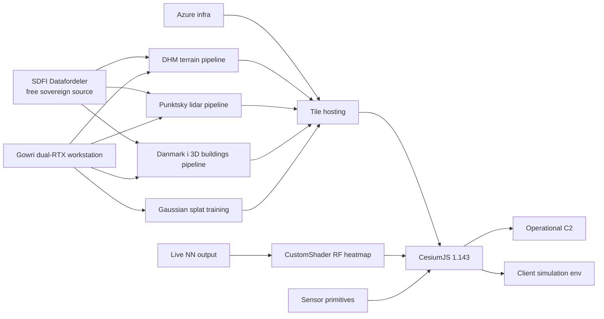
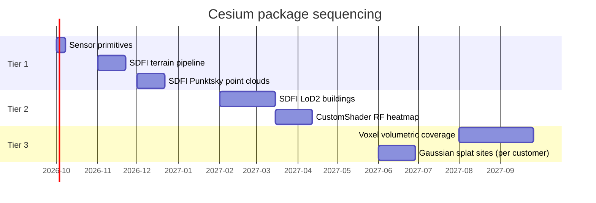

# Cesium Full-Package Roadmap

**Scope:** long-horizon visualization roadmap for the ISR C2 platform and the client-facing simulation environment. Establishes what future Cesium capabilities are committed to, in what order, under what hard constraints.

**Status:** planning. No code depends on this document yet. Consumed by future implementation work when the prerequisites (GPU compute, sovereign data pipelines, real NN output) are in place.

---

## 1. Purpose

Two surfaces share the same Cesium engine and must evolve together.

1. **Operational C2** — the live platform running detection, coverage, and response coordination for real customers. Every visual is a load-bearing operator surface.
2. **Client simulation environment** — the training and pre-deployment surface where customers rehearse operator workflows, verify sensor placement, and run scenario replays before go-live. Same engine, different data source, different constraints on realism-vs-clarity.

This document maps every Cesium feature we intend to add to either surface, ordered by dependency and cost. Features are grouped in tiers reflecting when they become buildable.

---

## 2. Hard constraints (non-negotiable, apply forever)

Every feature listed here obeys these. Any proposal that violates them is out of scope.

- **No Cesium ion.** Sovereign procurement rules eliminate ion for the customers we target.
- **No Google Photorealistic 3D Tiles.** Same procurement reason.
- **No mutation of `viewer.globe`, `viewer.scene.atmosphere`, or `viewer.clock` properties.** Additive entities only. Day-mode Cesium settings are off-limits.
- **Detection-only invariant preserved.** No auto-response visualization, no kinetic overlay, no offensive-action rendering.
- **Coverage-visibility gating preserved.** Tracked objects hide when outside every sensor coverage radius. Universal rule across all views.
- **Additive-only rendering.** Layer additions and entity additions are the only permitted extension pattern.

Reference memories: `never-touch-day-mode`, `never-touch-cesium-globals`, `map-architecture`, `sensors-observe-only`, `detection-only-positioning`.

---

## 3. Current baseline (2026-09)

- CesiumJS 1.143
- SDFI 2D imagery as default basemap
- Gated 3D toggle. Copenhagen bbox branches to the free SDFI-derived city model. Outside CPH uses a paid EU provider for 3D basemap where a customer requires it.
- Additive detection entities, additive coverage visualizations, additive dispatch entities. No global property mutations.

---

## 4. Feature tiers

### Tier 1 — Immediate, low cost, sovereign

Features that ship as soon as engineering time is allocated. No blocking dependency on new hardware or new data pipelines beyond what SDFI already exposes free.

#### 1.1 Custom sensor primitives (ConicSensor / CustomPatternSensor)
**What:** GPU-tessellated true 3D sensor volumes. Cones for radar and RF antennas, arbitrary polar patterns for acoustic and camera, wedges for directional sensors. Configurable inner/outer angles, min/max clock angles, radius.

**GPU role:** Client render. Tessellation happens at draw time.

**Sovereign data:** None required. Rendered from sensor parameters already in the site config.

**Cost:** Days.

**Detection-only fit:** Perfect. This is the observe-only invariant made visible.

**License note:** Canonical implementations live in the Cesium Ion SDK. Community open-source forks exist (`cesium-sensors` family). Verify license compatibility before landing.

#### 1.2 Self-hosted SDFI quantized-mesh terrain
**What:** Convert SDFI Danmarks Højdemodel (DHM, roughly 5cm vertical accuracy) into Cesium quantized-mesh tiles, served from an ISR-owned endpoint.

**GPU role:** Server pre-compute one-time. Client render standard.

**Sovereign data:** SDFI Datafordeler DHM, free public. Note the Q2-2026 file-download phase-out. Migration to the newer distribution channel required.

**Cost:** Medium (1-2 weeks). Toolchain `cesium-terrain-builder` (C++, mature) or `tin-terrain`.

**Detection-only fit:** Passive basemap. No invariant risk.

#### 1.3 Point cloud rendering from SDFI Punktsky
**What:** Stream national lidar as `.pnts` tiles with GPU attenuation, per-point classification styling, eye-dome lighting.

**GPU role:** Both. Server tiles the raw cloud once. Client renders millions of points via GPU attenuation.

**Sovereign data:** SDFI Punktsky, free public. Toolchain `PDAL` and `py3dtiles`.

**Cost:** Medium (1-2 weeks).

**Detection-only fit:** Visualizes returns, not intent. Fits the invariant.

### Tier 2 — Medium horizon, dependencies

Features that require either the Gowri GPU workstation online, real NN output emitting, or a specific customer commitment to a site.

#### 2.1 CustomShader RF heatmaps
**What:** Attach GLSL vertex/fragment shaders to `Model` or `Cesium3DTileSet` entities. Drive color by RF signal strength, path loss, or acoustic intensity via uniforms sourced from NN output.

**GPU role:** Client render (heavy for volumetric fields).

**Sovereign data:** None required. Driven by NN output.

**Cost:** Medium (1-2 weeks per effect family).

**Detection-only fit:** Yes. Shows what sensors see, not what to do.

**Constraint:** CustomShader only attaches to `Model` and `Cesium3DTileSet`, not raw `Primitive`. Route heatmaps through a glTF or tiled dataset. This is a real API limitation, not a workaround.

**Blocks on:** First real NN emitting live signature output.

#### 2.2 Danmark i 3D LoD1/LoD2 buildings
**What:** Render every Danish city in 3D from sovereign national building models (SDFI Danmark i 3D). LoD1 is the "klodsmodellen" block model. LoD2 adds basic roof shapes. No ion, no Google.

**GPU role:** Server pre-compute pipeline (CityGML into 3D Tiles). Client render standard.

**Sovereign data:** SDFI publishes national LoD1/LoD2 as CityGML/CityJSON. EU sovereign equivalents also exist for Netherlands (3D BAG), Germany (LoD2-DE per Bundesland), France (IGN BDTOPO).

**Cost:** Medium-large (2-4 weeks). Pipeline: CityGML into 3DCityDB (Postgres/PostGIS) into `py3dtilers` CityTiler into `tileset.json`. Simpler alternative: `citygml-to-3dtiles` (Node) for datasets that fit without the DB step.

**Detection-only fit:** Static basemap context. No auto-response.

**Blocks on:** Gowri workstation online, or Azure GPU compute provisioned.

### Tier 3 — Watch, do not build yet

Features whose spec is mature but whose runtime, ecosystem, or per-site cost makes them premature. Track their status. Do not commit engineering time until the trigger conditions land.

#### 3.1 Voxel 3D Tiles (3DTILES_content_voxels)
**What:** True 3D voxel grids (ellipsoidal, cuboid, or cylindrical) storing sensor coverage or RF field as volumetric metadata. Rendered via GPU raymarching instead of stacked polygons.

**Trigger to build:** CesiumJS runtime for voxels stabilizes. Spec is production. JS runtime is still maturing as of mid-2026.

**Cost when triggered:** Large.

#### 3.2 Gaussian splat 3D Tiles (KHR_gaussian_splatting)
**What:** Photorealistic reality-mesh streaming via SPZ-compressed splats. Highest visual fidelity Cesium supports.

**Trigger to build:** A named customer commits to a specific site (CPH, Billund, Nordic energy facility) where photorealism justifies the capture-and-train cost.

**Cost when triggered:** Large per site. Full pipeline: drone photogrammetry capture, splat training on Gowri box, tiling, hosting. High visual value, high per-site cost.

#### 3.3 WebGPU port
**What:** Full CesiumJS renderer on WebGPU instead of WebGL2. Compute shaders unlock. Lower CPU overhead.

**Trigger to build:** Cesium ships an official CesiumJS 2.0 with WebGPU as the default renderer.

**Do not plan around:** Cesium's official position is "longer-term exploration." A community fork exists but is not an official release. The 18-month horizon does not assume WebGPU parity.

#### 3.4 3D Tiles vector data (KHR-based, tech preview mid-2026)
**What:** Stream points, lines, polygons with centimeter-precision 3D coordinates as 3D Tiles vector content. Site perimeters, exclusion volumes, sensor footprints on terrain.

**Trigger to build:** Cesium ships full 3D Tiles 2.0 vector support. CesiumJS 1.142 shipped preliminary `MVTDataProvider` and `EdgeDisplayMode` in June 2026 but the full spec is still stabilizing per Cesium's RFC track.

**Cost when triggered:** Medium.

---

## 5. Client simulation environment specifics

The simulation surface shares the Cesium engine with the operational C2 platform but is scoped for customer training and pre-deployment scenario validation. Same engine, different data source, different constraints on realism-vs-clarity.

### 5.1 Simulation-specific value from Tier 1
- **Sensor primitives** matter more in simulation than in ops. Trainees learn to read coverage volumes, gap analysis, overlap geometry. Ops uses the same primitives but rarely inspects them past the first week.
- **Terrain and point clouds** raise scenario realism without adding training complexity. Same tiles, same tooling.

### 5.2 Simulation-specific value from Tier 2
- **LoD2 buildings** convert every Danish site into a runnable scenario. Trainees rehearse dispatch through recognizable geography, not synthetic squares.
- **RF heatmap shaders** train intel-tier and archetype-liaison-tier users to interpret propagation, multipath, terrain masking. Simulation is where these signals are safe to explore.

### 5.3 Simulation-specific value from Tier 3
- **Gaussian splats** are the highest-yield simulation feature. Photorealistic renderings of a customer's actual site turn training from abstract to immediate. This is where the per-site cost becomes justifiable, because training reuses the capture across every scenario, every trainee, every year.

### 5.4 What simulation must NOT do
- No time-of-day mutation. The `viewer.clock` constraint applies to simulation as strictly as to ops.
- No atmospheric effects that shift the base rendering pipeline. Additive-only holds.
- No kinetic overlay even in simulation. Detection-only positioning applies to training as well. Trainees rehearse detection and coordination, not engagement.

---

## 6. Dependencies

The critical path is Gowri workstation online. Every Tier 2 feature blocks on server-side tile generation. Tier 1 sensor primitives ship independently.

---

## 7. Sequencing (18-month horizon)

Order reflects both cost and dependency graph.

Two rules govern the schedule.

1. **Sovereign story locks first.** Tier 1 items 1.2 and 1.3 must ship before any procurement conversation with a sovereign customer that asks "what is your terrain source." Answer must be "our own tiles from SDFI, hosted on Azure, no ion, no Google."
2. **NN dependencies gate Tier 2 shader work.** Do not build 2.1 (RF heatmap CustomShader) until the first real NN emits signature output. Otherwise the shader is driven by synthetic uniforms and the operator surface teaches trainees a fictional propagation model.

---

## 8. Architecture integration points

Every feature must integrate without violating the additive-only rule.

| Feature | Integration seam | Additive check |
|---------|------------------|-----------------|
| Sensor primitives | `viewer.entities.add(...)` per sensor | Yes, new entities |
| SDFI terrain | `viewer.terrainProvider = new CesiumTerrainProvider({url: ...})` | Yes, replacement of tile source only, no global mutation |
| Point clouds | `viewer.scene.primitives.add(new Cesium3DTileset({url: ...}))` | Yes, additive primitive |
| LoD2 buildings | `viewer.scene.primitives.add(new Cesium3DTileset({url: ...}))` | Yes, additive primitive |
| CustomShader RF heatmap | Attach to existing `Model` / `Cesium3DTileset` | Yes, shader hook, not global |
| Voxel coverage | `viewer.scene.primitives.add(new Cesium3DTileset({voxel: true, ...}))` | Yes, additive |
| Gaussian splats | Same primitive pattern | Yes, additive |

None of these touch `viewer.globe`, `viewer.scene.atmosphere`, `viewer.clock`, or day-mode branches. All pass the additive-only check.

---

## 9. What we will NOT build

Explicit exclusions. Adding them here prevents re-litigation.

- Any ion-backed feature.
- Any Google-backed feature (Photorealistic 3D Tiles, Street View, etc).
- Any Cesium global property mutation (globe color, atmosphere hue, clock rate).
- Any day-mode Cesium setting change.
- Photorealistic Gaussian splats before a specific named customer justifies the per-site capture cost.
- WebGPU migration before Cesium ships an official 2.0 with WebGPU as default.
- Kinetic overlays, offensive-action visualizations, or auto-response rendering (violates detection-only).
- Any mid-transit track rendering outside sensor coverage (violates sensors-observe-only).

---

## 10. Related

- `docs/geospatial-integrations.md` — SDFI integration state today
- Memory `map-architecture` — current baseline
- Memory `never-touch-day-mode` and `never-touch-cesium-globals` — the hard walls
- Memory `sensors-observe-only` — visibility gating rule
- Memory `detection-only-positioning` — invariant that scopes every feature above
- Memory `gowri-workstation` — the GPU dependency for server pre-compute
- Memory `azure-final-destination` — where tiles will eventually live
