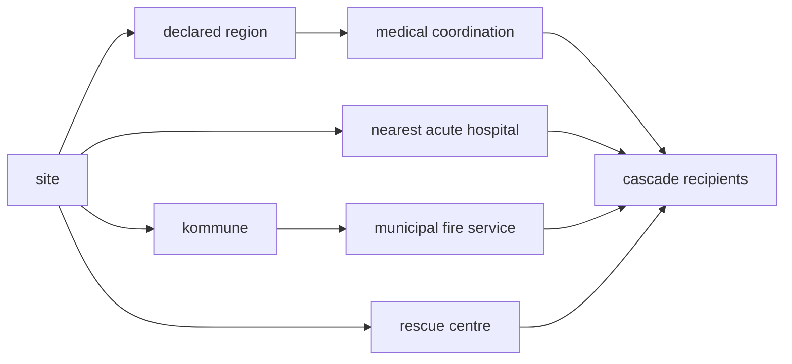

# Consequence routing architecture

Which agencies get alerted when something detonates or comes down at a
site: medical coordination, the receiving acute hospital, the municipal
fire service, and the state rescue reinforcement.

Table and lookup live in `src/consequence_routing.js`. It is pure data
plus one function, imports nothing, and runs under plain Node, so
`scripts/check-impact-cascade.mjs` verifies every id in it against the
real destination and role tables.

## The bug this replaced

The terminal-impact cascade alerted a fixed list of six Copenhagen
organisations for **every** site. A detonation at Billund Airport
summoned Rigshospitalet, Hovedstadens Beredskab and Beredskabsstyrelsen
Hedehusene, all of them a country away, while the services that actually
cover Billund were never told.

It was correct only because every site that could detonate happened to
be in the capital region. That is the same "latent, not live" reasoning
that let five dead receiver inboxes ship.

## Nothing here invents an organisation

Every role named in the table already existed in `roles.js`: five
regional medical coordination centres, 23 acute hospitals, 29 municipal
fire services, seven Beredskabsstyrelsen centres. What was missing was a
destination for them and a link back from the role, so they could be
named but never reached.

Wiring them up was 18 destinations and 18 role links. No new Danish
organisation, address or coordinate was created.

## How each capability is decided

| Capability | Decided by | Source |
|---|---|---|
| Medical coordination | the site's region | already declared in every site manifest |
| Municipal fire | the site's kommune | kommune resolved by point-in-polygon against official Danish boundary data, then matched to the `kbr-*` role whose `member_kommuner` contains it |
| Acute hospital | nearest akutmodtagelse | verified per site, see caveats |
| State rescue | Beredskabsstyrelsen centre | already named in every site manifest |

Kommune was resolved against official boundaries rather than by name
similarity. That matters: the Landerupgård manifest describes the site
as Fredericia, and the coordinates fall in Kolding.

## Judgement calls, recorded

These are the places where "nearest" is not the answer.

- **Copenhagen Airport and Amager route to Hvidovre, not
  Rigshospitalet.** Rigshospitalet is geometrically nearer to both, but
  it is Region Hovedstaden's trauma centre rather than a walk-in acute
  department. It is listed second, as escalation. A naive
  nearest-by-distance rule would pick it and be wrong.
- **Billund routes to Kolding, not Vejle.** Vejle is nearer but its
  emergency function runs 07 to 22. The 24-hour Fælles Akutmodtagelse
  for Sygehus Lillebælt is at Kolding, so Vejle is not a valid
  destination for a night event.
- **Copenhagen Airport's fire service is Tårnby, not Hovedstadens
  Beredskab.** Tårnby Brandvæsen covers the airport landside. Airside
  first response is the airport's own Lufthavnsbrandvæsen, which has no
  role in `roles.js` and so is not alerted. That is a known gap.
- **Bjæverskov is in Region Sjælland but routes to the Hedehusene
  rescue centre**, as its manifest declares. The repo holds a verified
  address for Beredskabsstyrelsen Sjælland in Næstved but no role for
  it. Kept as declared rather than inventing a role.

## Self-referential ids, and the trap they avoid

A consequence destination's id equals its role id, and the role holds
its own id in `destinationIds`.

This is load-bearing. Amager Koblingsstation's site code is **AMK**, so
its site-scoped destinations are `amk-t2-politi`, `amk-t3-cfcs` and so
on. The gate's old capability check matched an `amk-` prefix to mean
"an ambulance service was alerted", which a police destination would
have satisfied with no ambulance present. The gate now checks the named
fields in the routing table instead of prefixes, so the trap is closed
rather than avoided by luck.

## No fallback, on purpose

`consequenceAgenciesForSite` returns an **empty array** for a site it
does not know. It does not fall back to a default set, because falling
back to Copenhagen is the bug being removed, and a silent wrong answer
is worse than a visible empty one.

The build gate fails if a site with a detonating template has no routing
entry, so an empty result cannot reach production unnoticed.

## What the gate enforces

`scripts/check-impact-cascade.mjs` imports the real modules and runs the
real resolvers rather than pattern-matching source text. Text matching
cannot see a destination generated at runtime, which every Amager
destination is.

- the cascade still calls the resolver, for both the consequence leg and
  the police leg
- every detonating site has a routing entry
- every routed agency has a destination, an owning role, and a home base
  if it has vehicles
- every routed site covers all four capabilities, checked on the named
  fields
- no two destinations share an id
- every Politikreds destination is held by a role naming the same
  district, and no two roles claim one district

All mutation-tested: each fix reverted individually fails the gate.

## Two duplicate-id bugs this surfaced

Adding the shared destinations exposed both.

The **Aktionsstyrken generator** treated `siteId: null`, which marks a
shared destination, as if it were a site. It minted an entry for "no
site" whose prefix came from the first shared destination,
`amk-hovedstaden`, producing `amk-t3-aks` with no site that collided
with Amager's real one. Lookups return the first match, so which one you
got depended on array order.

**Esbjerg declared NORDEFCO inline** while the universal tier-5
generator also emitted it. The inline copy is removed and the generator
is now idempotent.

## Every routed agency can dispatch

All 24 have a verified station and vehicles. A detonation anywhere now
alerts local agencies that actually put vehicles on the road.

Verification standard for every coordinate:

- an OpenStreetMap house node with matching house number, road and
  postcode. Never a street centroid, never a city-level fallback.
- cross-checked against DAWA, the official Danish address register, or
  against the organisation's own published address, or both.
- where a second independent confirmation was not available, the base
  comment says so rather than implying a confidence the data lacks.

These are plot address points, not apparatus-bay doors. On a large
hospital campus the emergency entrance can sit 50 to 250 metres away.
That is the right precision for road routing and is stated rather than
glossed.

### Stale facts this pass corrected

Each of these would have sent a vehicle to the wrong place.

| Fact | Reality |
|---|---|
| Aalborg's emergency department at Hobrovej | Moved to Hospitalsbyen on 22 March 2026; Hobrovej's department closed |
| Region Sjælland's coordination centre in Slagelse | Moved to Næstved in 2019 |
| "Sydvestjysk Sygehus" | Renamed Esbjerg Sygehus in 2022; the old domain redirects |
| Vejle described as a plain acute hospital | Emergency function runs 07 to 22 only, which is why Billund routes to Kolding |
| Køge "consolidating in 2027 as ETK Brand & Redning" | Backwards. It WAS ETK and is already renamed; 2027 is incorporation as a §60 selskab |

### Traps recorded in the files

Two places where the obvious cross-check gives the wrong answer, written
into the base comments so nobody "corrects" them later:

- **TrekantBrand Kolding.** The service moved into a purpose-built
  station on Kobbervej in December 2025. OpenStreetMap's fire station
  feature for Kolding still sits at the decommissioned Smedegade
  station 4.5 km away.
- **Hjulmagervej 20, Aalborg.** This is the joint dispatch centre. It is
  the correct address for the regional medical coordination centre and
  the wrong one for Nordjyllands Beredskab's fire engines, even though
  some company registries list it as that organisation's headquarters.
  Both are recorded, each at its own entry.

### Choices made where the data was genuinely ambiguous

- **Frederiksborg Brand & Redning** publishes no main station at all.
  Frederikssund is used: the organisation's own registered address, a
  real station, and nearer to the site that routes there. Station
  Hillerød is the only around-the-clock crewed station and its
  coordinate sits in the comment for the day turnout matters more than
  distance.
- **TrekantBrand** runs two main stations. Kolding holds the
  administration and is nearer to both sites routed there; Fredericia
  holds the dispatch centre. Both coordinates are recorded.
- **Brand & Redning Sønderjylland** publishes one address while an
  operational record lists another 47 metres away on the adjacent
  frontage. Which holds the apparatus bays could not be verified, so the
  organisation's own published address wins.

### Known limits

- Copenhagen Airport's **airside** first response is the airport's own
  Lufthavnsbrandvæsen, which has no role and is therefore not alerted.
  Tårnby Brandvæsen covers the landside.
- **Køge and TrekantBrand contract operational firefighting to Falck**,
  so those addresses are the municipal organisation rather than the
  employer of the crew that turns out.
- **Frederiksborg Brand & Redning** is under municipal supervisory
  referral with a dimensioning shortfall, so its station footprint is
  less stable than the others.
