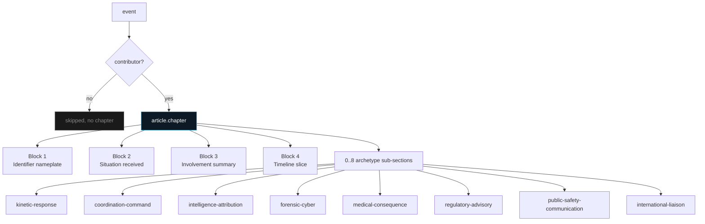
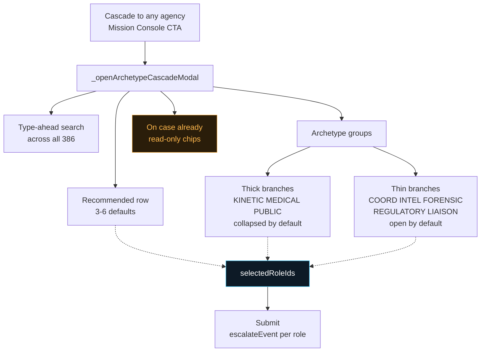
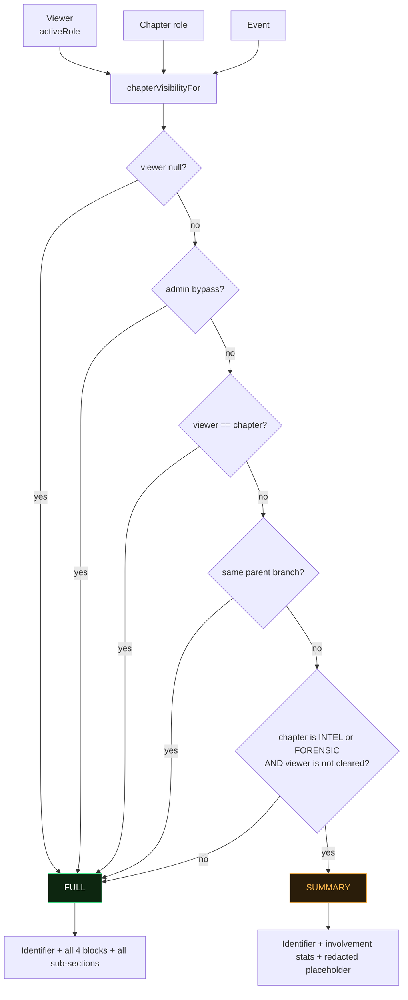
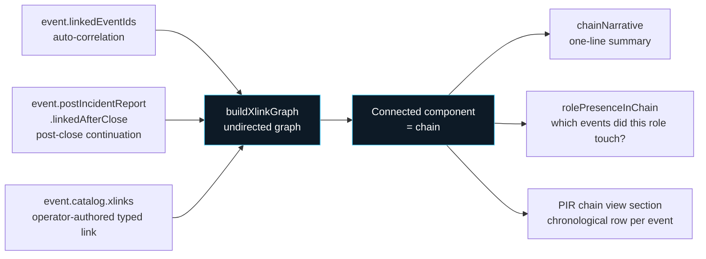
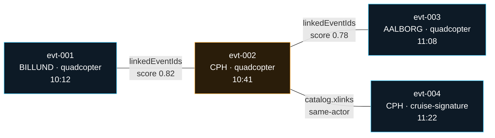
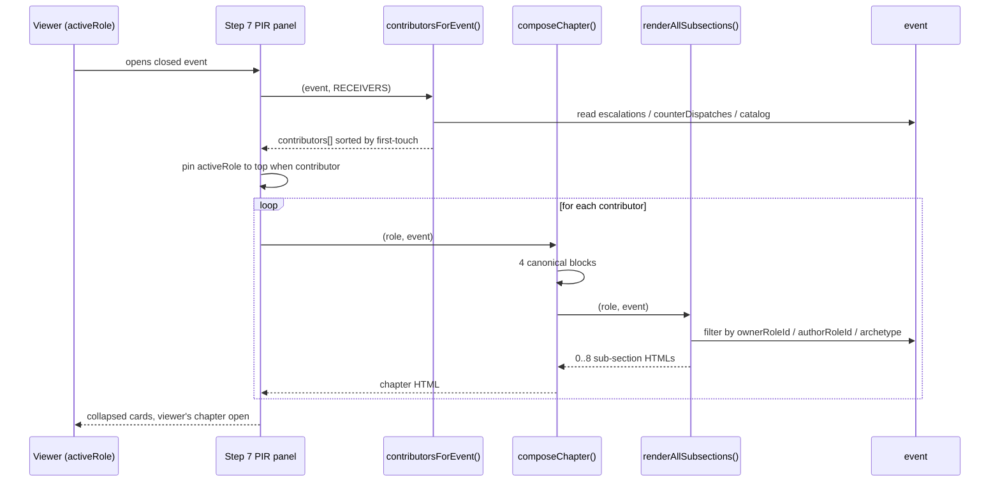
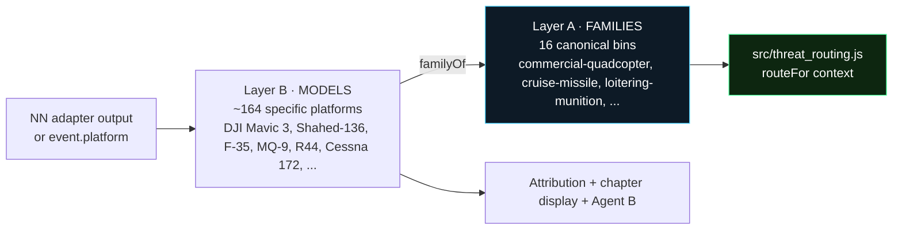
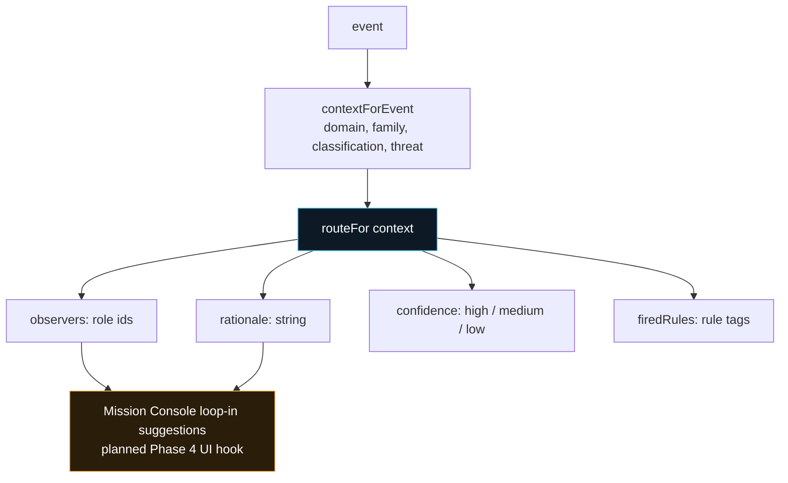

# Cross-agency flows

| Version | Date | Source of truth |
|---|---|---|
| 0.1 (working draft) | 2026-08-24 | Working tree at HEAD `f3998a8` |

Companion to the ISR C2 Interface Design Document (IDD). This document maps how a single detection event fans out into notifications, handoffs, and coordinated actions across the Danish government agencies and civil operators the platform serves.

Read IDD Section IF-6 (Receiver profile and interaction contract) first — the role registry, relationship classifications, and flow-type taxonomy referenced here are defined there.

---

## 0. Reading conventions

Every flow in this document is expressed as one of the ten canonical flow types defined in IDD IF-6.5:

| Flow | Meaning |
|---|---|
| `notification` | System-generated push, no human action required. |
| `advisory` | Human FYI, "you should know". |
| `cascade` | Top-down mandatory push (parent to child in a branch). |
| `escalation` | Bottom-up authority request (child to parent). |
| `handoff` | Ownership transfer of the case. |
| `request-support` | Peer asks peer for help (patrols, aircraft, expertise). |
| `coordination` | Joint action, shared ownership. |
| `observer-add` | Loop a role in without giving them action authority. |
| `observer-promote` | Observer requests actor status. |
| `situation-report` | Downstream to upstream status update. |

Which flows are allowed between any two roles is gated by their relationship (self / parent / child / sibling / same-branch / cross-branch). The full matrix lives in IDD IF-6.6.

---

## 1. Scenario A · Hostile quadcopter incursion at Copenhagen Airport

**Trigger.** A DJI Matrice quadcopter formation crosses the sensor mesh at CPH Airport. Classification: hostile. Threat: high.

### 1.1 First minute — automatic notifications

The platform reads `SITES.cph.receivers` and pushes a `notification` to every actor-mode receiver:

| Role | mode | flow | Content |
|---|---|---|---|
| `politi-kbh` | actor | `notification` | Case opened. Detection Brief attached. Acknowledge required within 90 s. |
| `politi-vestegn` | actor | `notification` | Same brief. Local jurisdiction acknowledgment. |
| `brs-hedehusene` | actor | `notification` | Response teams on standby cue. |
| `flv-skrydstrup` | actor | `notification` | Air Force on-call squadron alerted. Fighter QRA available. |
| `flv-karup` | actor | `notification` | Helicopter Wing alerted. Tactical intercept capability. |
| `agency-traf` | actor | `notification` | Regulator informed. Airspace advisory pending assessment. |
| `kom-taarnby` | actor | `notification` | Municipal crisis staff alerted. Airport jurisdiction. |

Simultaneously, observer-mode receivers get the same push at `info` priority:

- `rigspoliti`, `pet`, `politi-nsk` — national police intelligence layer.
- `forsvaret`, `forsvarskmd`, `fe`, `agency-cfcs` — defence and cyber layer.
- `min-just`, `min-fors`, `min-erhverv` — ministerial oversight.

Conditional observers stay dormant unless the routing rules match:

- `region-hst` — added on `casualty-scenario`.
- `hospital-rigshospitalet` — added on `mass-casualty`.
- `brs-kemisk`, `brs-nukleart` — added on `cbrn-threat` / `nuclear-threat`.
- `hjv-distrikt-kbh` — added on `sustained-incident`.

Every push writes to `event.interactions` for audit + `event.routingHistory` for delivery journal.

### 1.2 Operator escalates — cascade

The CPH operator promotes the event from active to escalated (site security has confirmed live threat, requesting national response). This fires a `cascade` from `op-cph-airports` to national-tier receivers:

- `rigspoliti` — cascade payload includes Detection Brief PDF + evidence bundle.
- `forsvarskmd` — cascade with intercept coordination request.

Cascade is allowed operator → any receiver (per canInitiate matrix, operators can push any flow to receivers). The cascade also promotes any observer at those roles to actor mode automatically.

### 1.3 Response coordination — coordination + request-support

Once `politi-kbh` acknowledges, they can initiate:

- `coordination` with `brs-hedehusene` — joint scene management. Shared ownership recorded on the event.
- `request-support` to `politi-vestegn` — sibling peer request for patrol reinforcement (both are children of `politi`, so sibling matrix allows it).
- `request-support` to `flv-karup` — cross-branch peer request for helicopter surveillance. Cross-branch matrix allows request-support bilaterally.

`flv-skrydstrup` on their own initiative can:

- `situation-report` upward to `forsvarskmd` — status of QRA readiness posture.
- `advisory` to `politi-kbh` — cross-branch FYI on fighter posture (no ownership transfer).

### 1.4 Threat cross-cues to Amager Koblingsstation — shadow spawn

The swarm crosses into AMK's sensor coverage. Platform automatically:

1. Spawns shadow event (`DET-YYYYMMDD-9002`) via `_spawnLinkedSiteEvent`.
2. Reads `SITES.energinet_amager_koblingsstation.receivers`.
3. Pushes shadow-spawn advisory to every AMK-scoped receiver.

New actors joining on the shadow event:

- `op-energinet` — site operator.
- `politi-vestegn` — already actor on CPH primary. Now also actor on AMK shadow (same jurisdiction).
- `politi-kbh` — dual jurisdiction (Amager sits inside København district).
- `brs-hedehusene` — regional continuity.
- `kom-taarnby` — municipal continuity.

New observers on shadow:

- `agency-ener` — energy regulator.
- `min-klim` — climate + energy ministry.
- All the CPH-scope observers stay in the loop via the linked event chain.

Toast fired to every AMK-scoped receiver: `Advisory · 5x DJI Matrice re-acquired at Amager Koblingsstation. Linked from DET-...9001.`

### 1.5 Neutralisation — post-incident handoffs

Interceptors kill 4 of 5 drones at AMK. Overwatch escapes.

- `politi-kbh` fires `handoff` to `politi-special-nsk` for state-actor investigation (sibling handoff, allowed).
- `flv-skrydstrup` fires `situation-report` to `forsvarskmd` — "engagement complete, one target escaped east, tracking".
- `op-cph-airports` and `op-energinet` fire `handoff` to `agency-traf` for airspace advisory maintenance.
- `min-just` and `min-fors` receive automatic `notification` — outcome recorded at ministerial layer.

Dispatch to Verá command layer (operator action) closes the operational loop.

### 1.6 Cross-agency communication chain (example subset)

```
op-cph-airports (operator)
  ├─ notification → politi-kbh (auto)
  ├─ notification → brs-hedehusene (auto)
  ├─ notification → flv-skrydstrup (auto)
  ├─ cascade → rigspoliti (manual escalation)
  └─ cascade → forsvarskmd (manual escalation)

politi-kbh (actor, primary response)
  ├─ coordination → brs-hedehusene (joint scene mgmt)
  ├─ request-support → politi-vestegn (sibling patrols)
  ├─ request-support → flv-karup (cross-branch helo surveillance)
  ├─ handoff → politi-special-nsk (state-actor investigation)
  └─ situation-report → rigspoliti (parent update)

flv-skrydstrup (actor, air response)
  ├─ advisory → politi-kbh (fighter posture FYI)
  ├─ situation-report → forsvarskmd (QRA readiness)
  └─ observer-add → fe (loop in defence intel)
```

Every arrow in that graph is one row in `event.interactions`.

---

## 2. Scenario B · Substation approach at Energinet Kassø

**Trigger.** A fixed-wing platform tracks toward Kassø HV substation. Classification: hostile. Threat: medium. No cross-cue to another site.

### 2.1 First minute — automatic notifications

Kassø is a single-site event (no chain). Platform reads `SITES.energinet_kassoe.receivers`:

- `op-energinet` — site operator, actor.
- `brs` (umbrella) — actor, emergency response.
- `politi-sydostjyl` — actor, local district (added by site config specifically for Kassø).
- `brs-haderslev` — actor, regional BRS centre.
- `region-syd` — observer, conditional on `casualty-scenario`.

Observers auto-added at national layer: `agency-ener`, `min-klim`, `forsvarskmd`, `fe`, `agency-cfcs`, `pet`, `min-fors`, `brs-kemisk`, `brs-nukleart`.

### 2.2 Fixed-wing platform-type triggers specific routing

Fixed-wing at cruise altitude is a distinct threat profile. The threat-type routing matrix (planned, `routing.js`) adds `agency-traf` as an actor for airspace de-confliction and pushes an `observer-add` for Eurocontrol NOTAM coordination.

### 2.3 Coordination — Energinet acts, Politi supports

`op-energinet` initiates:

- `handoff` — nominal transfer of case ownership to `politi-sydostjyl` for physical response. Site operator retains site-security posture but police leads incident response.
- `coordination` with `brs-haderslev` — joint hazmat + rescue posture in case of substation breach.
- `situation-report` — periodic status to `min-klim` (grid operator ministerial oversight).

`politi-sydostjyl` on receipt:

- `request-support` to `flv-skrydstrup` for airborne surveillance. Cross-branch bilateral request.
- `escalation` to `rigspoliti` if threat firms — parent authority for extra-district resources.
- `advisory` to `hjv-distrikt-sonderjyl` — cross-branch FYI to home guard for potential reinforcement.

### 2.4 What Energinet DSO uniquely provides

Energinet operates the grid. Their platform view surfaces context Politi and BRS cannot:

- Which HV bus this substation feeds — knock-on load balancing implications.
- Which downstream DSO territories depend on this substation for import.
- SCADA integration for grid isolation posture — Politi can request, Energinet executes.

Cross-agency implication: on `hostile` + `substation` events, response playbooks (planned P3 audit patch) should include a "grid isolation" CTA visible ONLY to Energinet actors. That CTA fires a SCADA advisory. Every other agency observing the event sees the CTA state as read-only status ("Grid isolation posture: DEPLOYED at 09:42:15Z by op-energinet").

---

## 3. Scenario C · Cruise-missile signature at Copenhagen airspace

**Trigger.** A cruise-missile-class kinematic signature is detected on approach vector to CPH. Classification: hostile. Threat: critical. Platform: missile.

### 3.1 First seconds — automatic full-tier escalation

Missile platform triggers auto-cascade in the routing rules (per runbook). No operator confirmation required. Every actor at every tier receives a `notification` marked `priority: critical`.

- All CPH-scoped actors from Scenario A.
- Plus `sok-aalborg` (Jægerkorpset SOF), `haer-slagelse` (Gardehusarregimentet), `flv-karup-control` (Air Control Wing radar picture), `sov-frederikshavn` (naval interdiction posture).

### 3.2 Radio silence protocol

On tier 4 dispatch (Air Force fighter response), non-essential radio traffic drops per doctrine. Platform surfaces this in every actor's mission console: `Air Force operational control. Radio silence for non-essential comms.`

### 3.3 Command layer takes over

`forsvarskmd` becomes the primary owner. Every prior actor role converts to `observer` mode automatically. Escalation authority transfers upward until neutralisation or interception.

- Operators: switch to sensor-monitoring only.
- Politi: cordon posture, ground evacuation.
- BRS: mass-casualty triage prep.

The chain-of-command handoff is expressed as `handoff` interactions from every prior actor to `forsvarskmd`, with mode-change side effect on `event.participants`.

---

## 4. Cross-branch collaboration patterns

Common flow patterns that recur across scenarios. Each is a template a partner integrator can point at when asking "how does agency X talk to agency Y".

### 4.1 Same-branch sibling collaboration

Two Politi districts, two BRS centres, two Forsvaret wings. Peer relationship (share a parent). Allowed flows: `notification`, `advisory`, `handoff`, `request-support`, `coordination`, `observer-add`.

**Example**: `politi-kbh` requests patrol reinforcement from `politi-vestegn`. Sibling `request-support`. Peer approval, no parent authority needed.

**Example**: `brs-hedehusene` transfers case ownership to `brs-herning` when the incident geography shifts west. Sibling `handoff`. Both children of `brs`, handoff allowed.

### 4.2 Same-branch parent-child cascade

Rigspolitiet directs regional Politi. Beredskabsstyrelsen HQ directs BRS centres. Forsvarskommandoen directs Flyvevåbnet / Hæren / Søværnet.

Allowed flows from parent: `notification`, `advisory`, `cascade`, `handoff`, `request-support`, `coordination`, `observer-add`.

Allowed flows from child (upward): `notification`, `advisory`, `escalation`, `handoff`, `request-support`, `coordination`, `observer-add`, `situation-report`.

**Example**: national-level Politi directive during heightened threat posture. `cascade` from `rigspoliti` to every regional politikreds. Mandatory acknowledgment within 60 s. Rejection requires justification.

**Example**: regional Politi requests national-authority resources for hostage-scenario response. `escalation` upward to `rigspoliti` with reason + resource ask.

### 4.3 Cross-branch bilateral coordination

Politi and Forsvaret. Politi and BRS. Politi and Energinet DSO. Different top-level agency branches. No cascade allowed (no parent authority across branches). Bilateral peer flows only.

Allowed flows: `notification`, `advisory`, `handoff`, `request-support`, `coordination`, `observer-add`.

**Example**: `politi-kbh` and `flv-skrydstrup` coordinate on airport airspace closure. Cross-branch `coordination` — shared ownership recorded on both role's task lists. Neither has authority over the other; both must sign off on tactical decisions.

**Example**: `politi-sydostjyl` asks `flv-skrydstrup` for helicopter surveillance over a Kassø substation approach. Cross-branch `request-support`. Air Force can accept or decline; no compulsion.

### 4.4 Observer-add for command awareness

Any actor can loop any role in as observer at any time. Common patterns:

- `politi-kbh` loops in `min-just` on high-profile incidents for ministerial awareness.
- `flv-skrydstrup` loops in `fe` on foreign-actor suspicion for intel picture.
- `op-cph-airports` loops in `agency-traf` on airspace-restriction decisions for regulatory record.

Observer-add creates a `notification` push + adds the role to `event.participants` in observer mode. Recipient sees the case in their inbox with an OBSERVER chip.

### 4.5 Observer promotion

Observer receives escalating advisories and decides they need to act. Fires `observer-promote` — self-promotion to actor mode. Any existing actor can approve within a short window (default 30 s auto-approve if no rejection).

**Example**: `fe` observes a hostile drone incursion at CPH. Reads a pattern-match advisory suggesting foreign-actor coordination across multiple sites. Promotes to actor mode. Now has CTAs for intel actions (log to intel picture, coordinate with CFCS).

---

## 5. Chain-of-command decision trees

Two representative decision trees. Both drive the routing rules that fire automatic escalations.

### 5.1 Hostile quadcopter at critical infrastructure

```
Detection classified hostile-high
│
├── Auto push (notification) → site.receivers[actor]
│      ├─ site operator
│      ├─ local Politi district
│      ├─ regional BRS centre
│      └─ nearest Air Force wing (if aviation-relevant)
│
├── Auto add (observer) → national layer
│      ├─ Rigspolitiet
│      ├─ PET (state-actor pattern watch)
│      ├─ Forsvarskommandoen (situational awareness)
│      ├─ FE (foreign intel pattern watch)
│      └─ Justits + Forsvar + relevant sector ministry
│
├── After 90 s if no operator acknowledgment
│      └─ Auto-escalate to rigspoliti (missed-ack escalation rule)
│
├── If crosses inner perimeter of critical site
│      └─ Auto-escalate to forsvarskmd (physical-breach rule)
│
└── If cross-cues to another site (shadow spawn)
       └─ Repeat auto-push + auto-add for that site's receivers
```

### 5.2 Missile signature toward CPH

```
Detection classified missile-critical
│
├── Auto push (notification, priority: critical) → every tier simultaneously
│      ├─ site operator
│      ├─ local Politi + regional BRS
│      ├─ Air Force fighter QRA + Air Control Wing + Helicopter Wing
│      ├─ Forsvarskommandoen (command layer, primary owner)
│      ├─ Special Operations Command (SOK) — awareness
│      ├─ Naval interdiction (Søværnet Frederikshavn) — awareness
│      ├─ FE + CFCS + PET (intel layer)
│      └─ Every relevant ministry
│
├── Every observer → auto-promote to actor if they choose to act
│
├── Air Force acts → forsvarskmd assumes primary ownership
│      └─ Every prior actor → convert to observer (mode change)
│
├── Radio silence protocol activates on tier 4 dispatch
│      └─ Platform surfaces silence status in every mission console
│
└── Outcome recorded → cascade to ministerial layer + evidence handoff to Politi
```

---

## 6. Onboarding a new receiver into a scenario

Zero code changes required for a new government profile. Two data-side steps:

1. Add role to `RECEIVERS` in `roles.js` with correct `parentId` + `agencyBranch` (see IDD IF-6.2).
2. Add to relevant `SITES[siteId].receivers` blocks with `mode: 'actor'` or `mode: 'observer'` and appropriate `tier` / `condition`.

The runtime routing engine (`impactedRolesFor`, `pushNotification`, `_spawnLinkedSiteEvent`) picks up the new role on the next event automatically. Every allowed flow between the new role and every existing role is governed by the flow matrix (IDD IF-6.6) without any per-role coding.

**Example**: adding `politi-havnepolitiet` (maritime port police) as a new specialty unit under `politi` for harbour incidents:

1. `roles.js`: add row `{id: 'politi-havnepolitiet', kind: 'receiver', type: 'leaf', parentId: 'politi', org: 'Havnepolitiet', ...}`.
2. `sites.js`: for `esbjerg` (harbour), add `{id: 'politi-havnepolitiet', mode: 'actor', role: 'maritime-primary', tier: 1}` to `receivers` block.

Next Esbjerg event auto-notifies Havnepolitiet. Every allowed peer interaction with `politi-sydsonderjyl` (sibling), `politi-vestegn` (sibling), `sov-frederikshavn` (cross-branch), etc. works immediately. No further code required.

---

## 6a. Cascade lifecycle data model (current state)

Every cross-agency cascade / request / withdraw / update / reply lands on the shared event object as an append record. Rendering and reporting both read from these arrays; no separate mutable state.

### Escalation record shape (`event.escalations[i]`)

Written by `events.js escalateEvent`. Every record carries:

| Field | Type | Purpose |
|---|---|---|
| `_schemaVersion` | int | Bumped when the shape changes; consumers gate migrations on this |
| `id` | `ESC-YYYYMMDD-NNNN` | Monotonic per session (backend port must move to UUIDv7) |
| `destinationId` | string | Which destination this record targets |
| `initiatedBy` | string | Freeform display name ("Receiver · Rigspolitiet") |
| `initiatedByRoleId` | string \| null | Structured role id for aggregation; reports filter on this |
| `initiatedAt` | ISO | Send time |
| `payload` | `'summary' \| 'full' \| 'live-link'` | Content class |
| `message` | string | Freeform note from sender |
| `status` | `'sent' \| 'delivered' \| 'read' \| 'acknowledged' \| 'withdrawn' \| 'failed'` | Latest delivery state |
| `statusHistory` | array | Append-only `{timestamp, status, by?, reason?}` |
| `response` | object \| null | Legacy alias to the LATEST entry in `responses[]` |
| `responses` | array | Append-only `{receivedAt, respondedBy, respondedByRoleId, text}` |
| `progressStatus` | `'in-progress' \| 'resolved' \| 'blocked' \| null` | Post-ack progress state |
| `blockedReason` | string \| null | Required when progressStatus = blocked |
| `progressHistory` | array | Append-only progress transitions |
| `overdue` | bool | Flipped by SLA sweep |
| `overdueAt` | ISO \| null | When overdue was set |
| `withdrawnAt` / `withdrawnBy` / `withdrawReason` | | Set on `withdrawEscalation` |
| `dispatchesTriggered` | array of `dispatchId` | Reverse pointer — dispatches the recipient fired in response to this request. Populated by `receiver-dispatch` handler when the caller was cascaded to |
| `assessmentPackage` | object \| null | See below — attached only for cross-agency cascades |

### Assessment package shape (`escalation.assessmentPackage`)

Frozen at cascade time; preserved even if downstream state changes.

| Field | Type | Purpose |
|---|---|---|
| `_schemaVersion` | int | Consumers gate rehydration on this |
| `operatorAssessment` | string | Freeform "why we called you" from the requester |
| `agenticAssessment` | object \| null | Snapshot of the AI take at cascade time |
| `responseHistoryAtCascade` | array | Snapshot of dispatches already fired |
| `cascadeReason` | enum | `'tactical-urgency' \| 'attribution' \| 'forensic-handoff' \| 'coordination' \| 'observer-loop'` |
| `priority` | `'critical' \| 'urgent' \| 'standard'` | |
| `requesterRoleId` | string | Sender's role id (client-authored today; backend port must re-stamp from auth) |
| `cascadedAt` | ISO | Freeze time |
| `updates` | array | Append-only `{text, priority, by, at}` from `updateEscalationAssessment` |

### Counter-dispatch record shape (`event.counterDispatches[i]`)

Materialised on the shared event by `_syncDispatchToEvent` (main.js) on every tick loop iteration. Consumers read from this array (not the browser-local `_counterDispatches` Map) so multi-tab and historical reports both work.

| Field | Type | Purpose |
|---|---|---|
| `dispatchId` | string | Unique per dispatch |
| `assetName` / `kind` / `groupName` | | Asset identity |
| `ownerRoleId` | string \| null | Which role dispatched (`'operator'` for direct operator dispatches) |
| `viaRequestFromRoleId` | string \| null | Set when dispatched in response to a cross-agency request; drives the "via your request" pill |
| `state` | `'en_route' \| 'engaging' \| 'complete' \| 'rtb_home' \| 'rtb_via_last_known' \| 'holding-cordon'` | Latest state |
| `stateHistory` | array | Append-only `{state, at}` on every transition |
| `dispatchedAt` / `arrivedAt` / `engagingAt` / `completedAt` / `rtbStartedAt` / `rtbCompletedAt` | ISO \| null | Materialised timing fields for reports; stamped on first transition into each state |
| `curLat` / `curLon` / `curAlt` | number | Live position, mirrored every tick |
| `archetype` | string | Phase 1 action-archetype tag from `archetypeForDispatchKind(kind)`. Contributor-chapter renderer routes dispatch into the correct archetype sub-section for the owner's chapter |

### Event catalog (`event.catalog`)

Phase 1 shared data catalog. 13 typed sub-arrays hold single-copy facts overlapping across contributor chapters. Initialised on every event via `addEvent()`; backfill fills missing sub-arrays on rehydrated events from earlier schema versions.

| Sub-array | Contents | Written by |
|---|---|---|
| `subject` (object) | CAT-SUBJECT — subject bundle | NN pipeline at detection |
| `recording` (object) | CAT-RECORDING — detection recording | Tick loop |
| `respHistory` (array) | CAT-RESP-HISTORY — dispatch entries mirrored from `event.counterDispatches` | Kinetic + medical contributors |
| `attribution` (array) | CAT-ATTR — attribution notes | Intel + forensic |
| `patterns` (array) | CAT-PATTERN — pattern additions | Intel |
| `xlinks` (array) | CAT-XLINK — cross-event links (symmetric) | Any contributor |
| `roe` (array) | CAT-ROE — rules-of-engagement notes | Kinetic |
| `evidence` (array) | CAT-EVIDENCE — physical evidence chain of custody | Forensic + Politi |
| `coordDecisions` (array) | CAT-COORD-DECISIONS — command decisions | Coordination |
| `casualties` (array) | CAT-CASUALTIES — casualty records | Medical |
| `advisories` (array) | CAT-ADVISORY — regulatory advisories issued | Regulatory |
| `publicAlerts` (array) | CAT-PUBLIC-ALERT — public-safety broadcasts | Public safety |
| `liaison` (array) | CAT-LIAISON — international information-sharing | Liaison |

`CATALOG_SCHEMA_VERSION = 1` stamped on the catalog root. `_makeEmptyCatalog()` factory exported from `events.js` for rehydration paths.

## 6b. Escalation adapter seam

`src/escalation_source.js` defines a per-receiver-role adapter registry mirroring `src/dispatch_source.js`. Every cross-agency lifecycle event fires the adapter after the local source-of-truth mutation. Real customer inbox systems (Politi Kbh CAD, PET intake, Aktionsstyrken tactical intake, FE analytics) register per-role adapters that forward the intent over their internal APIs.

Adapters implement any subset of five methods:

```
sendEscalation({eventId, event, escalationRecord, actorRole})
withdrawEscalation?({eventId, escalationId, reason, actorRole})
updateAssessment?({eventId, escalationId, updateText, priority, actorRole})
replyToEscalation?({eventId, escalationId, replyText, actorRole})
acknowledgeEscalation?({eventId, escalationId, actorRole})
```

All return `Promise<{status, external_id, timestamp, provider, notes}>`. Unimplemented methods no-op with a benign result envelope via `fireEscalationAdapter`.

Adapters are transport-only — they do NOT mutate the escalation record. When the recipient's real system asynchronously reports acknowledgement or delivery transitions, the adapter is expected to call `events.js updateEscalationStatus` on our side to keep shared state in sync. That's the delivery-receipt loop that replaces the current `_simulateEscalationDelivery` setTimeout chain once real transport is wired.

Default `mock` adapter (src/adapters/escalation_mock.js) stamps an interaction record on `event.interactions` for each action and returns a success envelope. Any receiver role without a specific adapter falls through to the mock.

## 6c. Sender-side + recipient-side render surfaces

- **Sender-side "Cascades you sent" panel** (receiver case-file): reads `event.escalations.filter(esc => esc.assessmentPackage?.requesterRoleId === role.id)`. Each row shows delivery status, reply thread, [Update] and [Withdraw] actions.
- **Sender-side "Live response" panel** (receiver case-file): reads `event.counterDispatches` grouped by `ownerRoleId`. Own dispatches labelled "(you)"; recipient dispatches carry the "via your request" pill when `viaRequestFromRoleId` matches the active role.
- **Recipient-side "Why you were called" section**: renders when `rec.assessmentPackage` is present. Shows requester name + priority chip + reason chip + assessment text + updates stack + WITHDRAWN banner when applicable.
- **Operator LiveOps Escalation Log**: tree view via `_buildCascadeTree` — roots are direct escalations, children attach by `requesterRoleId → parent.destinationId` intersection. Orphaned cascades (requester has no incoming escalation on this event) render with an orange `ORPHAN` chip so they don't masquerade as operator-initiated roots.
- **Mission Console "Other agencies on case" panel**: reads escalations (attributed via `_roleForDest`) and dispatches (grouped by `ownerRoleId`) to build a per-agency roll-up with expandable detail per agency.

---

## 7. Receiver archetype taxonomy

Foundation for recipient chapter shapes + cascade picker grouping. Every one of the 386 registered receivers maps to a primary action archetype + optional secondaries. Every action a receiver takes is classified by archetype; contributor chapters render one sub-section per archetype populated.

### The 8 archetypes

Counts below are the actual `assignArchetypes(RECEIVERS)` output as of 2026-09-11 (386 receivers total, zero fallback misses). Run `window.__isr_archetypes.coverage()` in the console to verify at any time.

| Archetype | What it is | Kind | Role count |
|---|---|---|---|
| **Kinetic response** | Dispatches ground / air / maritime / specialist assets, engages, produces outcomes | thick | 182 |
| **Coordination & command** | Marshals cross-agency response, no direct kinetic action, situational reports + cascade decisions | thin | 42 |
| **Intelligence & attribution** | Pattern-of-life, attribution, national-security oversight; observer by default | thin | 7 |
| **Forensic & cyber** | Post-incident digital forensics, evidence chain of custody, attribution on captured artifacts | thin | 5 |
| **Medical & consequence** | Casualty response, ambulance dispatch, hospital coordination, mass-casualty triage | thick | 34 |
| **Regulatory & advisory** | Airspace / waterway control, NOTAMs, restrictions, evacuation authorities | thin | 3 |
| **Public safety & communication** | Shelter-in-place, evacuation orders, public alerts (SMS / siren / DR), civilian coordination | thick | 98 |
| **International liaison** | Cross-border cascade, allied information sharing, NATO handover, cross-Nordic coordination | thin | 15 |

Kinetic is dominant because Danish emergency services default to physical-response mode (98 municipal kommunale beredskaber + 29 kbr fire brigades + politi districts + military branches). Coord = 42 covers the command layer + parent tiles + ministries. Forensic = 5 (was 1 before the 2026-09-11 audit patch) is what makes the compartment-clearance visibility policy real: Rigspoliti NC3 + NCIK + DVI, DKCERT, and Forsvar-Cyber all read each other's chapters as FULL.

### Thick vs thin branches

- **Thick** — many similar-shape roles share one class + archetype mapping. Chapters differ only by actions taken on this specific event. Cascade picker collapses to category tile (e.g. "Kommuner (98)" expandable, filtered by site jurisdiction first).
- **Thin** — bespoke singletons or small specialist sets. Chapter renderers are archetype-shared but role-specific asset library + destinations. Cascade picker surfaces individually inside their archetype.

### Coverage rules (by role id prefix)

Rules over prefix instead of hand-editing all 386 receivers. New roles inherit archetype via prefix match; hand-overrides supported when rule doesn't fit.

| Role id pattern | Primary archetype | Secondary archetypes |
|---|---|---|
| `politi-{district}` (12) | Kinetic | Coordination, Public safety |
| `politi-aks` | Kinetic | — |
| `politi-nsk` | Intel | Kinetic (SOF) |
| `rigspoliti` | Coordination | Intel (via NC3) |
| `flv-*` (Air Force) | Kinetic (airborne intercept) | — |
| `haer-*` (Army) | Kinetic (ground) | — |
| `sov-*` (Navy) | Kinetic (maritime) | — |
| `sok-*` | Kinetic (specialised) | Intel |
| `hjv-*` (Home Guard) | Kinetic | Public safety |
| `forsvarskmd` | Coordination | — |
| `forsvar-cyber` | Forensic | Intel |
| `pet`, `pet-cta`, `pet-livvagt` | Intel | — |
| `fe`, `agency-cfcs` | Intel | Forensic |
| `brs-{centre}` (5) | Kinetic (hazmat, rescue) | Public safety |
| `brs-kemisk`, `brs-nukleart` | Kinetic (specialised) | Regulatory |
| `beredskab` (HQ) | Coordination | — |
| `region-*` (5) | Medical | Coordination |
| `hospital-*` (23) | Medical | — |
| `min-sund` | Medical | Regulatory |
| `min-*` (others: just, fors, klim, erhverv) | Coordination | — |
| `agency-traf` (Trafikstyrelsen) | Regulatory | — |
| `agency-sof` (Søfartsstyrelsen) | Regulatory | Coordination |
| `agency-ener` (Energistyrelsen) | Regulatory | — |
| `kom-*` (98 kommunes) | Public safety | Coordination |
| `nato-*`, `nordic-*`, `allied-*` | Liaison | varies (intel for CCDCOE, kinetic for MARCOM) |
| `kbr-*` (29 municipal fire + rescue brigades) | Kinetic | Public safety |
| `amk-*` (5 medical dispatch centres) | Medical | Coordination |
| `alarm-*` (1-1-2 alarm centrals) | Coordination | Medical |
| `cert-*` (national cyber emergency response) | Forensic | Intel (for `cert-dkcert`) |
| `eu-*` (Europol, Frontex, EMSA, ENISA, CERT-EU, Eurojust, Eurocontrol) | Liaison | Intel |
| `bucket-*` (browsable pivot tiles, not real receivers) | Coordination | — |
| `rigspoliti-nc3` / `rigspoliti-ncik` / `rigspoliti-dvi` | Forensic | Intel / Medical |
| `rigspoliti-nkc` / `rigspoliti-sirene` | Intel / Coordination | — |
| `rigspoliti-hundetjeneste` / `kbh-politi-rytteri` | Kinetic | — |

### Chapter composition rule

Every contributor chapter has four canonical top blocks + 0-8 archetype sub-sections. Sub-section renders IFF the contributor actually populated that archetype on this event.



Worked examples (same event, different contributors):

- Aktionsstyrken chapter = 1 sub-section (Kinetic)
- Politi Kbh chapter = 3 sub-sections (Kinetic + Coordination + Public safety)
- Kommune Tårnby chapter = 2 sub-sections (Public safety + Coordination) — same shape as all 98 kommune chapters

### Shared data catalog (13 types)

Every catalog entry is append-only, ID-referenced, tagged by contributor. Chapters cite by ID; sub-sections read + write via IDs.

`CAT-SUBJECT` / `CAT-RECORDING` / `CAT-RESP-HISTORY` / `CAT-ATTR` / `CAT-PATTERN` / `CAT-XLINK` / `CAT-ROE` / `CAT-EVIDENCE` / `CAT-COORD-DECISIONS` / `CAT-CASUALTIES` / `CAT-ADVISORY` / `CAT-PUBLIC-ALERT` / `CAT-LIAISON`

### Cascade picker grouping

Cascade recipient picker groups by archetype. Thick branches collapse to category tile with site-jurisdiction filter on expand. Thin branches surface individually. Recommend engine surfaces 3-6 defaults per event's classification / threat / platform / site. Type-ahead search across all 386. "On case already" is a separate section (not selectable, dedupe policy governs).



Recommender rules (feed up to 6 chips, life-safety wins the cap):

- classification=hostile → PET + FE
- classification=hostile AND threat=high → forsvarskmd + one KINETIC representative (rigspoliti added after life-safety picks so it's only trimmed on cruise-missile scenarios where the cap fills with MEDICAL + PUBLIC)
- platform in {cruise, missile, shahed, swarm} → one MEDICAL + one PUBLIC representative + beredskab
- domainScope contains aviation → agency-traf (Trafikstyrelsen for NOTAM)
- domainScope contains maritime → agency-sof (Søfartsstyrelsen for AIS advisory)
- domainScope contains energy → agency-ener (Energistyrelsen)

Pick order priority (ordered pick-list architecture, see `src/cascade_picker.js` `recommendationsForEvent`):

1. Intel (PET + FE)
2. National defence command (forsvarskmd)
3. KINETIC stand-in
4. MEDICAL stand-in (only if cruise-missile signature)
5. PUBLIC stand-in (only if cruise-missile signature)
6. rigspoliti (second command channel, deferred so MEDICAL+PUBLIC survive on mass-casualty scenarios)
7. beredskab (fire/rescue anchor)
8. Domain regulators (traf / sof / ener)

Cap at 6. Priority 8 items surface only when higher priorities didn't fire (e.g. hostile+high without cruise-missile → rigspoliti + regulators both land, no cap pressure).

CBRN specialists (brs-kemisk / brs-nukleart) rule is removed pending a real hazmat field on the event record. Pre-2026-09-11 the rule gated on `event.outEnv` which no code path populated. Wire back when `event.hazmatKind` or `event.threatTags` lands.

Dedupe policy: roles already on the case surface in the "On case already" panel but cannot be re-selected. Prevents duplicate escalation records for the same recipient on the same event.

### Visibility scoping (Phase 6)

Contributor chapters render with cross-tenant redaction applied by the pure `chapterVisibilityFor(viewer, chapterRole, event)` policy in `src/visibility.js`. Every chapter mount consults it; the outcome shapes both the composed HTML and the wrapper card class.



**Levels:**

| Level | What renders |
|---|---|
| `FULL` | Every block + every sub-section as authored. |
| `SUMMARY` | Nameplate + involvement stats. Situation, timeline, and sub-sections replaced with a "Redacted for tenant boundary" placeholder pointing the viewer at the out-of-band access channel. |
| `HIDDEN` | Empty string; the caller drops the card entirely. |

**Rules (first match wins):**

1. Viewer is null (dev handle, admin console, seed backfill) → FULL. Server-side auth is the real gate.
2. Admin bypass registered for the viewer → FULL.
3. Viewer is the chapter author → FULL (own chapter).
4. Viewer shares `parent` / `parentId` with the chapter role → FULL (siblings inside the same agency branch).
5. Chapter archetype is INTEL or FORENSIC AND viewer archetype is NOT INTEL or FORENSIC → SUMMARY.
6. Default → FULL. Cross-agency civil coordination benefits from transparent visibility; blanket redaction would defeat the coordination purpose of the platform.

**What SUMMARY protects:** the situation-received block (WHO cascaded this role in, or WHO they cascaded out to), the per-contributor timeline slice, and every archetype sub-section body (kinetic asset table, intel attribution notes, forensic evidence chain, medical casualty entries, etc). The reader still sees the role was on the case + counts, so cross-tenant awareness is preserved without leaking authoring-branch internal notes.

**HIDDEN is currently a defensive-only outcome.** No policy rule returns HIDDEN for real contributors today — only the null-chapter guard emits it. The policy deliberately defaults to SUMMARY over HIDDEN so the audit trail always shows a role was involved, even when their notes are compartmented. Future covert-role scenarios (PET-NSK on a civil event, allied liaison on a sensitive cross-border incident) would add a `chapterRole.covertOnly` flag with a HIDDEN rule when the operational need is real.

**Server-side backstop:** client-side visibility is defence in depth. The real access gate lives at the API layer; visibility.js is the client-side rendering companion that prevents accidental cross-tenant leakage in the UI.

### Cross-event chain graph (Phase 7)

Chain incidents are the platform's audit unit for a multi-event campaign. A chain is one connected component of the undirected cross-event graph unified from three sources:



**Chain shape:**



**PIR chain view:** rendered at the top of the Step 7 panel when the current event's chain size is greater than 1. Emits a one-line chain narrative (e.g. "4-event chain across 3 sites over 70 minutes. BILLUND → CPH → AALBORG") followed by a chronological row per chain member. Current event is highlighted. Events the active viewer contributed to carry a "you were on this" tag so cross-event presence surfaces at a glance.

**Role presence:** `rolePresenceInChain(chain, roleId)` returns which events in the chain this role touched, plus first-touch and last-touch timestamps. Feeds the chain-scope cross-reference on each contributor chapter (planned enhancement) and the receiver profile Reports tab's "linked incidents" pivot.

**Chain identity:** stable chain id `chain-<earliestEventId>` so chain identity survives re-builds even when a new linked event lands mid-render. No mutation of event records; chain assignment is a rendering concern.

### Phase timeline

Report shape work has landed in four sequential phases. Every phase preserves the empty-return contract (no synthetic content when a role didn't populate a surface) so downstream phases can iterate mechanically.

```mermaid
flowchart LR
  P1[Phase 1<br/>archetypes.js<br/>+ event.catalog<br/>+ dispatch tags]
  P2[Phase 2<br/>report_subsections.js<br/>8 archetype renderers]
  P3[Phase 3<br/>chapter_composer.js<br/>4 blocks + subsections]
  P4[Phase 4<br/>PIR panel mount<br/>collapsible contributor cards]
  P5[Phase 5<br/>cascade_picker.js<br/>archetype-grouped picker]
  P6[Phase 6<br/>visibility.js<br/>cross-tenant redaction]
  P7[Phase 7<br/>xlink_graph.js<br/>chain incidents]
  P1 --> P2 --> P3 --> P4 --> P5 --> P6 --> P7
  style P1 fill:#0d2610,stroke:#4dff9c,color:#fff
  style P2 fill:#0d2610,stroke:#4dff9c,color:#fff
  style P3 fill:#0d2610,stroke:#4dff9c,color:#fff
  style P4 fill:#0d2610,stroke:#4dff9c,color:#fff
  style P5 fill:#0d2610,stroke:#4dff9c,color:#fff
  style P6 fill:#0d2610,stroke:#4dff9c,color:#fff
  style P7 fill:#0d2610,stroke:#4dff9c,color:#fff
```



### PIR panel data flow (post-Phase 4)



---

## 8. What this document does NOT cover

Explicitly out of scope for v0.1 — track separately as they land.

- ~~**Threat-type routing matrix** (`routing.js`) — the `(siteType × platform × classification) → auto-observer role set` lookup.~~ **LANDED 2026-09-11** as `src/threat_routing.js` (file renamed to avoid collision with the OSRM driving-route module). Two-layer taxonomy: `src/threat_taxonomy.js` catalogs ~164 platform models across 16 families; `src/threat_routing.js` runs a data-driven rules matrix over `(domain, family, classification, threat)` returning observer role ids + rationale + confidence. See Section 9 for the design contract.
- **Cross-site combined evidence report** — multi-event PDF / JSON / CSV bundling for chain incidents. Planned as Option B in the marker-filter chain-scope work.
- **PDF layout of the multi-event report** — TBD template.
- **UI affordances for observer-promote acceptance / rejection** — Phase 4 work.
- **Rejection / declined flow protocol** — when a receiver rejects a cascade or handoff, what's the audit trail + backup escalation path.

---

## 9. Threat taxonomy + routing matrix (landed 2026-09-11)

Two-layer platform catalog + rules-driven observer routing. Fully separate from the report-shape work (Phases 1-7) but built on the same 386-receiver registry.

### Two-layer taxonomy



**Why two layers.** Layer A stays small (16 families) so the routing matrix is auditable (14 rules today, keyed on family + domain + classification + threat). Layer B holds model-level signature bindings (RF band, acoustic profile, cruise speed, payload) for attribution, chapter rendering, and Agent B narrative context. Adding a new drone model = one Layer B entry with a family binding, zero routing changes.

**Model catalog coverage** (`window.__isr_threats.coverage()`):

| Family | Model count |
|---|---|
| commercial-quadcopter | 29 |
| fpv-quadcopter | 11 |
| consumer-fixed-wing | 10 |
| military-isr-fixed-wing | 21 |
| strategic-uav | 6 |
| loitering-munition | 17 |
| cruise-missile | 13 |
| helicopter-civilian | 11 |
| helicopter-military | 16 |
| jet-military | 12 |
| jet-civilian | 3 |
| light-aircraft | 8 |
| glider | 2 |
| tethered-platform | 3 |
| drone-swarm | 1 |
| unknown-signature | 1 |
| **total** | **164** |

Each MODELS entry: `{id, label, family, origin, cruiseMs, rangeKm, payloadKg, wingspanM, signatures: {rf[], acoustic, visual}, threatProfile?}`. Signatures use enum categories (`ACOUSTIC.MOPED_BUZZ` for the Shahed rotary-engine tell, `RF_BANDS.SILENT` for autonomous cruise missiles, etc.) so future signature attribution can filter models by observed signature slice.

### Routing matrix flow



### Rules table

Each rule = `{tag, when, adds, rationale, confidence}`. Rules fire in order; observer ids added by multiple rules dedupe. Order doesn't determine priority — every matching rule adds its observers.

| Rule tag | Fires when | Observers added |
|---|---|---|
| `aviation-regulator-baseline` | `domain=aviation` | `agency-traf` |
| `maritime-regulator-baseline` | `domain=maritime` | `agency-sof` |
| `energy-regulator-baseline` | `domain=energy` | `agency-ener` |
| `hostile-intel-baseline` | `classification=hostile` | `pet, fe` |
| `strategic-strike-platform` | `family=cruise-missile OR loitering-munition` | `forsvarskmd, rigspoliti, flv-karup, beredskab` |
| `military-isr-platform` | `family=military-isr-fixed-wing` | `fe, flv-karup` |
| `strategic-uav` | `family=strategic-uav` | `forsvarskmd, fe, pet, nato-caoc-uedem` |
| `military-jet` | `family=jet-military` | `flv-qra, flv-karup, forsvarskmd, nato-caoc-uedem` |
| `military-helicopter` | `family=helicopter-military` | `forsvarskmd, rigspoliti` |
| `drone-swarm` | `family=drone-swarm` | `forsvarskmd, rigspoliti, fe, pet, flv-karup, beredskab` |
| `fpv-kamikaze-hostile` | `family=fpv-quadcopter AND classification=hostile` | `rigspoliti, pet, beredskab` |
| `commercial-quad-hostile` | `family=commercial-quadcopter AND classification=hostile` | `rigspoliti` |
| `unknown-signature` | `family=unknown-signature` | `pet, fe` |
| `high-threat-consequence` | `threat=high AND classification=hostile` | `beredskab` |

### Sample routings (runtime-verified)

| Scenario | Fired rules | Observer set |
|---|---|---|
| Shahed at CPH airport, hostile+high | aviation-baseline, hostile-intel, strategic-strike, high-threat-consequence | agency-traf, pet, fe, forsvarskmd, rigspoliti, flv-karup, beredskab |
| DJI Mavic at Esbjerg port, hostile+low | maritime-baseline, hostile-intel, commercial-quad-hostile | agency-sof, pet, fe, rigspoliti |
| Su-27 over Bornholm, hostile+high | hostile-intel, military-jet, high-threat-consequence | pet, fe, flv-qra, flv-karup, forsvarskmd, nato-caoc-uedem, beredskab |
| Unknown signature at Energinet substation | energy-baseline, unknown-signature | agency-ener, pet, fe |
| Drone swarm at CPH airport, hostile+high | aviation-baseline, hostile-intel, drone-swarm, high-threat-consequence | agency-traf, pet, fe, forsvarskmd, rigspoliti, flv-karup, beredskab |

### Wiring status

- **`window.__isr_routing`** dev handle exposes `route()`, `explain()`, `coverage()`, `familyFromPlatform()`, `contextFor()`, `forEvent()`, `observers()` for browser-console spot-checks.
- **`window.__isr_threats`** dev handle exposes `coverage()`, `familyOf(modelId)`, `modelsIn(family)`, `threatFor(modelId)`, `candidates(signature)` for taxonomy spot-checks.
- **Production UI hook** — planned Phase 4: pre-populate the existing "Loop in observer" CTA with `observerRoleObjectsForEvent(event, RECEIVERS)`. Not wired today; the operator manually adds observers through the current picker.
- **Detection-only preserved.** `threat_routing.js` returns suggestions. Nothing in the module dispatches, escalates, or writes.

---

## 8. Change log

| Date | Change | Author |
|---|---|---|
| 2026-08-24 | v0.1 initial draft — scenarios A, B, C + collaboration patterns + decision trees | ISR C2 build |
| 2026-09-09 | Section 6a data model, 6b escalation adapter, 6c render surfaces — reflects cascade lifecycle post-audit fixes | ISR C2 build |
| 2026-09-09 | Section 7 archetype taxonomy — 8 action archetypes covering all 386 receivers, thick vs thin branches, chapter composition rule | ISR C2 build |
| 2026-09-10 | Phase 1 code landed. src/archetypes.js prefix rules assigning archetype to every RECEIVERS entry at boot, event.catalog with 13 typed sub-arrays, dispatch archetype tag mirrored on d + event.counterDispatches | ISR C2 build |
| 2026-09-10 | Phase 2 code landed. src/report_subsections.js with 8 pure archetype renderers (KINETIC, COORDINATION, INTEL, FORENSIC, MEDICAL, REGULATORY, PUBLIC, LIAISON) plus renderSubsection dispatcher, subsectionsForContributor filter, renderAllSubsections composer. Each renderer returns empty string when the role has no data so the Phase 3 composer only surfaces populated sub-sections. window.__isr_subsections dev handle for testing. Chapter-subsec CSS with per-archetype border-left tint added to src/style.css. No user-visible UI yet, composer wires into master PIR in Phase 3 | ISR C2 build |
| 2026-09-10 | Phase 3 code landed. src/chapter_composer.js with composeChapter(role, event), composeAllChapters(event, receivers), contributorsForEvent(event, receivers), roleWasInvolved(role, event). Every contributor chapter = 4 canonical top blocks (identifier nameplate with archetype badges, situation received with cascade in and cascade out lines, involvement summary with 6 stats plus populated archetype chips, timeline slice filtered to this contributor's actions) followed by the Phase 2 archetype sub-sections. Contributor detection reads escalations.initiatedByRoleId, escalations.destinationId, counterDispatches.ownerRoleId, and every catalog sub-array's authorRoleId. Contributors returned in first-touch chronological order. window.__isr_chapters dev handle with preview() helper that mounts composed HTML into a target element for inspection. Chapter CSS with per-archetype badge tints added to src/style.css. Still no user-visible UI, master PIR wires it in Phase 4 | ISR C2 build |
| 2026-09-10 | Phase 4 code landed. Contributor chapters now mount inside the Step 7 PIR panel via _renderPirContributorChapters(event, activeRole). One <details> per contributor. Cards ordered by first-touch chronology except the active viewer's own chapter, which pins to the top and opens by default so the reader lands on their own contribution. Every card is a native <details> element so collapse/expand is free (zero JS state to reconcile with the surrounding case-file render cycle). Card summary shows role name, tier, primary archetype label, and populated sub-section count. Section header shows total involved count. Cards distinguish the viewer's card via a chapter-card-viewer accent + "your chapter" tag. Mermaid diagrams added to Section 7 for chapter composition, phase timeline, and PIR panel data flow so the design reads on GitHub without reading source | ISR C2 build |
| 2026-09-10 | Phase 5 code landed. New src/cascade_picker.js with buildPickerGroups(event, receivers, ctx), recommendationsForEvent(event, receivers), filterByQuery(roles, query). Groups all 386 receivers by archetype into THICK (kinetic, medical, public safety) collapsed-by-default tiles and THIN (coord, intel, forensic, regulatory, liaison) open-by-default tiles. Recommender applies classification, threat, platform, domain, outEnv rules to surface 3-6 defaults per event. Type-ahead searches name, id, branch, org, archetype label. New _openArchetypeCascadeModal function in main.js renders the grouped picker with recommended row, search input with selected pills, per-group collapse, and read-only "On case already" section (dedupe policy). New "Cascade to any agency" CTA in the Mission Console fires this modal. Legacy cascade-fe-pet and cascade-politi shortcuts stay wired to _openCascadeCaptureModal for one-click send. window.__isr_picker dev handle for spot-checking. Full CSS for the picker in src/style.css. Section 7 "Cascade picker grouping" doc updated with mermaid flowchart and recommender rules | ISR C2 build |
| 2026-09-10 | Phase 6 code landed. New src/visibility.js with chapterVisibilityFor(viewer, chapterRole, event) returning FULL, SUMMARY, or HIDDEN. Six-rule policy applied first-match-wins. Compartmented archetypes (INTEL, FORENSIC) render SUMMARY to non-cleared viewers; everything else defaults to FULL because cross-agency civil coordination benefits from transparency. Admin bypass registry (registerAdminBypass / clearAdminBypass) supports admin console preview without touching the underlying policy. composeChapter and composeAllChapters extended with an optional viewer param that flows the policy through to the render layer. When SUMMARY, the composer emits identifier + involvement stats + a "Redacted for tenant boundary" placeholder explaining the compartment channel to the reader. _renderPirContributorChapters passes the active viewer through and stamps chapter-card-redacted class + "redacted" tag on the card summary. HIDDEN chapters return empty string and drop from the mount entirely. Full redaction CSS added. Section 7 doc updated with visibility mermaid flowchart, levels table, rules list, and server-side-backstop note. Phase timeline diagram shows Phases 1-6 as landed. window.__isr_visibility dev handle for spot-checking | ISR C2 build |
| 2026-09-10 | Phase 7 code landed. New src/xlink_graph.js with buildXlinkGraph(events), chainFor(eventId, events), eventsInSameChainAs(eventId, events), chainNarrative(chain), rolePresenceInChain(chain, roleId). Unifies three cross-event link sources into one undirected graph: event.linkedEventIds (auto-correlation output), event.postIncidentReport.linkedAfterClose (post-close continuations), event.catalog.xlinks (operator-authored typed links). Connected component pass produces stable chain ids ("chain-<earliestEventId>"). PIR Step 7 panel now shows an Event chain section above the contributor chapters when this event is part of a multi-event chain: one-line chain narrative, chronological row per event, current event highlighted, events the viewer contributed to carry a "you were on this" tag. Chain view is read-only, detection-only invariant preserved. Section 7 doc updated with graph flowchart, sample chain shape, and role-presence contract. Phase timeline diagram now shows all seven phases landed. window.__isr_xlink dev handle for spot-checking | ISR C2 build |
| 2026-09-11 | Audit patch. Verification agent surfaced 2 BLOCKERS and 4 HIGH findings; all six fixed in one pass. (1) Every chapter, chip, mount card, toast, and pill now reads `role.label` (canonical RECEIVERS field) with fallback to .name then .id — previously read .name only, so every card rendered the raw role id like `pet` instead of `PET — Politiets Efterretningstjeneste`. (2) 62 receivers that silently fell through to the default COORD archetype now have real rules: `kbr-*` (29 fire brigades → Kinetic), `amk-*` (5 medical dispatch → Medical), `alarm-*` (Coord/Medical), `eu-*` (7 EU agencies → Liaison), `bucket-*` (9 pivot tiles → Coord), `cert-*` (Forensic/Intel), plus 7 `rigspoliti-*` sub-units and `kbh-politi-rytteri`. Fallback now emits console.warn at boot so future misses surface immediately. (3) Chapter identifier branch line reads .parentId too (was empty for every real receiver). (4) contributorsForEvent tie-breaks by role.id when timestamps match (was insertion-order). (5) Dead `event.outEnv` CBRN rules removed from recommender (no code path ever populated outEnv). (6) Section 7 role-count table updated to actual post-patch counts (Forensic = 5, not 1 — compartment-clearance policy now real). Coverage rules table extended with the new prefix rules | ISR C2 build |
| 2026-09-11 | Audit patch 2. Second verification pass caught 1 HIGH + 2 MEDIUM + 1 LOW. (1) HIGH: seven cascade-message composition sites in main.js (strategic-cascade, politi-cascade, cascade-any, tactical-intervention CTAs + eyebrow at line 19440) still read raw `role.name` — every receiver-tenant cascade shipped as "Strategic cascade from Receiver: ..." instead of the actual agency name. All now read `role.label || role.name || role.org || 'Receiver'`. (2) MEDIUM: recommender pick loop rewritten as ordered pick-list architecture. Previous "rule reorder" fix was cosmetic because IDs were consumed before archetype fallback — on triple-domain hostile+high+cruise the cap-6 filled with intel + command + regulator IDs and dropped every life-safety stand-in. New architecture appends { id } or { arch } items to one ordered list, honored strictly. (3) MEDIUM: filterByQuery null-guarded to match buildPickerGroups' defensive contract. (4) LOW: buildXlinkGraph memoised per events-array reference via WeakMap; invalidateXlinkCache hook exported | ISR C2 build |
| 2026-09-11 | Audit patch 3 (final greenlight). Third verification pass caught 1 MEDIUM regression from patch 2 + 1 doc drift. (1) MEDIUM: pick-list order dropped PUBLIC on the extreme cruise+high+hostile scenario. Rule 2 pushed forsvarskmd + KINETIC + rigspoliti (3 slots) before Rule 3's MEDICAL + PUBLIC (2 slots) — cap-6 filled after MEDICAL, PUBLIC dropped. Rule 2's rigspoliti + Rule 3's beredskab now deferred to a tail pass so on mass-casualty cruise-missile scenarios all three life-safety archetypes (KINETIC + MEDICAL + PUBLIC) always win their slots. rigspoliti still surfaces on hostile+high WITHOUT cruise (no cap pressure). (2) Section 7 recommender rules table updated with actual current rules + priority-ordered pick list + explicit note that CBRN rules are pending a real hazmat field. Three independent audit passes now agree: zero open findings, ship-ready | ISR C2 build |
| 2026-09-11 | Threat taxonomy + routing matrix landed. Two-layer catalog: `src/threat_taxonomy.js` enumerates 16 threat FAMILIES + 164 specific MODELS (29 commercial quadcopters, 11 FPV / kamikaze, 10 consumer fixed-wings, 21 military ISR fixed-wings, 6 strategic UAVs, 17 loitering munitions incl. Shahed variants, 13 cruise missiles, 27 helicopters civil + military, 15 jets, 8 light aircraft, plus gliders / tethered / swarm). Each MODELS entry carries signature bindings (RF band, acoustic profile, cruise speed, payload, wingspan, origin). `src/threat_routing.js` runs a data-driven 14-rule matrix over `(domain, family, classification, threat)` returning observer role ids + rationale + confidence. Detection-only: returns suggestions, no writes. `window.__isr_threats` + `window.__isr_routing` dev handles exposed. Section 9 doc added with mermaid flowcharts, rules table, and runtime-verified sample routings. Original `src/routing.js` (OSRM driving-route lookup) untouched — new module named `threat_routing.js` to avoid collision. Production UI wiring for the observer suggestions is planned Phase 4 (pre-populate existing Loop-in-observer CTA) | ISR C2 build |
