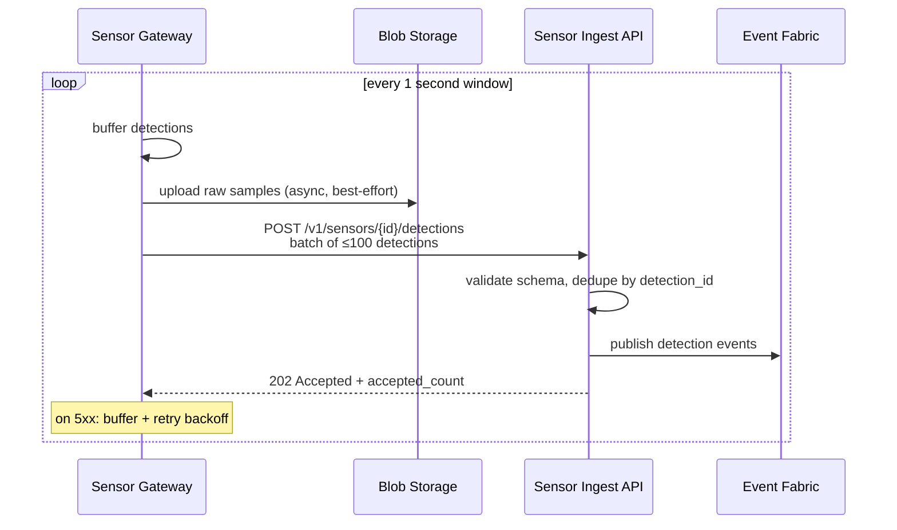
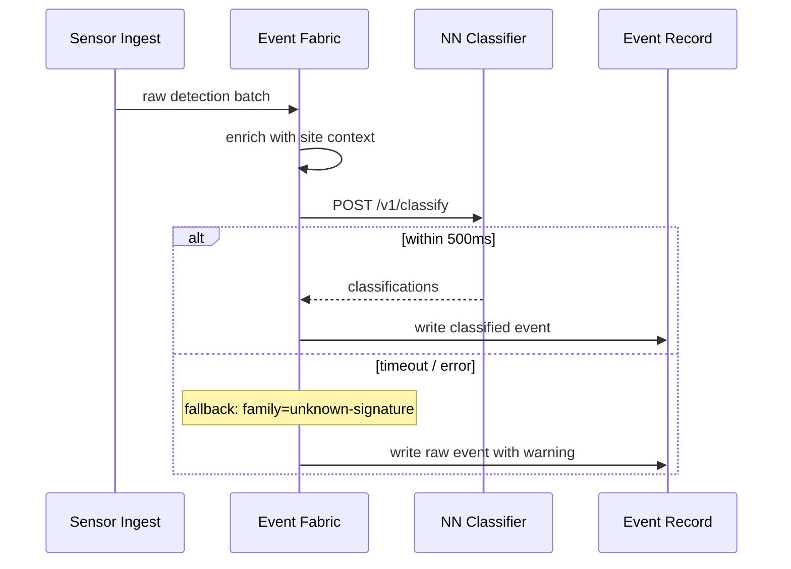
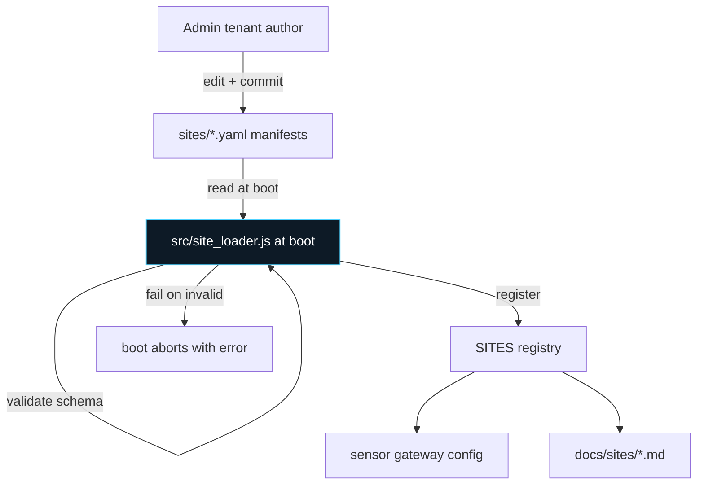
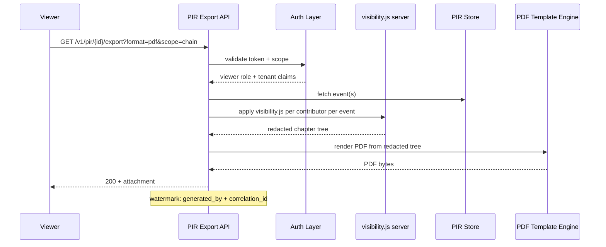
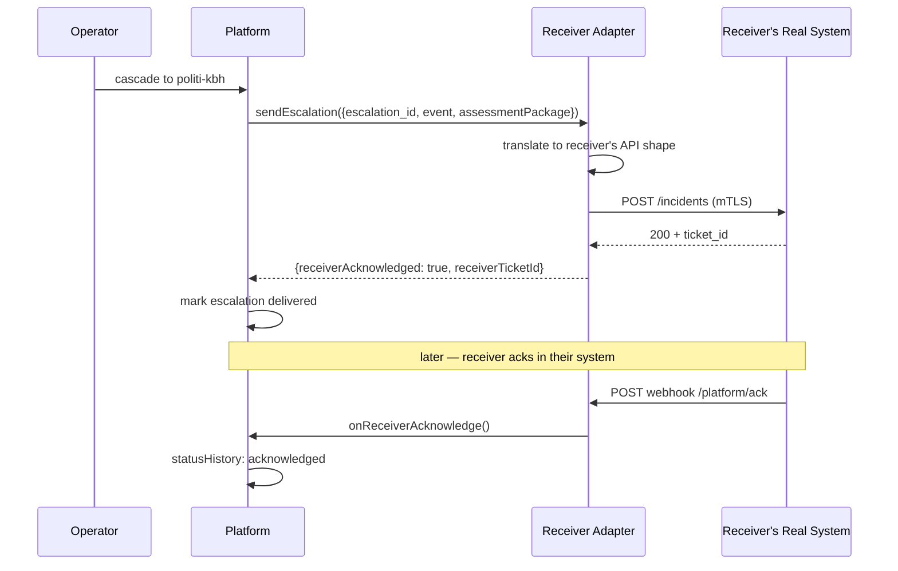
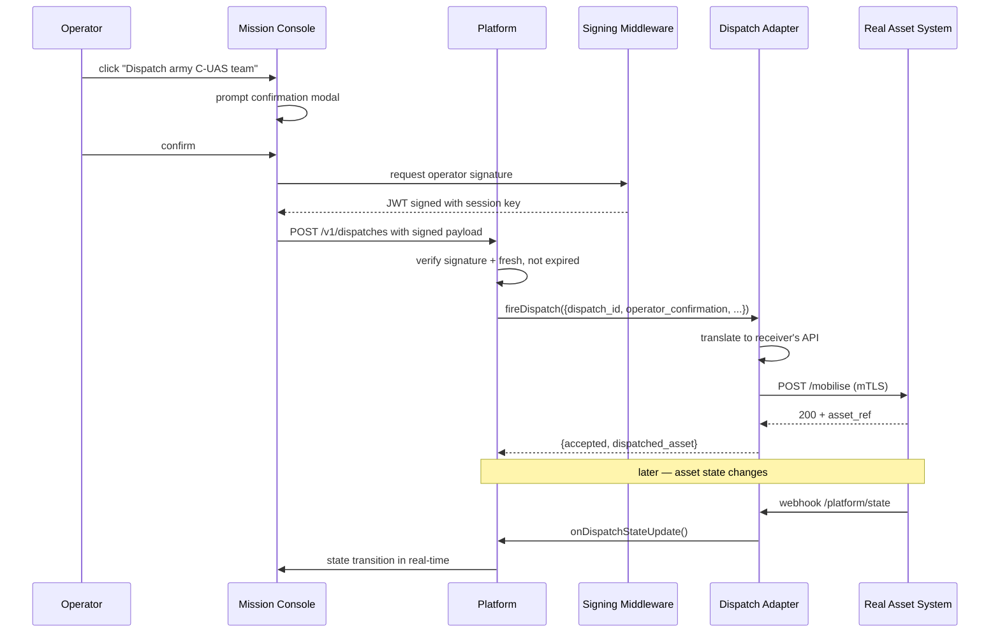
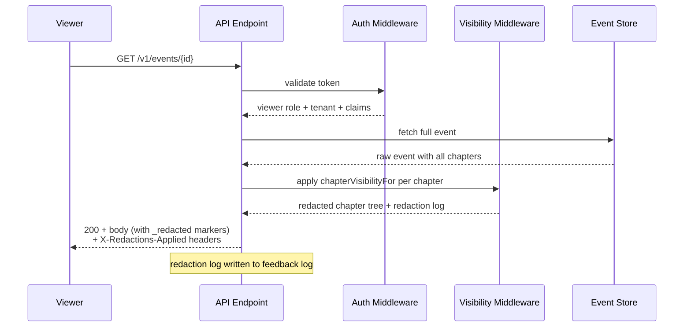

# Integration Contracts

Every external system that plugs into the ISR C2 platform speaks against one of the contracts in this book. Sensors, NN classifiers, receiver agencies, dispatch APIs, IAM providers, agentic services, audit sinks — each has a documented shape any implementer can build against without asking us.

Read this before writing any adapter, integration, or customer-facing endpoint.

| Version | Date | Source of truth |
|---|---|---|
| 0.1 (Phase A initial) | 2026-09-13 | Working tree at HEAD |

## Structure

Every contract section follows the same shape:
1. **Purpose** — what integrates through this contract
2. **Actors** — who calls, who receives
3. **Wire format** — concrete schemas
4. **Auth model**
5. **Error semantics**
6. **Sequence diagram** — mermaid
7. **Example** — request / response
8. **Reference implementation** — pointer to mock adapter or stub in the codebase
9. **Open questions** — anything TBD

## Table of contents

### Phase A · Foundation contracts

- [1. Sensor ingestion](#1-sensor-ingestion) — RF / acoustic / visual / radar → platform
- [2. NN classifier](#2-nn-classifier) — raw detection → classified event
- [3. Site definition](#3-site-definition) — customer site schema + onboarding
- [4. Post-Incident Report export](#4-post-incident-report-export) — JSON / PDF / CSV bundling

### Phase B · Integration contracts

- [5. Receiver adapter](#5-receiver-adapter) — outbound to any of 386 registered receivers
- [6. Dispatch adapter](#6-dispatch-adapter) — outbound to real asset dispatch APIs
- [7. Server-side visibility](#7-server-side-visibility) — the auth-layer gate `visibility.js` documents but doesn't implement

### Phase C · Advanced contracts

- [8. Agent B (Mistral)](#8-agent-b-mistral) — narrative synthesis
- [9. Signature bridge](#9-signature-bridge) — raw NN signature → family label + candidate models
- [10. Feedback log WORM](#10-feedback-log-worm) — Azure Blob write-once audit sink
- [11. Cooperative traffic fusion](#11-cooperative-traffic-fusion) — ADS-B / Naviair reconciliation
- [12. Auth + IAM](#12-auth--iam) — tenant provisioning + session management

---

## Cross-cutting conventions

Applies to every contract in this book.

- **Encoding.** UTF-8 throughout. Never Latin-1. Danish characters (æ, ø, å) always preserved.
- **Time.** ISO 8601 with explicit `Z` suffix (UTC). Sub-second precision at millisecond resolution when ordering matters.
- **Coordinates.** WGS 84 latitude/longitude in decimal degrees. Altitude in metres above ellipsoid (WGS 84), NOT above ground, NOT above sea level. All calculations round-trip through Cesium's Cartographic type.
- **Identifiers.** Kebab-case strings for machine ids (`shahed-136`, `politi-kbh`, `evt-1234`). Freeform strings for human labels. Never mix.
- **Auth.** Every contract uses OAuth 2.0 client-credentials against the Auth+IAM contract (Section 12) unless explicitly noted. Tokens carry tenant + role claims.
- **Idempotency.** Every write endpoint accepts an `Idempotency-Key` header. Repeat requests with the same key + same payload return the original response. Repeat with same key + different payload returns HTTP 409.
- **Error format.** All 4xx / 5xx responses use RFC 7807 Problem Details JSON:
  ```json
  {
    "type": "https://isr-systems.dk/errors/invalid-signature",
    "title": "Signature payload rejected",
    "status": 400,
    "detail": "acoustic.confidence must be in [0.0, 1.0]",
    "instance": "/sensors/cph-radar-01/detections",
    "correlation-id": "abc-123"
  }
  ```
- **Correlation.** Every request must carry an `X-Correlation-ID` header (UUID v4). Propagates through every downstream call. Surfaces in audit log + feedback log.
- **Rate limits.** Per-tenant, per-endpoint. Enforced at the API layer. `429 Too Many Requests` includes `Retry-After` header in seconds.
- **Versioning.** Every endpoint is versioned in the path: `/v1/sensors/...`. Breaking changes bump the major version + run parallel for one deprecation cycle.
- **Detection-only.** No contract in this book triggers a real-world dispatch action without a human confirming through the Mission Console. Every dispatch adapter (Section 6) requires a signed operator confirmation payload — the raw asset-command endpoint doesn't exist.

---

# 1. Sensor ingestion

## Purpose

Every physical sensor (RF spectrum analyser, acoustic array, EO/IR camera, radar) posts detections into the platform through this contract. This is the entry point for real-world signal.

## Actors

- **Caller:** sensor device or edge gateway on the customer's site
- **Receiver:** ISR C2 sensor ingest API (Azure Function endpoint per site tenant)

## Wire format

### POST `/v1/sensors/{sensor_id}/detections`

Batch endpoint. Sensors send one array of detections per second (or per fixed window). Batching amortises TLS handshake + reduces per-detection overhead.

**Request body:**
```json
{
  "sensor_id": "cph-rf-01",
  "batch_id": "batch-1726220000-001",
  "window_start": "2026-09-13T10:30:00.000Z",
  "window_end":   "2026-09-13T10:30:01.000Z",
  "detections": [
    {
      "detection_id": "det-1726220000-abc",
      "timestamp": "2026-09-13T10:30:00.412Z",
      "modality": "rf",
      "position": {
        "lat": 55.617,
        "lon": 12.646,
        "alt_m": 120.5,
        "accuracy_m": 15.0
      },
      "signature": {
        "rf": {
          "band": "2.4-GHz",
          "center_hz": 2437000000,
          "bandwidth_hz": 20000000,
          "power_dbm": -68.2,
          "modulation_hint": "ofdm",
          "hopping_pattern": null
        }
      },
      "confidence": 0.87,
      "raw_reference": "s3://cph-rf-01-raw/2026-09-13/10-30-00-412.iq"
    },
    {
      "detection_id": "det-1726220000-def",
      "timestamp": "2026-09-13T10:30:00.520Z",
      "modality": "acoustic",
      "position": { "lat": 55.618, "lon": 12.647, "alt_m": null, "accuracy_m": 30.0 },
      "signature": {
        "acoustic": {
          "profile": "moped-buzz",
          "fundamental_hz": 78.0,
          "harmonic_ratio": 0.42,
          "spl_db": 54.3
        }
      },
      "confidence": 0.91,
      "raw_reference": "s3://cph-acoustic-01-raw/2026-09-13/10-30-00-520.wav"
    }
  ]
}
```

**Response 202 Accepted:**
```json
{
  "batch_id": "batch-1726220000-001",
  "accepted_count": 2,
  "rejected_count": 0,
  "rejections": [],
  "next_batch_after": "2026-09-13T10:30:01.000Z"
}
```

**Field constraints:**
- `sensor_id` — kebab-case, must match a registered sensor in the site definition (Section 3).
- `modality` — one of `rf`, `acoustic`, `visual`, `radar`, `cooperative-traffic` (Section 11). Determines which `signature.*` sub-object is required.
- `position.accuracy_m` — 1-sigma horizontal error estimate. Used by the fusion layer for weighting.
- `confidence` — sensor-side belief this detection is a real object (not noise). Range [0.0, 1.0].
- `raw_reference` — optional pointer to the raw sample in Blob storage. Enables replay + forensic audit. Sensor is responsible for uploading the raw file BEFORE posting the detection metadata.
- `signature.{modality}` — modality-specific schema. See per-modality sub-sections below.

### Signature sub-schemas

**RF signature:**
| Field | Type | Notes |
|---|---|---|
| `band` | enum | Values from `threat_taxonomy.js` `RF_BANDS` (2.4-GHz, 5.8-GHz, 900-MHz, L-band, S-band, X-band, Ku-band, Ka-band, HF, VHF, UHF, silent) |
| `center_hz` | number | Center frequency in Hz |
| `bandwidth_hz` | number | Occupied bandwidth in Hz |
| `power_dbm` | number | Received signal power in dBm |
| `modulation_hint` | enum \| null | Best guess: `ofdm`, `fsk`, `qpsk`, `unknown`, or null when not determinable |
| `hopping_pattern` | object \| null | If frequency-hopping detected: `{ pattern_hash, dwell_ms, hop_count }` |

**Acoustic signature:**
| Field | Type | Notes |
|---|---|---|
| `profile` | enum | Values from `threat_taxonomy.js` `ACOUSTIC` (moped-buzz, high-whine, buzz, prop-hum, piston-drone, turbine-roar, jet-scream, rotor-thump, tilt-rotor, swarm-chorus, silent-electric, unknown) |
| `fundamental_hz` | number | Detected fundamental frequency |
| `harmonic_ratio` | number [0-1] | Strength of harmonic content vs noise floor |
| `spl_db` | number | Sound pressure level in dB |

**Visual signature:**
| Field | Type | Notes |
|---|---|---|
| `silhouette` | enum | Values from `threat_taxonomy.js` `VISUAL` |
| `bbox_px` | `[x, y, w, h]` | Detection bounding box in source image |
| `image_reference` | string | Blob URL pointing at the cropped detection thumbnail |
| `range_m` | number | Estimated range to target |

**Radar signature:**
| Field | Type | Notes |
|---|---|---|
| `rcs_m2` | number | Radar cross-section in square metres |
| `doppler_ms` | number | Radial velocity in m/s |
| `track_id` | string | Radar's own internal track identifier (used for de-dupe across batches) |

## Auth model

- OAuth 2.0 client credentials. Sensor gateway registers as a client with `sensor:write` scope + a tenant claim.
- Every request signed with `Bearer <access_token>` header.
- Access token TTL: 1 hour. Gateway refreshes 5 min before expiry.

## Error semantics

- **400 Bad Request** — malformed payload, missing required field, coordinate out of range. Response `type` identifies which field failed.
- **401 Unauthorized** — token expired, invalid, or revoked.
- **403 Forbidden** — sensor_id not owned by the calling tenant.
- **409 Conflict** — batch_id already ingested (idempotency hit). Original response is echoed.
- **413 Payload Too Large** — batch exceeds 1 MB. Split and retry.
- **429 Too Many Requests** — rate limit. Retry after `Retry-After` seconds.
- **503 Service Unavailable** — server-side backpressure. Retry with exponential backoff (max 5 attempts).

Sensor gateway MUST NOT drop detections on 5xx. Buffer locally and retry until 2xx or the buffer's TTL expires.

## Sequence diagram



## Example

**Curl request:**
```bash
curl -X POST https://api.isr-systems.dk/v1/sensors/cph-rf-01/detections \
  -H "Authorization: Bearer $TOKEN" \
  -H "Content-Type: application/json" \
  -H "X-Correlation-ID: 550e8400-e29b-41d4-a716-446655440000" \
  -H "Idempotency-Key: batch-1726220000-001" \
  -d @batch.json
```

## Reference implementation

- **Mock ingest endpoint:** `scripts/dev/mock-sensor-ingest.mjs` (stub — accepts any payload, logs to stdout, returns 202)
- **Sensor gateway reference:** to be published as a separate repo (`isr-sensor-gateway`) once wire format stabilises
- **Sample batches for testing:** `scripts/dev/sample-detections/*.json`

## Open questions

- **Multi-modality per detection:** should a single detection carry both RF and acoustic signature slices when the sensor is a fused array? Current design says no (post as two detections, let fusion layer correlate). Revisit if bandwidth becomes an issue.
- **Backpressure signal:** currently 503 + Retry-After. Consider adding WebSocket push for immediate backpressure indication when API is under load.
- **Raw sample upload timing:** async best-effort today. Should we require raw upload confirmation before accepting detection metadata? Trade-off: latency vs forensic completeness.

---

# 2. NN classifier

## Purpose

Raw detections from the sensor layer (Section 1) need to be classified — is this a DJI Mavic, a Shahed-136, or noise? The NN classifier contract specifies how a machine-learning service (running as an Azure ML endpoint or a self-hosted inference server) receives batched detections and emits classified events.

## Actors

- **Caller:** ISR C2 event fabric (server-side, per-tenant instance)
- **Receiver:** NN classifier service (Azure ML endpoint, or self-hosted GPU node)

## Wire format

### POST `/v1/classify`

**Request body:**
```json
{
  "classify_id": "cls-1726220000-abc",
  "context": {
    "site_id": "cph",
    "site_domain_scope": ["aviation", "ground"],
    "timestamp": "2026-09-13T10:30:00.520Z"
  },
  "detections": [
    {
      "detection_id": "det-1726220000-abc",
      "modality": "rf",
      "signature": {
        "rf": {
          "band": "2.4-GHz",
          "center_hz": 2437000000,
          "bandwidth_hz": 20000000,
          "power_dbm": -68.2,
          "modulation_hint": "ofdm"
        }
      },
      "position": { "lat": 55.617, "lon": 12.646, "alt_m": 120.5 }
    },
    {
      "detection_id": "det-1726220000-def",
      "modality": "acoustic",
      "signature": { "acoustic": { "profile": "moped-buzz", "fundamental_hz": 78.0, "spl_db": 54.3 } },
      "position": { "lat": 55.618, "lon": 12.647, "alt_m": null }
    }
  ]
}
```

**Response 200 OK:**
```json
{
  "classify_id": "cls-1726220000-abc",
  "model_version": "isr-classifier-v0.3.2",
  "latency_ms": 87,
  "classifications": [
    {
      "detection_id": "det-1726220000-abc",
      "family": "commercial-quadcopter",
      "family_confidence": 0.82,
      "candidate_models": [
        { "id": "dji-mavic-3", "score": 0.51 },
        { "id": "dji-mavic-3-pro", "score": 0.28 },
        { "id": "dji-air-2s", "score": 0.11 }
      ],
      "classification": "unknown",
      "threat_estimate": "low",
      "rationale": "2.4-GHz + 5.8-GHz OFDM pattern consistent with DJI OcuSync 2.0 link. Model discriminator is inconclusive between Mavic 3 variants."
    },
    {
      "detection_id": "det-1726220000-def",
      "family": "loitering-munition",
      "family_confidence": 0.94,
      "candidate_models": [
        { "id": "shahed-136", "score": 0.71 },
        { "id": "shahed-131", "score": 0.19 }
      ],
      "classification": "hostile",
      "threat_estimate": "critical",
      "rationale": "Moped-buzz acoustic signature at 78Hz fundamental is a Shahed-class rotary engine tell. No cooperative flight plan for this position."
    }
  ]
}
```

**Field constraints:**
- `family` — MUST be a valid enum value from `threat_taxonomy.js` `FAMILIES`. Reject if the classifier can't map to a known family — return `unknown-signature` and let the routing matrix handle it.
- `family_confidence` — [0.0, 1.0]. Below 0.5 the routing matrix treats the family as `unknown-signature` regardless of the top pick.
- `candidate_models` — ordered by score descending. Model ids MUST exist in `threat_taxonomy.js` `MODELS`. Send at most 5 candidates.
- `classification` — enum: `hostile`, `friendly`, `unknown`, `resolved`. Classifier's initial guess; operator can override.
- `threat_estimate` — enum: `critical`, `high`, `medium`, `low`, `unknown`. Feeds the routing matrix's threat axis.
- `rationale` — one-line human-readable explanation. Surfaces in Agent B narrative + case-file audit.
- `model_version` — classifier's own version tag. Recorded on every classified event for later model-drift diagnosis.

## Auth model

- Bidirectional mTLS between event fabric and classifier service.
- Classifier presents client cert; event fabric validates against a per-classifier trust anchor.
- Rotate certs every 90 days via Azure Key Vault.

## Error semantics

- **400 Bad Request** — batch schema invalid.
- **408 Request Timeout** — classifier processing exceeded latency budget (default 500ms per batch). Event fabric proceeds with raw signature (family = `unknown-signature`).
- **422 Unprocessable Entity** — classifier produced output that fails the schema constraints above (e.g. invalid family value). Event fabric logs + falls back to `unknown-signature`.
- **500-503** — event fabric retries once with exponential backoff (100ms, 500ms). If both fail, detection proceeds with `unknown-signature` and a warning is written to the operator's Mission Console.

**Latency budget:** 500ms end-to-end per batch. Classifier services that can't meet this MUST be scaled horizontally, not slowed down. The event fabric will not wait past 500ms.

## Sequence diagram



## Example

Detection classified as Shahed → routing matrix (Section 12 of cross-agency-flows.md) fires strategic-strike + hostile-intel rules → auto-observers loop in.

## Reference implementation

- **Mock classifier:** `scripts/dev/mock-nn-classifier.mjs` — returns deterministic mappings for known signature slices (moped-buzz → shahed-136, high-whine + 2.4GHz → commercial-quadcopter, etc). Useful for local testing without a real model.
- **Model versioning:** every event record stores `event.classifier_version` for later drift analysis.

## Open questions

- **Batching vs streaming:** current design is request/response per batch. Consider WebSocket streaming for lower-latency use cases (e.g. tracking a fast-moving target across many frames).
- **Multi-modal classification:** should the classifier accept a single detection with multiple signature slices fused, or classify per-modality and let the platform reconcile? Current design: classifier gets per-detection input; platform-side fusion happens upstream in Section 11 (cooperative traffic fusion).
- **Explainability:** `rationale` is one line today. Should we add structured feature importance (which signature elements drove the classification)? Useful for regulator conversations.

---

# 3. Site definition

## Purpose

Every customer site (airport, port, energy substation, data centre, government facility) is defined by a single YAML/JSON manifest that specifies boundaries, sensor placements, domain scope, tenant assignment, and default cascade recipients. The "7-step config-only add" claim rides on this schema.

## Actors

- **Author:** ISR ops team (admin tenant) OR customer's own IT if they self-onboard
- **Consumer:** platform boot loader — reads all site manifests, registers each with `registerSiteDomains()` and the sensor + destination registries

## Schema

### `sites/{site_id}.yaml`

```yaml
# Site identifier — kebab-case, unique across all tenants.
# Matches `event.siteId` throughout the codebase.
site_id: cph

# Human display label. Danish characters preserved.
label: Copenhagen Airport (Københavns Lufthavn)

# ICAO / IATA / port code — whatever the customer's operators call this
# site day-to-day. Optional but recommended for cross-reference.
code: CPH

# Tenant that owns this site. One of the OPERATORS in src/roles.js.
tenant: op-cph-airports

# Site type is DERIVED from domain_scope; kept as a hint for
# routing rules and doc generators.
site_type: airport

# Center point + boundary. Cesium consumes these for map rendering.
coordinates:
  lat: 55.618
  lon: 12.656

# Outer boundary as a closed GeoJSON-style polygon (lon, lat pairs).
# Coordinates in WGS 84 decimal degrees.
boundary:
  - [12.6301, 55.6284]
  - [12.6512, 55.6291]
  - [12.6598, 55.6202]
  - [12.6420, 55.6114]
  - [12.6303, 55.6183]
  - [12.6301, 55.6284]   # close the ring

# Which operational domains apply. Feeds event.domainScope and the
# threat_routing baseline rules. See DOMAIN enum in threat_routing.js.
domain_scope:
  - aviation
  - ground

# Sensors physically installed at this site. Each sensor is registered
# with the sensor ingestion contract (Section 1) at boot.
sensors:
  - sensor_id: cph-rf-01
    modality: rf
    position: { lat: 55.6181, lon: 12.6560, alt_m: 15 }
    coverage_radius_m: 3000
    label: "RF Spectrum Analyser (Terminal 3 rooftop)"
  - sensor_id: cph-acoustic-01
    modality: acoustic
    position: { lat: 55.6175, lon: 12.6540, alt_m: 8 }
    coverage_radius_m: 1200
    label: "Acoustic Array (Runway 22L)"
  - sensor_id: cph-radar-01
    modality: radar
    position: { lat: 55.6190, lon: 12.6600, alt_m: 45 }
    coverage_radius_m: 8000
    label: "Perimeter Radar (Control Tower)"
  - sensor_id: cph-eo-01
    modality: visual
    position: { lat: 55.6183, lon: 12.6555, alt_m: 25 }
    coverage_radius_m: 1500
    label: "EO/IR Camera (Terminal 3 pan-tilt-zoom)"

# Default cascade recipients when a hostile event occurs at this site.
# These are SUGGESTIONS pre-populated in the Mission Console; operator
# can accept, decline, or add more. Consumed by cascade_picker.js.
default_cascade_recipients:
  hostile_any:
    - pet
    - fe
    - politi-kbh
  hostile_high:
    - forsvarskmd
    - rigspoliti
    - beredskab
    - agency-traf

# Auto-observer role set that ALWAYS loops in on any event at this site,
# regardless of routing matrix. Empty by default; use sparingly.
always_observers:
  - agency-traf   # Trafikstyrelsen is baseline for aviation domain anyway,
                  # but naming here makes it explicit + audit-visible.

# Operating mode: 'live' (real sensors, operator-grade UX), 'sim'
# (cinematic drone POV for demos + training), or 'mixed' (per-detection
# source tag decides). Feeds the mode terminology per project memory.
mode: live

# Operator's dispatch scope — which asset kinds the operator's own team
# can dispatch. Empty array = SaaS-only tenant (no on-site assets).
# Referenced by _ROLE_DISPATCH_SCOPE_LOOKUP in main.js.
operator_dispatch_scope:
  - wildlife-response

# Airspace / regulatory context. Free-text notes surfaced in the
# case-file emphasis + Agent B narrative.
regulatory_context: |
  Class D controlled airspace up to 4500 ft AGL. Coordination with
  ATC on 118.100 MHz. NOTAM authority: Trafikstyrelsen. Standard
  drone incursion protocol: hold departures, delay arrivals >5 min,
  Trafikstyrelsen issues restriction NOTAM.

# Site-specific escalation SLA overrides (minutes). Defaults live in
# the escalation config; per-site overrides land here for sensitive
# sites. Empty means use platform defaults.
escalation_sla_minutes:
  hostile_high: 3     # override — tighter than default 5 min

# Reference to the per-site flow document that walks through the
# detection-to-closed-report lifecycle for this specific site.
flow_doc: docs/sites/cph-airport.md
```

## Onboarding checklist

Adding a new site is a config-only change. The 7 steps:

1. **Create `sites/{site_id}.yaml`** using this schema.
2. **Add the tenant** to `src/roles.js` OPERATORS if it's a new customer (existing tenant: skip).
3. **Copy the site flow doc template** from `docs/sites/_template.md` to `docs/sites/{site_id}.md` and fill in.
4. **Register the sensors** in the sensor gateway config (per Section 1) so they know where to POST.
5. **Configure receiver adapter destinations** in `src/dispatch_source.js` if the customer has bespoke receiver APIs (per Section 5). Skip for SaaS-only tenants.
6. **Add site-specific test scenarios** to `scripts/dev/scenarios/` so simulation + regression tests cover the new site.
7. **Deploy**. The platform picks up the new site at next boot; no code changes.

Zero source files touched beyond the config manifest and (optionally) a receiver adapter registration for the new tenant.

## Validation

Every manifest is validated at boot by `src/site_loader.js` against a JSON Schema. Validation failures block boot with a clear error pointing at the manifest field + line number. Never ships a broken site to production.

## Auth model

- **Read (any authenticated user):** site metadata is public within a tenant. Admin tenant sees all sites; operator tenants see only their own.
- **Write (admin tenant only):** site manifest changes require admin role. Audited to the feedback log (Section 10).

## Sequence diagram



## Reference implementation

- **Existing seed sites** in `src/sites.js` and `src/sites_energinet.js` — will be migrated to `sites/*.yaml` in a follow-up refactor.
- **Site loader:** `src/site_loader.js` (planned) — YAML parser + JSON schema validator + registry hookup.
- **Template:** `docs/sites/_template.md` — new-site flow doc scaffold.

## Open questions

- **Multi-site tenants:** does one operator tenant own multiple sites (e.g. CPH Airports A/S owns CPH + Roskilde)? Current design says yes — `tenant` field can repeat across manifests.
- **Site-of-site (sub-sites):** does an airport have sub-sites for terminal / runway / apron? Current design says no — treat as one site with sensor placement metadata distinguishing zones.
- **Dynamic re-registration:** can a site's sensor list change without a boot? Current design says restart required. Consider hot-reload for large fleets.

---

# 4. Post-Incident Report export

## Purpose

Every closed event produces a Post-Incident Report (PIR) as a structured record. This contract specifies the export format when a receiver / operator / auditor needs to bundle one or more PIRs into a portable file (PDF for reading, JSON for machine consumption, CSV for spreadsheet analysis).

## Actors

- **Caller:** authorised viewer in the platform UI OR API client with `pir:export` scope
- **Receiver:** PIR export service (Azure Function, per-tenant instance)

## Wire format

### GET `/v1/pir/{event_id}/export?format={json|pdf|csv}&scope={self|chain}`

**Query parameters:**
- `format` — `json` (structured record), `pdf` (rendered report), `csv` (flattened for spreadsheet analysis)
- `scope` — `self` (only this event) or `chain` (this event + every event in the same xlink chain per Section 7 of cross-agency-flows.md)

**Response headers:**
```
Content-Type: application/json | application/pdf | text/csv
Content-Disposition: attachment; filename="PIR-{event_id}.{ext}"
X-Redaction-Applied: full | summary | mixed
X-Chain-Event-Count: 4
```

### JSON export shape

```json
{
  "export_version": 1,
  "generated_at": "2026-09-13T10:45:00.000Z",
  "generated_by": "receiver-tenant:politi-kbh",
  "correlation_id": "550e8400-e29b-41d4-a716-446655440000",
  "scope": "chain",
  "chain": {
    "chain_id": "chain-evt-1201",
    "size": 4,
    "first_at": "2026-09-13T09:12:00.000Z",
    "last_at":  "2026-09-13T10:22:00.000Z",
    "span_minutes": 70,
    "sites": ["BILLUND", "CPH", "AALBORG"]
  },
  "events": [
    {
      "event_snapshot": {
        "id": "evt-1201",
        "site_id": "billund",
        "classification": "hostile",
        "threat": "high",
        "drone_type": "Shahed-136",
        "platform": "loitering-munition",
        "confidence": 0.94,
        "start_time": "2026-09-13T09:12:00.000Z",
        "end_time":   "2026-09-13T09:47:00.000Z",
        "duration_sec": 2100,
        "outcome": "closed",
        "domain_scope": ["aviation", "ground"],
        "linked_event_ids": ["evt-1202", "evt-1203"]
      },
      "summary": "Shahed-136 signature detected at Billund airport perimeter...",
      "recommendation": "Trafikstyrelsen NOTAM restriction advised for next 30 min.",
      "chapters": [
        {
          "role_id": "politi-kbh",
          "role_label": "Politi København",
          "primary_archetype": "kinetic-response",
          "visibility_level_for_viewer": "full",
          "involvement": {
            "cascades_in": 1,
            "cascades_out": 0,
            "responses_sent": 1,
            "dispatches_owned": 2,
            "dispatches_open": 0,
            "catalog_entries": 3
          },
          "populated_archetypes": ["kinetic-response", "coordination-command", "public-safety-communication"],
          "timeline": [ /* ... per-role timeline slice ... */ ],
          "sub_sections": { /* ... per-archetype sub-section content ... */ }
        }
        /* ... one chapter per contributor ... */
      ],
      "master_timeline": [ /* ... unified event timeline ... */ ],
      "escalations": [ /* ... per Section 6a of cross-agency-flows.md ... */ ],
      "dispatches": [ /* ... per Section 6a ... */ ],
      "catalog": {
        "subjects": [], "recordings": [], "resp_history": [],
        "attribution": [], "patterns": [], "xlinks": [], "roe": [],
        "evidence": [], "coord_decisions": [], "casualties": [],
        "advisories": [], "public_alerts": [], "liaison": []
      }
    }
    /* ... additional events in the chain when scope=chain ... */
  ],
  "redactions_applied": [
    {
      "role_id": "pet",
      "reason": "INTEL chapter compartmented from viewer archetype 'kinetic-response'",
      "level": "summary"
    }
  ]
}
```

### PDF export

Rendered from the JSON via a server-side templating engine. Each event becomes one section; each contributor chapter becomes a sub-section. Chain scope produces one PDF with an events index up front. Redacted chapters render as "Redacted for tenant boundary — contact authoring branch for access."

### CSV export

Flattened one-row-per-detection-event view. Useful for spreadsheet analysis (average response time per receiver, dispatch outcome distributions, etc). Loses the per-contributor chapter nesting; use JSON if you need the full structure.

## Auth model

- OAuth 2.0 token with `pir:export` scope.
- Viewer's tenant + role claims determine which chapters render at what visibility level. Server-side `visibility.js` gate (Section 7) applies before export streams.
- Exports are watermarked with `generated_by` + `correlation_id` for audit traceability.

## Error semantics

- **404 Not Found** — event id doesn't exist OR viewer isn't cleared to see it at all (HIDDEN visibility for every chapter of the event).
- **403 Forbidden** — viewer lacks `pir:export` scope.
- **410 Gone** — event closed >6 months ago and archival tier is offline. Retrieval requires ops ticket.

## Sequence diagram



## Reference implementation

- **Client-side JSON download:** already exists — `data-rcv="pir-download"` button in the Step 7 panel. Serves the local `event.postIncidentReport` object.
- **Server-side export:** planned as Azure Function. Reads from Azure Blob PIR archive, applies visibility, streams response.

## Open questions

- **Chain scope + partial visibility:** if the chain has 4 events but the viewer is cleared to see only 2, should the export drop the other 2 entirely, or include their stubs with "no visibility" markers? Current design: drop entirely + a footer noting "N additional events in this chain were not exported due to visibility policy."
- **Retention:** archival tier after 6 months? Legal + regulatory requirements TBD per customer.
- **Cross-tenant export:** can Politi Kbh export a chain that includes an event from Esbjerg Port? Only if the operator tenant explicitly grants cross-tenant read via the Auth+IAM contract (Section 12).

---

# 5. Receiver adapter

## Purpose

The ISR C2 platform has a 386-agency receiver registry. When a cascade is sent, each recipient is notified through a per-role adapter that translates the platform's canonical escalation shape into whatever the receiving agency's real API expects. This contract specifies how any agency (Politi Kbh, BRS, Trafikstyrelsen, kommune SOC, hospital, NATO liaison, EU agency, kbr fire brigade, etc.) plugs a real API into the platform.

## Actors

- **Caller:** ISR C2 escalation dispatcher (server-side, per-tenant)
- **Receiver:** custom adapter registered for a specific receiver role id (from `src/roles.js` RECEIVERS)

## Wire format

Each receiver adapter implements 5 methods against a stable interface. Every method is idempotent (retries safe with the same escalation_id + version).

### Adapter interface

```typescript
interface ReceiverAdapter {
  /**
   * Send a fresh cascade to this receiver. Called once per new
   * escalation. Adapter translates the assessmentPackage into the
   * receiver's real API shape.
   */
  sendEscalation(input: {
    escalation_id: string;      // stable id — same across retries
    event: EventSnapshot;       // minimal event context (see below)
    assessmentPackage: {
      operatorAssessment: string;
      agenticAssessment: { narrative, recommendation, model, generatedAt } | null;
      responseHistoryAtCascade: Array<DispatchSnapshot>;
      cascadeReason: string;
      priority: 'critical' | 'urgent' | 'standard';
      requesterRoleId: string;
    };
    initiatedBy: string;        // human display name of the sender
    initiatedAt: string;        // ISO 8601 UTC
    correlationId: string;      // propagates for tracing
  }): Promise<{
    receiverAcknowledged: boolean;  // did the receiver's system 200-ack
    receiverTicketId?: string;      // receiver's internal ticket if returned
    receiverMessage?: string;       // any human-readable response
  }>;

  /**
   * Withdraw a previously-sent escalation. Called when the sender
   * revokes the cascade before it's acted on. Idempotent: repeat
   * calls with the same escalation_id are no-ops.
   */
  withdrawEscalation(input: {
    escalation_id: string;
    reason: string;
    withdrawnBy: string;
    withdrawnAt: string;
    correlationId: string;
  }): Promise<void>;

  /**
   * Update the sender's assessment on an existing escalation without
   * withdrawing it. Used when the situation evolves (e.g. threat
   * downgraded, new agentic take, additional dispatches fired).
   */
  updateAssessment(input: {
    escalation_id: string;
    text: string;
    priority?: 'critical' | 'urgent' | 'standard';
    updatedBy: string;
    updatedAt: string;
    correlationId: string;
  }): Promise<void>;

  /**
   * Called when the receiver themselves acknowledges receipt. The
   * receiver's real system posts back to a webhook; this method is
   * how the adapter propagates that ack into the platform.
   * (Inbound webhook, not outbound call.)
   */
  onReceiverAcknowledge?(input: {
    escalation_id: string;
    acknowledgedBy: string;
    acknowledgedAt: string;
    correlationId: string;
  }): void;

  /**
   * Called when the receiver posts a reply (threaded response to the
   * sender). Same webhook pattern as onReceiverAcknowledge.
   */
  onReceiverReply?(input: {
    escalation_id: string;
    text: string;
    respondedBy: string;
    respondedAt: string;
    correlationId: string;
  }): void;
}
```

### Registration

Every adapter registers per-role at boot in `src/escalation_source.js`:

```js
import { registerEscalationAdapter } from './escalation_source.js';
import { PolitiKbhAdapter } from './adapters/politi-kbh.js';

registerEscalationAdapter('politi-kbh', new PolitiKbhAdapter({
  baseUrl: process.env.POLITI_KBH_API_URL,
  clientCert: process.env.POLITI_KBH_MTLS_CERT,
  // ... adapter-specific config
}));
```

Unregistered roles fall through to the default mock adapter (`src/adapters/escalation_mock.js`) which logs to the platform's event.interactions[] and returns a synthetic ack.

## Auth model

- Adapter-specific. Some receivers use mTLS (defence + intel), some OAuth 2.0 client credentials (regulators + agencies), some IP-allowlisted API keys (legacy systems), some AS4 message-signed (EU agencies per eDelivery standard).
- Every adapter carries its own credential store. Platform never sees raw credentials — they live in Azure Key Vault, adapter reads at instantiation.

## Error semantics

- Adapter methods throw on unrecoverable failure. Platform retries `sendEscalation` up to 3 times with exponential backoff (1s, 5s, 25s).
- After 3 failures, escalation is marked `blocked` with `blockedReason` set. Operator sees the block in Mission Console and can retry manually or route to a backup receiver.
- `withdrawEscalation` and `updateAssessment` are best-effort — failure logs a warning but doesn't block the platform (the underlying record is already in the audit trail).

## Sequence diagram



## Example implementation stub

```js
// src/adapters/politi-kbh.js
export class PolitiKbhAdapter {
  constructor(config) {
    this.baseUrl = config.baseUrl;
    this.mtlsCert = config.clientCert;
    // ... init HTTP client with mTLS
  }

  async sendEscalation({ escalation_id, event, assessmentPackage, initiatedBy, correlationId }) {
    // Translate ISR canonical shape → Politi Kbh's real POLIS incident format.
    const politiIncident = {
      external_ref: escalation_id,
      site_code: event.siteId,
      severity: this._mapPriorityToPolisSeverity(assessmentPackage.priority),
      narrative: assessmentPackage.operatorAssessment,
      classification: this._mapClassification(event.classification, event.threat),
      requesting_officer: initiatedBy,
      // ... other Politi-specific fields
    };
    const response = await this._httpPost('/incidents', politiIncident, {
      headers: { 'X-Correlation-ID': correlationId },
    });
    return {
      receiverAcknowledged: response.status === 200,
      receiverTicketId: response.body?.polis_incident_id,
      receiverMessage: response.body?.desk_officer_notes,
    };
  }

  async withdrawEscalation({ escalation_id, reason, correlationId }) {
    await this._httpPost(`/incidents/${escalation_id}/withdraw`, { reason },
      { headers: { 'X-Correlation-ID': correlationId } });
  }

  async updateAssessment({ escalation_id, text, priority, correlationId }) {
    await this._httpPatch(`/incidents/${escalation_id}`, {
      narrative_update: text,
      severity: priority ? this._mapPriorityToPolisSeverity(priority) : undefined,
    }, { headers: { 'X-Correlation-ID': correlationId } });
  }

  // Called by the webhook handler when Politi Kbh POSTs back.
  onReceiverAcknowledge({ escalation_id, acknowledgedBy, acknowledgedAt, correlationId }) {
    // Delegated to platform's escalation lifecycle — this adapter just
    // forwards. Actual state mutation happens in events.js.
    this._platformCallbacks.onReceiverAck(escalation_id, {
      by: acknowledgedBy, at: acknowledgedAt, correlationId,
    });
  }
}
```

## Reference implementation

- **Mock adapter (default):** `src/adapters/escalation_mock.js` — accepts everything, logs to `event.interactions[]`, returns synthetic ack. Byte-for-byte matches pre-adapter behaviour.
- **Adapter registration:** `src/escalation_source.js` `registerEscalationAdapter(roleId, adapter)`
- **Per-adapter dir:** `src/adapters/*.js` — one file per real receiver adapter as they land

## Open questions

- **Webhook receiver security:** every real receiver's webhook needs to authenticate BACK to the platform. Shared secret? Signed JWT? Per-adapter TBD.
- **Bulk withdraw:** if an entire chain is withdrawn (e.g. false-alarm event), do we call `withdrawEscalation` N times or add a batch endpoint? Current design: N calls. Batch is optional optimisation.
- **Adapter versioning:** if Politi Kbh changes their API, how do we deploy a new adapter version without downtime? Blue-green per adapter, or feature flag on the registration?

---

# 6. Dispatch adapter

## Purpose

When a receiver dispatches a real asset (patrol car, helicopter, drone-counter unit, army C-UAS team, NOTAM issuance), the platform routes the command through a per-role dispatch adapter to the receiver's real asset-command API. This contract specifies the shape.

Detection-only invariant: the platform NEVER issues a raw asset command. Every dispatch requires an operator confirmation payload (signed by the operator's session) before it reaches this contract.

## Actors

- **Caller:** ISR C2 dispatch dispatcher (server-side, per-tenant)
- **Receiver:** per-role dispatch adapter registered in `src/dispatch_source.js`
- **Downstream:** real customer asset-command API (Politi POLIS dispatch, BRS mobilisation, Trafikstyrelsen NOTAM issuance, etc.)

## Wire format

### Adapter interface

```typescript
interface DispatchAdapter {
  /**
   * Fire a dispatch to this receiver's real asset-command system.
   * Called once per dispatch. Includes the signed operator
   * confirmation payload proving the human authorised the action.
   */
  fireDispatch(input: {
    dispatch_id: string;
    role_id: string;              // owner role (from RECEIVERS)
    dispatch_kind: string;        // from DISPATCH_KIND_ARCHETYPES in archetypes.js
    asset_id?: string;            // specific asset if selected (else adapter picks from pool)
    event: EventSnapshot;
    operator_confirmation: {
      operator_id: string;
      operator_role_id: string;
      signed_at: string;          // ISO 8601 UTC
      signature: string;          // JWT signed with operator's session key
    };
    correlationId: string;
  }): Promise<{
    accepted: boolean;
    dispatched_asset: { id, name, kind, eta_sec?, position? } | null;
    receiver_reference?: string;   // receiver's own dispatch ticket
    rejection_reason?: string;
  }>;

  /**
   * Update dispatch state as it evolves. Called when the receiver's
   * system pushes back progress (e.g. asset en route, arrived,
   * engaging, complete, RTB).
   * Inbound webhook — adapter forwards to platform via callback.
   */
  onDispatchStateUpdate?(input: {
    dispatch_id: string;
    state: 'dispatched' | 'en-route' | 'arrived' | 'engaging' | 'complete' | 'rtb-started' | 'rtb-complete' | 'aborted';
    timestamp: string;
    metadata?: object;            // adapter-specific extras
    correlationId: string;
  }): void;

  /**
   * Attempt to abort an in-flight dispatch. Idempotent — repeat
   * calls with the same dispatch_id are no-ops.
   */
  abortDispatch(input: {
    dispatch_id: string;
    reason: string;
    requestedBy: string;
    correlationId: string;
  }): Promise<{
    aborted: boolean;             // false when the asset is past the abort window
    reason?: string;
  }>;
}
```

### Registration

```js
import { registerDispatchAdapter } from './dispatch_source.js';
import { BRSAdapter } from './adapters/brs.js';

registerDispatchAdapter('brs-hovedstaden', new BRSAdapter({
  baseUrl: process.env.BRS_MOBILISATION_URL,
  apiKey: process.env.BRS_API_KEY,
  // ...
}));
```

Unregistered roles use `src/adapters/dispatch_mock.js` which logs to console + feedback log + returns synthetic ack.

## Auth model

- Adapter-specific (same as receiver adapters).
- Additionally, the `operator_confirmation.signature` is verified BEFORE the adapter is called. Platform middleware ensures no dispatch reaches an adapter without a valid, signed, unexpired operator confirmation. This is the detection-only invariant enforced at the wire.

## Error semantics

- Adapter throws on unrecoverable transport failure. Platform retries once (1s backoff), then marks dispatch `failed` with reason.
- Adapter returns `{accepted: false, rejection_reason}` when the receiver's system explicitly rejects (asset unavailable, out of jurisdiction, wrong authority). Platform surfaces the rejection in Mission Console.
- `abortDispatch` returns `{aborted: false}` when the asset is past the abort window. Reason MUST be human-readable (e.g. "asset already engaged, cannot recall").

## Sequence diagram



## Reference implementation

- **Mock adapter (default):** `src/adapters/dispatch_mock.js` — preserves pre-adapter push shape byte-for-byte, logs to feedback log
- **Adapter registration:** `src/dispatch_source.js` `registerDispatchAdapter(roleId, adapter)`
- **Signature verification middleware:** planned as Azure Function pre-handler. Rejects any dispatch missing a valid operator confirmation JWT.

## Open questions

- **Multi-asset dispatch:** if a rule dispatches N assets in one call (swarm engagement), do we call `fireDispatch` N times or extend interface to accept `assets: []`? Current design: N calls (one adapter call per asset, easier to track independently).
- **Cross-role dispatch:** what if a dispatch spans multiple roles (joint operation)? Current design: split into N per-role dispatches, correlate via `event.id` + `parent_dispatch_id`.
- **Real-time asset telemetry:** should adapters stream position updates for in-flight assets, or is periodic webhook enough? Current design: webhook every state change; periodic position updates optional per adapter (Mission Console renders best-effort).

---

# 7. Server-side visibility

## Purpose

`src/visibility.js` implements client-side visibility as defence-in-depth (INTEL/FORENSIC chapters redact to SUMMARY for non-cleared viewers, etc). The REAL access gate belongs at the API layer so a viewer with browser dev tools cannot bypass. This contract specifies the server-side visibility middleware — every read endpoint that returns event data passes through it.

## Actors

- **Caller:** any authenticated user reading event data (PIR viewer, cascade picker, chain view, etc.)
- **Enforcer:** server-side visibility middleware (Azure Function pre-handler + per-route enforcement)

## Wire format

The middleware is not a separate wire contract — it's a policy applied to every API response that contains event or chapter data. The BEHAVIOUR is what's contracted here.

### Visibility levels

Applied per-chapter per-viewer. Same three-level model as `visibility.js`:

- `FULL` — every field renders as authored
- `SUMMARY` — nameplate + involvement counts only; situation, timeline, sub-sections replaced with redaction placeholder
- `HIDDEN` — chapter dropped from the response entirely; response includes `X-Redactions-Applied` header with a count

### Rules

Server-side rules MUST mirror `src/visibility.js` rules exactly (see `chapterVisibilityFor()` and Section 7 "Visibility scoping" of cross-agency-flows.md). Divergence between client + server would produce split-brain redaction: viewer sees FULL client-side but the API refuses to serve the fields. Reconciled by:

- **Single source of truth:** the rule table lives in `src/visibility.js`. Server middleware imports the SAME module.
- **Compile-time check:** CI test asserts that server middleware and client renderer produce identical redaction output for a canonical corpus of (viewer, chapterRole, event) triples.

### Response shape

Every response that carries event data includes:

```
X-Redactions-Applied: 2
X-Redactions-Detail: [
  {"role_id": "pet", "level": "summary", "reason": "INTEL compartmented from viewer archetype 'kinetic-response'"},
  {"role_id": "fe",  "level": "summary", "reason": "INTEL compartmented from viewer archetype 'kinetic-response'"}
]
```

Redacted fields in the body are either:
- Replaced with `null` + `_redacted: true` marker at the field level, OR
- Chapter entirely omitted from an array (HIDDEN case)

### Enforcement points

Every endpoint that returns event or chapter data MUST pass through the visibility middleware:

- `GET /v1/events/{event_id}` — full event with chapters
- `GET /v1/events/{event_id}/chapters/{role_id}` — single chapter
- `GET /v1/pir/{event_id}/export` — PIR export (Section 4)
- `GET /v1/chains/{chain_id}` — cross-event chain data
- `GET /v1/events?...` — event list (per-summary + involvement chips only, redacted per viewer)

Endpoints that return NON-event data (e.g. `GET /v1/receivers` for the picker) don't go through this middleware — they have their own tenant-scoped filters.

## Auth model

- Middleware reads the viewer's tenant + role claims from the OAuth 2.0 access token (issued per Section 12).
- Admin bypass tokens are marked with a `bypass_visibility: true` claim. Only issued to Admin tenant sessions after explicit MFA re-auth for the read operation.

## Error semantics

- **200 OK with redactions** — normal case, viewer sees what they're cleared for.
- **403 Forbidden** — viewer has no access to ANY chapter of the event. Response body contains a Problem Details explaining the tenant boundary.
- **404 Not Found** — event doesn't exist. Deliberately indistinguishable from 403 to avoid leaking event existence to unauthorised viewers.

## Sequence diagram



## Reference implementation

- **Client library:** `src/visibility.js` (LANDED, phase 6 of report shape)
- **Server middleware:** planned as Azure Function pre-handler `functions/middleware/apply-visibility.js` — imports the same `chapterVisibilityFor` function from `src/visibility.js` (shared source of truth).
- **CI parity test:** planned as `tests/visibility-parity.test.js` — generates canonical (viewer, chapterRole, event) triples + asserts client + server produce identical redaction output.

## Open questions

- **Legal hold / eDiscovery:** does an authorised court order allow full-visibility retrieval bypassing normal rules? Yes, via admin bypass token + special audit trail. Formalise the workflow.
- **Redaction proof:** should the server publish a cryptographic proof (hash chain) of redactions applied, so an auditor can verify the redaction pattern without seeing the redacted content? Consider for regulator conversations.
- **Cache invalidation:** if a viewer's role changes mid-session (promotion, demotion, revocation), does their cached data get purged? Session refresh with role check every 5 min; hard revocation propagates via WebSocket push.

---

<!-- Phase C contracts (8, 9, 10, 11, 12) land after Phase B. -->
