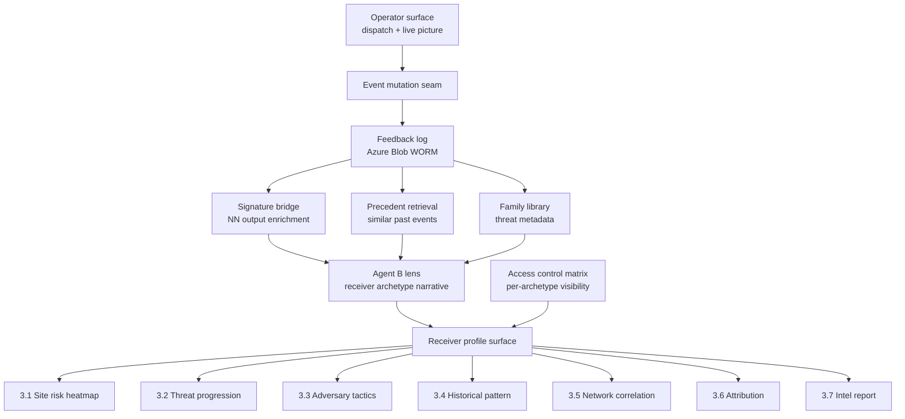
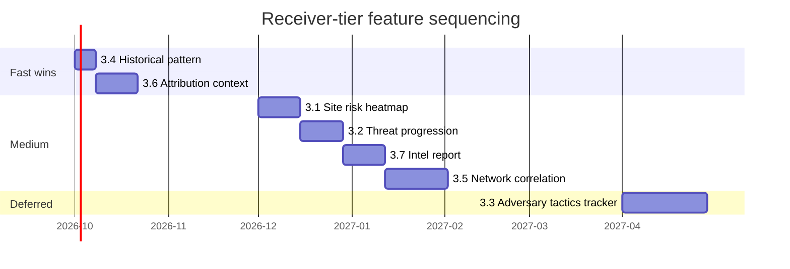

# Receiver-Tier Site Intelligence Roadmap

**Scope:** long-horizon roadmap for the intelligence features that appear ONLY on receiver profiles in the ISR C2 platform. Operators never see these. Access is gated by receiver archetype and, within an archetype, by role clearance.

**Status:** planning. This document exists to guide implementation phases without re-deriving the design each time. No code depends on it yet.

**Positioning decision (2026-09-15):** ISR is the **site intelligence producer**, not a national command tier. This document was reshaped around that decision. Section 2 records the reasoning so it does not get re-litigated.

---

## 1. Positioning: site intelligence, not national command

Two layers exist in the Danish airspace-security landscape and ISR occupies exactly one of them.

- **National C2 layer.** The country-wide picture fusing military and civilian sensors for the state. In Denmark this is decided: Terma won the nationwide DALO counter-UAS contract (Aug 2026) on top of a 30-year framework agreement. Competing here requires scale, a sovereign mandate, and a sensor manufacturing moat ISR does not have and does not need.
- **Site intelligence layer.** The per-site operational surface and the deep intelligence products generated from each site's sensor mesh. This is ISR's layer. Customers are critical infrastructure operators (utilities, ports, grid operators, data centers, airports as commercial entities) who need their own operational picture regardless of what the state runs nationally. Government receivers consume ISR's site intelligence as a product.

The two layers are complementary, not competitive. A receiver (PET, politi, Beredskabsstyrelsen) can consume deep per-site intelligence from ISR AND the wide national picture from the national C2. They answer different questions: "what exactly happened at this substation and what does it mean" versus "what is happening across the country right now."

**Long-term interoperability door.** The national C2 integrator publicly claims support for 70+ sensor types across 45+ vendors. An ISR site can eventually be a structured feed INTO the national picture rather than a rival to it. Nothing in this roadmap forecloses that; several features (the intel report, the structured event data) make ISR a better feed, not a worse one.

**What this roadmap therefore excludes on principle:**
- Country-wide risk or complexity mapping. National coverage is the national layer's job.
- Coalition or military classification-tier machinery (STANAG releasability governance). That belongs to national and NATO systems.
- Predictive asset staging across sites. Command-tier force posture is not ISR's product.
- Any framing of ISR as an analyst tier over sensors ISR does not serve.

The unique-feature moat and this positioning are not in tension. The features ARE the moat. They are site-intelligence features, not national-command features.

---

## 2. Competitive context (research, Sept 2026)

Public-source sweeps across the national incumbent's stack (Helion, FACE, C-Flex, T.react CIP, SCANTER Sphera, JIMAPS, coastal surveillance) found its public feature surface stops at: multi-sensor fusion, AI classification, shared operational picture, track history on the operator display, raw incident replay. Intelligence-product features (historical patterns, attribution, doctrine context, threat progression, structured after-action intelligence) are publicly silent. Their coalition-sharing capability exists but in a separate product line (JIMAPS) not integrated with the counter-UAS stack.

Meanwhile the broader industry (Palantir Gotham, Anduril Lattice, Systematic SitaWare Insight, NATO ACCS, BICES-X) ships exactly this split: operator surface for the live picture, intelligence surface for context. The pattern is proven. The Danish incumbent does not publicly demonstrate it.

**Implication for ISR:** the per-site intelligence surface is an open, visible product gap. ISR builds it scoped to its own sites and its own data, where the incumbent cannot follow without becoming a site-operator product company.

---

## 3. Feature backlog

Seven features, ranked by (impact × archetype-alignment × build-cost). Each entry states which receiver archetypes gain access. Access is a hard tenant-isolation boundary, not a UI toggle.

Archetype legend (from the receiver archetype taxonomy):
- **K** — kinetic (BRS, army counter-UAS liaison, patrol police)
- **C** — coordination (joint operations tier, threat picture cells)
- **I** — intel (PET, FE, intelligence liaison)
- **F** — forensic (post-incident evidence, prosecutor liaison)
- **M** — medical (hospitals, triage, casualty coordination)
- **R** — regulatory (Trafikstyrelsen, aviation authority, energy regulator)
- **P** — public safety (civil defense, evacuation, wildlife, airport safety)
- **L** — international liaison (rare; scoped to what the site owner permits)

### 3.1 Site risk heatmap

**What:** overlay on the receiver map, scoped strictly to the site perimeter and its sensor coverage, showing where on the site incidents concentrate by time-of-day, day-of-week, and threat class. Driven by the site's own detection history.

**Never:** regional or national risk surfaces. The heatmap ends where the site's sensors end.

**Archetypes:** C, I.

**Data source:** feedback log (write-only ledger, Azure Blob WORM at production) + site detection history.

**Cost:** medium (2 weeks). Visualization is an additive Cesium ground-plane texture, consistent with the sensor-primitive work in the Cesium roadmap.

**Detection-only fit:** yes. Passive aggregation of the site's own history.

### 3.2 Threat progression timeline

**What:** per active event, the receiver surface shows likely next steps at 5, 15, 60 minute horizons with confidence bands. Not a track projection on the map (no mid-transit tracks, per the receiver view scope rule). A narrative plus probability chart in the event detail pane.

**Archetypes:** C, I, K (kinetic sees the 5-minute horizon only, for response preparation).

**Data source:** Mistral Agent B lens output + precedent retrieval.

**Cost:** medium (1-2 weeks). Reuses the existing lens streaming infrastructure.

**Detection-only fit:** yes. Text and probability, no dispatch triggers.

### 3.3 Adversary tactics tracker (per platform family)

**What:** persistent record of how a threat family has behaved across events at this site (frequency hopping, altitude drops, RF silence periods, formation changes). Displayed as a per-event chapter in the receiver view. Successor to the deferred RF evasion tactics tracker idea.

**Archetypes:** I primarily. C on request.

**Data source:** signature bridge output, FNV-1a signature hashes tagging repeat detections, RF evasion event log.

**Cost:** medium-large (3-4 weeks). Blocks on the signature bridge being wired to live NN output. Deferred until then.

**Detection-only fit:** yes.

### 3.4 Historical pattern chapter

**What:** "this platform family has been detected at this site N times before" surfaced as an event chapter, with the prior events linked. Uses the signature hash to group repeat detections. Feeds the precedent retrieval agentic layer.

**Archetypes:** I, F, C.

**Data source:** feedback log + signature hash index.

**Cost:** small (1 week). Read-only aggregation over the existing ledger.

**Detection-only fit:** yes.

### 3.5 Customer-network correlation

**What:** when detections at multiple ISR customer sites cluster in a short time window with matching platform families, surface a correlation notification on receiver profiles that have visibility across those sites. This is the ISR network effect: the more sites, the more valuable the correlation.

**Never:** framed as national coverage. Scope is exactly the ISR customer network, and cross-tenant visibility requires explicit opt-in from every site owner involved.

**Archetypes:** C. I where site owners have opted in.

**Data source:** feedback log with site tags, signature hash matching, time-window analytics.

**Cost:** medium (2-3 weeks). Analytics logic + notification infrastructure + the opt-in consent model.

**Detection-only fit:** yes.

### 3.6 Attribution context

**What:** map detected platform families to known state actors, threat groups, or operator identifiers when confidence supports it. Displayed as a chapter in the intel-tier receiver view. Every claim carries a confidence tier and provenance (NN classification, precedent match, external feed).

**Archetypes:** I only.

**Data source:** family metadata attribution elaboration (already in `src/families.js`), external intel feeds where a customer provides them.

**Cost:** small to medium (1-2 weeks). The chapter rendering pattern exists. Attribution data deepens as the family library grows.

**Detection-only fit:** yes. Attribution is context, not action.

### 3.7 Post-incident intelligence report

**What:** the intelligence product generated for after-action review. Distinct from the operator-tier Post-Incident Report (already shipped). Longer-form, structured by receiver archetype, containing detection data, historical pattern, attribution assessment, and tactics context. Lives in the Reports tab. Also the natural artifact to hand upward if a site's data ever feeds the national layer.

**Archetypes:** I, F. Regulatory (R) sees a scoped-down variant.

**Data source:** every feature above feeds this one. It is the receiver-tier synthesis output.

**Cost:** medium (2 weeks). Reuses the PIR rendering infrastructure.

**Detection-only fit:** yes.

---

## 4. Parked features

Recorded so they do not get re-proposed without the positioning discussion attached.

- **Doctrine / TTP annotation (state-actor doctrine tags).** Parked, not cut. The family library can carry a `doctrine_context` field cheaply and the rendering is a week of work, but doctrine tagging edges toward the military-analyst framing this roadmap deliberately avoids. Revisit if intel-tier receivers explicitly ask for it.
- **Predictive dispatch / asset staging recommendations.** Command-tier force posture. Not ISR's product. If a customer requests advisory staging hints inside their own site, treat it as a fresh design conversation, not a revival of this feature.
- **Coalition classification tiers (STANAG 4774/4778 releasability governance).** National and NATO systems own this. ISR stamps its exports sensibly and lets the consuming system govern releasability. Revisit only with a concrete coalition-adjacent customer commitment.
- **Country-wide risk or complexity mapping.** Excluded on principle. See Section 1.

---

## 5. Access control matrix

Hard tenant isolation. No UI toggles. A K-archetype receiver never gains I-archetype visibility even if a screenshot is shared.

| Feature | K | C | I | F | M | R | P | L |
|---------|---|---|---|---|---|---|---|---|
| 3.1 Site risk heatmap | no | yes | yes | no | no | no | no | no |
| 3.2 Threat progression | T+5 only | full | full | no | no | no | no | no |
| 3.3 Adversary tactics | no | on request | yes | no | no | no | no | no |
| 3.4 Historical pattern | no | yes | yes | yes | no | no | no | no |
| 3.5 Network correlation | no | yes | opt-in | no | no | no | no | no |
| 3.6 Attribution | no | no | yes | no | no | no | no | no |
| 3.7 Intel report | no | no | yes | yes | no | scoped | no | no |

L-archetype access is deliberately empty across the board today. International liaison visibility only enters with an explicit site-owner decision, feature by feature.

---

## 6. Architecture integration

Every feature plugs into the existing receiver profile surface. No net-new receiver architecture. Additive rendering on top of what already ships.

**Key integration points:**
- The feedback log is the input to every historical-analytics feature. Already write-only with a clean Azure Blob WORM swap path.
- Signature bridge output feeds attribution and adversary tactics. Deferred until the first live NN.
- The family library is the partner-editable data seam. Ships as data, not code.
- Agent B lens (already shipped) is the narrative surface for threat progression and attribution.
- The access control matrix is enforced server-side (Azure identity + tenant isolation) once infrastructure lands. Client-side flags are never load-bearing.

---

## 7. Sequencing

18-month horizon. Order reflects both cost and the dependency graph.

**Sequencing rules:**

1. **Fast wins first.** Historical pattern and attribution context. Small, independent, high-visibility for intel-tier receivers, and both run entirely on data structures that already exist.
2. **Medium wave.** Site risk heatmap and threat progression share visual patterns and data sources. The intel report synthesizes them, so it comes after. Network correlation ships last in the wave because the cross-tenant opt-in consent model needs design time beyond the analytics.
3. **Deferred.** The adversary tactics tracker blocks on real NN output flowing through the signature bridge. It does not ship on synthetic data.

---

## 8. Constraints (non-negotiable)

- **Detection-only invariant.** Every feature renders context, not action.
- **Receiver view scope.** Site-scoped visibility. No mid-transit tracks. Network correlation surfaces as a notification, never as a map overlay of activity outside the site.
- **Sensors observe only.** Tracked objects hide outside coverage. Every visualization respects this.
- **Operators never see this surface.** Tenant + clearance gates enforce absolutely. No feature toggles.
- **Never mutate Cesium globals.** Additive entities only.
- **Never touch day mode.** New visuals ship in night mode first.
- **Cross-tenant data requires explicit opt-in.** Network correlation (3.5) never activates across site owners who have not consented.
- **Danish letters preserved.** æ, ø, å throughout.
- **No em-dashes.** Periods and commas.

---

## 9. Related

- Memory `receiver-archetype-taxonomy` — the 8-archetype foundation
- Memory `receiver-view-scope` — site-only visibility rule
- Memory `target-market` — critical infrastructure, not government/defense; the positioning in Section 1 extends this
- Memory `feedback-log` — the intelligence-tier data source
- Memory `signature-bridge-planned` — NN output enrichment path
- Memory `precedent-retrieval-planned` — top-K similar past events
- Memory `post-incident-report` — the operator-tier PIR (this doc's 3.7 is the intel version)
- Memory `azure-final-destination` — where clearance + tenant isolation eventually enforces
- `docs/cesium-full-package-roadmap.md` — the visualization layer for 3.1
- `docs/agentic-signature-bridge-architecture.md` — the enrichment path for 3.3 and 3.6
- `docs/agentic-precedent-retrieval-architecture.md` — the analytics path for 3.4 and 3.5
