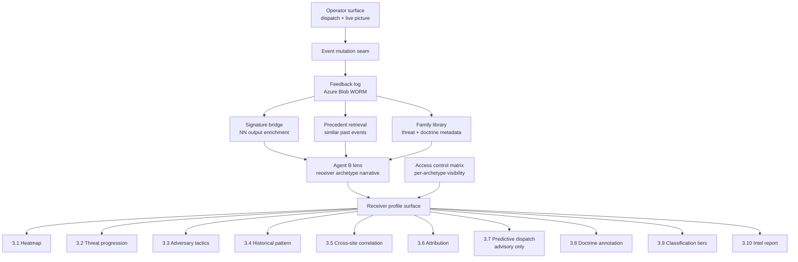
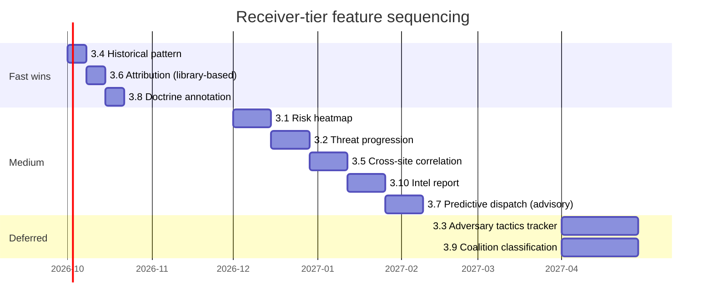

# Receiver-Tier Features Roadmap

**Scope:** long-horizon roadmap for the analyst / intelligence / command-tier features that appear ONLY on receiver profiles in the ISR C2 platform. Operators never see these. Access is gated by receiver archetype and, within an archetype, by role clearance.

**Status:** planning. This document exists to guide implementation phases without re-deriving the design each time. No code depends on it yet.

**Source of the differentiation angle:** competitive research (Sept 2026) across Terma A/S, Palantir Gotham, Anduril Lattice, Systematic SitaWare (Frontline / Headquarters / Insight), NATO ACCS, BICES-X, AFATDS, MIP. Findings summarized in Section 2.

---

## 1. Design principle: the operator / analyst split

Every C2 stack the industry ships today separates two user tiers:

- **Operator tier.** Live picture, sensor status, dispatch decisions, immediate response. What the duty officer sees. Timeframe is now. Vocabulary is action.
- **Analyst / command tier.** Fusion, correlation, projection, attribution, historical pattern, coalition governance, after-action product. What the intel analyst, threat coordinator, or command-tier user sees on top of the operator picture. Timeframe is minutes to years. Vocabulary is context.

ISR already has this split architecturally. The 8-archetype receiver taxonomy (`project_receiver_archetype_taxonomy`) maps to the analyst tier. What is missing is the visible feature surface that lives on top of the base receiver view.

**Operators never see these features.** The invariant is preserved. This roadmap is exclusively about receiver-facing surfaces.

---

## 2. Research finding: Terma's public surface exposes zero analyst-tier features

Ten public-source sweeps against Terma's Helion, FACE (OSL-acquired), C-Flex, T.react CIP, SCANTER Sphera, JIMAPS, and coastal surveillance stacks in Sept 2026 returned this pattern:

| Analyst-tier feature area | Terma public evidence | Industry standard confirms shipped |
|---|---|---|
| Risk heatmaps / probability overlays | SILENT | Palantir Gotham (heatmap analyses), SitaWare Insight (recognized intel picture) |
| Threat progression / projection | SILENT (kinematic tracking only) | Palantir Gotham (scenario simulation), Anduril Lattice (Mission Autonomy) |
| Adversary tactics tracking (freq hop, altitude drop, formation) | SILENT (micro-Doppler is sensor-side) | Palantir Gotham (target development), SitaWare Insight (IRM/CM) |
| Historical pattern overlay | SILENT (raw replay only) | Palantir Gotham (graph + map + timeline), Anduril Lattice (continuous AI training loop) |
| Cross-site correlation as analytics | PARTIAL (shared COP, not correlation) | Anduril Lattice Mesh (track correlation), BICES-X (multi-national merge), ACCS Sensor Fusion Post |
| Attribution intelligence | SILENT (Identify = drone type, not actor) | Palantir Gotham (link analysis + entity resolution) |
| Predictive dispatch / asset staging | SILENT | AFATDS (multiple tactical fire solutions), Palantir Gotham (tasking layers) |
| Doctrine / TTP annotation | SILENT | BICES (threat analysis + I&W), Palantir Gotham (analyst entity annotation) |
| Coalition sharing / classification tiers | CONFIRMED but in JIMAPS (separate product line, not Helion/FACE) | SitaWare Insight (MIP + KML + FMN), Palantir Gotham (RBAC + fine-grained), MIP STANAG 4774/4778 |
| Post-incident structured AAR | PARTIAL (raw replay only) | Palantir Gotham (immutable provenance trails + AAR), SitaWare Insight (dissemination) |

**Interpretation.** Two possibilities. First, Terma has these features and classifies them out of public marketing. Second, Terma has not yet built them at product tier and covers the gap with either the JIMAPS product (separate, not integrated with the C-UAS stack) or with human analyst workflows outside the tool.

Both possibilities are actionable for ISR. In either case, the receiver-tier feature surface is a real product-visibility gap in the Danish sovereign C2 incumbent, and building it as a visible first-class surface is a wedge.

**Industry doctrine is unambiguous.** Frontline / Sentry / operator surface stays live-picture. Insight / Gotham / Menace / BICES / ACCS Fusion Post owns projection, correlation, attribution, releasability, and after-action. ISR's Admin/Operator/Receiver split maps cleanly onto this Frontline-vs-Insight doctrinal cut.

---

## 3. Receiver-tier feature backlog

Ten features, ranked by (impact × archetype-alignment × build-cost). Each entry states which of the 8 receiver archetypes gain access. Access is a hard tenant-isolation boundary, not a UI toggle.

Archetype legend (from `project_receiver_archetype_taxonomy`):
- **K** — kinetic (BRS, army C-UAS, patrol police)
- **C** — coordination (JOC-tier, national threat picture cells)
- **I** — intel (PET, FE, intelligence liaison)
- **F** — forensic (post-incident evidence, prosecutor liaison)
- **M** — medical (hospitals, triage, casualty coord)
- **R** — regulatory (Trafikstyrelsen, aviation authority, energy regulator)
- **P** — public safety (civil defense, evacuation, wildlife, airport safety)
- **L** — international liaison (NATO, EU FRONTEX, coalition partner)

### 3.1 Highlighted risk exposure heatmap (site level)

**What:** overlay on the receiver map (site-scoped) that renders projected likelihood of next incident by time-of-day, day-of-week, threat class. Driven by historical detections + external threat context feed (regional threat level, adjacent-site events).

**Archetypes:** C, I, L. Not K, F, M, R, P.

**Data source:** feedback log (already exists, WORM in Azure at production) + external threat context (Mistral Agent B + optional external feed).

**Cost:** medium (2 weeks). Visualization is Cesium primitive (heatmap texture on ground plane, one of the sensor-primitive Tier 1 features from the Cesium roadmap).

**Detection-only fit:** yes. Passive projection, no auto-response.

### 3.2 Threat progression timeline (T+5, T+15, T+1hr projections)

**What:** per active event, receiver-tier surface shows likely next steps at 5, 15, 60 minute horizons with confidence bands. Not a track projection on the map (that would violate `receiver-view-scope`, no mid-transit tracks). A narrative + probability chart in the event detail pane.

**Archetypes:** C, I, L, K (kinetic sees T+5 only, for dispatch prep).

**Data source:** Mistral Agent B lens output + precedent retrieval (per `project_precedent_retrieval_planned`).

**Cost:** medium (1-2 weeks). Reuses existing lens streaming infrastructure.

**Detection-only fit:** yes. Text and probability, no dispatch triggers.

### 3.3 Adversary tactics tracker (per platform family)

**What:** persistent record of how a threat family has evolved across all events at this site and cross-site (frequency hopping, altitude drops, RF silence periods, formation changes). Displayed as a per-event chapter in the receiver view. Related to `project_rf_evasion_tactics_tracker` (currently deferred).

**Archetypes:** I, L primarily. C on request.

**Data source:** signature bridge output (per `project_signature_bridge_planned`), FNV-1a signature hashes tagging repeat detections, RF evasion event log.

**Cost:** medium-large (3-4 weeks). Requires the signature bridge to be wired to live NN output first. Deferred until then.

**Detection-only fit:** yes.

### 3.4 Historical pattern overlay

**What:** "this platform family has been detected here N times before" surfaced as an event chapter. Uses signature hash to group repeat detections. Feeds into the precedent retrieval agentic layer.

**Archetypes:** I, L, F.

**Data source:** feedback log + signature hash index.

**Cost:** small (1 week). Read-only aggregation over the existing WORM log.

**Detection-only fit:** yes.

### 3.5 Cross-site correlation

**What:** when detections at Site A + Site B + Site C within a short time window and by matching platform family cluster into a suspected coordinated incident, surface a cross-site event notification on receiver profiles that have visibility on multiple sites.

**Archetypes:** C (national coord tier), L (coalition tier). Never K, never P.

**Data source:** feedback log with site tags, signature hash matching, time-window analytics.

**Cost:** medium (2-3 weeks). Analytics logic + notification infra.

**Detection-only fit:** yes.

### 3.6 Attribution intelligence

**What:** map detected platform families to known state actors, threat groups, or specific operator identifiers when the confidence supports it. Displayed as a chapter in the intel-tier receiver view. Every claim marked with confidence tier and source (NN classification, precedent match, external intel feed).

**Archetypes:** I, L only. Never operator, never K, never regulatory.

**Data source:** family metadata attribution_elaboration (already in `src/families.js` per `project_signature_bridge_planned`), external intel feeds where available.

**Cost:** small to medium (1-2 weeks). Rendering logic exists (chapter subsection). Attribution data grows as families are enriched.

**Detection-only fit:** yes. Attribution is context, not action.

### 3.7 Predictive dispatch recommendations

**What:** where the system suggests staging assets ahead of a projected event. This is a recommendation to the coordinator, NOT auto-dispatch. Operators still see live options. Coordinators see suggested pre-staging.

**Archetypes:** C, K (kinetic sees suggestions for own scope only).

**Data source:** threat progression projection (3.2) + asset availability from receiver profile.

**Cost:** medium (2 weeks). Preserves the detection-only invariant strictly (recommendation only, never actuation).

**Detection-only fit:** careful. The system must render this as advisory and never wire it to actuation surfaces. Operators still make the call.

### 3.8 Doctrine / TTP annotation

**What:** the C2 knows what doctrine a given threat pattern typically follows (Russian, Iranian, criminal, commercial-hobbyist) and displays that context on the intel-tier receiver view. Uses the same family metadata as attribution, extended with doctrine-tagged patterns.

**Archetypes:** I, L, C.

**Data source:** family library extension (add `doctrine_context` field to `FAMILY_LIBRARY`). Partner-editable path per `project_signature_bridge_planned`.

**Cost:** small (1 week for the rendering, ongoing for the library curation).

**Detection-only fit:** yes.

### 3.9 Coalition information sharing controls

**What:** data classification tiers (releasable to NATO, releasable to EU only, national restricted, need-to-know). Visible only to appropriate clearance level within each archetype. Every field in the receiver view carries a classification stamp.

**Archetypes:** L (primary), I, C (see the classification tag), everyone else (do not see classified fields).

**Data source:** tenant + clearance metadata on each field. STANAG 4774/4778 alignment for future coalition integration.

**Cost:** large (3-4 weeks). Cross-cuts every receiver-tier surface. Not deferrable if coalition customers are in the roadmap.

**Detection-only fit:** yes.

### 3.10 Post-incident intelligence report

**What:** the intel product generated for after-action review. Different from the operator-tier Post-Incident Report (already shipped per `project_post_incident_report`). This is a longer-form intel document, structured by receiver archetype, with all detection data, attribution assessment, doctrine annotation, and cross-site correlation. Lives in the Reports tab.

**Archetypes:** I, L, F. Regulator (R) sees a scoped-down variant.

**Data source:** every prior feature above feeds this one. It is the receiver-tier synthesis output.

**Cost:** medium (2 weeks). Reuses PIR rendering infrastructure.

**Detection-only fit:** yes.

---

## 4. Access control matrix

Hard tenant isolation. No UI toggles. A K-archetype receiver never gains L-archetype visibility even if a screenshot is shared.

| Feature | K | C | I | F | M | R | P | L |
|---------|---|---|---|---|---|---|---|---|
| 3.1 Risk heatmap | no | yes | yes | no | no | no | no | yes |
| 3.2 Threat progression | T+5 only | full | full | no | no | no | no | full |
| 3.3 Adversary tactics | no | on request | yes | no | no | no | no | yes |
| 3.4 Historical pattern | no | yes | yes | yes | no | no | no | yes |
| 3.5 Cross-site correlation | no | yes | no | no | no | no | no | yes |
| 3.6 Attribution | no | no | yes | no | no | no | no | yes |
| 3.7 Predictive dispatch | own scope | full | no | no | no | no | no | no |
| 3.8 Doctrine annotation | no | yes | yes | no | no | no | no | yes |
| 3.9 Classification tiers | see stamp | see stamp | see stamp | no | no | no | no | full |
| 3.10 Intel report | no | yes | yes | scoped | no | scoped | no | yes |

Reference for archetype letters: Section 3 opener.

---

## 5. Architecture integration

Every feature above plugs into the existing receiver profile surface. No net-new receiver architecture. Additive rendering on top of what already ships.

**Key integration points:**
- Feedback log is the input to every historical-analytics feature. Already write-only with a clean Azure Blob WORM swap path per `project_feedback_log`.
- Signature bridge output feeds attribution + doctrine + adversary tactics. Deferred until first live NN, per `project_signature_bridge_planned`.
- Family library is the partner-editable seam for doctrine tagging. Ships as data, not code.
- Agent B lens (already shipped) is the narrative surface for threat progression, attribution, and doctrine.
- Access control matrix is enforced server-side (Azure identity + tenant isolation) once infrastructure lands. Client-side flags are never load-bearing.

---

## 6. Sequencing

18-month horizon. Order reflects both cost and dependency graph.

**Sequencing rules:**

1. **Fast wins first.** Historical pattern, attribution (from library metadata already there), doctrine annotation. All small, all independent, all high-visibility for intel-tier customers.
2. **Medium wave.** Risk heatmap and threat progression share the same visual patterns and data sources. Cross-site correlation builds on the feedback log analytics from historical pattern. Intel report is the synthesis of everything before it.
3. **Predictive dispatch advisory.** Only after threat progression is stable, since the advisory logic feeds off the projection.
4. **Deferred features.** Adversary tactics tracker blocks on real NN + signature bridge going live. Coalition classification blocks on coalition customer commitment or Azure identity infrastructure. Neither ships without the trigger.

---

## 7. Constraints (non-negotiable)

- **Detection-only invariant.** Every feature above renders context, not action. Predictive dispatch (3.7) is advisory only, wired to no actuation surface.
- **Receiver view scope.** Site-scoped visibility per `project_receiver_view_scope`. No mid-transit tracks. Cross-site correlation surfaces as notification, not as a map overlay of external activity.
- **Sensors observe only.** Tracked objects hide outside coverage. Every visualization above respects this.
- **Operators never see this surface.** Feature toggles do not exist. Tenant + clearance gates enforce absolutely.
- **Never mutate Cesium globals.** Every visual feature is additive-entity only, per `feedback_never_touch_cesium_globals`.
- **Never touch day mode.** All new visuals ship in night mode first, per `feedback_never_touch_day_mode`.
- **Danish letters preserved.** æ, ø, å throughout.
- **No em-dashes.** Periods and commas.

---

## 8. What we will NOT build

- Any receiver-tier feature that could be shipped to an operator surface (violates the split).
- Any auto-dispatch, auto-response, or auto-actuation. Recommendations only.
- Any feature that requires re-litigation of the Cesium constraints (globals, day mode).
- Any classification-tier feature that treats client-side flags as load-bearing.
- Any historical pattern rendering that spans tenants without explicit customer opt-in.
- Any coalition sharing feature that ships before STANAG 4774/4778 alignment is verified with a coalition partner.

---

## 9. Related

- Memory `receiver-archetype-taxonomy` — the 8-archetype foundation
- Memory `receiver-view-scope` — site-only visibility rule
- Memory `feedback-log` — the analyst-tier data source
- Memory `signature-bridge-planned` — NN output enrichment path
- Memory `precedent-retrieval-planned` — top-K similar past events
- Memory `post-incident-report` — the operator-tier PIR (this doc's intel version)
- Memory `dispatch-adapter` — the actuation adapter that predictive dispatch (3.7) intentionally does NOT wire to
- Memory `azure-final-destination` — where clearance + tenant isolation eventually enforces
- `docs/cesium-full-package-roadmap.md` — the visualization layer for features 3.1 and 3.5
- `docs/agentic-signature-bridge-architecture.md` — the enrichment path for 3.3, 3.6, 3.8
- `docs/agentic-precedent-retrieval-architecture.md` — the analytics path for 3.4 and 3.5
