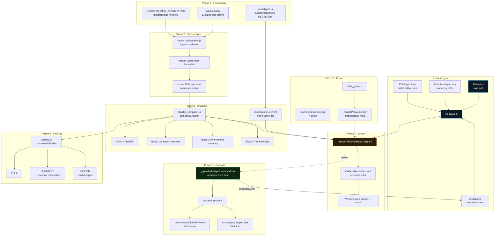
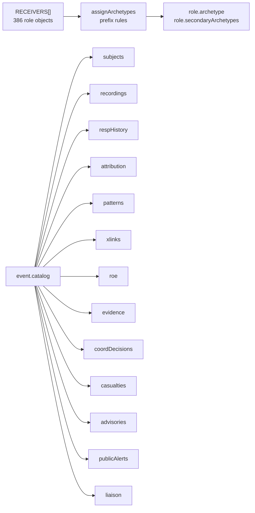
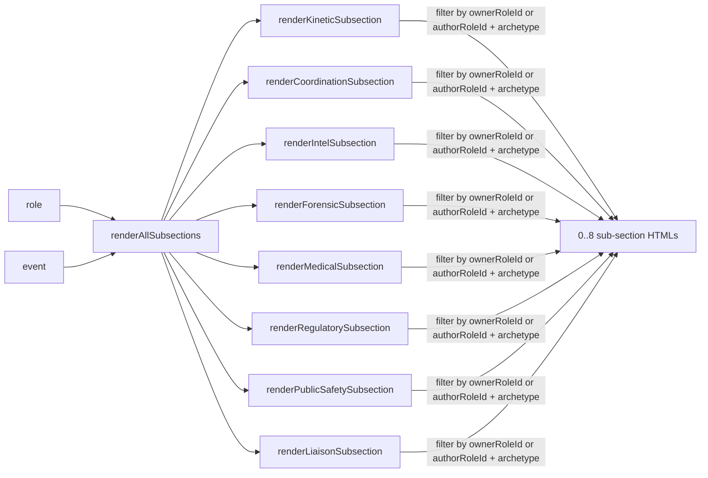
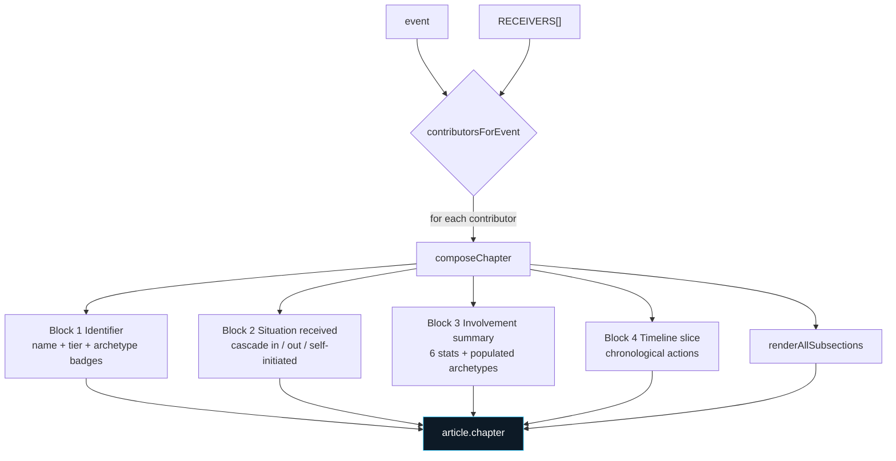
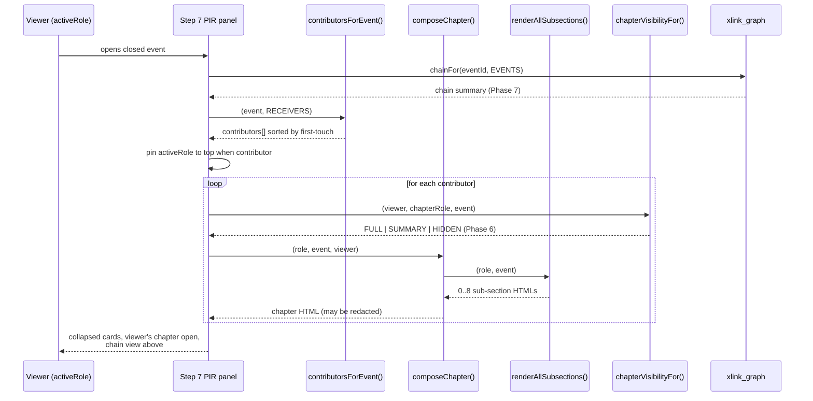
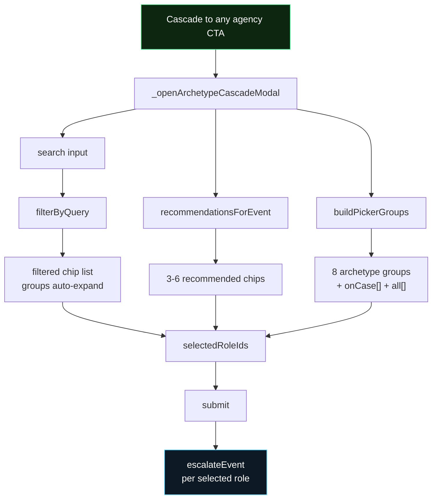
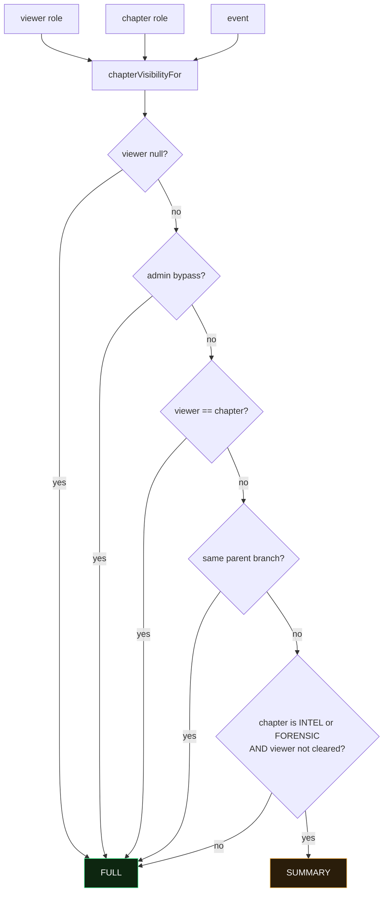
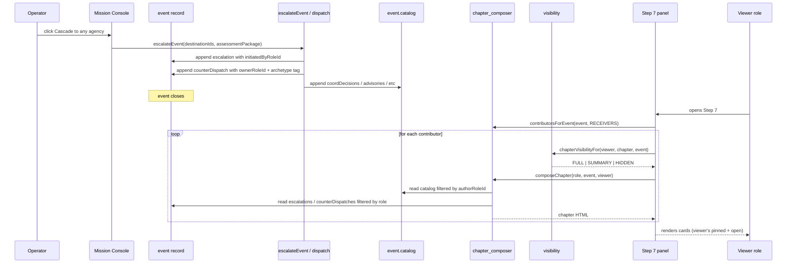

# Report shape · end-to-end overview

Companion to `docs/cross-agency-flows.md`. That doc is the reference — every rule, every edge case, every table. This doc is the map. Read this to see how the pieces fit; open cross-agency-flows.md when you need the details of a specific piece.

| Layer | Where it lives | What it does |
|---|---|---|
| Data foundation | `src/events.js` + `src/archetypes.js` | Event record shape + 386-receiver archetype tagging |
| Sub-section render | `src/report_subsections.js` | One HTML renderer per archetype (kinetic, coord, intel, forensic, medical, regulatory, public, liaison) |
| Chapter compose | `src/chapter_composer.js` | 4 canonical blocks + 0-8 archetype sub-sections per contributor |
| PIR mount | `src/main.js` `_renderPirContributorChapters` | Chapters mount in the Step 7 Incident Report panel |
| Cascade | `src/cascade_picker.js` + `src/main.js` `_openArchetypeCascadeModal` | Universal front door to cascade to any of the 386 |
| Visibility | `src/visibility.js` | Per-viewer redaction of compartmented material |
| Chain | `src/xlink_graph.js` + `src/main.js` `_renderPirEventChain` | Cross-event graph traversal + chain view in the PIR |

---

## The one-diagram view

The whole report shape in one flowchart. Follow the arrows from top-left (an event closes) to bottom-right (a specific viewer sees a specific version of the PIR).



---

## Phase-by-phase walkthrough

### Phase 1 · Foundation (`src/archetypes.js` + `event.catalog`)

Every one of the 386 receivers gets tagged with a primary archetype (and optional secondaries) at boot via prefix rules over the role id. Every event carries a `catalog` object with 13 typed append-only sub-arrays that later phases read from.



**Read this for details:** cross-agency-flows.md Section 6a (catalog shape) + Section 7 (archetype rules table).

---

### Phase 2 · Archetype sub-section renderers (`src/report_subsections.js`)

Eight pure renderers, one per archetype. Each function is `(role, event) → HTMLString`. Empty return when the role has no data for that archetype so the Phase 3 composer only surfaces sub-sections that earned their place.



Contributor scoping is enforced at read time (filter counterDispatches by archetype + ownerRoleId, filter catalog sub-arrays by authorRoleId). The renderer never claims data authored by someone else.

**Read this for details:** cross-agency-flows.md Section 7 "The 8 archetypes".

---

### Phase 3 · Chapter composer (`src/chapter_composer.js`)

One chapter per contributor. Chapter = 4 canonical top blocks + 0-8 archetype sub-sections. Empty return when the role didn't touch the event so the master PIR composer can iterate every RECEIVERS entry and only surface the ones that earned a chapter.



**Contributor detection:** a role contributed if ANY of these is true:
- Initiated an escalation on this event
- Was an escalation destination
- Owns any counter-dispatch
- Authored any catalog entry

Contributors ordered by first-touch timestamp so the master PIR reads in the sequence events actually unfolded.

**Read this for details:** cross-agency-flows.md Section 7 "Chapter composition rule".

---

### Phase 4 · Master PIR mount (`_renderPirContributorChapters`)

Contributor chapters mount in the Step 7 PIR panel below the classic summary rows. One collapsible `<details>` card per contributor. Active viewer's own chapter pins to the top and opens by default.



**Zero JS state** — every card is a native `<details>` element so collapse/expand is free. Redacted cards carry a `chapter-card-redacted` accent + "redacted" tag so the reader spots them without expanding.

**Read this for details:** cross-agency-flows.md Section 7 "PIR panel data flow".

---

### Phase 5 · Universal cascade picker (`src/cascade_picker.js` + `_openArchetypeCascadeModal`)

The "Cascade to any agency" CTA in every active event's Mission Console opens a picker over all 386 receivers. Thick archetypes collapse to category tiles the operator expands on click; thin archetypes show their chips open.



**Recommender rules** — 3-6 defaults surfaced per event based on classification, threat, platform, domainScope, outEnv. Full rule table in cross-agency-flows.md Section 7 "Cascade picker grouping".

**Legacy shortcuts stay wired.** Cascade to intel services (FE + PET) and Cascade to local police (Politikreds) still use their hardcoded 2-chip modal for one-click send. Phase 5 is the universal path.

---

### Phase 6 · Visibility scoping (`src/visibility.js`)

Cross-tenant redaction policy. Non-cleared viewers see intel + forensic chapters as SUMMARY: nameplate + involvement counts, no situation / timeline / sub-section bodies.



**Server-side backstop:** client-side visibility is defence in depth. The real access gate lives at the API layer. visibility.js prevents accidental cross-tenant leakage in the UI.

**Read this for details:** cross-agency-flows.md Section 7 "Visibility scoping".

---

### Phase 7 · Cross-event chain graph (`src/xlink_graph.js`)

Unifies three link sources into one undirected graph. Connected components define chains. Chain view mounts above the contributor chapters in the PIR when the chain size is greater than 1.

```mermaid
flowchart LR
  A["evt-001<br/>BILLUND<br/>10:12"]
  B["evt-002<br/>CPH<br/>10:41"]
  C["evt-003<br/>AALBORG<br/>11:08"]
  D["evt-004<br/>CPH<br/>11:22"]
  A -.linkedEventIds<br/>0.82.- B
  B -.linkedEventIds<br/>0.78.- C
  B -.catalog.xlinks<br/>same-actor.- D
  E[Connected component]
  A --> E
  B --> E
  C --> E
  D --> E
  E --> CHAIN["chain-evt-001<br/>4 events, 3 sites, 70 min"]
  style E fill:#0d1a26,stroke:#4dd2ff,color:#fff
  style CHAIN fill:#2a1d0a,stroke:#ffb84d,color:#fff
```

**Role presence in chain:** `rolePresenceInChain(chain, roleId)` returns which events in the chain a role touched. Feeds the "you were on this" tag in the PIR chain view.

**Read this for details:** cross-agency-flows.md Section 7 "Cross-event chain graph".

---

## Data flow across all phases (dispatch → chapter → viewer)

The lifecycle from the moment an operator fires a dispatch to the moment a specific viewer sees a specific version of that action in a specific contributor's chapter.



**Detection-only invariant** holds end-to-end. No phase writes back into the event during a render. Every module reads the event and derives its output; state changes only happen through the escalateEvent / dispatch / catalog-append paths on the write side.

---

## Debugging + dev handles

Every phase exposes a browser-console dev handle for spot-checking. Open a closed event, then in the console:

| Handle | What it does |
|---|---|
| `window.__isr_archetypes.byArchetype('kinetic-response')` | List every role tagged with an archetype |
| `window.__isr_archetypes.coverage()` | Count of roles per archetype |
| `window.__isr_subsections.populated(role, event)` | Array of archetypes this role populated |
| `window.__isr_subsections.all(role, event)` | Concatenated sub-section HTML for a role |
| `window.__isr_chapters.contributors(event)` | Array of role objects that touched this event |
| `window.__isr_chapters.compose(role, event)` | Composed chapter HTML for one role |
| `window.__isr_chapters.preview(event, elementId)` | Mount all chapters into a DOM element for inspection |
| `window.__isr_picker.groups(event)` | Grouped picker spec: groups[], onCase[], all[] |
| `window.__isr_picker.recommend(event)` | 3-6 recommended defaults for this event |
| `window.__isr_visibility.level(viewer, chapterRole, event)` | FULL / SUMMARY / HIDDEN |
| `window.__isr_visibility.adminOn('some-role-id')` | Register admin bypass for local preview |
| `window.__isr_xlink.graph()` | Full xlink graph over all EVENTS |
| `window.__isr_xlink.chainFor(eventId)` | Chain summary for one event |
| `window.__isr_xlink.narrative(eventId)` | One-line chain description |
| `window.__isr_xlink.rolePresence(eventId, roleId)` | Which events a role touched in the chain |

---

## What comes next (not in scope of these seven phases)

- **Threat-type routing matrix** (`routing.js`) — the `(siteType × platform × classification) → auto-observer role set` lookup for automatic cascade defaults.
- **Cross-site combined evidence report** — multi-event PDF / JSON / CSV bundling for chain incidents. Option B in the marker-filter chain-scope work.
- **UI affordances for observer-promote acceptance / rejection** — Phase 4 in the earlier docs' P8 numbering.
- **Rejection / declined flow protocol** — audit trail + backup escalation path when a receiver rejects a cascade or handoff.
- **PDF layout of the multi-event report** — template TBD.
- **Server-side visibility enforcement** — real auth gate at the API layer; visibility.js is only the client-side rendering companion.

These are tracked in `docs/cross-agency-flows.md` Section 8 "What this document does NOT cover".
