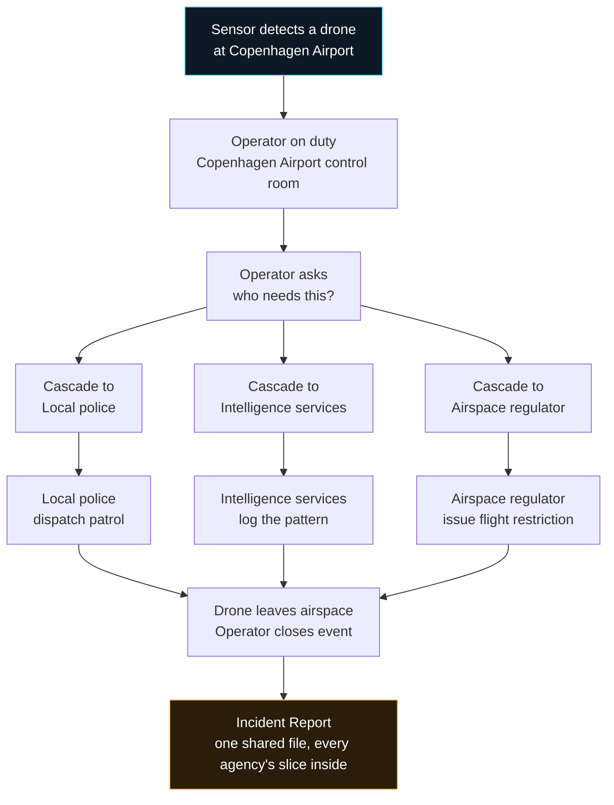
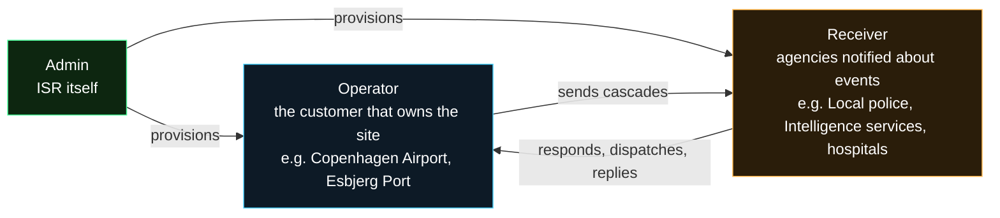
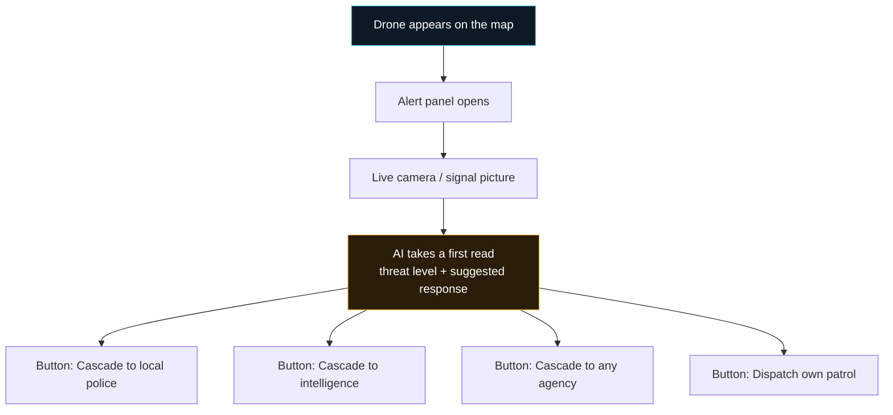
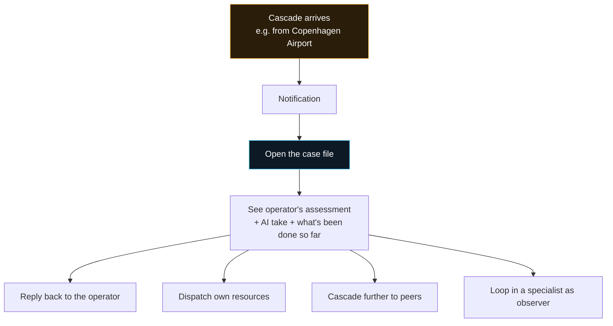
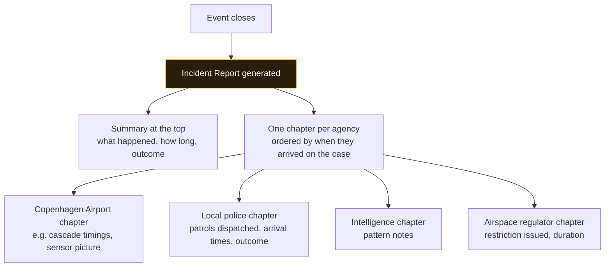
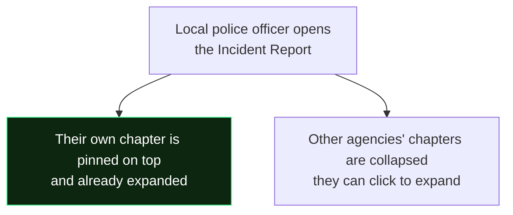
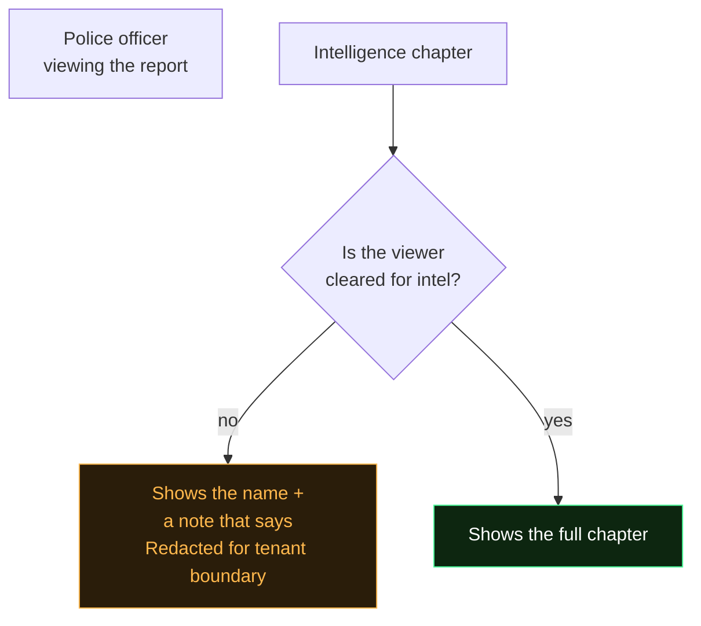
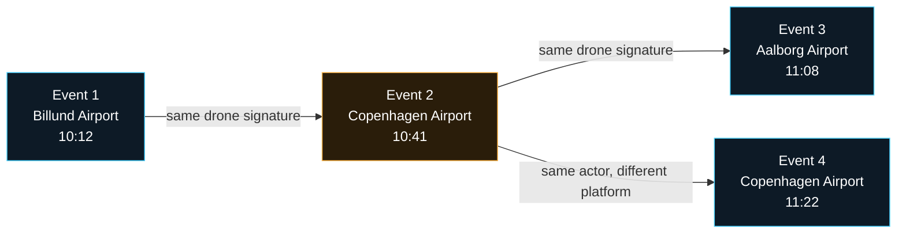

# Report shape · how a drone detection becomes a report every agency can read

Plain-language walkthrough for anyone (founder, investor, new team member) who wants to understand what the ISR C2 platform does end-to-end without reading source code. If you want function names and file paths, open `docs/cross-agency-flows.md` instead.

---

## What the platform does in one paragraph

Sensors at critical infrastructure sites (airports, ports, energy grids) watch the sky for drones. When something worth acting on is detected, the platform decides who needs to know, notifies them, coordinates the response across dozens of agencies, and produces a shared incident record every party can read afterwards. The core promise is a single event that everyone sees the same version of, with each agency's slice of the work presented in their own language.

---

## The story of one event, from detection to closed report

That is the whole system in one flowchart. Everything else is the fine print.

---

## Three kinds of users

The platform serves three tenant types. Each sees a different view of the same underlying events.

- **Admin (ISR)** sets up the accounts, runs the platform, sees everything.
- **Operator** is the customer whose site is being watched. Their team sits in front of the platform live, deciding what to escalate and to whom.
- **Receiver** is any agency the operator needs help from. Police, intelligence, hospitals, fire brigade, the airspace regulator, kommune crisis staff, NATO liaison. There are around 386 registered receivers today.

---

## What an operator sees when a drone appears

The operator is not asked to memorize anything. The platform surfaces suggested actions based on what the drone is doing, and lets them cascade to anyone they need with one button.

**Cascade to any agency** opens a searchable picker with all 386 receivers grouped by what they do (police-style agencies, hospitals, intel services, regulators, and so on). It also shows 3-6 recommended defaults for this exact event so common cascades take one click.

---

## What a receiver sees when a cascade lands

The receiver arrives at the case already briefed. They see what the operator thinks, what the AI thinks, and everything that has been dispatched or coordinated on the case up to that moment. Their next action is a single button click, not a form.

---

## How the shared Incident Report is built

Once the event closes (drone leaves, threat neutralised, all-clear given), a single Incident Report is generated. Every agency that touched the event gets a chapter inside it.

Every chapter has the same shape so readers know where to look:

1. **Who this agency is** (name, tier, what they do)
2. **How they got involved** (who cascaded to them, at what time, or if they self-initiated)
3. **What they did** (summary: patrols dispatched, replies sent, notes written)
4. **Timeline** (chronological list of their actions)
5. **Deep detail sections** (only the sections that agency actually populated on this event)

The deep-detail sections are shaped by the kind of work the agency does. Police get a dispatched-assets section. Hospitals get a casualty section. Regulators get an advisories section. Intel gets an attribution section. The platform picks the right shapes automatically based on who wrote what.

---

## The reader's own chapter is pinned to the top

A police officer reading the report sees Local Police at the top, already open, tagged "your chapter". Everyone else is one click away. No hunting.

---

## Some chapters are redacted for tenant boundaries

Not everyone should see everything. Intelligence services and forensic units write notes that stay inside their branch by default. A police officer reading the same incident sees the intel chapter's presence but the internal notes are held back.

The reader still sees the intel agency was on the case (audit trail intact) but the internal notes stay compartmented. The intel agency reading the same report sees their own chapter fully. Different windows on the same underlying record.

---

## When one incident is actually a chain of incidents

Sometimes one drone visits three sites in an hour. Or a swarm hits several targets at once. The platform links related events into a chain automatically and shows a chain view at the top of each report.

The report says "4-event chain across 3 sites over 70 minutes. Billund → Copenhagen → Aalborg" and lists every event in the chain. If the reader was involved in more than one of them (like local police at both airports), each of their events is tagged "you were on this" so they can see their footprint across the whole campaign.

---

## What the platform will NOT do

Three hard guardrails, worth knowing up front:

1. **The platform never dispatches on its own.** It observes, recommends, and lets humans decide. Every action goes through a human click. This is what "detection-only" means in our positioning.

2. **Tenant data stays inside tenant boundaries.** Copenhagen Airport does not see Esbjerg Port's events. Intelligence notes do not leak to civil agencies. The redaction shown above is the visible half of a stricter server-side gate.

3. **No half-truths in the record.** If an agency touched the case, they appear in the report. If their notes are compartmented, the presence still shows even when the content doesn't. The audit trail is always complete.

---

## The one thing to remember

Every drone detection becomes one shared record. Every agency involved gets their own chapter in it. Every reader sees the version they are cleared to see, with their own contribution up top. Chains of related events surface together. The platform stitches it all live so nobody is writing situation reports by hand at 3am after an incident.

That is the whole product.

---

## Where each piece lives (for later)

When you do want to open the code, this is the map:

| What you see | Where it lives |
|---|---|
| The Cascade-to-any-agency picker | `src/cascade_picker.js` |
| The report chapters (one per agency) | `src/chapter_composer.js` + `src/report_subsections.js` |
| The redaction rules for chapters | `src/visibility.js` |
| The chain view at the top of a report | `src/xlink_graph.js` |
| The list of 386 agencies + what each one does | `src/roles.js` + `src/archetypes.js` |
| The Incident Report generator itself | `src/post_incident_report.js` |

All wired together inside `src/main.js`, which is the shell everything sits inside.

Deep architecture reference: `docs/cross-agency-flows.md`. This overview is the map; that doc is the terrain.
