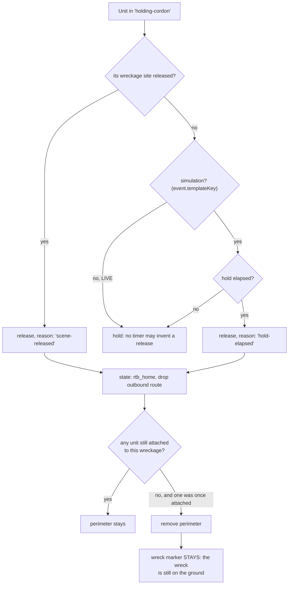

# Scene lifecycle architecture

How a scene ends: when a cordon stands down, when a downed airframe's
perimeter clears, and when a closed track's entities leave the map.

Decision logic lives in `src/scene_lifecycle.js`. That module is pure.
It imports nothing, touches no Cesium, uses no Vite-only API, and so it
runs under plain Node and is covered by `scripts/check-scene-lifecycle.mjs`,
a build gate. Every side effect stays at the call seam in
`src/main.js::_sweepSceneLifecycle`, which runs every 2 seconds.

## Level-triggered, not edge-triggered

Every question this module answers is a standing question about current
state, not an event that has to be caught at the right moment.

That is deliberate. The previous generation of this logic was
edge-triggered and produced two shipped bugs: the AMK phantom-live
condition that only became true after its last chance to be tested, and
a teardown that lived inside the drone tick's per-position loop. Closing
a track stops it emitting positions, so the loop never visited it again
and the teardown was unreachable on every natural close.

A practical payoff: a unit still driving to a scene that gets released
is stood down on arrival, without any code handling that case. It enters
`holding-cordon`, the next sweep sees its site in the released set, and
it turns around.

## Cordon release

Two triggers, and the difference between them is the whole point.

**`scene-released`** is the real-world path. Police scene command,
Indsatsleder Politi, holds the scene at a Danish incident and releases
it; every other agency stands down on that release. Any police account
records it through the **Record scene released** action, which calls
`recordSceneRelease()` in `events.js`, the single writer of
`sceneReleases[]`. It is append-only and a site already released is
skipped rather than re-stamped: this is the audit record of an agency
decision, and ISR does not get to revise one.

### A release is scoped per crash site

An event gains wreckages **one kill at a time**. A swarm drops a second
airframe minutes after the first (`wr-${event.id}-N`, appended per
kill), and `_rebalancePatrolsToWreckages` fans live patrols out onto it
as it appears.

So a release is recorded against the specific wreckage sites being held
when the button is pressed, and `releasedWreckageIds(event)` unpacks the
set for the sweep. An event-level flag would stay true forever, and
every cordon formed after the first release would be dissolved on the
next two-second sweep with no way for the operator to re-arm it. Police
release a scene; a second crash site is a second scene.

**`hold-elapsed`** is a simulation fallback so an unattended scenario
does not accumulate permanent cordons. It is gated on `templateKey` and
can never fire in a live event.

The reason is carried through to the audit note verbatim. A timer
expiring must never be written down as an agency decision: ISR observes,
agencies decide, and a record saying police released a scene when no
police account did would be the platform asserting something it has no
basis for.

### Why the live path had to exist

Until it did, the only trigger that could fire was the simulation timer.
Nothing recorded a release, so a live cordon had no release path at
all, and no backstop either: `holding-cordon` is deliberately excluded
from endurance drain (`main.js`, the `d.enduranceMin` guard), so a live
cordon would have held until the browser closed.

That was unreachable only because no real dispatch adapter is registered
yet. "Latent, not live" is the same reasoning that let five dead
receiver inboxes and a Copenhagen-hardcoded cascade ship, so it was
built before the first real adapter rather than after.

`LIVE_NO_TIMER` and `LIVE_RELEASES` in the build gate hold this line: a
live scene releases when, and only when, a human records it.

### The live path has a precondition

The control lives in the receiver view, whose events come from
`eventsForDestinations(role.destinationIds)`. A police account therefore
sees an event only once it has been escalated to a police destination.

That is right for the normal case, since a crash site cordon is a police
scene by definition. But a cordon can form without any police account
being on the event: `police-c-uas` is an operator-side counter-dispatch
asset with `useRoadRouting: true, airborne: false`, and any such ground
unit is promoted to `holding-cordon` on arrival.

**Closed for warhead impacts.** The terminal-impact cascade now
escalates to the site's own tier-2 Politikreds alongside the consequence
agencies, so an impact scene always has a commander who can release it.
See "Impact cascade" below.

**Still open for an operator-dispatched cordon** on an event that never
escalates to police by any other route. The fix is not an operator-side
release control, since operators do not hold scene command and inventing
one would contradict how the platform routes authority. The answer is
that a cordon forming should itself escalate to the responsible
district, reusing `localPoliceDestinationIds`. That is a routing
question, not a lifecycle one, and it is not built.

## Impact cascade

A warhead detonation auto-escalates with no human click. Until
2026-09-22 it alerted six consequence agencies and no police, while its
own message told those agencies the scene was not yet declared safe by
police. Responders, no scene commander, and the code comment claimed
police were included.

The police recipient is resolved by `localPoliceDestinationIds(event)`
in `destinations.js`, which takes the event's site destinations and
keeps the tier-2 entry whose parent is `Politi`. Deterministic, offline,
and correct at any site added later.

It is deliberately **not** derived from `sovereign_geo_routing`. That
module returns role ids rather than destination ids, needs a 30MB
Datafordeler polygon pull, is never primed in a normal session, and its
own authors marked it non-authoritative for routing. It is for display
and audit enrichment.

### A destination nobody holds is a record nobody sees

Inboxes are built from `eventsForDestinations(role.destinationIds)`, so
a destination that no role lists is an escalation written into a void.
Seven of the nine site police destinations were in exactly that state,
which meant resolving the right district would still have delivered
nothing at every site but Copenhagen Airport. Each district now holds
the sites inside it, taken from the destination's own declared
Politikreds name rather than inferred from geography.

`scripts/check-impact-cascade.mjs` asserts the whole chain by importing
the real `destinations.js` and `roles.js` and running the real resolver,
rather than pattern-matching source text. Text matching cannot see a
destination that is generated at runtime, which every Amager destination
is. It fails the build if the police leg is removed, if a covered site
has no district, if a district is held by no role, or if a Politikreds
name falls through `destinationParent` into `Other`.

That last one was a live bug: `Sydsjællands og Lolland-Falsters Politi`
parented as `Other` because the name list abbreviated it, so Bjæverskov
had no police routing anywhere in the product while its destination sat
in the table looking correct.

### Still Copenhagen-shaped

The six consequence recipients remain a fixed Copenhagen list. Every
site that can detonate today is in the capital region, and the gate
fails the build if a detonating template appears at a site outside
`CASCADE_COVERS`, so a new site cannot silently summon Copenhagen
hospitals. Making that list resolve per site needs the ambulance
service, municipal fire service and rescue reinforcement for each site,
which is configuration data, not code.

### Not in the case file yet

`sceneReleases[]` is not carried into the Post-Incident Report, so who
released which scene is absent from the case file, even though the
per-dispatch `cordonReleaseReason` is mirrored onto the event for
exactly the purpose of telling the two release causes apart in the
record. Worth closing when the report shape is next touched.

## Who is offered the control

`sceneReleaseState()` decides. Offered only when all hold:

| Condition | Why |
|---|---|
| Account is on the police branch | Scene command is a police function |
| At least one unit attached to a wreckage | Nothing to release otherwise |
| That wreckage site not already released | The decision is recorded once per site |

Attached means `holding-cordon`, `en_route` or `engaging`
(`CORDON_ATTACHED_STATES`, exported so the perimeter sweep and the
control share one definition rather than two that drift).

Not gated on the event still being active. A cordon outlives the
detection event: the drone is down and the track is closed long before
the perimeter lifts, which is exactly the window where the control is
needed.

The police test is passed IN as `hasSceneCommand` rather than derived
from a role-id prefix inside the module. `main.js` resolves it through
`agencyBranchOf()`, which reads `roles.js`; a prefix test here would be
a second definition of "is this the police" free to drift from it.
Duplicated predicates that drifted apart are this platform's most
repeated bug class.

## Not a dispatch

`record-scene-release` is deliberately **not** in
`STUB_DISPATCH_ACTIONS` and does not route through the dispatch adapter.
Dispatching sends an instruction to an agency. This records a decision
that agency already made on the ground. Sending it outward would have
ISR instructing police to release a scene, which inverts the platform's
whole stance.

It is recorded in the feedback log as an `operator_action`
(`logOperatorDecision`), and in the event audit trail attributed to the
account that clicked it, never to `AUTO-CORRELATOR`.

## Perimeter clearing

Two conditions, both learned from shipped bugs.

A unit counts as attached while **en route**, not only once it arrives.
The perimeter is drawn the instant an airframe comes down, while every
assigned car is still driving. Counting only arrived units meant nothing
held the wreckage at the moment it was created, so the sweep two seconds
later deleted the polygon before a single unit got there.

A wreckage **nobody ever held** is never cleared (`everHeldIds`).
Without it, a wreck with no cordon dispatched at all, the normal case
for an impact scene, would be drawn and destroyed within two seconds. A
cordon that never formed has not stood down; it never stood up.

Only the perimeter clears. The downed-airframe marker stays: the wreck
is still on the ground after the cordon lifts.

## Track teardown

`expiredGhostEventIds()` returns closed tracks older than the ghost
period that still have entities. Recordings are persisted **before**
teardown, because `droneState.recording` is the only copy for the close
paths that do not persist on their own (left coverage, lost contact, and
the kill path). Without that, a track shorter than the 30 second
in-flight persist would lose its recording entirely and Replay would
have nothing to show, breaking the rule that replay is available
whenever sensors captured data.

The `_entitiesRemoved` flag is set only **after** a successful removal,
so a partial failure is retried on the next pass rather than latched and
left with orphan entities.

## Files

| File | Role |
|---|---|
| `src/scene_lifecycle.js` | Pure decisions. No imports, no side effects. |
| `src/events.js` | `recordSceneRelease()` / `releasedWreckageIds()`, the only writer and reader of `sceneReleases[]`. |
| `src/main.js` | `_sweepSceneLifecycle()` applies decisions; the CTA and click handler. |
| `scripts/check-scene-lifecycle.mjs` | Build gate, wired into `npm run build`. |
