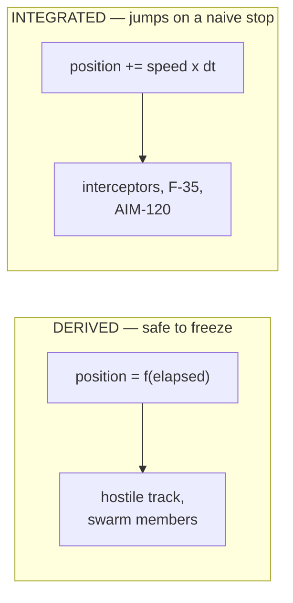

# The simulation clock

`src/sim_clock.js`. One clock the whole simulation reads, so that
stopping it freezes everything at once.

## Why a module and not a flag

Before this, there was nothing to freeze. Every loop called
`performance.now()` or `Date.now()` directly, so a pause button had
nothing to act on. It is a film set where every actor wears their own
watch: you cannot call "freeze", because nobody is listening to one
clock.

Stopping the loops instead of the clock does not work, because the loops
fall into two kinds.

A derived loop freezes exactly when the clock does, and resumes from the
same point. An integrated loop asks "how long since my last frame?" If
it asks the real clock after a 30 second pause, it is told 30 seconds and
takes one 30 second step:

| unit | speed | one frame after a 30 s pause |
|---|---|---|
| interceptor | 250 km/h | 2.1 km |
| counter-drone swarm | 200 km/h | 1.7 km |
| F-35 | 900 m/s | 27 km |
| AIM-120 | 1500 m/s | 45 km, further than any distance on the map |

The missile case is the worst: the step exceeds the distance to its
target, so it snaps onto it, lands inside the 250 m kill radius and
registers a kill it never made. A pause that decides the engagement is
worse than no pause.

Both kinds are fixed by the same thing. **An integrating loop that reads
a frozen clock is told that no time has passed, so it takes a zero-sized
step.** One clock, read by everyone, stopped in one place. No
re-stamping, no per-loop special case, no catching up on resume.

## Nothing stops a loop

There is no helper for pausing an animation frame loop or an interval,
because none has to stop. Every loop keeps spinning, asks the frozen
clock, is told nothing has passed, and advances by nothing.

That also avoids a trap. Three of the four simulation loops re-arm only
conditionally — the drone engine and the dispatch tick while their
collection is non-empty, the F-35 and missile loops not at all when not
airborne — so a pause written as `if (paused) return;` inside any of them
would stop it for the rest of the session.

The periodic sweeps need nothing either. The sweep that closes an
unobserved event compares the clock against a detection stamp, and the
one that tears a track down compares it against a close stamp. Both sides
of both comparisons are on this clock now, so the differences hold steady
and neither fires while frozen. Before that was true, a 30 second pause
would have closed every active cross-site event and written a permanent
audit note reading "No sensor observation for 15 seconds and no active
pursuit", which is false.

## Two epochs, deliberately

The codebase uses both `performance.now()` and `Date.now()` for
simulation state, and they are not interchangeable. main.js documents the
collision itself at the jam-fall site: a start stamp from `Date.now()`
compared against a tick's `performance.now()` is a different scale.

So there are two readers over one shared frozen-time accumulator. Swap
like for like and nothing changes scale:

| was | becomes |
|---|---|
| `performance.now()` | `monoNow()` |
| `Date.now()` | `wallNow()` |

`wallNow()` is still milliseconds since 1970, shifted back by however
long the scene has been frozen. Safe to difference against another
`wallNow()`. **Not** a real timestamp, so never persist it as the moment
something happened.

## What deliberately keeps the real clock

| | why |
|---|---|
| The clock in the corner | An operations surface showing a frozen time is lying about something an operator checks against external systems |
| Record stamps | An event's start time, a dispatch's `dispatchedTs`, a report timestamp. Real moments in the real world |
| `isTelemetryStale` | It compares now against a timestamp from a real feed. Pausing a screen does not pause a car. A frozen clock makes the age negative, so the 90 second guard could never fire and a stalled real vehicle would read as still driving to the scene |
| Animation | Pulses, flashes, fades, tracer streaks. A frozen scene that still breathes reads as paused rather than as broken |
| Replay | An analysis view with its own independent pause. It must not freeze when the live scene does |

## Deferred transitions

A `setTimeout` has no clock to freeze; it is already counting. Three were
load bearing enough to move onto `after(fn, ms)`, which holds the
remaining time on pause and re-arms with exactly that remainder on
resume:

- the wreckage record, DOWNED marker, cordon and patrol rebalance
- the deletion of a live dispatch from `_counterDispatches`
- the deferred drone spawn, which would otherwise spawn a drone into a
  frozen simulation
- the post-fall transition, which hides the trail and fires signal loss

`after` takes `(fn, ms)` on purpose, matching `setTimeout`, so converting
a call site is a pure rename and cannot silently swap the two arguments.

## Enforcement

`scripts/check-sim-clock.mjs`, in the build gate. There is no test runner
here and the failure mode is silent, so this script is the enforcement.

It checks **assignment** sites for 16 baseline fields: a baseline is
written in one or two places and differenced in several, so the write is
the chokepoint, and `const now = wallNow()` at the top of a tick covers
every reader below it. A mismatched epoch is worse than a missed
conversion — stamping with `Date.now()` and comparing against
`wallNow()` makes the difference go *negative*, and an interceptor steps
backwards.

It found a real one on its first run: `engageStartTs` was still on the
browser clock while the engagement timer that reads it had moved.

Exemptions live in the script with the reason written down, and the two
deliberate real-clock stamps are listed in the checked fields so they
have to justify themselves rather than passing because nobody looked.

## The control

`src/sim_pause_control.js` renders into the sim panel, where an operator
already drives a scenario. Not a new floating element: the bottom centre
is occupied by the toast at 40px and the replay overlay at 24px, and the
top right has a known unresolved collision between Map Controls and the
account dropdown.

Shown only while something is live. Neutral grey normally, amber while
frozen, because "the scene is not advancing" is a state worth noticing
without reading the label.

The spacebar toggles it too, wired with the other global key handlers so
it works whether or not the panel is on screen.

## Known gaps

- **`rules.js` delayed auto-escalation.** `setTimeout(doFire,
  rule.then.delaySec * 1000)` still fires while frozen. It is an
  operator-configured business action rather than simulation physics, so
  it was left alone, but a long configured delay will fire mid-pause.
- **No `visibilitychange` handling.** Animation frames suspend in a
  hidden tab while intervals keep firing, so backgrounding the tab
  probably still produces the jumps this clock prevents. Auto-pausing on
  tab hide would fix it and is a behaviour change nobody has asked for
  yet.
- **Replay has the same latent bug** and the same cause, with only a
  clamp on its duration limiting the symptom to "replay jumped to the
  end".
