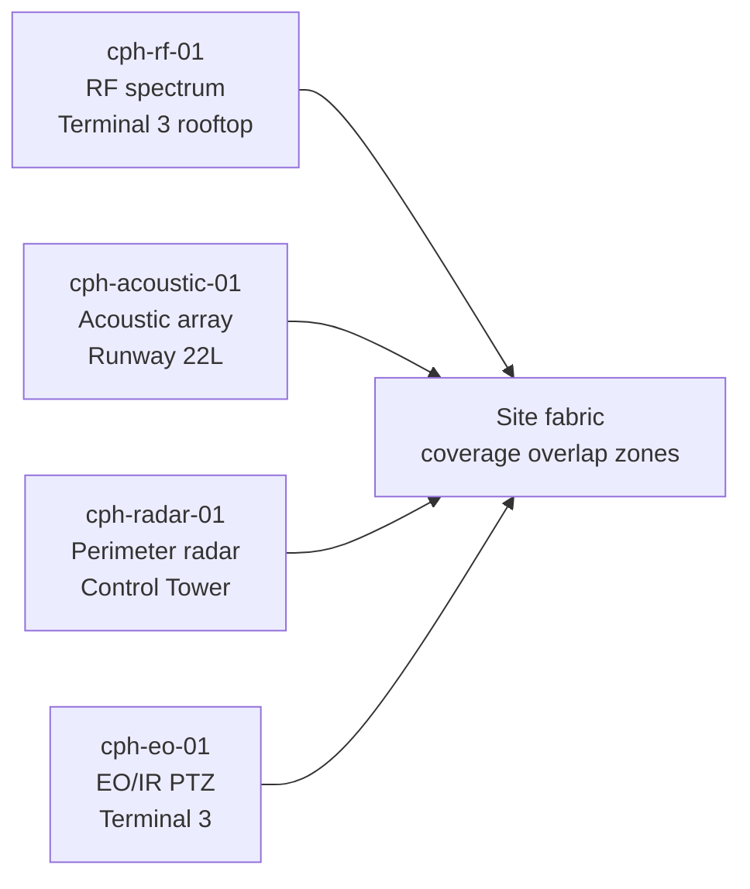
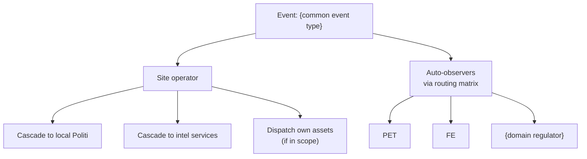
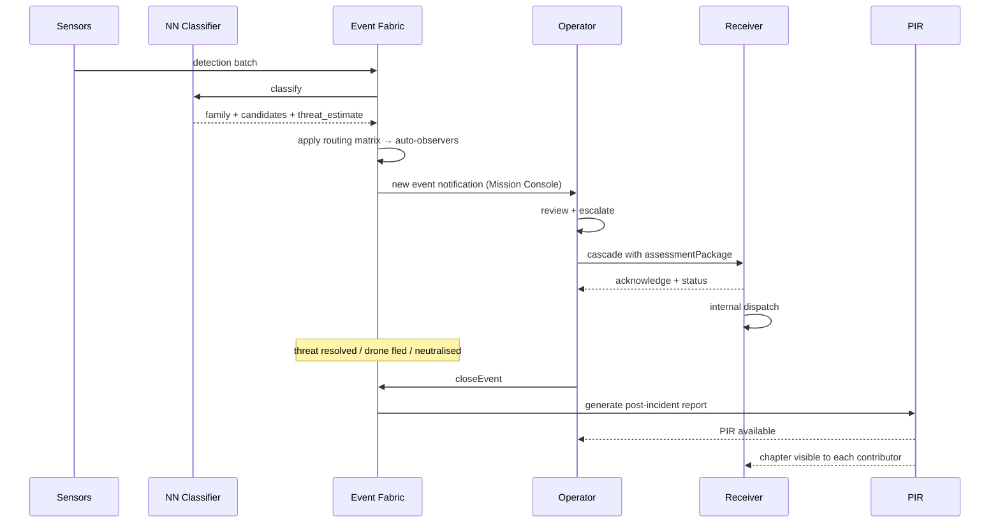

# {Site Label} · flow reference

Template for a per-site flow doc. Copy this file to `docs/sites/{site_id}.md` when onboarding a new customer site and fill in every section. Delete this notice on the actual site doc.

Cross-reference: this doc is the human companion to the machine manifest `sites/{site_id}.yaml` (see `docs/integration-contracts.md` Section 3 "Site definition"). Every field in the manifest has a corresponding narrative section here.

| Field | Value |
|---|---|
| Site ID | `{site_id}` |
| Label | {Human name, Danish + English if relevant} |
| Code | {ICAO / IATA / port code} |
| Tenant | `{tenant_role_id}` |
| Onboarded | YYYY-MM-DD |
| Site type | airport / port / energy / government / data / gov-facility |
| Operating mode | live / sim / mixed |

## 1. Overview

One paragraph. What is this site, what does it do in the real world, why does the ISR C2 platform watch it?

Include:
- Site owner (operator tenant)
- Customer contact (ops lead + escalation contact)
- What normal operations look like day-to-day (context for what "anomalous" means)
- Which sensor types are deployed (RF / acoustic / visual / radar)

## 2. Sensor layout

Physical placement of each sensor. Mermaid diagram + table.

| Sensor ID | Modality | Position | Coverage | Notes |
|---|---|---|---|---|
| `{sensor_id}` | rf / acoustic / visual / radar | lat, lon, alt_m | radius_m | placement rationale + known blind spots |
| ... | | | | |

Blind spots and coverage overlap zones matter — call them out explicitly. Every real detection either falls in coverage or gets an "outside coverage, projected only" tag (per the sensors-observe-only rule).

## 3. Domain scope + operating mode

- **Domain scope:** `[aviation, ground]` (or maritime, energy, etc.)
- **Operating mode:** live / sim / mixed. If mixed: which sensors are live, which are sim.
- **Airspace/waterway/grid regulator:** which regulatory agency owns the domain over this site — feeds baseline auto-observer rule.

## 4. Default cascade recipients

Who gets a cascade by default for common event shapes at this site. Pre-populates the Mission Console picker; operator can accept, add, or decline.

| Event shape | Recipients | Rationale |
|---|---|---|
| Any hostile | pet, fe, {local politi kreds} | Intel + ground authority baseline |
| Hostile + high threat | + forsvarskmd, rigspoliti, beredskab | National command + emergency response |
| Cruise / missile signature | + {air force wing}, agency-traf (NOTAM) | Airspace intercept + NOTAM issuance |
| Cyber signature | rigspoliti-nc3, cert-dkcert | Forensic + cyber attribution |
| Mass gathering onsite | + {kommune SOC}, {region medical} | Evacuation + medical response |

## 5. Cascade tree for common event shapes

Mermaid flowchart(s) for the top 2-4 event types at this site. Shows who ends up in the case regardless of which specific rule fired.

## 6. Full flow: detection → closed report

Sequence diagram walking through one canonical event of the most common type at this site. Shows every actor, every transition, every doc surface.

## 7. Edge cases

Site-specific gotchas that need special handling. Examples:

- **Mixed civil / military airspace** — event over a mixed-use airfield needs both civil (Trafikstyrelsen) and military (Forsvarskommandoen) baseline observer.
- **Weather-restricted operations** — sensors have degraded coverage in fog / heavy rain; per-detection confidence needs weather annotation.
- **Cross-boundary events** — drone crossing FROM this site's airspace INTO an adjacent site's — how the platform stitches events + observers across the boundary.
- **False positives from local traffic** — cooperative traffic fusion (Section 11) handles most, but list the recurring false positives specific to this site (e.g. flocks near coastal port).
- **NOTAM authority** — who issues, timing, coordination handshake.
- **Regulatory reporting** — post-incident reporting obligations to the domain regulator (timing + shape).

## 8. Escalation SLA overrides

Site-specific timing overrides if the platform defaults aren't tight enough. Example:

| Event shape | Platform default | This site's override |
|---|---|---|
| hostile + high | 5 min | 3 min |
| hostile + medium | 10 min | 8 min |
| cruise / missile | 2 min | 2 min (no override) |

## 9. Regulatory context

Multi-paragraph. What laws / regulations / operating agreements apply at this site.

Include:
- Airspace / waterway / grid classification
- Coordination frequencies
- NOTAM / advisory issuance authority
- Reporting obligations (to whom, at what interval, in what format)
- Data retention requirements specific to this site's regulator
- Any customer-specific compliance clauses

## 10. Contacts

Escalation contacts, on-call rotations, key stakeholders. Free-form.

| Role | Name | Contact | On-call schedule |
|---|---|---|---|
| Ops lead | | | |
| Escalation on-call | | | |
| Regulatory liaison | | | |
| Technical integration | | | |

## 11. Change history

| Date | Change | Author |
|---|---|---|
| YYYY-MM-DD | Initial site onboarding | ... |

---

**Reference:** `docs/integration-contracts.md` Section 3 "Site definition" for the machine-readable manifest schema this doc accompanies.
