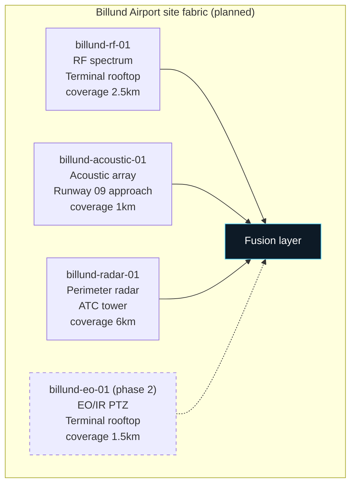
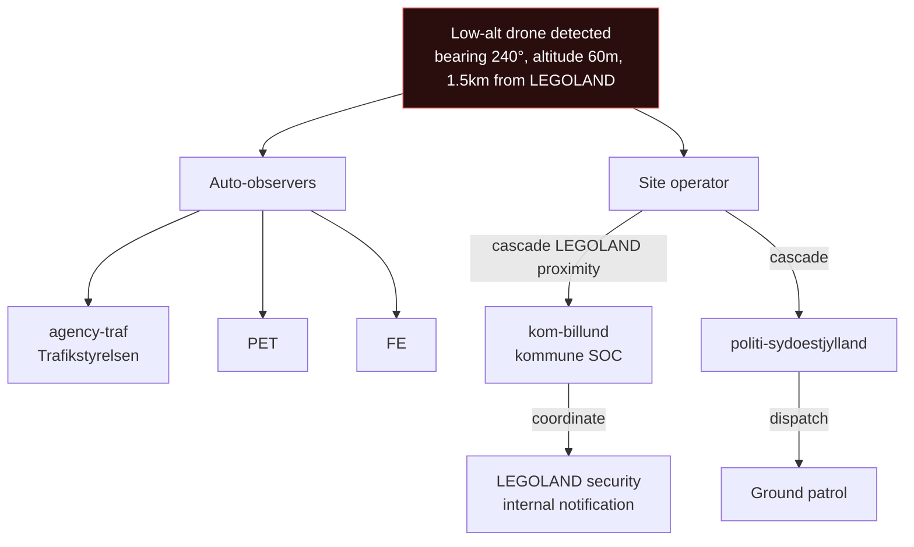
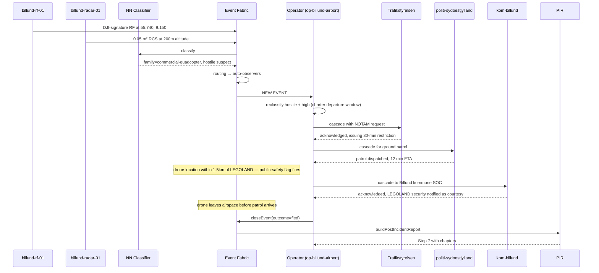

# Billund Airport · flow reference

| Field | Value |
|---|---|
| Site ID | `billund` |
| Label | Billund Airport / Billund Lufthavn |
| Code | BLL (IATA) / EKBI (ICAO) |
| Tenant | `op-billund-airport` (planned, tenant onboarding queued) |
| Onboarded | queued — write this doc first, land the manifest + tenant when contract closes |
| Site type | airport |
| Operating mode | sim initially, mixed once sensors deploy |

Onboarding queued. This doc validates the "7-step config-only add" claim: write this + the site manifest first, land the tenant + sensors last. When the contract closes, the doc + manifest are ready to go.

## 1. Overview

Billund Airport is Denmark's second international airport, ~4 million annual passengers, primary base for Sun-Air + charter airlines, adjacent to LEGOLAND theme park (safety-critical proximity). Class D controlled airspace up to 4500 ft AGL. Runway 09/27 is single-runway operations. The ISR C2 platform will watch airspace surrounding the airport perimeter for drone activity similar to CPH's profile, with two distinctions: (a) LEGOLAND proximity elevates public-safety concern for any low-alt drone incident, (b) charter airline schedule sensitivity means shorter tolerance for schedule disruption.

Normal operations: ~200 movements/day. Runway 09 is primary; 27 is reverse-wind alternate. Coordination with ATC on 118.500 MHz.

Sensor deployment (planned): RF spectrum on terminal rooftop, acoustic array on runway 09 approach, perimeter radar on ATC tower. EO/IR camera phase 2. Rollout cadence tracked in project onboarding memory.

## 2. Sensor layout (planned)

| Sensor ID | Modality | Position (planned) | Coverage | Notes |
|---|---|---|---|---|
| `billund-rf-01` | RF spectrum | 55.740, 9.152, alt 20m | 2.5km radius | Terminal rooftop; less coverage than CPH due to smaller terminal profile |
| `billund-acoustic-01` | Acoustic | 55.735, 9.140, alt 6m | 1km radius | Runway 09 approach; wind-shielded |
| `billund-radar-01` | Radar (X-band) | 55.744, 9.156, alt 35m | 6km radius | ATC tower mount |
| `billund-eo-01` | EO/IR PTZ | 55.740, 9.152, alt 22m | 1.5km radius | **Phase 2** — deferred until phase 1 stable |

**Blind spots:** west sector towards LEGOLAND (~200° arc bearing 220°-320°) has degraded coverage due to LEGOLAND's tall structures. LEGOLAND is 2km SW — this matters because low-alt drone activity there is exactly the public-safety scenario we care about.

**Coverage gap coordination with LEGOLAND security:** ongoing conversation about placing an additional sensor at LEGOLAND perimeter to close the western gap. TBD contract structure.

## 3. Domain scope + operating mode

- **Domain scope:** `[aviation, ground]`
- **Operating mode:** sim initially (before sensor deployment), mixed once phase-1 sensors online, live once phase-2 complete
- **Airspace regulator:** Trafikstyrelsen
- **Public-safety context:** LEGOLAND proximity — factor in every case-file emphasis

## 4. Default cascade recipients

| Event shape | Recipients | Rationale |
|---|---|---|
| Any hostile | pet, fe, politi-sydoestjylland | Intel + local politikreds (Sydøstjylland) |
| Hostile + high threat | + forsvarskmd, rigspoliti, beredskab, agency-traf | National command + emergency + NOTAM |
| Low-altitude event near LEGOLAND (< 500m from park boundary) | + kom-billund (kommune SOC) | Public safety broadcast + park evacuation coordination |
| Cruise / missile signature | + flv-karup, flv-skrydstrup | Airspace intercept |
| Cyber signature | + rigspoliti-nc3, cert-dkcert | Forensic + cyber attribution |

Always-observers: `agency-traf`.

## 5. Cascade tree for common event shapes

### Low-altitude drone near LEGOLAND

## 6. Full flow: detection → closed report

Canonical case: unauthorized drone over Billund airspace during charter schedule window.

## 7. Edge cases

- **Charter departure windows:** heightened threat baseline (medium) during scheduled charter departure windows (Sun-Air, TUI). Reflects schedule sensitivity of chartered operations vs regular airline.
- **LEGOLAND proximity:** any event within 2km of LEGOLAND boundary auto-suggests kom-billund cascade. Especially critical during peak season (April-October). LEGOLAND security has direct comms line to Billund kommune SOC.
- **Cross-boundary with Karup Air Base:** Karup (military) 60km NW. Cross-linked events rare but possible during military exercises when air corridors overlap.
- **Single-runway constraint:** Billund is single-runway. Any restriction disrupts all operations. NOTAM issuance is a heavier decision than at CPH; operator + Trafikstyrelsen coordinate more explicitly on duration.
- **Weather:** frequent low clouds + fog in the region. Sensor degradation more common than CPH.

## 8. Escalation SLA overrides

| Event shape | Platform default | Billund override |
|---|---|---|
| hostile + high | 5 min | 4 min |
| Low-alt near LEGOLAND (any classification) | 15 min | 5 min |
| Charter departure window + hostile | 5 min | 3 min |

## 9. Regulatory context

Class D controlled airspace up to 4500 ft AGL. Coordination with Air Traffic Control on 118.500 MHz (Tower), 121.850 MHz (Ground).

**NOTAM authority:** Trafikstyrelsen. Same shape as CPH — cylinder restriction, coordinated with airport ops.

**Reporting obligations:**
- Aviation Safety Reporting: as per CPH (24-hour report window for runway-proximity events)
- LEGOLAND proximity events: additional courtesy report to kom-billund within 12 hours
- Every hostile-classified event: report to PET within 24 hours

**Data retention:** as per CPH.

**Customer contract compliance:** TBD — contract closing.

## 10. Contacts

| Role | Contact | On-call |
|---|---|---|
| Billund Airport Ops Lead | | 24/7 (post-onboarding) |
| Trafikstyrelsen liaison | | Business hours + on-call |
| Politi Sydøstjylland | | 114 |
| Billund kommune SOC | | Business hours + on-call |
| LEGOLAND security liaison | | Business hours |
| ISR technical integration | | Business hours |

## 11. Change history

| Date | Change | Author |
|---|---|---|
| 2026-09-13 | Flow reference doc written pre-onboarding to validate "7-step config-only add" claim | ISR C2 build |
| TBD | Site manifest + tenant + sensors deploy | ISR + customer |

---

**Reference:** `docs/integration-contracts.md` Section 3 "Site definition".
