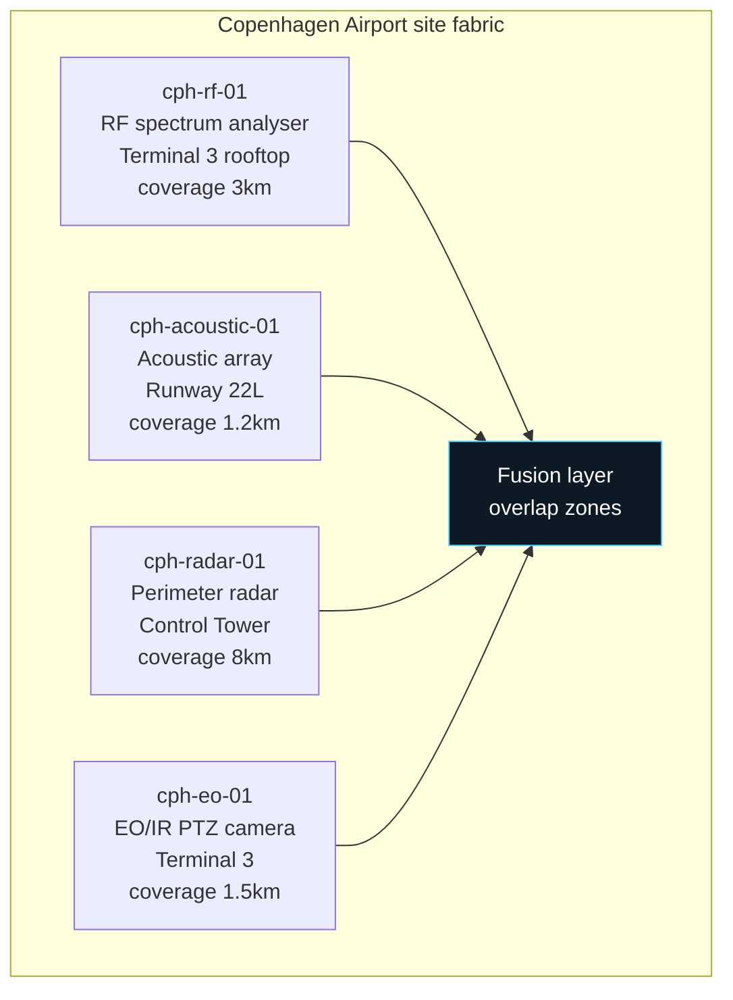
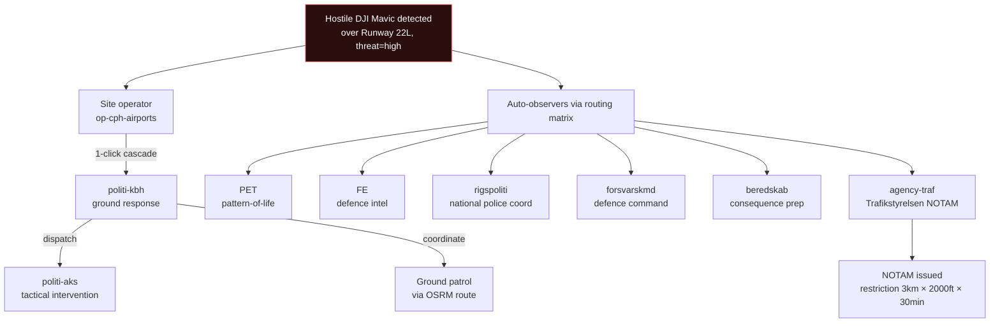
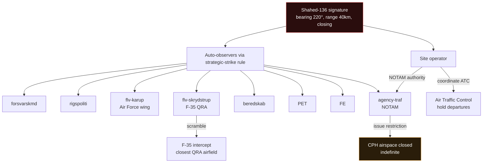
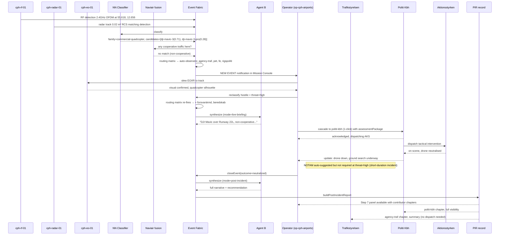

# Copenhagen Airport (Københavns Lufthavn) · flow reference

| Field | Value |
|---|---|
| Site ID | `cph` |
| Label | Copenhagen Airport / Københavns Lufthavn |
| Code | CPH (IATA) / EKCH (ICAO) |
| Tenant | `op-cph-airports` (CPH Airports A/S) |
| Onboarded | 2026-08 (seed) |
| Site type | airport |
| Operating mode | live (sim overlay for training scenarios) |

Reference site for the per-site flow doc pattern. Every other site follows this shape.

## 1. Overview

Copenhagen Airport is Denmark's primary international airport, ~30 million annual passengers, 22 airlines, hub for SAS. The ISR C2 platform watches airspace surrounding the airport perimeter for drone detections that could disrupt takeoff / landing operations. Detections trigger a cascade to Trafikstyrelsen (airspace regulator, NOTAM authority), Politi København (local police + AKS specialists), and — for hostile signatures — Forsvarets Efterretningstjeneste (FE) plus Politiets Efterretningstjeneste (PET) for pattern-of-life logging.

Normal operations: ~700 movements/day (takeoff + landing combined). Class D controlled airspace up to 4500 ft AGL. Base coordination with ATC on 118.100 MHz. Runway 04L/22R is primary; 04R/22L is secondary and cross-wind alternate.

Sensor deployment: RF spectrum analyser on Terminal 3 rooftop, acoustic array near Runway 22L, perimeter radar on Control Tower, EO/IR PTZ camera on Terminal 3. Multi-modality fusion at the platform layer resolves the "same drone, multiple detections" case + cross-references cooperative-traffic (Naviair) to explain away legitimate GA traffic.

## 2. Sensor layout

| Sensor ID | Modality | Position | Coverage | Notes |
|---|---|---|---|---|
| `cph-rf-01` | RF spectrum | 55.6181, 12.6560, alt 15m | 3km radius | Full broadband 400 MHz - 6 GHz. Detects DJI OcuSync + FPV + Shahed autonomous silence signature |
| `cph-acoustic-01` | Acoustic | 55.6175, 12.6540, alt 8m | 1.2km radius | 32-mic array. Distinguishes rotary from turbojet from electric. Weather-degraded above 20 knots wind |
| `cph-radar-01` | Radar (X-band) | 55.6190, 12.6600, alt 45m | 8km radius | Primary track source. Rain-degraded above 15mm/hr. Small-UAV detection down to 0.01 m² RCS |
| `cph-eo-01` | EO/IR | 55.6183, 12.6555, alt 25m | 1.5km radius | Slaves to radar track for auto-cue. Manual override via Mission Console. Thermal imaging for night ops |

**Blind spots:** the western perimeter (~500m sector centred on 55.616, 12.630) has degraded RF coverage due to terminal building shadowing. Radar + acoustic compensate. EO cannot resolve targets in that sector — a detection there always renders without visual confirmation and is flagged in the case-file emphasis.

**Sensor id note:** the four sensor ids above (`cph-rf-01`, `cph-acoustic-01`, `cph-radar-01`, `cph-eo-01`) are illustrative modality archetypes for narrative clarity. The actual seed data in `src/sites.js` registers CPH with 22 online / 24 total multi-modality Radxa nodes (ids `N01`-`N24`, each combining RF + acoustic + visual on one board, with the HackRF SDR core on N08). When the site definition schema per `docs/integration-contracts.md` Section 3 migrates the seed data, each Radxa node becomes one manifest `sensors[]` entry with multi-modality flags — the four-archetype narrative here still holds as a role-grouping.

**Overlap zones:** central runway area (~200m radius around 55.618, 12.656) has full 4-modality coverage. Detections here get the highest fusion confidence.

## 3. Domain scope + operating mode

- **Domain scope:** `[aviation, ground]`
- **Operating mode:** live (all four sensors real). Sim mode overlay available for training scenarios — enabled per operator session, marked with `source: 'sim'` on every detection.
- **Airspace regulator:** Trafikstyrelsen. NOTAM authority for restriction issuance.

## 4. Default cascade recipients

| Event shape | Recipients | Rationale |
|---|---|---|
| Any hostile | pet, fe, politi-kbh | Intel + local ground authority baseline |
| Hostile + high threat | + forsvarskmd, rigspoliti, beredskab, agency-traf | National command + emergency response + NOTAM |
| Cruise / missile signature | + flv-karup (Air Force), flv-skrydstrup (F-35 QRA) | Airspace intercept |
| FPV / kamikaze | + politi-aks (Aktionsstyrken) | Tactical intervention specialist |
| Drone swarm | + full national command chain + beredskab | Multi-threat escalation |
| Cyber signature | + rigspoliti-nc3, cert-dkcert | Forensic + cyber attribution |
| Mass gathering event onsite (e.g. VIP flight, terminal evacuation) | + kbr-taarnby, region-hst | Fire/rescue + medical |

Always-observers (baseline, regardless of routing rule): `agency-traf` (Trafikstyrelsen is baseline for aviation domain).

## 5. Cascade tree for common event shapes

### Hostile quadcopter over Runway 22L

### Shahed signature approaching CPH airspace

## 6. Full flow: detection → closed report

Canonical case: hostile DJI Mavic detected over Runway 22L, operator escalates, Politi Kbh dispatches Aktionsstyrken, drone neutralised, event closed.

## 7. Edge cases

- **Runway proximity:** any detection within 500m of an active runway triggers auto-suggestion for NOTAM issuance regardless of classification. Operator can dismiss but the suggestion always appears.
- **Cross-boundary events:** drones crossing FROM CPH airspace INTO Roskilde (EKRK) airspace 15km southwest — the platform links events via `linkedEventIds` (Phase 7 xlink graph). Both sites' operators see the linked event in their Mission Console chain view.
- **VIP flight movements:** when a VIP flight is scheduled (STA/STD windows published in Naviair), the platform temporarily elevates baseline threat to "high" for detections within 5km. Reverts after VIP movement completes.
- **False positives from Kastrup marina:** occasional wave-clutter radar returns from the marina 2km east. Cooperative-traffic fusion should filter, but if it doesn't, operator marks as false-positive + feedback log records for classifier tuning.
- **Weather-restricted operations:** during heavy fog (<800m RVR) or precipitation >15mm/hr, radar coverage degrades. Case-file flags "sensor degraded" + confidence downgraded accordingly. Cascade recipients still notified; operator makes the call whether to hold based on their SOP.
- **Flocks near coastal approach:** bird flocks over Kastrup can produce non-cooperative multi-track patterns that resemble drone swarm. Cooperative-traffic fusion doesn't cover birds; NN classifier has bird-vs-drone distinguisher that flags with `target_class_hint: bird` from the radar layer.
- **Airshow days (annual):** cooperative traffic layer receives an airshow-mode flag from Trafikstyrelsen — expected non-scheduled traffic patterns are pre-annotated, reduces false-positive rate for the day.

## 8. Escalation SLA overrides

| Event shape | Platform default | CPH override |
|---|---|---|
| hostile + high | 5 min | 3 min (aviation-critical) |
| cruise / missile | 2 min | 2 min (no override) |
| hostile + medium | 10 min | 5 min |
| commercial quadcopter, hostile + low | 15 min | 10 min |

Reasoning: CPH is Denmark's primary hub; downstream cascade delays translate directly to airline schedule impact + passenger delays. Tight SLAs reflect the operational cost of slow escalation.

## 9. Regulatory context

Class D controlled airspace up to 4500 ft AGL over Copenhagen Airport, transitioning to Class C above. Coordination with Air Traffic Control on 118.100 MHz (Tower), 121.850 MHz (Ground), 119.775 MHz (Radar).

**NOTAM authority:** Trafikstyrelsen (Danish Civil Aviation Authority). NOTAM issuance for drone incursions:
- Restriction shape: cylinder centred on detection, radius per event scale, altitude 0 to 4500 ft AGL, duration per event scale
- Timing: NOTAM issued within 3 min of Trafikstyrelsen cascade acknowledgement for high-threat events
- Coordination handshake: Trafikstyrelsen operator confirms restriction shape with CPH operator before publishing

**Reporting obligations:**
- Every event with runway proximity (<500m) or altitude within active flight levels: incident report to Trafikstyrelsen within 24 hours
- Every event with airline schedule impact: report to affected airline within 2 hours
- Every hostile-classified event: report to PET within 24 hours (regardless of whether they were auto-cascaded)

**Data retention:**
- Aviation Safety Reporting: 10 years (statutory)
- Personal data on detected operators (if identified): GDPR-compliant, 6 months default retention with legal-hold override
- Sensor raw data: 90 days rolling in Azure Blob (cheaper tier after 30 days)

**Customer contract compliance:**
- SLA: 99.5% platform uptime during operational hours (05:30 - 24:00 CET)
- Reporting cadence: monthly incident summary to CPH Airports A/S ops team
- Sensor maintenance windows: coordinated with airport operations (avoid peak movement periods)

## 10. Contacts

| Role | Name | Contact | On-call schedule |
|---|---|---|---|
| CPH Airports Ops Lead | | | 24/7 rotating |
| CPH Airports Escalation | | | 24/7 duty officer |
| Trafikstyrelsen liaison | | | Business hours + on-call |
| Politi Kbh drone unit | | 114 (dispatch) | 24/7 |
| ISR technical integration | | | Business hours |

## 11. Change history

| Date | Change | Author |
|---|---|---|
| 2026-08 | Initial site onboarding as seed data | ISR C2 build |
| 2026-09-13 | Flow reference doc written per new per-site pattern | ISR C2 build |

---

**Reference:** `docs/integration-contracts.md` Section 3 "Site definition" for the machine-readable manifest schema this doc accompanies.
