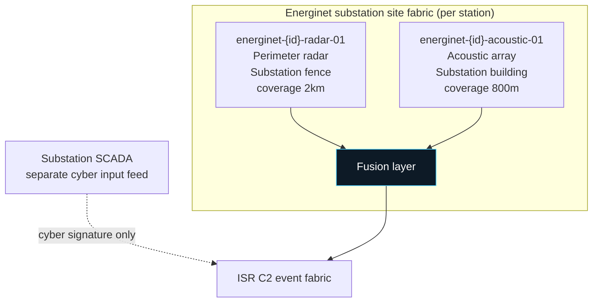
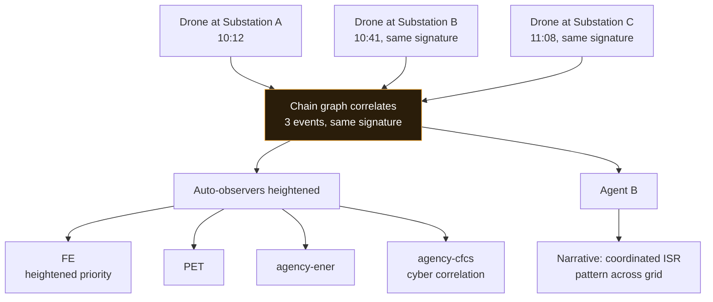
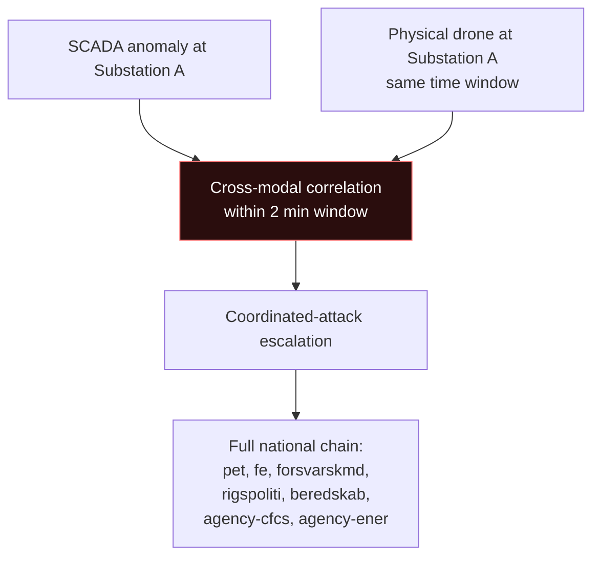
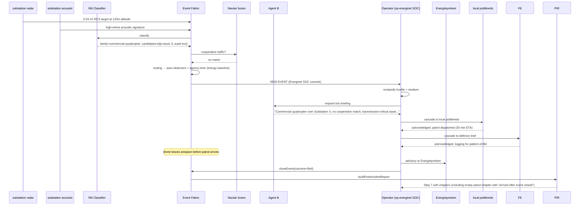

# Energinet substations · flow reference

| Field | Value |
|---|---|
| Site IDs | multi-site: `energinet-*` (300+ substations across Denmark) |
| Label | Energinet grid substations |
| Tenant | `op-energinet` |
| Onboarded | 2026-08 (seed subset) |
| Site type | energy |
| Operating mode | live (subset), sim (majority pending sensor rollout) |

Multi-site tenant: one operator (Energinet) owns 300+ physical substations spread across Denmark. This doc covers the shared pattern; per-substation manifests carry the site-specific coordinates + sensor placement.

## 1. Overview

Energinet is Denmark's Transmission System Operator — owns + operates the national electricity + gas transmission grid. 300+ substations across the country carry the high-voltage backbone. The ISR C2 platform watches substation airspace + perimeter for drone activity (reconnaissance, potential sabotage, ISR against grid topology) OR cyber signature against substation SCADA (SCADA cyber attribution is separate from airspace but shares the incident record).

Normal operations: substations are mostly unmanned; visited by field maintenance crews on scheduled routes. Airspace is uncontrolled but many substations sit within 5-10 km of controlled airport airspace (Copenhagen, Aarhus, Aalborg, Odense) — cross-boundary events with adjacent airports common.

Sensor deployment (per substation, live-mode subset): perimeter radar + acoustic array. RF spectrum + EO/IR planned Q4 for critical substations.

## 2. Sensor layout (per substation)

Every substation follows a common sensor pattern; specific coordinates vary per manifest.

| Sensor ID pattern | Modality | Coverage | Notes |
|---|---|---|---|
| `energinet-{id}-radar-01` | Radar (X-band) | 2km radius | Perimeter radar per substation. Low-alt small-UAV detection |
| `energinet-{id}-acoustic-01` | Acoustic | 800m radius | Wind-shielded. Rotary-vs-fixed-wing discriminator |
| `energinet-{id}-rf-01` (planned) | RF spectrum | 1.5km radius | Q4 rollout for critical substations |
| `energinet-{id}-eo-01` (planned) | EO/IR | 1km radius | Slaves to radar; Q4 rollout for critical substations |

**Blind spots:** substation-internal — the substation buildings themselves shadow parts of the fence perimeter. Detections within 50m of internal buildings degrade all sensors.

**Cyber input feed:** SCADA anomaly detections arrive from Energinet's own SOC via the sensor ingestion contract (Section 1) with `modality: cyber-scada` (custom modality, per-tenant negotiated).

## 3. Domain scope + operating mode

- **Domain scope:** `[energy, ground]` (some coastal substations also `[maritime, energy, ground]`)
- **Operating mode:** live for the priority subset (transmission-critical substations), sim for the majority pending sensor rollout
- **Grid regulator:** Energistyrelsen. Advisory authority for grid-affecting incidents.

## 4. Default cascade recipients

| Event shape | Recipients | Rationale |
|---|---|---|
| Any hostile drone over substation | pet, fe, local politikreds (per substation) | Intel + local ground authority |
| Hostile + high threat | + forsvarskmd, rigspoliti, beredskab, agency-ener | National + grid regulator |
| Reconnaissance pattern (multiple drones, multiple substations, temporal correlation) | + fe (heightened), pet, agency-cfcs | Coordinated ISR against grid |
| SCADA cyber anomaly | rigspoliti-nc3, cert-dkcert, agency-cfcs | Forensic + national cyber |
| SCADA + physical drone together (multi-modal attack) | full national escalation chain | Coordinated attack pattern |

Always-observers: `agency-ener` (Energistyrelsen for energy domain).

## 5. Cascade tree for common event shapes

### Reconnaissance pattern across substations

### SCADA cyber signature + physical drone

## 6. Full flow: detection → closed report

Canonical case: hostile quadcopter at rural substation, no local politikreds within 15 min drive.

## 7. Edge cases

- **Rural substation response gap:** many substations are 30+ min drive from the nearest politikreds. Cascade recipients are notified but real-world response often happens after the drone has left. Post-incident chapters reflect the timing gap. Not a platform bug — a hardware + geographic reality.
- **Cross-boundary with adjacent airports:** substations near CPH / Aarhus / Aalborg airports link to airport events via `linkedEventIds` when timing correlates.
- **Multi-substation chain:** reconnaissance pattern (same signature at multiple substations within a short window) auto-correlates via `catalog.xlinks`. Agent B narrative explicitly calls out the pattern; heightened FE priority.
- **SCADA-only anomalies (no drone):** cyber signature detected without concurrent physical activity — routes to cyber cell (rigspoliti-nc3 + cert-dkcert + agency-cfcs) only. No airspace regulator notification.
- **Combined SCADA + drone attack:** cross-modal correlation within 2 min triggers "coordinated attack" pathway. Full national escalation. This is the highest-priority scenario Energinet contracted for.
- **Winter maintenance windows:** planned maintenance crews trigger acoustic + radar detections. Cooperative-traffic reconciler doesn't cover ground crew; per-substation whitelist of scheduled maintenance windows suppresses NEW event creation during those windows (feedback log records every suppression for audit).
- **Weather:** rural substations often exposed. High wind + rain degrades sensors. Case-file flags degraded state.

## 8. Escalation SLA overrides

| Event shape | Platform default | Energinet override |
|---|---|---|
| hostile + high threat | 5 min | 5 min (no override) |
| SCADA cyber signature | 15 min | 3 min |
| Coordinated SCADA + drone | 5 min | 2 min |
| Reconnaissance pattern (multi-substation) | 10 min | 5 min |

Reasoning: grid disruption cascades fast — a compromise at one substation can cascade to grid instability within seconds. Tight SLA on cyber + coordinated attacks reflects that.

## 9. Regulatory context

Danish national grid operates under Energistyrelsen + Elforsyningsloven (Electricity Supply Act). Critical infrastructure classification for high-voltage transmission assets.

**Grid advisory authority:** Energistyrelsen. Restriction advisories for grid-affecting incidents.

**Reporting obligations:**
- Every hostile-classified event at a transmission-critical substation: report to Energistyrelsen within 4 hours
- Every event with grid-instability impact (voltage anomaly detected): report to Energistyrelsen + Nord Pool Spot within 1 hour
- Every cyber-signature event: report to CFCS (agency-cfcs) within 24 hours
- Every event categorized as "coordinated attack" (SCADA + physical): report to PET + Energistyrelsen + Statsministeriet within 6 hours

**Data retention:**
- Grid incident reports: 10 years (Danish critical-infrastructure requirement)
- SCADA cyber signatures: 5 years
- Sensor raw data: 90 days rolling

**Customer contract compliance:**
- Uptime SLA: 99.9% (critical infrastructure grade)
- Reporting cadence: monthly detailed report + quarterly executive summary to Energinet leadership
- Multi-site pricing model: per-substation, tiered by criticality

## 10. Contacts

| Role | Contact | On-call |
|---|---|---|
| Energinet SOC lead | | 24/7 |
| Energistyrelsen liaison | | Business hours + on-call |
| CFCS (agency-cfcs) | | 24/7 |
| Local politikreds (per substation) | 114 | 24/7 |
| ISR technical integration | | Business hours |

## 11. Change history

| Date | Change | Author |
|---|---|---|
| 2026-08 | Initial Energinet-sites seed subset (`src/sites_energinet.js`) | ISR C2 build |
| 2026-09-13 | Flow reference doc written | ISR C2 build |

---

**Reference:** `docs/integration-contracts.md` Section 3 "Site definition". Per-substation manifests will migrate from `src/sites_energinet.js` to `sites/energinet-*.yaml` in the follow-up refactor.
