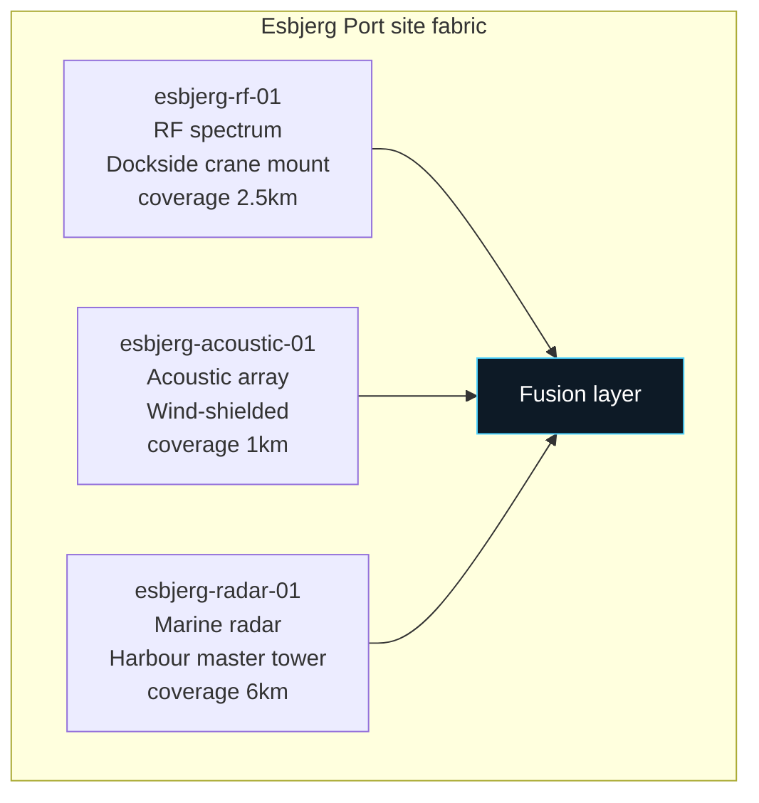
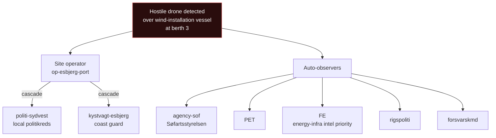
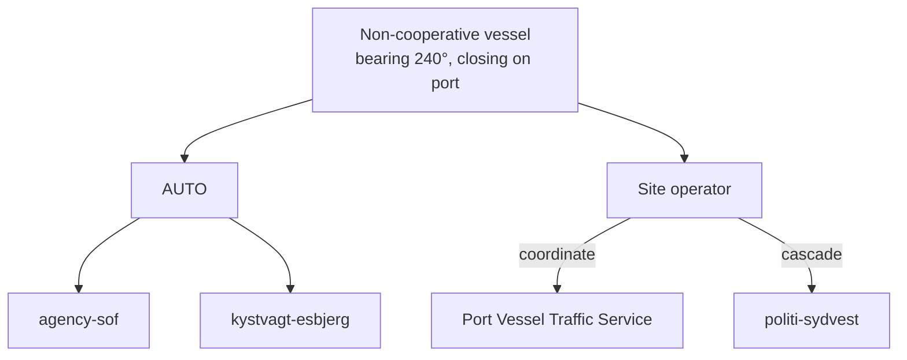
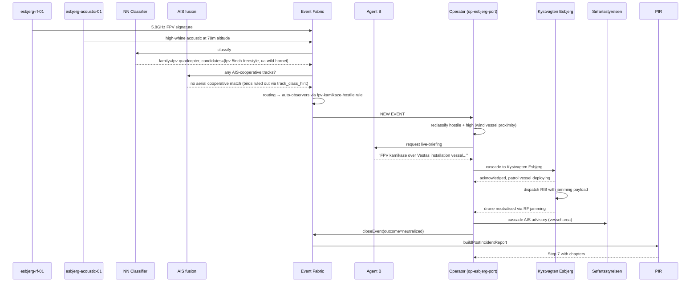

# Port of Esbjerg · flow reference

| Field | Value |
|---|---|
| Site ID | `esbjerg` |
| Label | Port of Esbjerg / Esbjerg Havn |
| Code | DKEBJ (UN/LOCODE) |
| Tenant | `op-esbjerg-port` (Port of Esbjerg A/S) |
| Onboarded | 2026-08 (seed) |
| Site type | port (maritime) |
| Operating mode | live (sim overlay for training) |

## 1. Overview

Port of Esbjerg is Denmark's largest offshore energy port, ~10 million tons cargo annually, primary export terminal for North Sea wind installation vessels + oil/gas support. The ISR C2 platform watches port airspace + surface waterways for drone or unauthorised vessel activity that could disrupt terminal operations OR pose an intelligence-collection risk against oil/gas installations shipped through here.

Normal operations: ~600 vessel movements/month + heavy crane operations + wind installation vessel loading. Airspace has no controlled zone but is uncontrolled up to 500 ft (Danish uncontrolled port airspace). Adjacent Esbjerg Airport (EKEB) 3km northeast; port is inside EKEB's Class G airspace.

Sensor deployment: RF spectrum analyser (dockside crane mount), acoustic array (wind-shielded), radar (harbour master's tower). No EO/IR yet — planned Q4.

## 2. Sensor layout

| Sensor ID | Modality | Position | Coverage | Notes |
|---|---|---|---|---|
| `esbjerg-rf-01` | RF spectrum | 55.467, 8.450, alt 40m | 2.5km radius | Dockside crane mount — reduced coverage inland due to warehouse RF shadowing |
| `esbjerg-acoustic-01` | Acoustic | 55.468, 8.451, alt 5m | 1km radius | Wind-shielded housing; still degraded above 25 knots (frequent in North Sea weather) |
| `esbjerg-radar-01` | Marine radar | 55.470, 8.453, alt 30m | 6km radius | Multi-target marine + light-air; primary source for AIS + non-cooperative vessel + low-alt drone |

**Blind spots:** north sector (~90° arc bearing 340°-070°) has degraded coverage across all three sensors due to industrial warehouse structures on-site. Detections in that arc are logged with a "reduced coverage" flag.

## 3. Domain scope + operating mode

- **Domain scope:** `[maritime, ground]`
- **Operating mode:** live
- **Waterway regulator:** Søfartsstyrelsen. AIS advisory authority.
- **Adjacent airspace:** EKEB Esbjerg Airport 3km northeast (Class G). Cross-boundary events with EKEB when they land there.

## 4. Default cascade recipients

| Event shape | Recipients | Rationale |
|---|---|---|
| Any hostile | pet, fe, politi-sydvest | Intel + local politikreds (SVJ) |
| Hostile + high threat | + forsvarskmd, rigspoliti, beredskab, agency-sof | National command + emergency + AIS advisory |
| Unauthorized vessel (maritime domain) | + kystvagt-esbjerg (Kystvagten Esbjerg) | Coast guard on-water response |
| Cyber signature against port SCADA | + rigspoliti-nc3, cert-dkcert, agency-cfcs | Forensic + cyber attribution |
| Wind-installation vessel present + hostile drone | + fe (heightened) | Critical energy-infra intel priority |

Always-observers: `agency-sof` (Søfartsstyrelsen for maritime domain).

## 5. Cascade tree for common event shapes

### Hostile drone over wind installation vessel

### Unauthorised small vessel approaching port entrance

## 6. Full flow: detection → closed report

Canonical case: hostile FPV drone over wind-installation vessel at berth, operator escalates, Kystvagten Esbjerg dispatches vessel, drone neutralised.

## 7. Edge cases

- **Wind-installation vessel schedules:** heightened threat baseline when a wind-installation vessel is at berth (broadcast published in port ops schedule). ISR platform elevates baseline threat to "medium" during that window.
- **Cross-boundary with Esbjerg Airport (EKEB):** drone crossing from port airspace INTO airport airspace 3km NE — links to any concurrent EKEB event via `linkedEventIds`.
- **North Sea weather:** wind above 25 knots degrades acoustic sensor. Case-file flags "acoustic degraded." Wind above 40 knots + heavy sea state: radar clutter increases; small-vessel detection reliability drops.
- **Cooperative AIS gaps:** small pleasure craft often don't carry AIS. Non-cooperative surface detection is common; NN classifier's `target_class_hint: small-vessel` is the discriminator.
- **Oil/gas installation intel priority:** any hostile drone during oil/gas cargo loading gets elevated FE observer priority. Reflected in the routing matrix's site-specific `always_observers`.
- **Bird flocks:** North Sea coastal birds. Radar clutter + acoustic false positives. NN classifier + cooperative-traffic reconciler filter most, but recurring false-positive patches near northern breakwater log to feedback log for classifier tuning.

## 8. Escalation SLA overrides

| Event shape | Platform default | Esbjerg override |
|---|---|---|
| hostile + high | 5 min | 5 min (no override) |
| hostile + wind-installation vessel present | 5 min | 3 min |
| Unauthorized surface vessel | 15 min | 8 min |

## 9. Regulatory context

Esbjerg Port operates under Danish Port Authority + Søfartsstyrelsen (Danish Maritime Authority) rules. Uncontrolled airspace up to 500 ft AGL over the port area; class G airspace above merging into EKEB Class G at 3km NE.

**AIS advisory authority:** Søfartsstyrelsen. Advisories for restricted anchorage / no-go zones during incidents.

**Reporting obligations:**
- Every hostile-classified event: report to PET within 24 hours
- Every event involving oil/gas cargo or wind-installation vessels: additional report to Energistyrelsen within 24 hours
- Every unauthorised vessel entry: report to Kystvagten log within 12 hours

**Data retention:**
- Port operational safety reports: 5 years (statutory)
- Sensor raw data: 90 days rolling
- Vessel identification data: GDPR-compliant, 6 months default

**Customer contract compliance:**
- Uptime SLA: 99% during operational hours (05:00 - 22:00 CET)
- Reporting cadence: monthly summary to Port of Esbjerg A/S ops team

## 10. Contacts

| Role | Contact | On-call |
|---|---|---|
| Port of Esbjerg Ops Lead | | 24/7 |
| Harbour Master | | 24/7 |
| Kystvagten Esbjerg | | 24/7 |
| Politi Sydvestjylland | | 114 |
| Søfartsstyrelsen liaison | | Business hours + on-call |

## 11. Change history

| Date | Change | Author |
|---|---|---|
| 2026-08 | Initial site onboarding as seed data | ISR C2 build |
| 2026-09-13 | Flow reference doc written | ISR C2 build |

---

**Reference:** `docs/integration-contracts.md` Section 3 "Site definition".
