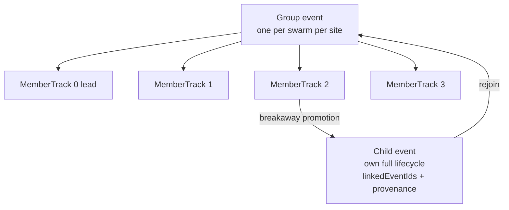
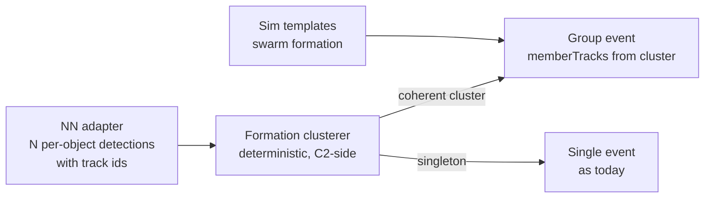

# Swarm Individual Tracking Architecture

**Status:** `[planned]` — designed 2026-09-16. This document maps the target architecture for per-drone tracking inside swarm events. Nothing here is built yet; the current swarm implementation (one event, lead billboard + member billboards) ships as-is until this lands.

## Problem

Today a swarm is ONE event. The lead drone is the primary track; members are attached billboards following formation offsets, each with only a `neutralised` flag of independent state. That model breaks in three real-world situations:

1. **Breakaway.** One member peels off toward a different target. It has no independent track identity, no independent event lifecycle, and its departure is invisible to history and to receivers.
2. **Wide formations.** Members flying kilometers apart can straddle sensor coverage boundaries. Per the sensors-observe-only rule, each member's visibility must be gated by ITS position, not the lead's. Today gating follows the primary track.
3. **The live path inversion.** The simulation spawns a swarm as a pre-defined group. A real NN does the opposite: it emits N individual per-object detections and the C2 must CLUSTER them into a formation. The current model has no clustering seam, so the sim architecture cannot receive real swarm data without rework.

One thing stays right: one event per group lifecycle per site. Receivers coordinate a response to an incident, not to five separate paperwork trails. The fix is per-member track state INSIDE the group event, plus promotion rules for breakaways, not five events for five drones flying together.

## Design

### Track model



`event.memberTracks[]` replaces the render-only swarm billboard array as the source of truth:

```
MemberTrack = {
  memberId,               // stable within the event: '<eventId>-m<i>'
  nnTrackId,              // NN-assigned track id when live (null in sim)
  kinematics: { lat, lon, alt, heading, speedMs },   // per member, per tick
  inCoverage: bool,       // gated by THIS member's position
  status: 'tracked' | 'lost' | 'neutralised' | 'broken-away',
  classification,         // per member; usually inherited, can diverge
  class_confidence,
  formationOffset,        // expected slot; deviation feeds breakaway detection
  history: [...],         // per-member state transitions, append-only
}
```

**Per-member coverage gating.** Each tick evaluates each member against sensor coverage independently. A member outside all radii is hidden (its billboard, trail, and any projection) while the rest of the formation stays visible. The universal visibility rule applies at member granularity, full stop.

**Per-member classification.** A mixed group (four quadcopters escorting one fixed-wing) carries per-member class. The event's top-level subject remains the group summary (dominant class + cardinality), which keeps every existing consumer working.

**Cross-site shadow events (P1.1 semantics, deliberate).** A shadow event clones the primary's member tracks at spawn with `sourceMemberId` provenance and inherits each member's status at that moment. After spawn the shadow's tracks are FROZEN: shadow events have no droneState render wrappers, so nothing syncs their kinematics or coverage, and a member neutralised after the shadow spawned stays 'tracked' in the shadow's copy. The primary event's tracks are the live truth for the group; the shadow's copy answers "what did this site's event know at handoff." Live shadow-track sync (deriving the shadow's per-member coverage against ITS site's sensors) is Phase 2 work, folded into breakaway detection which needs per-site member geometry anyway.

### Breakaway detection and promotion

Deterministic, tunable per site, evaluated per tick for each member:

- **Distance trigger:** member's distance from formation centroid exceeds `breakawayDistanceM` (default 500 m) for longer than `breakawayGraceSec` (default 10 s), OR
- **Vector trigger:** member's heading diverges from the formation's mean heading by more than `breakawayHeadingDeg` (default 45°) sustained over the grace window.

On trigger, the member PROMOTES to a child event:

- New event with full lifecycle (entry, escalations, dispatches, close, PIR, precedent record).
- `linkedEventIds` both ways + `provenance: { parentEventId, memberId, promotedAt, reason }`.
- Parent's MemberTrack flips to `broken-away` with a pointer to the child. Parent cardinality history remembers the peak (per the gap 9 rule: history records what showed up).
- Receivers on the parent case see a timeline entry: "Member 3 broke formation, tracking as EV-xxxx." Cross-navigation via the existing linked-events panel.

**Rejoin.** If a promoted child re-converges with the formation (inverse of the triggers, sustained), it closes with outcome `rejoined formation` and links back. The parent MemberTrack returns to `tracked`. History keeps both records; the child's precedent record is real intelligence (a probing maneuver).

**Formation split.** If the group splits into two coherent sub-formations (cluster analysis yields two centroids, each with 2+ members), the larger cluster keeps the parent event; the smaller promotes as ONE child group event, not N singles.

### The clustering seam (live-path inversion)



The clusterer is the new deterministic module (`src/formation_clusterer.js` when built). Inputs: live per-object detections with NN track ids. Rule: objects within `clusterRadiusM` of each other with velocity coherence above `clusterVelocityDot` (default cos 30°) sustained `clusterConfirmSec` (default 5 s) form one group event. The sim path constructs the same MemberTrack shape directly from templates, so downstream code has exactly one swarm representation regardless of source. This honors the plug-in-ready rule: when the real NN lands, the clusterer is the only new consumer; everything downstream is already member-aware.

Clustering is kinematic grouping, not classification. The NN classifies each object; C2 groups what the NN already classified. The c2-not-classifier boundary is untouched.

### History and intelligence layer fit

- Parent group event registers ONE precedent record with peak cardinality (gap 9 semantics).
- Promoted child events register their own records with provenance, so "this site has seen breakaway maneuvers before" becomes a queryable pattern — feeds the historical pattern panel and, later, the adversary tactics tracker (`project_rf_evasion_tactics_tracker`).
- The signature bridge applies per member when raw signatures flow: five members = five signature hashes. Same-airframe matching across events (edge case 6) then works per drone, not per formation.

## Migration phases

| Phase | Scope | Depends on |
|-------|-------|------------|
| 1 | `memberTracks[]` on swarm events, per-member coverage gating, per-member status replacing the billboard `neutralised` flag | nothing — sim-only refactor |
| 2 | Breakaway detection + child-event promotion + rejoin semantics | Phase 1 |
| 3 | Formation clusterer for the live path | NN adapter emitting per-object tracks |
| 4 | Per-member signature hashes + same-airframe matching | Phase 3 + signature bridge live |

Phase 1 and 2 are buildable today against the sim. Phase 1 is the prerequisite for everything and touches the swarm tick loop, render path, and neutralisation flow. Estimate: Phase 1 ~1 week, Phase 2 ~1 week. Phases 3-4 wait for their layers.

## Constraints (unchanged, restated)

- Detection-only. Promotion creates tracking context, never response action.
- Sensors observe only: per-member visibility gating is the POINT of this design, not an exception to negotiate.
- One event per group lifecycle per site remains the doctrine; child events are the exception with explicit provenance, not a new default.
- Additive Cesium entities only. Member billboards and trails follow the existing entity patterns.
- Every seam NN-plug-in ready: MemberTrack carries `nnTrackId` from day one, sim leaves it null.

## Related

- docs/event-model-edge-cases.md — cases 1-3 and 9 define the group-event semantics this extends
- docs/agentic-signature-bridge-architecture.md — per-member signatures (Phase 4)
- docs/nn-adapter-explainer.md — the per-object detection stream the clusterer consumes
- Memory: sensors-observe-only, c2-not-classifier, api-nn-plugin-ready, site-intelligence-layer
