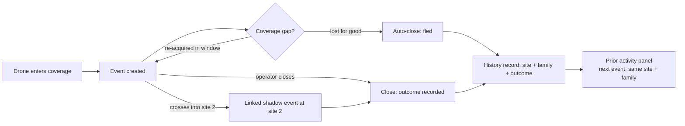

# Historical Pattern — Test Plan

Simple checklist for verifying the "Prior activity at this site" panel. Each test: do this, look at this, good when.

Reference: docs/receiver-tier-features-roadmap.md §3.4. Feature code: src/historical_pattern.js.

---

## Before you start

- Open the browser console once (F12). Two commands you will use:
  - `window.__isr_history.all()` shows every history record the system holds
  - `window.__isr_history.clear()` wipes history for a clean start
- History records are created when an event CLOSES. Live events do not count yet.

---

## Part A — Core behavior (5 minutes)

### Test 1 · First detection reads as first detection

**Do:** run `window.__isr_history.clear()` in the console. Reload. Spawn the standard quadcopter scenario at CPH. Open the case as Rigspolitiet.

**Look:** scroll the case-file. A purple panel "Prior activity at this site".

**Good when:** it says "First recorded detection of this platform family (quadcopter) at this site."

### Test 2 · History builds when a case closes

**Do:** work the Test 1 case to the end (dispatch, confirm outcome, close event). Spawn the same quadcopter scenario again. Open the new case as Rigspolitiet.

**Look:** the same purple panel.

**Good when:** it says "detected at this site 1 time before" with one row: date, outcome you chose, one-line summary, and a View report button that opens the old case.

### Test 3 · Operators and kinetic receivers see nothing

**Do:** open the same case as Aktionsstyrken (politi-aks). Then check an operator profile.

**Look:** the case-file.

**Good when:** no "Prior activity" panel anywhere. Only intel, forensic, and coordination profiles (PET, Rigspolitiet, NC3) see it.

### Test 4 · History survives reload

**Do:** reload the page fully. Spawn the quadcopter scenario. Open as Rigspolitiet.

**Look:** the purple panel count.

**Good when:** the prior events from Tests 1-2 are still counted. (View report buttons are allowed to disappear after reload. The reports live in session memory, the history records do not. The row itself must stay.)

---

## Part B — Your edge cases

These cover: missed drones, 10-second capture bites, and re-capture at another site.

### Test 5 · Capture bites do NOT inflate the count

**The worry:** a drone dips in and out of coverage 5 times. Does that create 5 history records?

**What the system does:** one event = one full lifecycle (entry, track, loss, re-entry, exit). Re-acquisition inside the detection window continues the SAME event. Coverage gaps hide the object on the map but do not split the event.

**Do:** spawn a scenario, watch the drone leave coverage and return (map dot disappears, then reappears). Close the case once. Run `window.__isr_history.all()` in the console.

**Good when:** exactly ONE new record exists for that whole flight, not one per capture bite.

### Test 6 · A missed drone still becomes intelligence

**The worry:** we only held the drone for 10 seconds, then lost it for good. Is that wasted?

**What the system does:** when signal is lost and not re-acquired, the event auto-closes as fled/lost. Even a seconds-long contact closes as a real event and lands in history. There is no minimum duration.

**Do:** spawn the high-altitude recon scenario at CPH (climbs past the sensor ceiling, auto-closes as fled). Then spawn a second recon scenario. Open the new case as Rigspolitiet.

**Good when:** the panel shows the fled event as prior activity with its outcome. The 10-second contact was not lost. It is now context for the next incident.

### Test 7 · Re-capture at another site counts at THAT site

**The worry:** drone detected at CPH, lost, re-captured at another site later. Where does the history go?

**What the system does:** the cross-site swarm scenario tracks a primary event at CPH and spawns a linked shadow event when the drones enter the second site's coverage. Each site's event closes separately and each lands in history under its own site. The panel is deliberately site-scoped: the second site's panel counts the second site's detections only. The cross-site story (same physical drone at both sites) lives in the linked-events chain and the chain report, not in this panel.

**Do:** spawn the cross-site swarm scenario (swarm_recon_cph_amk). Close both cases. Open a later case at each site.

**Good when:** each site's panel counts only its own prior events. No double counting. The linked chain still shows the two events belong together.

### Test 8 · Late classification records the final answer

**The worry:** the system first thinks bird, reclassifies to quadcopter mid-flight. What goes into history?

**What the system does:** history records the FINAL classification at close time. A bird-to-quadcopter reclassification lands as quadcopter, so future quadcopter detections at that site count it.

**Do:** after closing any case where classification changed, run `window.__isr_history.all()` and check the newest record's `featureFields.platform_family`.

**Good when:** the family matches what the event ended as, not what it started as.

---

## Known gaps (honest list, no action needed today)

1. **Closed-while-unknown is invisible to family matching.** An event that closes before any classification lands registers as family "unknown". A later confirmed quadcopter at the same site will not count it. Fix arrives with the NN adapter + signature hashes, which can match on raw signature instead of family label.
2. **History is per browser profile.** The records live in this machine's IndexedDB. Two operators on two machines see different counts until the Azure backend lands. The storage seam is already built for that swap.
3. **View report links are session-only.** After a reload, prior events keep their history rows but lose the button until report archiving moves server-side.

---

## How the information flows (the one-diagram version)

One flight = one event per site. Every close, even a fled 10-second contact, becomes a history record. The panel reads history for the site + family it is looking at, nothing wider.
