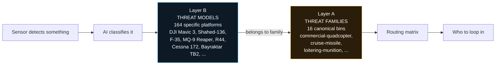
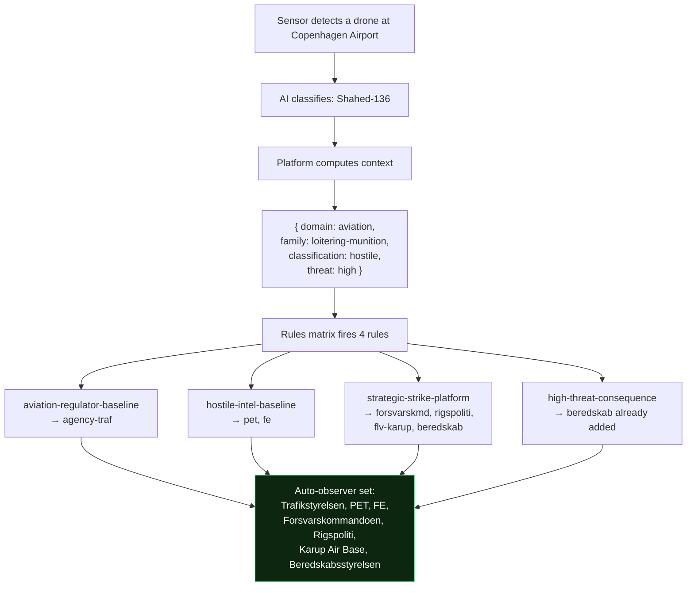
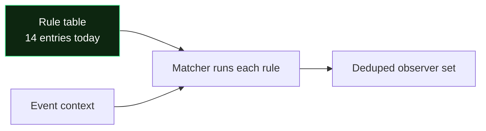

# Threat routing · how the platform knows who to loop in

Plain-language walkthrough for anyone (founder, investor, new team member) who wants to understand the threat catalog + auto-observer routing without reading source code. If you want the technical reference, open `docs/cross-agency-flows.md` Section 9.

---

## What this does in one paragraph

When a sensor detects something in the sky, the platform needs to answer three questions immediately: (1) what is it, (2) which of the 386 registered agencies want to know, and (3) how urgent is that notification. The threat catalog answers (1). The routing matrix answers (2) and (3). Together they turn "sensor sees drone" into "PET + FE + Trafikstyrelsen + Beredskabsstyrelsen were auto-looped in before the operator even opened the case".

---

## Two layers, not one flat list

The catalog is deliberately split into two layers so the platform can be both comprehensive AND stable.

**Layer B (Threat models)** — 164 real platforms catalogued. DJI Mavic 3. Shahed-136. Bayraktar TB2. F-35. Robinson R44. Cessna 172. Each entry carries the specific model's fingerprint: what radio bands it uses, what acoustic profile it has, cruise speed, payload capacity, wingspan, country of origin, distinctive notes.

**Layer A (Threat families)** — 16 broad categories. Every model belongs to exactly one family. The routing matrix ONLY cares about families, never models. This keeps the matrix stable: adding the DJI Mavic 5 next year is one new Layer B entry with a family binding, zero changes to who gets notified.

---

## What's in the catalog

164 real platforms across 16 categories. This is the ISR platform's threat universe.

```mermaid
flowchart TD
  ALL[164 models in catalog]
  Q[Commercial quadcopters<br/>29 models]
  FPV[FPV / racing / kamikaze<br/>11 models]
  FW[Consumer + industrial fixed-wings<br/>10 models]
  MIL_FW[Military ISR fixed-wings<br/>21 models]
  STRAT[Strategic UAVs<br/>6 models]
  LOIT[Loitering munitions<br/>17 models]
  CRUISE[Cruise missiles<br/>13 models]
  HELI_C[Civilian helicopters<br/>11 models]
  HELI_M[Military helicopters<br/>16 models]
  JET_M[Military jets<br/>12 models]
  LIGHT[Light aircraft + civilian jets<br/>11 models]
  OTHER[Gliders + tethered + swarm<br/>7 models]
  ALL --> Q & FPV & FW
  ALL --> MIL_FW & STRAT
  ALL --> LOIT & CRUISE
  ALL --> HELI_C & HELI_M
  ALL --> JET_M & LIGHT & OTHER
  style ALL fill:#0d1a26,stroke:#4dd2ff,color:#fff
```

**What each family looks like:**

- **Commercial quadcopters** — DJI Mavic 3, DJI Mini 4 Pro, Autel EVO Max 4T, Skydio X10, Parrot Anafi. What civilians fly.
- **FPV / kamikaze quadcopters** — hobbyist FPV frames, plus Ukrainian battlefield variants (Wild Hornet, Baba Yaga, Vampire, Perun-F) and Russian FPV munitions.
- **Consumer + industrial fixed-wings** — SenseFly eBee, WingtraOne, generic RC platforms. Mapping + survey work.
- **Military ISR fixed-wings** — MQ-9 Reaper, Bayraktar TB2, Wing Loong II, Orion, Watchkeeper, ScanEagle. Long-endurance armed reconnaissance.
- **Strategic UAVs** — RQ-4 Global Hawk, MQ-4C Triton, S-70 Okhotnik. High-altitude stealth ISR.
- **Loitering munitions** — Shahed-136 (Iranian one-way attack UAV with the distinctive rotary engine), Lancet, Switchblade, Harop. Weapons that hunt.
- **Cruise missiles** — Kh-101, Tomahawk, Kalibr, Storm Shadow, Zircon hypersonic.
- **Civilian helicopters** — R22, R44, Bell 206, Airbus H135, Sikorsky S-92.
- **Military helicopters** — Apache, Blackhawk, Ka-52, Mi-24 Hind, V-22 Osprey.
- **Military jets** — F-16, F-35, Eurofighter, Rafale, Su-27, Tu-160.
- **Light aircraft + civilian jets** — Cessna 172, Piper, Diamond, Gulfstream G550.
- **Gliders + tethered + swarm** — sailplanes, surveillance balloons, and coordinated multi-drone attack patterns.

Every entry carries the RF, acoustic, and visual signatures so a detection can be attributed back to the specific model when the AI classifier is confident enough. The Shahed's rotary-engine "moped-buzz" acoustic signature, for instance, is a distinctive tell — no other family has it.

---

## How routing works

When an event opens, the platform computes a routing context and asks a rules matrix which agencies should be looped in.

That's it. Seven agencies auto-notified before the operator opens the case. The operator sees them pre-loaded in the Mission Console as suggested observers and can accept, decline, or add more.

**Detection-only invariant:** routing SUGGESTS observers. It never dispatches, never cascades, never sends orders. The operator (or the receiver themselves) always decides what happens next.

---

## Real routing examples

Runtime-verified across five different scenarios. Same architecture, different observer sets depending on what's flying and where.

**Shahed at Copenhagen Airport** (hostile, high threat)
→ 7 observers: Trafikstyrelsen, PET, FE, Forsvarskommandoen, Rigspoliti, Karup Air Base, Beredskabsstyrelsen. Full strategic-strike response.

**DJI Mavic at Esbjerg Port** (hostile, low threat)
→ 4 observers: Søfartsstyrelsen, PET, FE, Rigspoliti. Common civilian scenario, tight response set.

**Su-27 fighter over Bornholm airspace** (hostile, high threat)
→ 7 observers: PET, FE, QRA (Quick Reaction Alert squadron), Karup Air Base, Forsvarskommandoen, NATO CAOC Uedem, Beredskabsstyrelsen. Air-defence + NATO liaison chain.

**Unknown signature at Energinet substation** (unknown classification)
→ 3 observers: Energistyrelsen, PET, FE. Minimal but includes intel for manual attribution work on the unrecognized signature.

**Drone swarm at Copenhagen Airport** (hostile, high threat)
→ 7 observers: Trafikstyrelsen, PET, FE, Forsvarskommandoen, Rigspoliti, Karup Air Base, Beredskabsstyrelsen. Full-net response — swarms are the hardest to counter.

---

## Why rules, not code

The routing matrix is 14 rules today. Each rule is a data entry: WHEN this predicate matches, ADD these observer role ids, WITH this rationale.

**Adding a new routing rule is one entry.** No code changes to the matcher. When a new customer comes online (data center, telecom tower, government facility), we add the site's domain + new rules keyed on that domain. The matrix scales linearly.

**Every rule is auditable.** The dev console can explain why any observer got looped in: which rule fired, what the rationale was, how confident the platform is. Zero black-box behavior.

---

## What this unlocks

Three product properties that weren't possible before:

**1. The operator opens a case pre-briefed.** Seven agencies already suggested as observers with clear rationale. One click to accept the set, then focus on the actual response decision.

**2. Model-level attribution can grow independently.** When the NN adapter improves and starts distinguishing Bayraktar TB2 from Wing Loong II, both already exist in the Layer B catalog with signature bindings. No routing rule changes needed — both are `military-isr-fixed-wing` family, both route the same way.

**3. The rules table is the doc.** Section 9 of `docs/cross-agency-flows.md` reproduces the rules table verbatim from the code. Doc-code drift can't hide.

---

## What comes next (not in scope of this phase)

- **UI hook for the auto-observer suggestions.** Today the routing output is available in the dev console (`window.__isr_routing.observers(event)`) but not yet wired into the Mission Console's "Loop in observer" CTA. Planned as a Phase 4 UI change: pre-populate the existing picker with the routing-suggested observers when the case opens.
- **Real hazmat detection.** Right now CBRN specialists (brs-kemisk, brs-nukleart) aren't in any routing rule because no event field carries hazmat classification. When `event.hazmatKind` lands, add two rules keyed on it.
- **Signature-driven attribution.** Layer B carries signature bindings; the signature bridge module (planned) will match detected RF + acoustic + visual profiles against the catalog to produce candidate model lists.
- **Real NN adapter output.** Today `event.platform` is a coarse string mapped to a family via a shim. When the NN adapter emits a family enum directly, the shim goes away.

---

## Where each piece lives (for later)

| What you see | Where it lives |
|---|---|
| Threat model catalog (164 platforms) | `src/threat_taxonomy.js` |
| Family enum + signature enums | `src/threat_taxonomy.js` |
| Routing rules matrix | `src/threat_routing.js` |
| Rule table extraction | `docs/cross-agency-flows.md` Section 9 |
| Dev-console handles | `window.__isr_threats`, `window.__isr_routing` |

Not to be confused with `src/routing.js` — that's the OSRM driving-route lookup for ground dispatches (police patrols following real street networks). Different concern entirely; different module.
