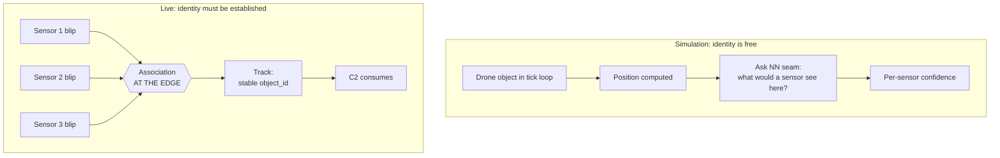
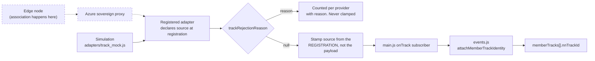

# Track Identity Architecture

**Status:** `[live — src/track_source.js + src/adapters/track_mock.js landed 2026-09-26. Seam, validator, mock and gate are in. Position ingest and the render/interceptor layer are NOT wired; see "What is deliberately not built".]`

## The problem

A sensor sees a blip. A second later it sees another blip. Nothing in a detection says those two blips are the same aircraft.

In the simulation environment the question never arises, because a drone **is** an object. The tick loop holds it, moves it, and then asks the detection seam what confidence a sensor would have had at that point. The detection is downstream of the object.

In a real deployment it is the other way round. Detections arrive first, from many sensors, many times a second, carrying no identity at all. Something has to decide which of them are one aircraft, give it a stable identifier, and keep that identifier attached as it moves between sensors.

## Where association happens, and why not here

**At the edge. Not in this platform.**

It needs microsecond-precision timestamps across sensors, per-modality signal features, and error models that never reach a browser. It runs at sensor rate, not at user-interface rate. And multi-sensor fusion is the differentiating technology in the ISR stack, which belongs next to the raw signal rather than in a rendering layer.

C2 consumes identity. It never mints it. That boundary is enforced by `scripts/check-track-identity.mjs` rather than left as an intention, because the way it erodes is not a crash. It is a helpful default: a track arrives without an identifier, something generates one so the render layer has a key, and from that moment the platform is quietly deciding what counts as one aircraft. Nothing fails, the map looks right, and two sensors seeing one drone become two drones in a case file an agency reads.

## The contract is SAPIENT, and we already committed to it

`docs/idd-integration-brief.md` already states that our detection output aligns to the SAPIENT interface control document, published as **BSI Flex 335 v2.0**. SAPIENT is owned by Dstl, adopted by the UK Ministry of Defence, and in NATO ratification as the sensor-to-command-and-control standard. Its message definitions are openly published.

So the identity model here is not invented. It is lifted from SAPIENT's `DetectionReport`:

| Field | Meaning |
| --- | --- |
| `object_id` | ULID for the object detected in the environment. The stable identity. |
| `node_id` | The node that produced this report. |
| `associated_detection[]` | Other detections associated with this one. Each carries `node_id`, `object_id` and an `association_type`. |
| `association_type` | `PARENT` / `CHILD` / `SIBLING` / `NO_RELATION` / `UNSPECIFIED` |
| `state` | Whether a special case is in effect, for example the object being lost. |

Using the standard's own field names rather than a paraphrase is the point. A conforming edge node plugs in with no translation layer, and the ask to whoever builds that node is "conform to BSI Flex 335", not "implement our bespoke format".

### Two things the standard gets right

**Position is a oneof.** A track carries *either* a `location` (x, y, z with per-axis error) *or* a `range_bearing` from the reporting node, where `range` is **optional** with its own `range_error`. That is not an afterthought. A radio-frequency sensor commonly gives a direction and no distance at all, and a model that forced every observation into a latitude and longitude would make such a sensor fabricate a range it never measured. Sending both is rejected as ambiguous, because it does not say which the producer actually measured.

**Datum is mandatory.** An altitude means nothing without saying what it is measured from. We reached the same conclusion independently on the dispatch telemetry seam and then aligned the enum names to the standard's rather than keeping our own.

## Flow

## Provenance is declared at registration, not carried on a payload

Every other seam stamps provenance at the receiving edge. This one goes further: an adapter must declare `source: 'sim' | 'live'` when it registers, and every track it publishes is stamped from that declaration.

The distinction matters. Registration happens in this repository's own code, which is trusted. A payload arrives over a wire, which is not. A feed still cannot describe its own data, because the field it would have to lie in is never read.

An adapter that declares neither is refused at registration.

## Identity lands on a field that has been waiting for it

`memberTracks[].nnTrackId` has existed since the swarm tracking work, documented as *"NN-assigned track id when live (null in sim)"*, and `docs/swarm-individual-tracking-architecture.md` records the intent: *"Every seam NN-plug-in ready: MemberTrack carries `nnTrackId` from day one, sim leaves it null."*

It is filled by `attachMemberTrackIdentity()` in `src/events.js` and nowhere else, because `events.js` owns every event field write and `scripts/check-event-mutations.mjs` enforces that.

**Conflicts are refused, not resolved.** If a member already carries a different identifier, a second claim returns `{ status: 'conflict', existing, offered }` and the first stands. Two edge nodes disagreeing about what is one aircraft is a real disagreement about the world. Silently taking the most recent would hide it, and the case file would show one drone becoming another mid-incident.

## What is deliberately not built

This is the pipe, not the tracker. Scoped this way so a real feed can be connected incrementally rather than in one cutover.

| Not built | Why |
| --- | --- |
| **Position ingest from a track.** Identity is attached; movement still comes from the simulation tick. | Keeping identity and movement separate is what lets the edge take over one before the other. `syncMemberTrack()` already accepts kinematics and is the landing point when it does. |
| **The tracker itself.** No estimator, no gating, no association. | It belongs at the edge. Building one here would be building the thing this seam exists to leave room for. |
| **Render and interceptor rewiring.** Interceptor targeting holds live object references into `droneState.get(eventId).swarmBillboards`, keyed by array position. | This is the largest piece of the eventual integration and has two known defect classes already (stale target references, and mass re-target onto a breakaway child, found 2026-09-18). It wants its own pass, against a real feed. |
| **Altitude conversion.** `CONVERTIBLE_LOCATION_DATUMS` is deliberately empty, so no datum is applied. | The renderer wants height above ground; neither SAPIENT datum is that, and converting needs a terrain sample. Dropping only the altitude is a visible gap rather than a silent error the size of the local terrain. Write it against a real producer's spec, not a guess. |
| **Breakaway reconciliation.** `_promoteBreakawayMember` still mints a new event identity for an object that would already have a stable one. | Becomes partly redundant once an edge feed supplies `object_id` across a formation break, but the *event* promotion still has to happen because that is what receivers coordinate on. Needs the position ingest first. |

## Reachable from the running application

| Handle | Purpose |
| --- | --- |
| `window.__isr_publishTrack(track)` | Publish a track as the simulation provider. |
| `window.__isr_buildTrack({...})` | Build a conforming track from a position. |
| `window.__isr_trackStats()` | Per-provider accepted, rejected and reason counts. |
| `window.__isr_trackRelated(payload)` | Object ids this track claims to be the same aircraft as. |

These exist for the same reason `window.__isr_dispatchFix` does. The dispatch telemetry seam shipped with a live branch nothing imported, so it had never executed in a browser, and four defects sat behind that gap until a review read the code. A seam nothing imports is a seam that has never run.

## Gate

`scripts/check-track-identity.mjs`, wired into `npm run build` and its own named CI step.

Deliberately separate from `check-provenance.mjs`. The split is: provenance asks *did we say where this came from*, track identity asks *did we make it up*.

12 mutants were tried against it, including generating an identifier when one is missing, trusting provenance from the payload, letting the mock masquerade as live, rejecting bearing-only tracks, treating `NO_RELATION` as a link, and silently overwriting a conflicting identity. Two survived the first pass: the conflict path had no behavioural test, and the import assertion matched a commented-out line. Both fixed and re-tested.

## The ask to whoever builds the edge

Emit `object_id` and `associated_detection` per BSI Flex 335 v2.0. One line, against a published NATO-track standard, not a design project.

**Not sent yet.** Parked as Q1 in `docs/open-questions.md`. The C2 half landed first deliberately, so the conversation is "here is the socket, conform to the standard" rather than "please design a format for us".

## Related

- `docs/idd-integration-brief.md` — the SAPIENT commitment this builds on.
- `docs/swarm-individual-tracking-architecture.md` — where `nnTrackId` was specified.
- `docs/agentic-dispatch-adapter-architecture.md` — the sibling inbound seam this is modelled on.
- `docs/agentic-cooperative-traffic-fusion-architecture.md` — adjacent but distinct: cooperative traffic answers "is this thing supposed to be here", track identity answers "is this the same thing as a second ago".
- `docs/integration-contracts.md` — §1 sensor ingestion and §2 classification, both keyed on `detection_id`, which is what this adds identity on top of.
