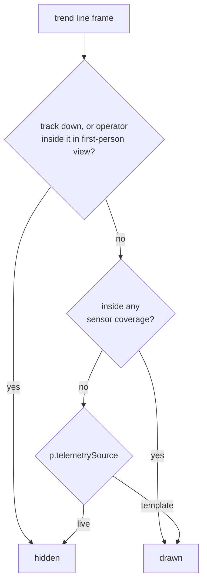

# Track trend line — provenance-keyed policy

**Scope:** the red dashed trend line behind a tracked object, its length, and when
it draws. Implemented in `src/trail_policy.js`, consumed by the single-drone lead
path in `main.js`. The swarm path has its own breadcrumb design and is not covered
here.

## Keyed on the track, not on a mode

The line answers a different question depending on where the position came from,
so the policy reads `p.telemetrySource`, which rides on every position emitted by
the tick.

| Provenance | Line length | Outside coverage |
|---|---|---|
| `live` — real sensor feed | 180 points, time-sampled every 3rd frame, about 9 s | **hidden** |
| anything else — scenario template (default) | 4000 points, distance-sampled every 120 m, about 480 km of route | **drawn** |

A real feed is operator-grade: past the edge of coverage no sensor reported a
position, so the line stops rather than asserting one. A template track still
hides its own icon outside coverage, because that is the behaviour being
rehearsed, but the line runs the whole route so the track can be found and flown
toward.

Every threat track in the platform today is template-driven, so the line draws for
all of them and the coverage gate stays dormant until a real feed lands. That is
the seam, not a special case. An untagged track defaults to simulated, so a
missing tag can never silently claim to be a real sensor observation.

**Do not key this on `_isSimMode()`.** That flag is the cinematic toggle in the
role menu: first-person drone view, jam-static overlay, night grading. It defaults
to `false` and says nothing about where a position came from. Gating on it both
failed to light the line for scenario tracks and switched the coverage gate on for
every track in the default mode, which removed the only trend line there was.

## Why distance sampling

The original setting was one for everything: 180 points every third animation
frame. At 60 frames per second that is 20 points per second, so 180 points is a
**nine second tail** — about 460 m behind a Geran-2 at 185 km/h, on a 268 km
route. Three orders of magnitude short.

Raising the count alone would hand Cesium a 10 000-vertex polyline rebuilt twice a
second. Sampling by distance instead costs 2219 points for the whole Billund Geran
transit, and unlike a time-based tail a loitering drone does not bloat it, because
the buffer scales with route length rather than duration.

Measured by replaying the real `billund_geran2_north` waypoints through the module:

| | Points held | Aged out | Route covered |
|---|---|---|---|
| Template track | 2219 | 0 | 267.7 of 267.7 km (100%) |
| Real feed | 180 | 104 020 | 0.5 km (0.2%) |

## Visibility

## Invariants

- The object's own icon is hidden outside coverage for **every** track, real or
  template. This policy governs the trend line only, never the symbol, and never
  detection state.
- Detection report timing is independent of this file. It is gated on coverage via
  `coverageGatedTrack`; see `event-model-edge-cases.md` cases 17 and 18.
- The line is torn down when the event closes, so on a long transit it lasts as
  long as the event does. The auto-close chain holds the event open while a
  dispatch is still `en_route` or `engaging`, then closes about 12 s after the
  pursuit ends.
- A change here must not touch the swarm trail. That path wipes its trail on
  coverage loss and draws a separate pre-detection breadcrumb instead.

## Related

- `docs/event-model-edge-cases.md` — detection lifecycle, grace windows, coverage gating
- `docs/swarm-individual-tracking-architecture.md` — the swarm path's own trail behaviour
