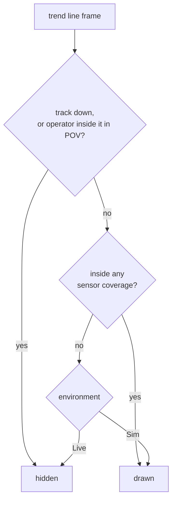

# Track trend line — Live versus Sim policy

**Scope:** the red dashed trend line behind a tracked object, its length, and when
it draws. Implemented in `src/trail_policy.js`, consumed by the single-drone lead
path in `main.js`. The swarm path has its own separate breadcrumb design and is
not covered here.

## Why there are two settings

The line answers a different question in each environment.

**Live is operator-grade.** The platform knows only what its sensors saw, so the
trend line stops at the edge of coverage. Drawing it past that edge asserts a
position no sensor reported, which is the thing the sensors-observe-only rule
exists to prevent.

**Sim is the authoring and rehearsal environment.** The object stays hidden
outside coverage, because that is the behaviour being rehearsed, but the operator
has to be able to find it. In the Billund Geran transit the track is invisible for
most of a 268 km route and a chase aircraft has nothing to fly toward. The trend
line is that handle. It is a simulation aid and never ships as operator truth.

## The defect this replaced

Both environments shared Live's numbers: 180 points appended every third animation
frame. At 60 frames per second that is 20 points per second, so 180 points is a
**nine second tail** — about 460 m behind a Geran-2 at 185 km/h, on a 268 km
route. Nothing was broken and nothing had been removed. The line was three orders
of magnitude shorter than the route it was meant to mark.

## Current numbers

| | Append every | Points kept | Span | At Geran-2 speed |
|---|---|---|---|---|
| Live | 3 frames | 180 | 9 s | 0.5 km |
| Sim | 30 frames | 6000 | 3000 s | 154 km |

Sim trades resolution for reach: a tenth the sample rate, far more samples, the
same order of memory. One point per 26 m at Geran-2 speed, far finer than a route
line needs.

`trailSpanSeconds(isSim, fps)` derives the span so nobody computes it by hand.

## Visibility

`suppressed` outranks the environment: a downed track, or first-person view from
inside the object where the final segment would render across the camera.

Outside coverage, Sim draws and Live does not. That asymmetry is the entire point
of the module.

## Invariants

- The object's own icon is hidden outside coverage in **both** environments. This
  policy governs the trend line only, never the symbol, and never detection state.
- Detection report timing is independent of this file. It is gated on coverage via
  `coverageGatedTrack`; see `event-model-edge-cases.md` cases 17 and 18.
- A change here must not touch the swarm trail. That path wipes its trail on
  coverage loss and draws a separate pre-detection breadcrumb instead.

## Related

- `docs/event-model-edge-cases.md` — detection lifecycle, grace windows, coverage gating
- `docs/swarm-individual-tracking-architecture.md` — the swarm path's own trail behaviour
