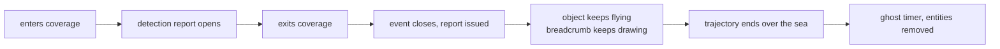
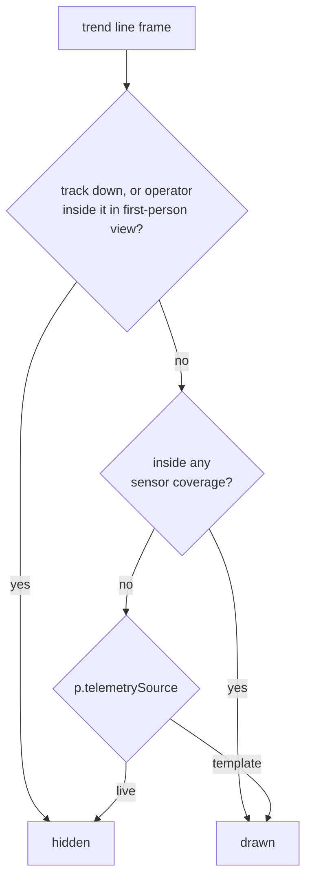

# Track trend line — provenance-keyed policy

**Scope:** the red dashed trend line behind a tracked object, its length, and when
it draws. Implemented in `src/trail_policy.js`, consumed by the single-drone lead
path in `main.js`. The swarm path has its own breadcrumb design and is not covered
here.

## Keyed on the track, not on a mode

The line answers a different question depending on where the position came from,
so the policy reads `p.telemetrySource`, which rides on every position emitted by
the tick.

| Provenance | Line length | Outside coverage |
|---|---|---|
| `live` — real sensor feed | 180 points, time-sampled every 3rd frame, about 9 s | **hidden** |
| anything else — scenario template (default) | 4000 points, distance-sampled every 120 m, about 480 km of route | **drawn** |

A real feed is operator-grade: past the edge of coverage no sensor reported a
position, so the line stops rather than asserting one. A template track still
hides its own icon outside coverage, because that is the behaviour being
rehearsed, but the line runs the whole route so the track can be found and flown
toward.

Every threat track in the platform today is template-driven, so the line draws for
all of them and the coverage gate stays dormant until a real feed lands. That is
the seam, not a special case. An untagged track defaults to simulated, so a
missing tag can never silently claim to be a real sensor observation.

**Do not key this on `_isSimMode()`.** That flag is the cinematic toggle in the
role menu: first-person drone view, jam-static overlay, night grading. It defaults
to `false` and says nothing about where a position came from. Gating on it both
failed to light the line for scenario tracks and switched the coverage gate on for
every track in the default mode, which removed the only trend line there was.

## Why distance sampling

The original setting was one for everything: 180 points every third animation
frame. At 60 frames per second that is 20 points per second, so 180 points is a
**nine second tail** — about 460 m behind a Geran-2 at 185 km/h, on a 268 km
route. Three orders of magnitude short.

Raising the count alone would hand Cesium a 10 000-vertex polyline rebuilt twice a
second. Sampling by distance instead costs 2219 points for the whole Billund Geran
transit, and unlike a time-based tail a loitering drone does not bloat it, because
the buffer scales with route length rather than duration.

Measured by replaying the real `billund_geran2_north` waypoints through the module:

| | Points held | Aged out | Route covered |
|---|---|---|---|
| Template track | 2219 | 0 | 267.7 of 267.7 km (100%) |
| Real feed | 180 | 104 020 | 0.5 km (0.2%) |

## Two lines, one language

The single-drone path now carries the same pair the CPH swarm members
always had. One or the other draws, never both, so the map always states
which of the two it is showing.

| Entity | Means | Drawn | Style |
|---|---|---|---|
| `trail` | confirmed path, a sensor saw this | only **inside** coverage | `#ff3838`, width 2.5, dash 8 |
| `projLine` | unobserved breadcrumb, where it went while nothing watched | only **outside** coverage, and only for a template track | `#ff3d3d` at 0.55 alpha, width 1.5, dash 12 |

`projLine` is wiped on re-entry to coverage, so the next gap starts fresh.
Without that the line draws a straight segment from the previous gap's
last point across the map to the new one. The swarm wipes `projPositions`
for the same reason.

Before this, the single-drone path had no breadcrumb at all: a track that
left coverage simply vanished, and on a long transit there was nothing
left to follow. The swarm's own breadcrumb appends once per tick and caps
at 300 points, which is 5 s at 60 frames per second — fine for a short
run out to sea, useless across an 87 minute transit, so the single-drone
breadcrumb is distance-sampled instead.

Measured by replaying `billund_geran2_north` against all 130 sensors with
the real cylinder test, horizontal radius and altitude ceiling both:

| | In coverage | Out of coverage | Breadcrumb |
|---|---|---|---|
| Template track | 0.8 min | 86.1 min | 2173 pts, 262.2 km, drawn 86.0 min |
| Real feed | 0.8 min | 86.1 min | drawn 0.0 min |

## The simulation outliving the event

A breadcrumb entity alone was not enough, and this was the actual reason
nothing appeared past Billund.

`markTrackClosed` sets `live.closed = true`, and the position feed in
`drones.js` opens with `if (live.closed) continue`. So the object stopped
moving the moment its event closed, about 12 s after it left coverage.
The breadcrumb froze at roughly 600 m and the ghost sweep deleted it 15 s
later. The CPH swarm never hit this because `multiSite` suppresses the
out-of-coverage close, so `markTrackClosed` only fires at trajectory
completion.

Billund's event must close on exit — that rule is not negotiable. So the
two lifecycles are now separate:

Two additions, both opt-in so no existing scenario changes:

- `template.continueAfterClose` keeps the position feed running after the
  event closes. The feed still stops on its own, because past
  `durationSec` the interpolator returns `visible: false`.
- `state._simTrackFlying`, maintained from the tick, makes the ghost
  sweep in `scene_lifecycle.js` skip a track that is still airborne, so
  the entities are not deleted mid-route. It clears on trajectory
  completion and the ghost timer then applies as normal.

Measured end to end against the real sensors and the real
`expiredGhostEventIds`:

| | Feed stops | Breadcrumb at end |
|---|---|---|
| Without the flag | 12 s after close | 6 pts, **0.6 km** |
| With the flag | runs to the end | 2173 pts, **262.2 km** |

## Visibility

## Which sensors count

The symbol's visibility test implemented exactly two sensors: the ground
mesh, and a friendly missile's seeker. A dispatched aircraft's own turret
was not one of them.

So an MH-60R could hold a Geran on its EO/IR at 800 m, lay the door gun
onto it, and the operator sitting in that aircraft's own first-person
view saw nothing, because Billund's 1 km rings do not reach 40 km up the
Jutland spine. The gun swung at an empty sky. The comment on
`_gunTargetOf` already recorded that as a known oddity.

That was not a stricter reading of sensors-observe-only. It was an
incomplete list of sensors. A turret with a published range, on our own
aircraft, holding a contact, is the platform observing something. Leaving
it out did not make the map more truthful; it hid something we could in
fact see.

`src/onboard_sensor.js` adds it. A unit counts only when it is assigned
to this event, airborne, in `en_route` or `engaging`, carries an
`onboardSensorRangeM`, and has a known position of its own.

An onboard hold also outranks `closedAt`: the site's event is closed and
reported, and the object is still there in front of the gun.

**Rendering only.** Detection state, the detection report and the event
lifecycle are untouched and still keyed on the ground mesh via
`coverageGatedTrack`. An onboard hold is not a detection event and must
never open or close one.

## Invariants

- The object's own icon is hidden outside coverage for **every** track, real or
  template. This policy governs the trend line only, never the symbol, and never
  detection state.
- Detection report timing is independent of this file. It is gated on coverage via
  `coverageGatedTrack`; see `event-model-edge-cases.md` cases 17 and 18.
- The line is torn down when the event closes, so on a long transit it lasts as
  long as the event does. The auto-close chain holds the event open while a
  dispatch is still `en_route` or `engaging`, then closes about 12 s after the
  pursuit ends.
- A change here must not touch the swarm trail. That path wipes its trail on
  coverage loss and draws a separate pre-detection breadcrumb instead.

## Related

- `docs/event-model-edge-cases.md` — detection lifecycle, grace windows, coverage gating
- `docs/swarm-individual-tracking-architecture.md` — the swarm path's own trail behaviour
