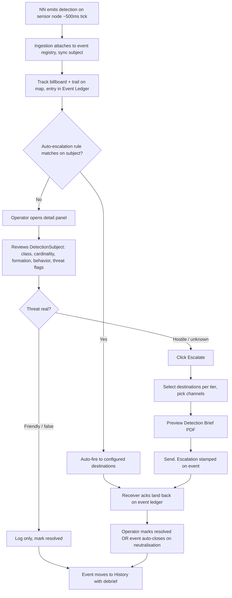
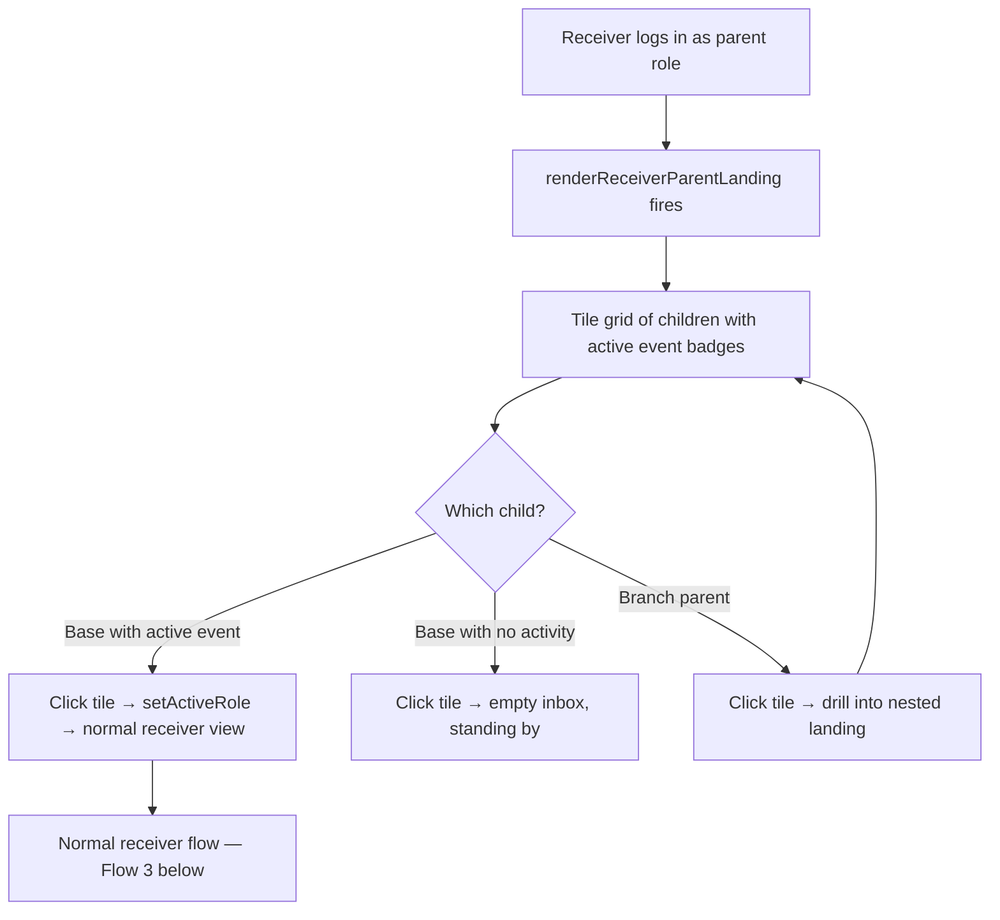
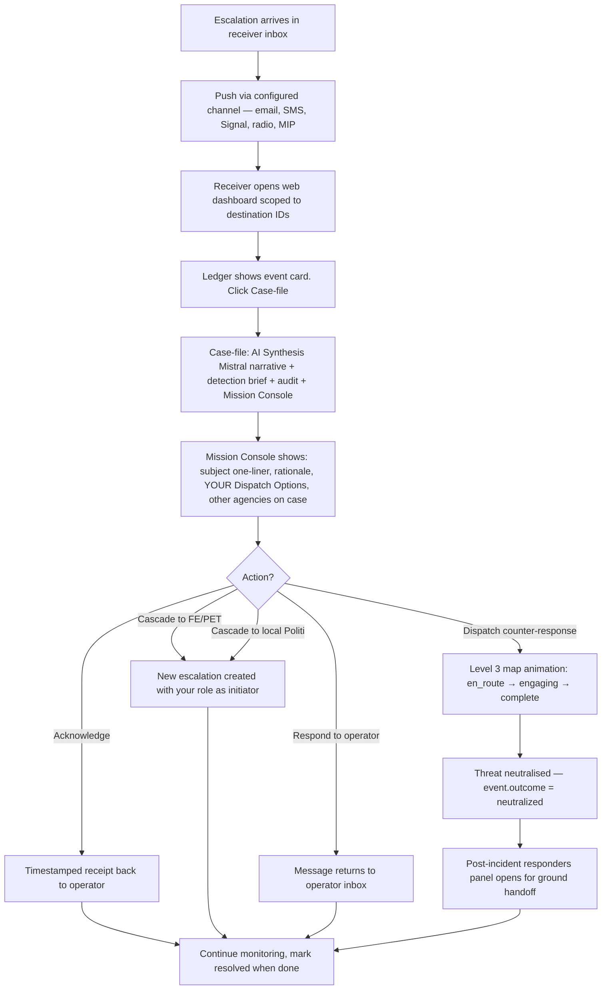
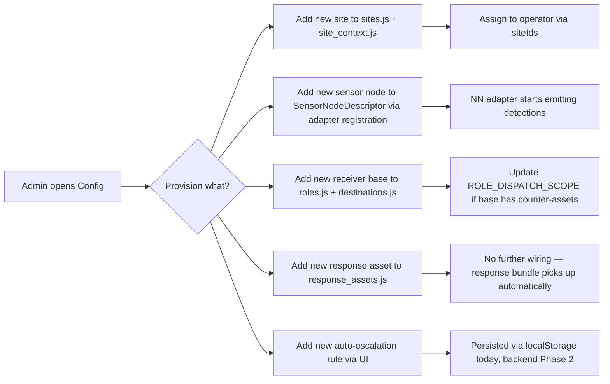
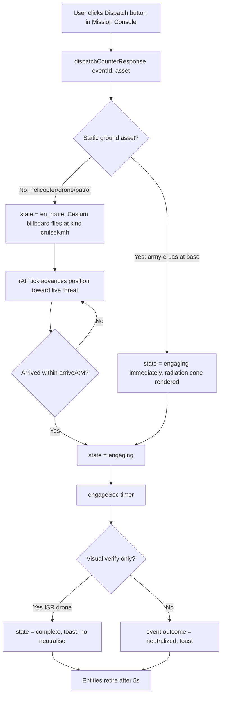

# ISR C2 Platform — User Flows

Internal reference. The connective tissue between every module. Every feature must slot into a flow or explicitly extend one. Foundation for **plug-and-play** readiness: when real sensor mesh comes online, these flows should carry it end to end without code changes.

Last updated 2026-08-13, reflecting P92 hierarchical roles + P95 workspace Mission Console + P83 canonical DetectionSubject.

---

## Three-Tenant Model

Strict isolation. Separate deployments in prod. No cross-tenant access.

| Tenant | Who | What they buy | Access |
|---|---|---|---|
| **Admin** | ISR internal (L. Flindt et al.) | Full platform. Provisions sensors, sites, rules, receiver mappings. | Everything |
| **Operator** | Site owner (utility, port, grid, data centre, telecom, hospital) | SaaS + HaaS. Sensors on their site + full C2 dashboard. | Live map, sensor health, event ledger, escalate to receivers, config, history, fleet |
| **Receiver** | Government agency (Politi, PET, FE, Forsvaret branches + bases, Beredskabsstyrelsen) | SaaS only. Receives escalations from operators. Now hierarchical — see below. | Filtered inbox scoped to their destination IDs, brief detail, acknowledge, respond, cascade, dispatch counter-response |

---

## Receiver Hierarchy (P92)

Receivers are now nested. A parent role lands on a chooser grid of children; a leaf role lands on the normal inbox. The tree:

```
Receivers
├── PET                                    (leaf — intelligence)
├── FE                                     (leaf — defence intelligence)
├── Beredskabsstyrelsen                    (leaf — emergency mgmt)
├── Forsvarskommandoen                     (leaf — national defence HQ)
├── Forsvaret                              (PARENT — Danish Defence umbrella)
│   ├── Flyvevåbnet                        (PARENT — Air Force branch)
│   │   ├── Skrydstrup                     (leaf — F-35 QRA)
│   │   └── Karup                          (leaf — Helicopter Wing)
│   ├── Hæren                              (PARENT — Army branch)
│   │   ├── Slagelse (Gardehusarregimentet)
│   │   ├── Høvelte (Livgarden)
│   │   ├── Varde (Efterretningsregimentet)
│   │   ├── Bornholm (Bornholms Værn, Almegård)
│   │   └── Oksbøl (Hærens Kampskole)
│   ├── Søværnet                           (PARENT — Navy branch)
│   │   ├── Frederikshavn
│   │   └── Korsør
│   └── SOK                                (PARENT — Special Ops)
│       └── Aalborg (Jægerkorpset)
└── Politi                                 (PARENT — Danish Police umbrella)
    ├── Rigspolitiet (National HQ)
    ├── Politi København
    └── Politi Sydvestjylland
```

Adding a new base = one entry in `roles.js` RECEIVERS + one line in `ROLE_DISPATCH_SCOPE`. No other code changes required.

---

## Flow 1: Operator — Detection to Resolution

The primary journey. Everything else exists to support this.



**Modules touched:** map + entities, alert strip / event ledger, detail panel, DetectionSubject (attached at addEvent), auto-escalation rules, escalate modal, destinations, brief preview, receiver ack callback, history + debrief.

**Not in this flow (correctly):** anything kinetic. ISR provides intelligence — government responds.

---

## Flow 2: Receiver Parent — Landing to Drill-In (P92)

New with P92. When a receiver logs in as a parent role (Forsvaret, Flyvevåbnet, Hæren, Politi, etc.), they land on a chooser grid before seeing any inbox.



**Modules touched:** roles.js (type=parent), renderReceiverParentLanding, _bindReceiverParentActions, memoization keyed on child active counts.

**Sub-flow: back to parent.** Currently done by re-selecting the parent from the account dropdown. Future: add "← Back to Forsvaret" chip at the top of leaf inbox views.

---

## Flow 3: Receiver Leaf — Inbox to Dispatch

Government-side. What a duty officer does when a brief lands in their queue. Now includes graduated counter-response dispatch (P86, P87).



**Modules touched:** receiver dashboard, event filter by `destinationIds`, workspace (Case-file + Live Map modes), renderWorkspaceMissionConsole, ROLE_DISPATCH_SCOPE, dispatchCounterResponse, CD_PROFILE, Mistral streaming (mistral.js).

**Role-scoping (P90):** Dispatch button only appears for asset kinds this role can command. Other agencies' assets show as "OTHER AGENCY" for situational awareness only.

---

## Flow 4: Admin — Provisioning

How ISR wires a new operator or receiver into the platform.



**Plug-and-play checklist for new sensor:**
1. Ship SensorNodeDescriptor entry pointing to node
2. NN adapter registers → ingestion consumes NN output stream
3. Detections flow through DetectionSubject → Correlation → Narrative → Recommendation → Escalation Router
4. Zero platform code changes if the NN output schema is honoured

---

## Flow 5: Counter-Response Dispatch (P87 Level 3)

Detailed drill-in for the dispatch state machine. Fires from Flow 3's "Dispatch counter-response" action.



**Kinds + profiles** (see `CD_PROFILE` in main.js):
- helicopter-intercept: 250 km/h, 500m arrive, 8s engagement
- army-c-uas: 0 km/h (static), 12s jam
- police-c-uas: 80 km/h drive, 500m, 10s
- army-isr-drone: 60 km/h flight, 300m orbit, 6s visual verify (does NOT neutralise)
- sof-tactical: 200 km/h air insertion, 400m, 15s
- wildlife-response: 20 km/h on-airport, 200m, 4s

---

## Cross-Cutting States

**Site scope:**
```
All Sites (Denmark rollup) → Click site marker → Fly to site → Detail visible → "Fly to Denmark" resets
```

**View mode (operator):**
```
Live Ops (default) ↔ History (event browser) ↔ Fleet (sensor health)
```

**Role switch (all users, for demos + testing):**
```
Any user → Account dropdown → Select any role → body.mode-* class → Full view
```

**Panel state:**
```
Both panels open (default) ↔ Collapse alerts (left) ↔ Collapse detail (right) ↔ Both collapsed for max map real estate
```

**Workspace mode (receiver):**
```
Inbox split view ↔ Case-file (Report) ↔ Live Map — back button exits to inbox
```

---

## Plug-and-Play Readiness Matrix

For each dimension, what is config-driven (plug-and-play) vs code-driven (requires deploy).

| Dimension | Config-driven | Code-driven |
|---|---|---|
| Add new site | ❌ (needs sites.js entry) | ✓ |
| Add new sensor node | Partial — needs adapter registration | ✓ (NN output schema locked in) |
| Add new receiver base | Almost — roles.js + ROLE_DISPATCH_SCOPE | ✓ |
| Add new response asset | ✓ (response_assets.js entry) | — |
| Add new class to taxonomy | ✓ (detection_subject.js CLASS_VOCAB) | — |
| Add new auto-escalation rule | ✓ (rules.js UI, localStorage) | — |
| Change response mapping (kind → asset) | ✓ (tacticalKindsForSubject) | — |
| Add new Mistral prompt language | ✓ (mistral.js WRITING_RULES) | — |
| Add new sensor MODALITY | ❌ (NN output schema is fixed) | ✓ |
| Add new receiver LEVEL (grandchild of parent) | Partial — getRoleChildren supports recursion, landing page renders one level | ✓ (needs UI drill-in state) |
| Change UI layout | ❌ | ✓ |

**Target state (Advance B):** everything above except UI layout becomes config-driven via sovereign backend + admin console.

---

## Known Gaps

These flows exist but have unresolved sub-questions:

- **Onboarding flow** — new operator tenant provisioning, first sensor install, first-run tour. Comes when we sign first paying customer.
- **Billing / account** — Stripe, invoice, tier upgrade. Comes with first paying customer.
- **Multi-user within a tenant** — operator company with three duty officers on shift rotation. Handoff, override, audit log.
- **Sensor commissioning** — HaaS install and calibration flow. Field-side, not web-app.
- **Compliance flow** — GDPR data subject requests, audit export, retention policy. Comes with first regulated customer.
- **Site Context Console (Advance D)** — operator direct-brief to Agent A. Currently site context is static JSON.
- **Multi-receiver coordination (Advance C)** — when 3 receivers acknowledge the same event, each sees what the others did. Currently each receiver's view is isolated.
- **Cross-tenant correlation** — same detection at CPH + Bjæverskov, does the platform automatically link? Correlation Agent supports this but no UI shows the roll-up.

---

## How to Use This Doc

- Adding a feature? Locate the flow. If it fits nowhere, either update the flow or reconsider the feature.
- Reviewing UX? Walk each flow end-to-end with a real user in mind. Break points logged as issues, not silently patched.
- Investor / partner demo? Flows 1, 3, 5 are the tour. Flow 2 (parent → drill in) is the P92 showcase.
- Plug-and-play verification? Check the readiness matrix. Anything with ✓ in the config-driven column should never require a code change to extend.

Kept tight on purpose. If it grows past what fits on one screen, split by tenant.
