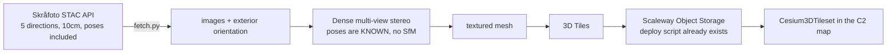

# ISR Systems · Skråfoto Mesh Pipeline

Build photorealistic 3D meshes of Danish sites from national oblique
photography, in-house, with open-source tools and no licence fees.

## Why this exists

Google Photorealistic 3D Tiles covers six Danish cities: Aalborg,
Aarhus, Copenhagen, Esbjerg, Odense, Vejle. **Billund is not one of
them, and neither are the substations, the ports, or most of the
infrastructure this platform protects.** Outside those six cities the
map falls back to extruded OSM footprints, which read as white blocks
over an otherwise sharp orthophoto.

There is no product to buy this off the shelf cheaply and no Danish
national mesh to download. Denmark publishes the *raw material* instead,
and Aarhus Kommune built their own city mesh from exactly that.

So do we.

## What makes this tractable

Denmark is the first country in the world to publish nationwide oblique
aerial photography as open data, and critically, it publishes the
**camera orientation with every image**.

That last part is the whole reason this is a weekend project rather than
a research effort. Normal photogrammetry starts with Structure from
Motion: solving where every camera was, from the pictures alone. It is
slow, it is fragile, and it is where amateur attempts fail.

**We can skip it entirely.** Every image arrives with its exterior
orientation already solved by the national mapping agency.

Verified against the live API on 2026-09-30 for the Billund Airport
bounding box:

| | |
| --- | --- |
| Collection | `skraafotos2025`, flown April–May 2025 |
| Images over the airport | **121** |
| By direction | nadir 24, north 24, south 24, east 28, west 21 |
| Ground sample distance | **0.1 m** |
| Exterior orientation | `pers:omega`, `pers:phi`, `pers:kappa`, `pers:perspective_center`, plus a 9-value rotation matrix |
| Coordinate reference | EPSG:25832 (ETRS89 / UTM 32N) |
| Access | Dataforsyningen token, already in `.env.local` as `VITE_SDFI_TOKEN` |

Five viewing directions per location is what makes facades reconstruct
rather than just roofs. It is the same input Aarhus used.

## Pipeline

## Tooling, all free

| Stage | Tool | Licence |
| --- | --- | --- |
| Fetch | `fetch.py` in this directory | ours |
| Dense stereo + mesh | **OpenMVS**, or COLMAP with fixed poses | open source |
| Alternative, single-shot | **OpenDroneMap** | open source |
| Mesh to 3D Tiles | `obj2tiles`, or py3dtiles | open source |
| Hosting | `scripts/city-tiles-pipeline/deploy-scaleway.sh` | already written |

**Hardware we already have.** Gowri's dual RTX workstation is exactly
the machine for the dense-stereo stage, which is the only part that
wants a GPU.

## Status, honestly

| Stage | State |
| --- | --- |
| API access and data availability | **Proven.** Token works, 121 images located over Billund, orientation confirmed present |
| `fetch.py` | Written. Downloads imagery and writes a pose sidecar |
| Camera interior orientation | **Open question.** Focal length is in the image id (`100mm`), but principal point and lens distortion need confirming. See below |
| Dense stereo | **Not attempted.** This is the step that decides whether the whole thing works |
| Mesh to 3D Tiles | Not attempted. Well-trodden, low risk |
| App integration | Not started. The tileset-loading block in `main.js` needs a per-site gate, not one global URL |

**Nobody should claim this works until the dense-stereo stage has run
once and been looked at.** Everything above it is confirmed; everything
below it is expected-to-work rather than known-to-work.

## The one real unknown

Interior orientation. Exterior orientation says where the camera was and
which way it pointed. Interior orientation says how the lens projects:
focal length, principal point offset, distortion coefficients. Dense
stereo needs both.

The image id encodes `100mm` so focal length is recoverable, and SDFI
publishes **SAUL** (github.com/SDFIdk/saul), their own open-source
photogrammetry helper library for this exact API, which does the
image-to-ground maths. If interior orientation is not directly on the
STAC item, SAUL is where to look for it.

This is the first thing to resolve, because it gates everything after.

## Order of work

1. Resolve interior orientation, via the STAC item or SAUL. Half a day.
2. Run `fetch.py` for a **small** area first, a few hundred metres around
   the terminal, not the whole aerodrome. Dense stereo scales badly and
   a failed six-hour run teaches less than a failed twenty-minute one.
3. Dense stereo on that patch. Look at it. This is the go/no-go.
4. If it looks right, scale to the full aerodrome and convert to 3D Tiles.
5. Host, and add a per-site tileset gate in the app.

## Licence

Danish public geodata is free to use, including commercially, under the
terms Dataforsyningen publishes. **Confirm the attribution string
required for skråfoto before anything built from it is shown to a
customer**, and put it in the map credits. The STAC collection response
returned no `license` field, so this needs reading from Dataforsyningen's
own terms rather than assumed.

## Related

- `scripts/city-tiles-pipeline/` — the earlier CityGML route. Different
  input, same destination. Its `deploy-scaleway.sh` is reusable here.
- `docs/geospatial-integrations.md` — the Danish data source register.
